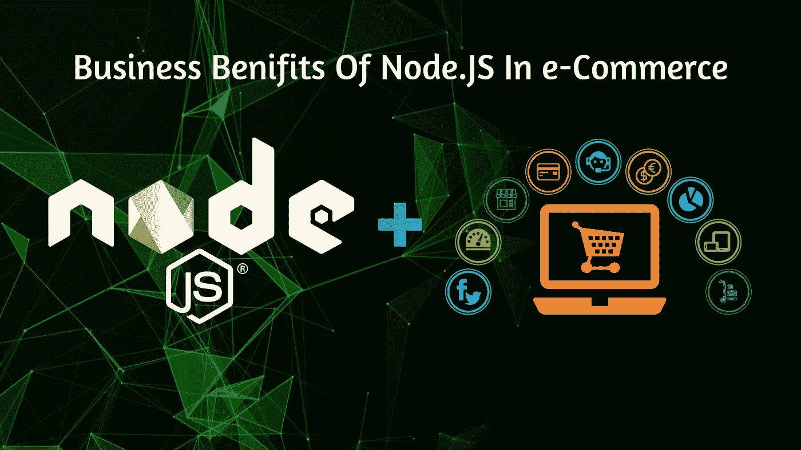
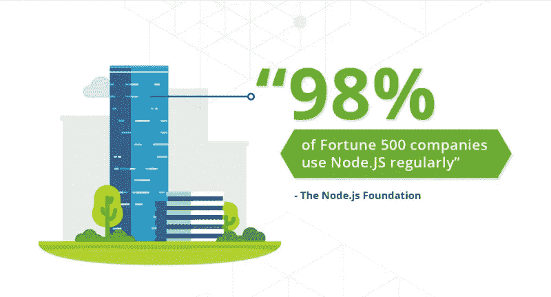
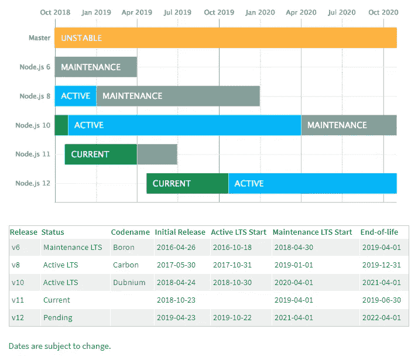
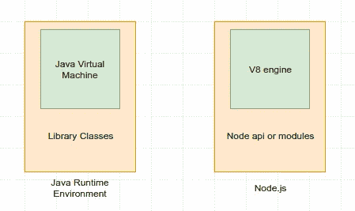
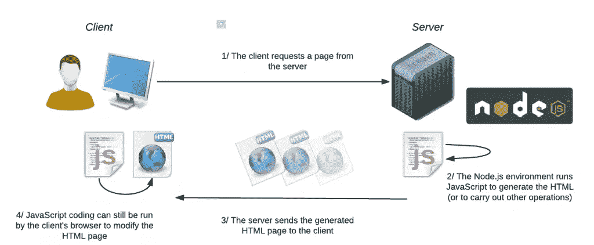

# 实施 Node 的好处。2019 年电子商务行业 JS

> 原文：<https://medium.com/hackernoon/benefits-of-implementing-node-js-in-e-commerce-industries-for-2019-f238689eb1a1>

Source: Designed By Author

从过去十年到现在，我们看到如今的电子商务业务正在激增，数量也在增加；全球市场认为它是在线行业中最可靠的商业平台之一。

人们每天都在增加，因此使用在线服务来完成需求和必需品的习惯也在增加，其中在线购物是移动设备以及其他系统上使用最多的平台之一。因此，为了满足客户的需求和可靠性，公司正在推动他们的极限，以达到网络和移动应用程序开发的最终目标。之前我也分享过一个博客，讲的是 react native 在电商行业 的 [**商业效益，现在讲的是 Node。JS 也在很短的时间内在电子商务领域获得了巨大的人气，所以今天我将向你们介绍 Node 的商业优势。电商领域的 JS。这可能会帮助你们中的一个从生意中得到更多。**](https://hackernoon.com/best-implementations-of-react-native-in-ecommerce-industries-in-2018-f12be1ae800b)

# 什么是节点。JS？

**Source Image:** [**tothenew**](http://www.tothenew.com/blog/top-6-benefits-of-node-js-for-application-development/)

节点。JS 是一个异步开源、跨平台的 JavaScript 运行时环境，它在浏览器之外执行 JavaScript 代码。通常，JS 主要用于客户端脚本编写，其中用 JS 编写的脚本嵌入在网页的 HTML 中，并由用户 web 浏览器中的 JS 引擎在客户端运行。节点。JS 最初是由 Ryan Dahl 于 2009 年编写的，在第一个服务器端 JavaScript 环境推出大约 13 年后，它仍然以其企业级的动态可行性取悦着商业人士。下图显示了 Node 的不同版本。JS 向可能不知道的人说明稳定和不稳定的版本。

**Source: Google.com**

# 为什么是 Node。电商行业通常流行的 JS？

节点。JS 为开发人员提供了可靠性，使用 JavaScript 编写命令行工具和服务器端脚本，在页面被发送到用户的 web 浏览器之前，在服务器端运行脚本以生成动态网页内容。因此，[节点。JS 代表了一种“无处不在的 JavaScript”范例](https://medium.freecodecamp.org/@priyeshp18)，用一种编程语言统一了 web 应用程序开发，而不是针对服务器端和客户端脚本的不同语言，JS 是每个 JavaScript 代码的标准文件扩展名。

**Source: Priyesh Patel(Coding Enthusiast)**

节点。JS 具有事件驱动的架构，能够有效地进行异步 I/O。这些设计选择旨在优化具有许多输入/输出操作的 web 应用程序以及实时 Web 应用程序(例如，实时通信程序和浏览器游戏)的吞吐量和可伸缩性。它允许 web 开发中的响应性和动态可行性，这在电子商务网站和移动应用程序开发中非常精确。

# Node 的业务优势。电子商务中的 JS:

**Source: Created By Author**

1.  **跨平台 JavaScript 平台:**节点最显著的优势之一。JS 提供的是一个跨平台的开发平台。在大多数情况下，开发人员需要了解一些编程语言的知识，至少对于编码来说是这样，但是 Node。JS 据说是个例外。
2.  **最佳性能:【Node 有什么值得称道的地方。JS 对电子商务平台的更多支持是最佳表现。众所周知，与 PHP 等其他语言相比，它能以更低的成本提供更好的结果。**
3.  **预算友好:**node . js I/O 模型非常活跃，即使它是实时工作的，也不会妨碍 I/O 操作。网站应用程序可以以更快的速度更新。
4.  **可伸缩性:**node . js 的事件驱动设计为 web 应用程序注入了可伸缩性。它提供了小而简单的模块，可以很好地与网站一起工作，而且新模块可以更有效地添加，使其更具可扩展性。
5.  **社区的大力支持:**电子商务平台是一个复杂的结构设计，有很多特性、功能、设计等。因此，有时，如果开发人员想要某个问题的特定解决方案，他们可能需要社区成员的连续支持和帮助。
6.  **已知最优速度:**我们已经知道了那个节点。JS 使用 Chrome V8 引擎，在运行基于网络的应用程序时提供高效的速度。而且，我前面也讲过，I/O 模式是主动的；它不会阻止 I/O 操作，从而提高性能。
7.  **插件的好处:**使用 Node.js 开发下一个电子商务网站的主要好处之一是，你可以使用现成的插件。
    免费插件通常在 GitHub 上提供，下载过程免费。它们有助于加速开发过程，而无需再花一分钱。
8.  **数据流的一致性:**节点的架构。JS 以这样的方式构建，任何 HTTP 请求和相应的结果都通过单个 [**数据流**](https://www.zivtech.com/blog/nodejs-stream-dreams) 传输。因此，处理这些文件变得容易得多，这对于不断加载 N 个项目的电子商务网站来说是一个福音。视频以高速上传，帮助顾客快速做出购买决定。
9.  **开源的好处:**节点的最大好处。JS 作为一个开源的 JavaScript 平台，接受专业和经验丰富的开发人员的访问，他们可以帮助您修改代码，并在电子商务网站中添加更多的功能或特性。
10.  **实时沟通和轻松管理:**当您构建电子商务网站或应用程序时，您需要添加的基本功能之一是与客户的实时交互。由于 Node.js 既支持前端开发，也支持后端开发，所以当您可以与客户端即时交互时，交流变得更加舒适。事实上，节点。JS 还充分支持基于聊天的平台或工具的实现。
11.  **有节点的网站特征。JS 工具:**
    轻量级的网站提供快速加载，并且很容易纠正错误。节点的代码重用和测试。JS 降低了开发成本。电子商务网站中重要的搜索和过滤功能可以借助 JSON 和 AJAX 通信来实现。它减少了解析时间。

**Source: Google.com**

# 什么是 NPM 和节点模块？

## NPM(节点包经理)

这些是由社区建立的[库，它们将解决你的大部分通用编码问题，NPM 有一些包，你可以在你的应用中使用它们，让你的开发更快更划算。](https://thenextweb.com/dd/2015/06/12/20-best-javascript-chart-libraries/)

## 节点模块

节点模块是一组可重用的代码，它的存在不会影响模块中的其他代码。您可以编写自己模块，并在各种应用程序中使用它们。Node.js 有许多组内置模块(NPM ),无需进一步安装即可重用。

# **结论* *

正如我之前所说的。JS 是一个企业级的编程平台，可以在前端和后端帮助你。因此，如果你们浏览博客，会发现它很有趣，并考虑让你的朋友和同事参考他们的下一个 web 和移动应用程序开发，那么很少有像 **MEAN Stack** 或 **MERN Stack** 开发这样的选项可供技术融合使用，通过从一流的[Node 雇佣 node js 开发人员，将你的业务发展到另一个成功水平。JS 开发公司](https://www.bacancytechnology.com/node-js-development) 。

> 希望你们喜欢&谢谢大家的耐心。如果你们有任何疑问或建议，请发表评论..！