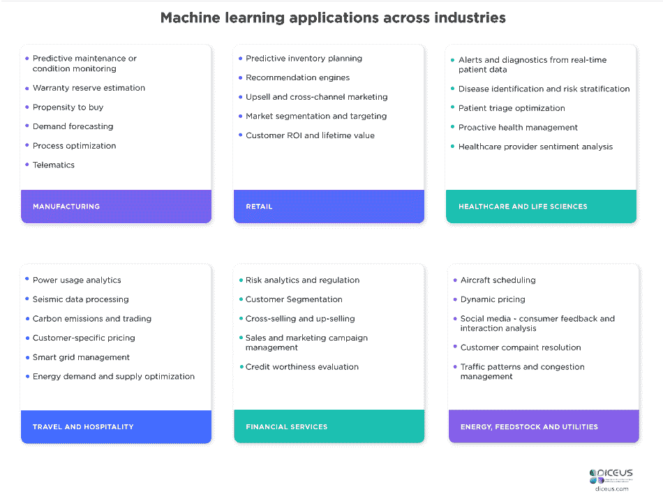

# 机器学习为您的企业带来的好处

> 原文：<https://medium.com/hackernoon/benefits-of-machine-learning-for-your-business-624c7297a3af>

[去年](https://www.statista.com/statistics/822160/worldwide-machine-learning-mergers-acquisitions-total-deal-volume/)，全球[机器学习](https://hackernoon.com/tagged/machine-learning)交易总数达到 91 笔，整体商业价值 169 亿美元。据[德勤](https://www.legaltechnology.com/latest-news/deloitte-insight-100000-legal-roles-to-be-automated/)称，到 2036 年将有 10 万个法律职位实现自动化。因此，自动化和机器学习将带来巨大的变化，改变我们的工作方式。

*你想知道 ML 能给你的组织带来什么好处吗？*

对销售额至少为 5 亿美元的公司的调查带来了这样的统计数据:

*   76%的领导者分享了他们通过使用机器学习获得更高销售增长的经验。新的[技术](https://hackernoon.com/tagged/technology)帮助他们预测更好的用户偏好和行为，优化流程，引导追加销售和交叉销售。
*   超过 50%的企业正在应用机器学习来细化营销问题。
*   38%的人认为 ML 让他们获得了更好的销售业绩指标。
*   一些欧洲银行已经将新产品销售额提高了 10%,同时将流失率降低了 20%。麦肯锡最近的一项研究发现，许多欧洲银行从统计建模方法转向了 ML。这有助于他们提高客户满意度。

# 机器学习的当今价值

脸书大学的机器学习工程师 Catherine Dong 表示，大多数科技公司都围绕人工智能和机器学习制定战略。例如，优步正在为各种目的积极应用洗钱。

数据是我们信息化社会的加速器，速度极快。这就是为什么新的技术专家和机器学习技术在处理大型和复杂系统中的新信息财富方面有巨大的需求。

在 [Diceus](https://diceus.com/) ，我们的科学家和大数据开发人员帮助世界各地的企业发现数据分析，以获得有价值的见解。我们有 6 年的经验，知道如何应用它来达到更好的目标，做到事半功倍。

# ML 的用例

电子商务应用程序可以应用 ML 来跟踪和理解与产品相关的客户对话。它甚至可以应用该算法来预测客户所期望的功能和特征。此外，企业可以使用机器学习来与客户建立更好的关系。机器学习算法可以容易地剖析客户查询，并将请求发送给相关团队。这将加快解决客户问题的过程，并很快给他们答案。

在创建电子商务应用程序时，开发人员可以使用机器学习来让客户更快地找到产品。特定的机器学习算法有助于确保客户按时获得相关和高质量的信息。此外，新技术帮助客户根据他们的需求和喜好选择产品。电子商务平台可以应用 ML 来使客户仅浏览相关的服务和产品。

机器学习为客户带来了许多个性化，并有助于确定公司的工作目标。例如，脸书混合了统计分析和预测分析来寻找基于数据的模式。它有助于个性化新闻源、推荐有趣的内容、帖子、提高用户参与度。此外，脸书使用神经网络扫描图像，并建议成员在图片中添加标签。

网飞利用机器学习为用户提供个性化的电影和电视节目，从而节省了 10 亿美元。此外，ML 可用于检测垃圾邮件。早先，电子邮件服务提供商利用基于规则的技术来分类垃圾邮件。如今，垃圾邮件过滤器正在通过应用神经网络来开发新的规则。

PayPal 应用至少 3 种机器学习方法来消除风险和欺诈。你好芭比可能通过使用机器学习和高级分析、自然语言处理成功地与儿童交流。麦克风记录，语音被分析，在不到一秒的时间里从 8000 个变化中找到所需的响应。

再比如 IBM 的机器学习系统 Watson，它学习了高迪的作品和他涉及巴塞罗那的作品，歌词。沃森消耗了所有的数据，并给需要创作高迪风格雕塑的人类艺术家带来了灵感。

[深度学习](https://www.tcs.com/content/dam/tcs/pdf/Industries/Banking%20and%20Financial%20Services/Machine%20Learning%20in%20Capital%20Markets.pdf)可能被用于金融行业，以创建自动化交易策略。它可以用来识别模式，并根据数据做出交易决策。其他潜在的应用是通过搜索影响组织财务绩效的外部、内部和经济因素的模式来创建信用评级机制。类似地，这些技术也可以应用于向客户提供相关的自动化投资建议。

因此，机器学习有助于企业个性化他们与观众的合作，提高销售额，并只建议相关内容。通过使用新技术，公司可以赚得更多，节省资金，做出数据驱动的决策。此外，ML 算法有助于排除风险和欺诈，确保流程完全安全，并提高客户满意度。