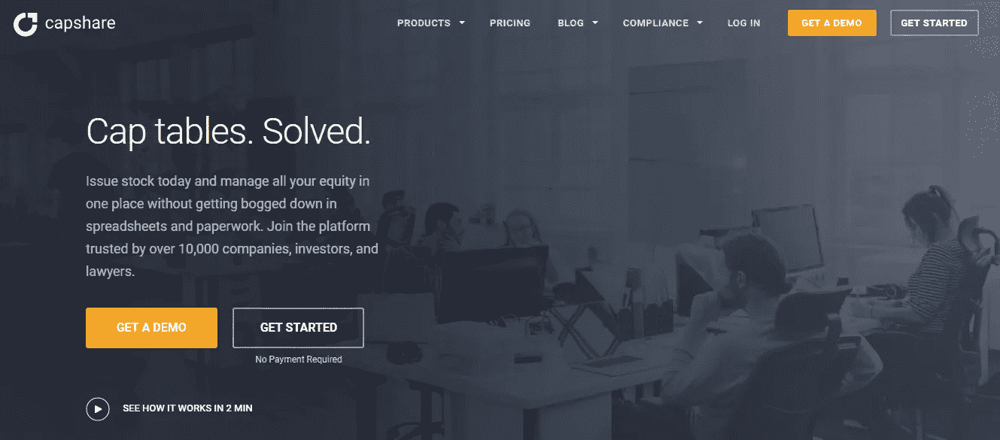
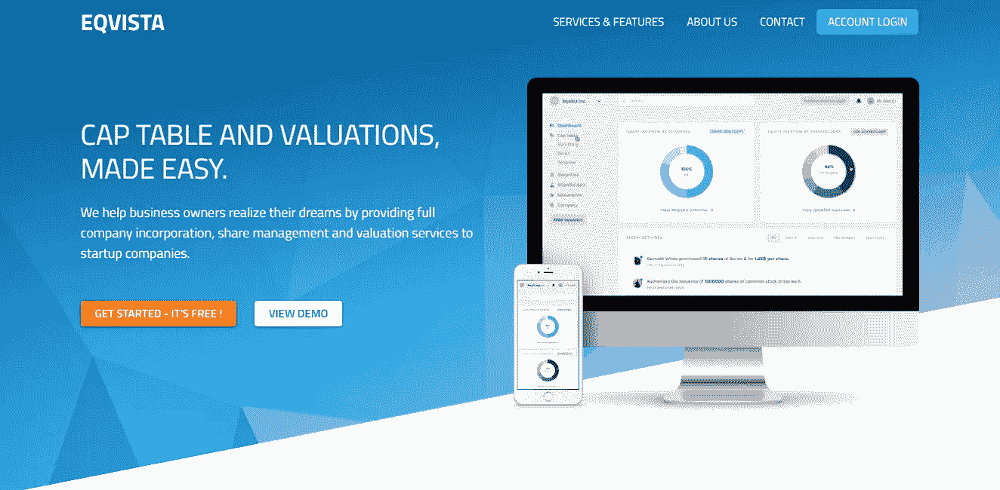
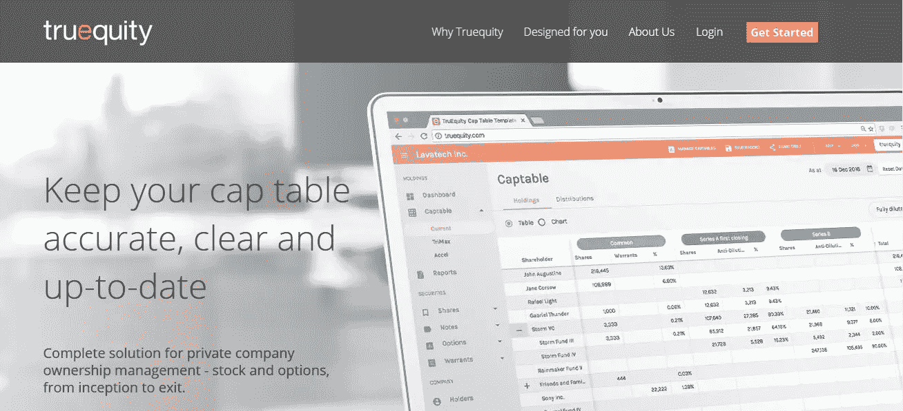

# 资本表管理软件对创业公司的好处

> 原文：<https://medium.com/hackernoon/benefits-of-using-cap-table-management-software-in-startups-7365ddd442d>

现在你已经开了自己的公司，并决定投资来帮助它成长，下一步该怎么做呢？除了从投资者那里获得资金，你还需要组织所有权并绘制公司的资本表。简而言之，资本总额表是关于投资者和创始人在公司的所有权比例、股权稀释以及每轮投资的股权价值的所有细节的简要总结。

不完全清楚这个想法？下一节将帮助您理解 cap 表的全部内容。

Image credits: [unsplash](https://unsplash.com/photos/qY9zgRqmNtA)

# **Cap 表介绍**

首先，cap 表是企业家生活中非常重要的一部分。如果你是其中之一，你一定已经有了一个想法。但是，如果你认为资本总额表只是一个简单的 Excel 电子表格，记录每个人持有的公司股份，那么你会感到惊讶。这只是冰山一角。

许多人认为资本表很简单，仅仅是公司成立以来每一笔交易的代表。但是，cap 表实际上是由几个法律文档和事务组成的。简而言之，您会在 cap 表中找到以下内容:

*   期权的运用
*   债转股
*   取消
*   转移
*   销售
*   股票发行

简而言之，它变得相当复杂，电子表格没有能力准确地显示这一点。

## ***那么，我们为什么需要限额表管理呢？***

好吧，有这么多事情要处理，限额表管理是必不可少的，这样一切都不会搞砸。简而言之，cap 表管理充分而准确地管理这些复杂性。管理包括记录交易，起草和签署法律文件，遵守法规，与股东沟通和其他一些事情。

如果您到目前为止还没有遇到过这些复杂的 cap 表，您可能很快就会遇到它们。这是因为任何成长型公司变得有价值，通常会有复杂的资本结构。为了让你的公司发展壮大，你会有一些投资者在这个过程中帮助你。你还会有许多优秀的员工，其中一些人你甚至可以分享公司的股份。

所有这些对企业来说都是好事，但也会带来一些管理负担。除了业务增长的压力，你还必须管理工资表。你不应该让别人替你做这件事。但这是为什么呢？主要原因是你想控制监督公司的所有权和管理决策。所以，作为创始人，工资表的工作必须掌握在你的手中。保存限额表的最好方法是使用限额表软件来简化它。

仍然不满意，为什么你需要一个帽表软件？好吧，下面这些能帮你找出为什么它是创始人生活中重要的一部分。

## **为什么需要帽表软件？**

您需要 cap table 软件的原因有很多，以下是对这些原因的总结:

## ***以更优惠的条件筹集资金***

为了发展公司，你必须在不同的阶段进行投资。当你这样做的时候，它会影响你的所有权和股东的所有权。有了管理得当的限额表，你就能更好地谈判你的条件。因此，保持 cap 表准确和最新是至关重要的。

此外，你需要知道，在谈判过程中，投资者总是会要求你出示工资表。因此，如果你有一个杂乱无章的资金表或者根本没有，这将影响你获得新投资的计划。你可能不容易筹到钱，或者根本筹不到钱。此外，如果你有一个组织良好的限额表，并有所有需要的细节，你将能够得到一个更好的交易。

此外，您需要在开始时设置您的限额表。如果你等到你要进行一些外部投资的时候才准备资本表，你可能会错过一些重要的细节。虽然这在开始时可能不是问题，但如果在资本表中出现错误，你可能会失去公司的所有权。

假设你已经向一些员工提供了一些股权，但没有将其添加到你的资本表中。现在，当你和一个投资者达成交易时，你不会得到正确的所有权比例或股份数量。这是因为您没有添加您提供的员工薪酬。简而言之，你可能最终放弃了公司的一大块股份，却没有意识到你正在放弃自己的所有权。

简而言之，你需要一个最新的上限表和一个准确的。没有这些东西，你就不能得到你想要的交易，你的公司也不会轻易成长。管理好 cap 表可以帮助你避免任何代价高昂的错误。最终，你的口袋里仍然会有最多的资产。

## ***发行选项***

另一件事，你要注意的是跟踪所有期权授予的既得股份，因为股票期权通常会随着时间的推移而授予。听起来很容易？嗯，不是的。有些情况下，期权持有者也可以提前离开公司。他们的未行权期权将返还给公司。这是因为对于贵公司提供的员工股权计划，员工在返回之前可以行使其期权的时间是固定的。

但这还不是全部；情况变得更糟。你还必须跟踪各种回购、转让、限制性股票和早期行权。由此，您可以看到，为员工提供股权薪酬使得资本表管理变得更加复杂。

此外，根据 ASC 718 股票费用要求，每个期权活动也必须在财务报表中注明。一个人坐着做这件事会让人非常头疼。因此，最好是获得一个资本表软件来轻松处理所有这些复杂问题，同时不断更新资本表，以避免任何代价高昂的错误。

## ***招聘关键员工***

如果你想为你的创业公司雇佣和留住最好的员工，股权薪酬是一个很好的激励。因此，你知道如何创造和制定一个优秀的薪酬方案是至关重要的。那些获得股权的人，尤其是高管，会想知道在公司被收购的情况下，在不同的退出价值下，他们的派息会是多少。为此，您需要有一个最新的限额表，其中一切都很清楚。

许多公司现在对公司员工更加透明，不仅仅是对高管和投资者。通过这种信息共享，您将不得不回答有关公司股权的任何细节问题。

从好的一面来看，对自己的工资表项目诚实的公司有更好的机会保持员工的高度积极性，即使是在困难时期。如果你有合适的工具和信息，从人力资源的角度来看，你的工资表可能是一个完美的资产。

这也是为什么你需要为你的 cap 表使用 cap 表软件，而不是简单的电子表格。它允许员工、投资者和高管轻松查看他们的持股。此外，通过看到期权的归属和价值的增加，员工会更长时间地留在公司。这也有助于激励他们更好地工作。简而言之，你的公司因成长而赢，员工也因提供并获得报酬而赢。

## ***待顺从***

cap 表的另一个重要部分是法规和税务合规性。如果你在电子表格上有一个上限表，你会花上几个小时试图弄清楚在税务表格的哪个部分添加什么。是的，美国国税局对公司的股权补偿有很多规定。做任何错事或无视规则都会让你和员工付出巨大的代价。

通过使用 cap table 软件，您将能够轻松地遵守它们，因为该软件会负责通知您任何更新。这也有助于填写表格，你也不必担心出错。

## ***出售公司***

许多公司到了不得不上市或被出售的地步。这时就需要 cap 表来告诉谁得到了什么。如果你打算在收购过程中套现，律师会需要你的资金限额表来完成交易。

但是事情是这样的:这些律师不会依赖你维护的 excel 表格。他们需要所有的东西都放在一个地方。这意味着他们需要销售协议、期权协议、公司的所有交易、一年中的各种估价、股东协议等等。

保存一个 excel 和各种分散的文件会使律师确定正确的所有权变得非常复杂。任何不完整或错误的细节都会引起法律纠纷。如果你想卖掉公司，这可能是个大问题。

更糟糕的是，当你出售或退出公司时，你可能得不到你原以为会得到的金额。因此，最好的方法是使用可靠的上限表软件。退出时，您将能够避免任何问题。

## **得到一个封顶表软件**

尽管没有任何正确的方法来格式化一个 cap 表，但首先它通常是在 Excel 电子表格中显示的。但是随着你的公司成长并开始提供股权补偿，电子表格会变得复杂，并且不能很好地组织一切。基本上，上限表永远不会很难，但当你在期权池中增加更多的员工和投资者时，它确实会成为一种痛苦。

因此，你需要帽表软件，将自动化你的过程，使之更容易。市面上有许多工资表软件，但其中一些最好的是:

[**CapShare**](https://www.capshare.com/)**:**CapShare 是一个很棒的资本表应用程序，可以帮助你轻松地发行股票，并在一个地方管理你的所有股票。当您开始使用 CapShare 发行电子股票时，您可以对所有的文书工作和电子表格说“再见”了。

受到超过 1 万名律师、投资者和公司的信任，这个应用程序将使所有复杂的工作变得简单。

[**Eqvista:**](https://eqvista.com/) Eqvista 处于顶端，因为它通过向创业者提供完整的公司注册、股份管理以及估值服务来帮助他们实现梦想。该软件致力于管理资本表，估值，公司股票，以及更多，更有效和更容易。

简而言之，你可以组建自己的公司，一起管理股权。有了 Eqvista，您将能够进行安全的在线交易，而持有股票的每个人都可以在一个地方跟踪资本表中的所有更新。

[**Gust**](https://gust.com/)**:**Gust 是一个平台，让你可以创办自己的公司，也可以在一个地方管理所有的法律事务。整个创业生态系统将帮助你实现你的梦想，并让它成长为最好的。

大约 80，000 名投资专业人士和 650，000 名创始人，这个平台拥有管理一家企业所需的所有工具，从注册到 cap 表管理以及遵守各种法规。

[**true quity**](https://www.truequity.com/)**:**true quity 是私人公司所有权管理的完整解决方案。这意味着你可以处理股票从开始到退出的所有事情。通过使用该软件，您将始终拥有最新、准确和完整的所有权数据视图。

这将有助于你对未来的融资和清算事件会如何影响公司有一个更清晰的认识。最棒的是，这是一个易于使用的基于云的解决方案。

## **结论**

总而言之，正确跟踪和管理你的资金表的最好方法是选择最好的软件来帮助你实现你的商业目标。除了建立一个伟大的公司，你还需要有一个伟大的资产负债表。因此，请确保您选择了最适合您的软件！