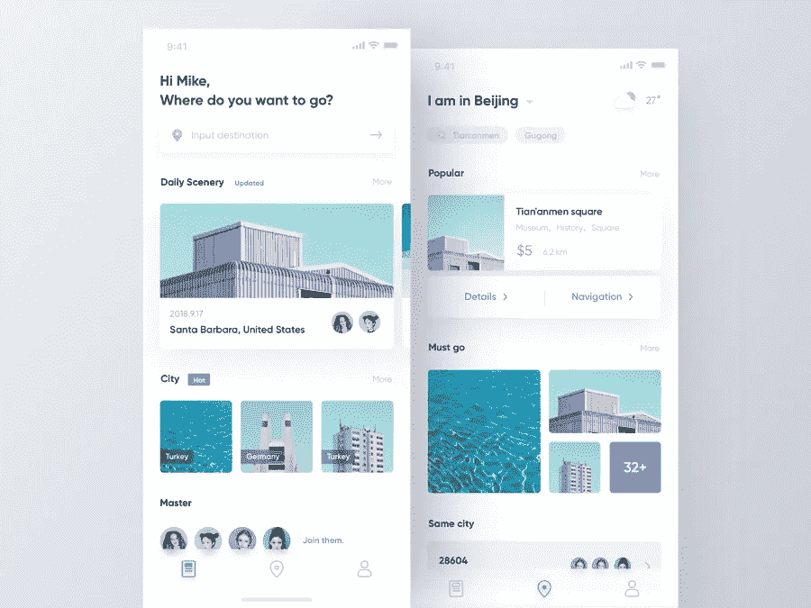

# 2018 年最受欢迎的 15 个卡片 UI 设计范例

> 原文：<https://medium.com/hackernoon/best-15-examples-of-popular-card-ui-design-for-inspiration-in-2018-7b758ab9fa27>

卡片 UI 设计有助于增强界面和用户体验。2018 年全新 web/app 设计灵感的 15 个最佳卡片 UI 设计实践。

**卡片式 UI 设计**作为 2018 的大 [UI 设计趋势之一，已经在现代界面设计中获得主流地位，并且已经深入嵌入到各个行业和领域的 UI 设计中。许多网络和移动应用已经使用了基于**卡片的 UI 设计**，尤其是随着](https://www.mockplus.com/blog/post/mobile-app-ui-design-trend)[材质设计](https://material.io/design/components/cards.html#anatomy)的流行。

作为一个信息容器，卡片包含了所有的元素，如文本、富媒体、按钮等。基于这些内容，它可以调整其大小以适应不同的设备和屏幕，平衡用户界面和用户体验。

相比于传统的 UI 设计，卡片 UI 一个简单但直观的优势就是提供了更加个性化的用户体验，使得整个界面更加清晰、平衡、美观、简洁、时尚，具有良好的可用性。

智能设备和应用程序让我们的生活变得简单而合理。基于卡片的 UI 设计和交互模式也融入了我们的日常生活。因此，设计师在面对不同的设备时，需要考虑用户的习惯。简而言之，为了保证在任何设备上都有完美的界面，应该实施响应式设计。

**相关:** [12 个最佳响应式网页设计入门教程](https://www.mockplus.com/blog/post/responsive-web-design-tutorials)

在本文中，我将在 Web UI 设计和移动应用程序 UI 设计的背景下解释卡片 UI 设计的含义。此外，我会分享一些伟大的卡用户界面为基础的设计，你的灵感。如果你对制作自己的基于卡片的 UI 设计感兴趣，你可以免费下载并使用 [Mockplus](http://www.mockplus.com/) 制作原型。

**相关:**[2017 年给你灵感的 10 个最佳 APP UI 设计](https://www.mockplus.com/blog/post/best-app-ui-design)

# 什么是卡片 UI 设计？

卡片是一个带有图像和文本的小矩形模块。是用户了解更多细节的入口。为了平衡界面的美观性和可用性，卡片 UI 设计基本上是默认的选择。因为卡片易于使用，所以它们也可以显示包含不同元素的内容。

# 卡片 UI 设计有什么优势？

谷歌称之为 inside out，本质上是更好的信息收集。那么卡片 UI 设计有什么优势呢？

# (1)提高空间利用率

当使用传统列表时，需要不断垂直向下滚动以获得更多内容，并且显示的内容是有限的。使用卡片布局，即使在垂直内容流中，也可以通过水平滑动来显示更多内容。

# (2)提高可操作性

卡是一种可以覆盖、堆叠、移动和刷卡的物质元素。这有助于扩展内容的视觉深度和可操作性。

比如 iPhone 上的“提醒”就是卡片叠放设计。用户可以根据标题快速找到目标备忘录，同时点击打开或删除卡片内容。

# (3)有利于信息整合

在卡片设计中，卡片是一个逻辑信息模块。用户即使快速浏览也不会感到困惑。块状卡片使页面更整洁，更悦目。由于各种卡片在同一页上可以有不同的大小，所以很容易区分信息的层次。

# (4)提供个性化的用户体验

与传统的 UI 设计相比，卡片 UI 简单而直观的优点是它提供了更多。这使得整个界面清晰、平衡、美观、简洁、时尚，具有良好的可用性。

# 优秀的卡片用户界面设计范例

**网站实卡 UI 设计实践**

# 1.Google Play —材料设计卡

Google Play 作为谷歌的产品，是材质设计的绝佳范例。无论是什么颜色，什么网站主题，都是沿用谷歌的设计。你可以在整个网站的任何地方看到卡片设计，不仅是主页，还有应用详情页面。

模块化的展示让整个网站界面看起来整洁、宽敞、井井有条。卡集合中实现的手势，包括滑动、拾取和移动以及滚动，为用户提供了快速响应并增强了用户的可操作性。

# 2.Quora

作为一个内容网站，Quora 首先要考虑的是信息流。即如何在其有限的版面内展示网页的内容，平衡网站设计和用户体验。解决办法就是卡！从用户的阅读习惯来看，用户更喜欢阅读块状、流畅的内容。卡片将信息组合成小块，使其更适合阅读。

因为卡片将内容提取并优化成有意义的块，所以不同类型的内容可以在卡片上组合成有机的、连贯的集合。与面对一篇较长的文章相比，简短的内容让用户感觉更轻松。这鼓励读者继续阅读。

# 3.商务化人际关系网

根据菲茨定律:点击目标越大，用户操作越快。LinkedIn 的格式使用文本、图片和链接。当在同一个卡片中选择了上述所有元素时，大图像出现在卡片的中心，并成为整个卡片上最大的可点击区域(详细内容页面的入口点)。当鼠标移动并与网页交互时，用户得到一个“可点击”的反馈。

# 4.拼趣

作为卡片设计的先驱，Pinterest 的瀑布式页面设计为用户提供了流畅无缝的体验。另外，减少点击量。非常有助于留住用户。卡片设计和瀑布流的结合，称之为流卡。

类似于 LinkedIn 的可点击富媒体，Pinterest 图片流的每张图片也是可点击的。材料设计给卡片一个微妙的阴影，尤其是当与鼠标交互时。阴影和深度增强了可见性，并赋予元素“可点击性”的感觉

# 5.滴水不漏

说到卡片 UI 设计，Dribbble 可能是最好的例子。Dribbble 上有很多设计师每天上传无数创意设计。为了展示每一个巧妙的作品，Dribbble 使用了一场视觉盛宴来取悦用户。

事实证明，图像可以迅速吸引用户的注意力。这使得基于卡片的设计的视觉方法更加相关，也是 Dribbble 的自然选择。

# 移动应用的真实卡片用户界面设计实践

# 6.照片墙

卡片容器在手机 app UI 设计中最为突出。Instagram 是一款基于图片的手机 app。所有图像都发布在一个正方形中，这标准化了提要流中图像的宽度。除了图片之外，卡片还带有其他元素，如文字和功能信息。屏幕上的所有元素构成了这个应用程序的一个完整的功能模块。

# 7.特雷罗

这个移动应用的卡片用户界面设计，帮助用户更好地分类列表。Trello 的成功源于卡片设计。这也是 Trello 与传统交易管理工具的最大区别。基于卡片的任务列表可以灵活地用于优化它们的工作方式，帮助用户管理任务和工作。

# 8.爱彼迎（美国短租平台）

作为一款租房软件，Airbnb 注重视觉设计来吸引用户。卡片设计的简单性足以改善用户体验，并有助于区分每一部分内容。而且基于卡片 UI 设计，Airbnb 也采用了无框设计。这与统一和重复的信息元素相结合，使内容标准化，增强了整体设计的凝聚力。

# Dribbble 上出色的卡片用户界面设计

# 9.AR 汽车机械师 Ap

设计师:马切伊·迪雅克

网址:【https://dribbble.com/shots/5306051-AR-Car-Mechanic... 

# 10.旅游文章页面

**设计师:法利亚**

网址:[https://dribbble.com/shots/5278735-Travel-Article-...](https://dribbble.com/shots/5278735-Travel-Article-Page)

# 11.旅游 App

**设计师:嬉皮士毛**

网址:【https://dribbble.com/shots/5270259-Travel-App 

# 12.美食 APP

**设计师:刘狗蛋**

网址:[https://dribbble.com/shots/5020742-Cate-APP](https://dribbble.com/shots/5020742-Cate-APP)

# 13.Resto Friends 应用探索

**设计师:马苏杜尔·拉赫曼**

网址:[https://dribbble.com/shots/5093616-Resto-Friends-A...](https://dribbble.com/shots/5093616-Resto-Friends-App-Exploration-02)

# 14.实验分析:性能总结

**设计师:优步设计**

网址:[https://dribbble.com/shots/4965024-Experimentation...](https://dribbble.com/shots/4965024-Experimentation-Analysis-Performance-Summary)

# 15.定制家具购物 App

**设计师:Jack W.**

网址:[https://dribbble.com/shots/4611632-Customized-Furn...](https://dribbble.com/shots/4611632-Customized-Furniture-Shopping-App)

# 结论

**卡片是 UI 设计师的创意画板。它不仅仅是一个物化的卡片 UI 控件，它还是创建优质内容和提供良好用户体验的重要布局元素。以上 15 个例子展示了实现设计卡的最佳实践。如果你想获得更多的卡片 UI 设计灵感，可以搜索 Dribbble 获得进一步的例子和资源。**

**更多关于 UI 设计:**

[给你灵感的 10 款最新手机应用界面设计](https://www.mockplus.com/blog/post/mobile-app-ui-design-in-2018)

[十大实用的 Android 应用 UI 设计范例](https://www.mockplus.com/blog/post/andriod-app-ui-design)

[2017 年你的灵感 10 大最佳 APP UI 设计](https://www.mockplus.com/blog/post/best-app-ui-design)