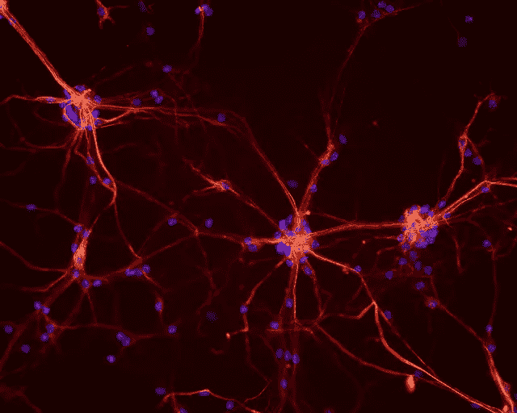
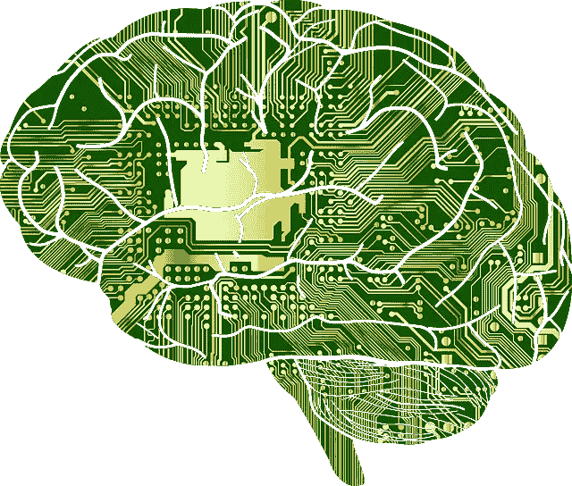
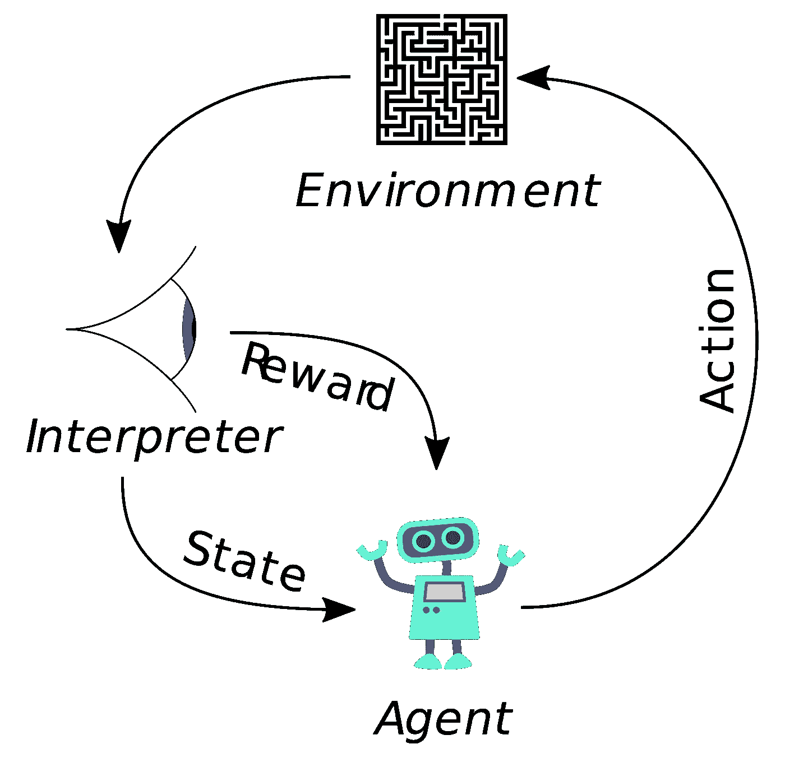

# 最好(而且免费！！)了解深度学习具体细节的资源

> 原文：<https://medium.com/hackernoon/best-and-free-resources-to-understand-nuts-and-bolts-of-deep-learning-9c51166ffdf5>

互联网上充斥着入门深度学习的教程。你可以选择从一流的斯坦福课程 [CS221](http://cs231n.stanford.edu/) 或 [CS224](http://cs224d.stanford.edu/) 、[快速 AI 课程](http://www.fast.ai/)或深度学习 AI [课程](https://www.deeplearning.ai/)开始，如果你是一个绝对的初学者。除了深度学习人工智能，其他都是免费的，可以在家里舒适地使用。你所需要的只是一台好的电脑(最好是配有 Nvidia GPU 的)，你可以迈出深度学习的第一步。

然而，这个博客不是针对绝对初学者的。一旦你对深度学习算法如何工作有了一点直觉，你可能会想了解事情在引擎盖下是如何工作的。虽然深度学习的大多数工作(除了数据管理之外的 10%，即总工作的 90%)是添加 Conv2d 之类的层，在 ADAM 之类的不同类型的优化策略中更改超参数，或者使用 batchnorm 和其他技术，只是通过用 Python 编写一行命令(感谢可用的牛逼框架)，但许多人可能会强烈希望知道幕后发生了什么。这是一个资源列表，可以帮助你了解当你放置一个 conv2d 层或调用 T.grad 时，发生了什么。

# 综合论文

深度学习的书当然是最有名最知名的[资源](http://www.deeplearningbook.org/)。其他好的资源是 Charniak 教授的[课程](https://cs.brown.edu/courses/csci1460/assets/files/deep-learning.pdf)和[论文](https://arxiv.org/abs/1709.01412)，这是深度学习的技术介绍。如果你想从某个特定的角度去理解事物，你可能还想利用其他的资源。例如，[教程](https://arxiv.org/abs/1801.05894)是从应用数学家的角度编写的，如果你只是想开始编码而不想深入任何理论，那么在这里阅读。还有一个推荐资源是 PyTorch [这里](https://documents.epfl.ch/users/f/fl/fleuret/www/dlc/)的深度学习课程。本课程讲述自下而上的事情，并帮助你抓住一个更大的视角。

# 关于反向传播的问题

很多时候，人们不确定“梯度下降和反向传播是怎么一回事？”或者“链式法则和反向传播到底是什么？”。为了理解基本原理，我们可以选择阅读鲁梅尔哈特、辛顿和威廉姆斯的原始论文，这是一切开始的地方。该文件位于[这里](https://web.stanford.edu/class/psych209a/ReadingsByDate/02_06/PDPVolIChapter8.pdf)，是一份非常简单易懂的文件。

除此之外，你还可以阅读一些非常有用的资源，比如 Karpathy 关于反向[道具推导的博客](/@karpathy/yes-you-should-understand-backprop-e2f06eab496b)和[解释反向推导的视频](https://www.youtube.com/watch?v=gl3lfL-g5mA)。

# 线性代数和其他数学

任何人都会把渴望学习线性代数的人转到斯特朗教授的[课程](https://ocw.mit.edu/courses/mathematics/18-06-linear-algebra-spring-2010/)。这可能是世界上最好的线性代数资源。类似的情况还有 Boyd 教授的最优化课程[这里](http://web.stanford.edu/~boyd/cvxbook)或者向量微积分的流形上的微积分书(你可以在谷歌上搜索“流形上的微积分”找到 pdf)。然而，人们不需要通过这些资源查看其主题的深度来跳入深度学习。一个非常快速的开始方法是快速复习深度学习的所有先决微积分，可以在这里[找到](https://arxiv.org/abs/1802.01528)。还有一套非常好的[讲义](http://people.eecs.berkeley.edu/~elghaoui/Teaching/EE227BT/lectures.html)来看看深度学习中使用的凸优化。另一个很好的资源是 Sebastian Reuder 的论文。我也喜欢这些讲义来理解[张量](https://github.com/mtomassoli/tensor-differential-calculus/blob/master/tensor_diff_calc.pdf)上的导数。

# 自动微分和深度学习库

当你在做深度学习时，自动微分并不是你绝对需要知道的东西。大多数框架如 Torch、Theano 或 tensorflow 会自动为您完成。在大多数情况下，你甚至不需要知道微分是如何进行的。也就是说，如果你决心了解深度学习框架如何工作，你可能想了解自动微分如何工作[这里](https://arxiv.org/abs/1502.05767)。了解深度学习库如何工作的其他好资源可以在这个[博客](http://blog.christianperone.com/2018/03/pytorch-internal-architecture-tour)和[视频](https://www.youtube.com/watch?v=Lo1rXJdAJ7w)中找到。

# 卷积神经网络；

在你完成一些使你能够使用基本修道院的课程后，你可能需要的最有用的东西是理解卷积如何在图像上工作。"对输入应用某种类型的卷积后，输出形状是什么？"，“步幅如何影响卷积？”，“什么是批量正常化？”诸如此类的东西。我见过的关于这类应用题的两个最佳资源是这里的教程[和这里的 Ian Goodfellow 的演讲](https://arxiv.org/abs/1603.07285)。如果你想得到一个想法，这里有一篇关于 Convnets 的更全面的[评论](https://arxiv.org/abs/1803.08834)。这篇关于物体检测的[综述](https://towardsdatascience.com/deep-learning-for-object-detection-a-comprehensive-review-73930816d8d9)是该主题中非常好的资源。

# 自然语言处理中的深度学习

我之前在博客中指出的斯坦福 224 课程是一个非常好的起点，你应该对几乎所有事情都足够好。youtube 上还有 Graham Neubig(使用 dynet)的课程[这里](https://www.youtube.com/watch?v=Sss2EA4hhBQ)。还有一本由 Yoav Goldberg 写的 NLP 书籍，你可能会喜欢。在这本书写完之后，NLP 的(更新)进展在这里[被回顾](https://arxiv.org/abs/1708.02709)。还有一个很常见的问题，关于在文本上使用 convnets 还是 RNNs (LSTMs/GRUs)。这里有一个很好的概述。

# 强化学习

萨顿和巴尔托是这些方法的入门圣经。这本书是免费的，在这里可以买到。这里有一篇关于最近深度强化学习方法的很好的综述。这里有一本非常有趣的关于强化学习的教程。

蒙特卡洛树搜索(除深度强化学习技术外，是 Deepmind apart 算法的一部分)的一个很好的综述[这里](http://mcts.ai/pubs/mcts-survey-master.pdf)。然而，我使用[这个](http://jeffbradberry.com/posts/2015/09/intro-to-monte-carlo-tree-search/?utm_source=top.caibaojian.com/19271)快速教程来了解它们。

# 其他一些好的评论/教程

Goodfellow 在 2016 年 ICLR 大会上给出了一个关于 GANs(生成对抗网络)和生成模型的很好的教程。这里可以找到[。神经网络已被用于传输 art(例如在 Prisma app 中)，详细的方法调查可在](https://www.youtube.com/watch?v=HGYYEUSm-0Q)[这里](https://arxiv.org/abs/1705.04058)找到。Reuder 关于多任务学习(通过相同的神经网络组合多个任务)的另一个很好的调查是这里的**。**

# 批评

虽然深度学习在多个问题上的效果令人惊讶，但我们知道总会有一些地方他们还没有到达。一些值得一读的好的批评是 Shalev-Shwartz 等人的基于梯度的学习的失败，Hinton 的这个演讲列出了 convnets T21 的一些困难，以及 conv nets 如何不能破译他们在 T23 上训练的图像的底片。几天前，这里的另一个批评成为了病毒/争议，那就是这个。还有[这篇关于深度学习恶意使用的广泛报道](https://arxiv.org/abs/1802.07228)。

# 对立的例子

这是一个制造人工/真实数据点的巨大领域，可以欺骗 Convnets。我本可以把它放在评论区，但是我没有

1)它们不是所有应用的技术挑战，并且

2)我对它们不是很了解。一个非常酷的开始和感兴趣的案例是[这里](https://www.labsix.org/physical-objects-that-fool-neural-nets/)他们生成“敌对对象”来欺骗神经网络。

你也可以在这里阅读成为数据科学家[应该知道的机器学习算法。](https://blog.paralleldots.com/data-science/machine-learning/ten-machine-learning-algorithms-know-become-data-scientist/)

我们希望你喜欢这篇文章。请[注册](http://user.apis.paralleldots.com/signing-up?utm_source=blog&utm_medium=chat&utm_campaign=paralleldots_blog)免费的 ParallelDots 账户，开始你的 AI 之旅。你也可以在这里查看 PrallelDots AI API[的演示。](https://www.paralleldots.com/text-analysis-apis)

这里可以阅读原文[。](https://blog.paralleldots.com/data-science/deep-learning/best-and-free-resources-to-understand-of-deep-learning/)

 [## 深度学习——黑客正午

### 在黑客正午阅读关于深度学习的写作。黑客如何开始他们的下午？

hackernoon.com](https://hackernoon.com/tagged/deep-learning)