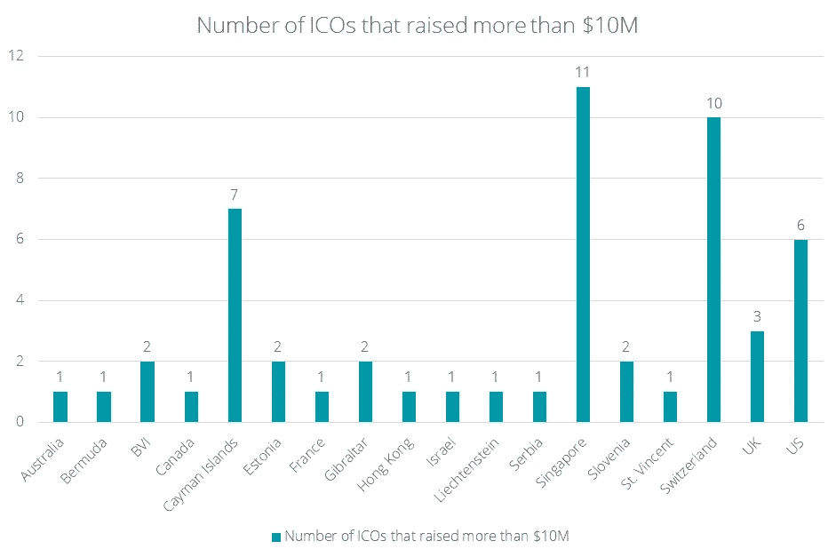
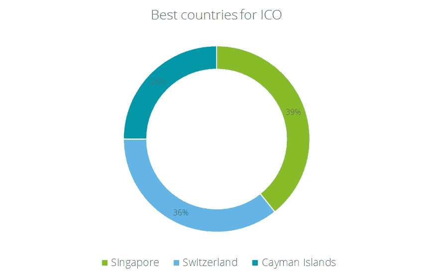
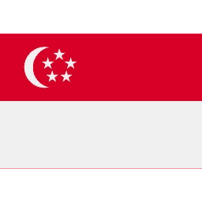

# ICO 最佳国家

> 原文：<https://medium.com/hackernoon/best-countries-for-ico-ef710ace2785>

最近，ICO(首次公开募股)作为[区块链](https://hackernoon.com/tagged/blockchain)创业公司筹集资金的一种方式获得了相当多的关注。

作为一种融资选择，它如此受欢迎的部分原因是因为它为企业家提供了更容易获得投资者资金的途径，这些企业家可能会发现难以通过 IPO 等传统融资计划推出他们的商业想法，在这些计划中，严格的监管通常会阻止他们满足所有必要的要求，甚至成为合格的市场参与者，更不用说具有足够的吸引力，能够从投资者那里筹集足够的资金。

然而，随着投资者资金的容易获得，出现了许多欺诈活动，T4 ICO T5 项目背后的一个团体突然消失，没有兑现他们的承诺，带着筹集的资金逃跑了。

因此，人们对 ICO 的做法褒贬不一也就不足为奇了。虽然支持者称这是一种收集投资者资金的创新方式，但怀疑者认为这是庞氏/金字塔骗局的温床。

不仅人们对 ico 褒贬不一，各国也是如此。一些[国家禁止 ICO](http://english.yonhapnews.co.kr/news/2017/09/29/0200000000AEN20170929005300320.html) (甚至[关闭加密货币交易所](http://www.businessinsider.com/bitcoin-price-chinas-biggest-exchanges-shutting-2017-9))另一些国家试图在创业公司筹集资金的方式上接受这种范式转变。

在这篇文章中，我们将看看一些开展 ICO 运动的最佳国家。该分析基于我们对一些最成功的 ico 进行的独立研究。

在这里，我们将“成功的 ico”定义为:

1.  在代币销售中筹集了超过 1000 万美元
2.  仍在运作
3.  没有涉及法律问题
4.  不是骗局

最佳国家拥有最多的成功 ico。

# 使用的数据

*我们使用了本网站***中的数据作为参考。**

*首先，我们将 ico 按“总筹款”降序排列，然后选择前 100 个活动。*

*然后，我们联系了项目团队，以确定他们的注册国家。结果如下图所示。在这 100 个项目中，有 47 个无法联系到，或者干脆拒绝就其注册状态置评。因此，以下数据基于 53 家代币销售额超过 1000 万美元的 ico。此外，所有 53 个项目都符合上述“成功”标准的其余部分:它们目前正在运作，没有一个因欺诈计划而被起诉。*

**

# *分析*

*根据这些数据，我们将着眼于以下国家/地区进行分析:*

*   *新加坡*
*   *瑞士*
*   *开曼群岛*

**

**请注意，在美国证券交易委员会发布了*[*Munchee 命令*](https://www.sec.gov/litigation/admin/2017/33-10445.pdf) *之后，我们决定不将美国列入名单，该命令阻止了总部位于加利福尼亚州的公司 Munchee Inc .在第二天继续其 ICO 活动，该公司创建了一个允许其用户发布餐馆评论的区块链应用程序。尽管该公司在其白皮书* *中声明“已经进行了一项 Howey 分析，以确定按照目前的设计，MUN 公用事业代币的销售不会构成涉及联邦证券法的重大风险。”该命令称，其模拟证券实际上是“证券”，因为它们被视为“投资合同”。事实上，豪威测试是目前唯一可靠的方法，人们计划一个 ICO，以确定其令牌是否被视为一种“证券”，但美国证券交易委员会可以简单地不同意“内部”分析意味着，潜在的企业家可能或多或少地受到美国证券交易委员会的决定，如果他们不注册他们的令牌作为证券或有资格获得豁免。SEC 裁决的不可预测性导致我们将美国排除在我们的分析之外。**

# *新加坡*

**

*这个拥有第七高人均 GDP(截至 2017 年 7 月 1 日)并经常在 PISA 测试中名列前茅的国家也是我们调查的 53 次成功 ICO 活动中的 11 次(20.7%)的所在地。*

*有几个因素使得这个国家对加密领域的企业家如此有吸引力。*

*新加坡金融监管机构新加坡金融管理局(MAS)在 8 月份表示，它将对数字代币进行监管,“如果(它们)构成受《证券及期货法案》( Cap。289) (SFA)”。这基本上与[SEC 裁决](https://www.sec.gov/news/press-release/2017-131)的观点相似，该裁决认为“特定投资交易是否涉及证券的发售或出售……将取决于事实和环境，包括交易的经济现实”，这基本上意味着 ICO 代币的特定性质并不完全清楚。*

*尽管如此，金融管理局在 12 月发布了另一份声明[,要求投资者“极其谨慎地”做出决定，并认识到加密市场总体上存在“重大风险”。](http://www.mas.gov.sg/News-and-Publications/Media-Releases/2017/MAS-cautions-against-investments-in-cryptocurrencies.aspx)*

*虽然后一份报告的语气似乎表明了其对加密货币投机性质的担忧，但新加坡金融管理局也明确表示，它“不监管加密货币”，表达了对加密空间的中立立场。*

*事实上，我们可以说，新加坡金融管理局对金融科技相关业务持相当积极的态度。新加坡金融管理局通过其所谓的[“金融科技监管沙箱”](http://www.mas.gov.sg/Singapore-Financial-Centre/Smart-Financial-Centre/FinTech-Regulatory-Sandbox.aspx)倡议，实际上是在“鼓励更多的金融科技实验”。它鼓励“FIs(金融机构)以及金融科技公司尝试创新的金融产品或服务”，并提供“适当的保障措施，以遏制失败的后果，维护金融体系的整体安全和稳健”。*

*新加坡金融管理局积极(如果不是一致)支持金融科技倡议的发展，而且它也是新加坡事实上的中央银行和金融部门的监管机构，这一事实应该很好地说明了它的监管立场。*

*如果你正在寻找一个可靠的政府支持的支持结构来启动 ico，新加坡应该是你的首选。*

***案例分析:** [**金恩币**](https://enjincoin.io/)*

*通过众筹，金恩已经筹集了超过 2000 万美元，是“最大的在线游戏社区创造平台”。它的主要特色是金恩币(ENJ)，这是一个可定制的加密货币和虚拟商品游戏平台。这枚硬币被[估计](https://enjincoin.io/enjincoin_sec_howey_test.pdf)无法通过[豪威测试](https://en.wikipedia.org/wiki/SEC_v._W._J._Howey_Co.)，豪威测试是一套广泛用于确定这枚硬币是否应该被归类为证券的标准。因此，他们的分析基本上声称，代币不太可能被归类为证券，根据 SEC 的惯例，证券可能会受到更严格的监管。*

# *瑞士*

**

*瑞士因其悠久的经济和政治稳定传统而闻名，在我们的研究中，瑞士是第二大最受欢迎的国家，有 9 个国家(16.9%)成功举办了 ICO 活动。与新加坡的情况一样，它对 ICO 的监管立场也不太明确，其金融市场监管机构(FINMA) [表示](https://www.finma.ch/en/news/2017/09/20170929-mm-ico/)虽然它承认“这种技术的创新潜力”，但它也宣称 ICO 程序的某些方面“可能已经被现有法规所涵盖”。*

*然而，早在声明发布之前，该国就已经在加密货币领域确立了有利地位。*

*2013 年， [Monetas](https://monetas.net/) 的创始人 Johann Geversthe 提出了[密码谷](https://en.wikipedia.org/wiki/Crypto_Valley)的想法，以硅谷命名并模仿硅谷，使该国成为全球密码技术中心。为了在该国发展加密生态系统，他与该领域的各种利益相关者建立了合作关系，吸引了主要的加密初创公司，同时通过在该领域发展专家服务提供商生态系统来确保他们的运营得到支持，并促进了他在行业中的愿景。*

*这导致了[Crypto Valley Association](https://cryptovalley.swiss/)的成立，“这是一个独立的、受政府支持的协会，旨在充分利用瑞士的优势来构建世界领先的区块链和加密技术生态系统”。它通过促进该领域的研究、提供政策建议和组织各种行业活动等来支持加密创业公司的发展。*

*鉴于这种私人和公共倡议的蓬勃和积极的发展，加上政府当局对加密空间的自由放任，或者更积极的态度，难怪我们继续看到许多加密企业家决定在那里建立他们的运营基地。*

*因此，我们可以有把握地得出结论，瑞士是从专门的加密爱好者社区获得广泛支持的最佳地方。*

***案例分析:** [**班柯**](https://www.bancor.network/)*

*众所周知，以太坊是在瑞士创立的，以太坊基金会[位于楚格。认为很多与以太坊平台相关的密码项目应该建立在那里，这可能不是没有道理的。Bancor 是许多利用以太坊生态系统和加密谷的区块链项目之一，](https://www.ethereum.org/foundation) [Bancor 本身是加密谷实验室的创世成员之一](https://cryptovalley.swiss/crypto-valley-labs-genesis-hub-zug/)。这是一个分散的网络，允许以数学上透明的汇率兑换任何符合 ERC20 的以太坊代币，同时确保代币的持续流动性，而没有任何交易对手风险。*

*同样值得注意的是，在代币销售开始后的几个小时内，它已经筹集了 1.53 亿美元，成为有史以来最成功的 ico 之一。然而，在推出后不到一个月，它的价格下跌了 50%以上，导致一些投资者将其称为“有史以来最差的 ICO”。虽然截至 2017 年 12 月 27 日，它已经恢复了最初的价格水平，但这一记录表明，最成功的 ICO 活动项目不一定是长期商业成功的项目。*

***开曼群岛***

**

*虽然不是一个国家，这个英国海外领地自诩为构建 ICO 最有趣的地区之一。通过其稳定的政治和法律平台，它看到了许多离岸公司的形成，其中许多是机构客户，因为他们更喜欢与国际标准有关的强有力的监管和法律框架，而不是在更适合于投机活动的 merky 监管环境下运营。*

*这种强有力的监管和法律精神自然使这个 BOT 成为启动 ICO 的最有吸引力和最可靠的领域之一。*

*与此同时，对于那些考虑发起 ICO 活动的人来说，其中一个关注点是了解所发行令牌的性质。具体来说，如果它通过了 Howey 测试(如上所述),它将被认为是安全的，有可能将自己暴露在 SEC 和其他监管机构的监督范围之内。然而，一些专家[建议](https://www.stuartslaw.com/cms/document/Initial_Coin_Offerings_in_the_Cayman_Islands.pdf)开曼群岛相关法律规定的“证券”定义不适用于 ICO 代币，这是一个有利于代币销售流程的有利因素。*

*尽管其加密生态系统中仍存在一定程度的法律模糊性，但我们认为这是因为该国的监管机构需要时间来确保所有区块链倡议的监管结构得到妥善制定，而不是试图推迟结构性实施，以试图在模糊的法律环境中吸引尽可能多的金融科技企业家。*

*具有明确目标和结构良好的路线图的 ICO 计划将会取得最大的成功，这是因为开曼群岛有着强有力的法律和监管精神，而不是尽管如此。*

***案例:***

***Block.one 的 ICO 活动在 5 天内筹集了超过 1.85 亿美元，被认为是有史以来最成功的 ICO 活动之一。作为一个“可扩展的分散自治社区(DAC)可以很容易地建立、启动和管理”的平台，它的目标是将自己建立为一个分散的平台，在此基础上建立各种透明、安全和廉价的网络应用程序——这是区块链技术应该带来的好处。***

# ***结论***

***在本文中，我们研究了已经吸引(并将继续吸引)区块链项目的 3 个主要国家/地区。每个国家都有不同的方法来构建关于区块链技术的法律框架和分析其特定管辖范围内的 ico。我们可以将使它们成为实施 ico 的合适场所的常见因素总结如下:***

1.  ***ICO 代币不太可能被归类为证券，因此较少受到“苛刻”的监管***
2.  ***存在支持性社区/政府机构，鼓励金融科技创业公司的发展***

***当然，监管框架在不断变化(尤其是在金融科技领域)，也不能绝对保证上面分析的某个国家不会突然改变其法律立场，并在该领域开始一场大规模的“打击”。然而，我们相信他们有相当稳定的经济、政治和法律基础，随时欢迎密码行业的新兴企业家。***