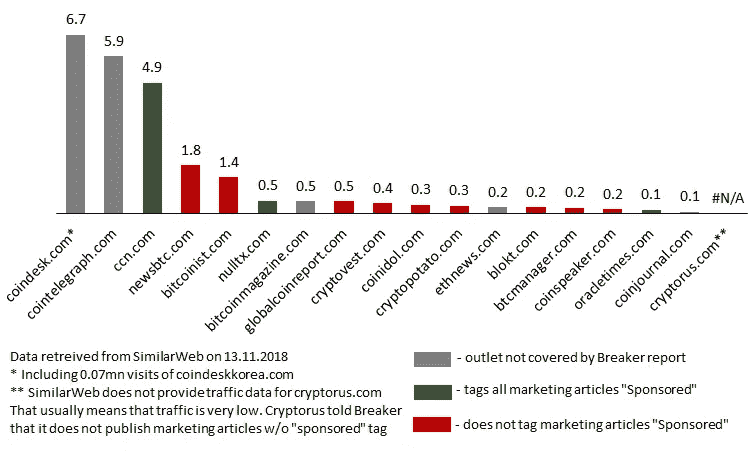

# 最佳加密货币新闻来源:如何明智地阅读它们

> 原文：<https://medium.com/hackernoon/best-cryptocurrency-news-sources-how-to-read-them-wisely-e4e2f438a255>

> 在加密领域有几十家新闻出版商——这是不可能的(也是不必要的！)全部读完。

我们阅读大量的新闻报道，并从中挑选出报道最好的。智慧是有代价的——我们每天花 3-5 个小时阅读加密新闻。

在这篇文章中，我们列出了必须阅读的英语加密新闻来源。我们讨论了它们的优点和缺点，并提出了一种每天只需 30 分钟就能做到的方法。

让我们强调一下——选择可靠的数据源至关重要。Breaker magazine 最近的[研究显示，50%的加密新闻媒体可以发布赞助内容，而不提及其营销性质——当然是额外收费。](https://breakermag.com/we-asked-crypto-news-outlets-if-theyd-take-money-to-cover-a-project-more-than-half-said-yes/)

令人遗憾的是，一些非常有名的名字，如[比特币主义者](https://bitcoinist.com/)和[新闻 BTC](https://www.newsbtc.com/) 打破了这种道德规范。剩下的 50%很聪明，没有回答。以下是如何不上当受骗的建议。

# **内容:**

**1。** [**每日新闻专业**](/p/e4e2f438a255#bbd5)
1.1。 [CoinDesk](/p/e4e2f438a255#50d4)
1.2。 [Cointelegraph](/p/e4e2f438a255#b88c)
1.3。 [CCN(原名 CryptoCoinsNews)](/p/e4e2f438a255#c83d)
1.4。[每日加密新闻:摘要](/p/e4e2f438a255#e8bf)

**2。** [**补充然而有用发布者**](/p/e4e2f438a255#d62c)
2.1。[BitcoinMagazine](/p/e4e2f438a255#c8ef)
2.2。[彭博密码](/p/e4e2f438a255#f45b)

**3。** [**独家故事与分析**](/p/e4e2f438a255#2d7e)
3.1。[块](/p/e4e2f438a255#b2ae)块
3.2。[断路器](/p/e4e2f438a255#30f2)3.3
。[现代共识](/p/e4e2f438a255#f369)
3.4。[我们长长列表中的其他网站](/p/e4e2f438a255#afab)

**4。** [**研究博客和邮件列表**](/p/e4e2f438a255#dfdc)
4.1。[工作证明](/p/e4e2f438a255#31ce)
4.2。[Diar](/p/e4e2f438a255#7a7e)4.3
。 [Woobull](/p/e4e2f438a255#a655)
4.4。 [BitMEX 研究](/p/e4e2f438a255#de03)
4.5。[要记住的其他研究来源](/p/e4e2f438a255#422c)

**5。** [**用户生成内容平台**](/p/e4e2f438a255#047c)
5.1。 [Reddit](/p/e4e2f438a255#0352)
5.2。[中等](/p/e4e2f438a255#d16a)中等
5.3。[黑客正午](/p/e4e2f438a255#4b02)
5.4。[钢模](/p/e4e2f438a255#f7ae)

**6。** [**新闻聚合**](/p/e4e2f438a255#2a27)
6.1。[隐恐慌](/p/e4e2f438a255#d2f1)6.2
。[其他一些自动聚合器](/p/e4e2f438a255#2357)
6.3。[我们的服](/p/e4e2f438a255#07f4)

**7。** [**结论**](/p/e4e2f438a255#ab8c)

# **1。** **每日加密新闻专业**

日常新闻专业是加密货币信息的必不可少的来源。从阅读其中至少一本开始你的一天是一个好习惯。如果你浏览 2-3 个每日新闻网站，你会注意到出版商报道相同的主题。我们可以说 70%的新闻主题在所有网站上都是一样的。然而，剩下的 30%的独特内容是有价值的。根据我们的经验，阅读排名前三的出版商足以找到所有主要新闻。

这一类有很多销路。最直接的方法是通过网站流量来给他们排名。我们发现了内容质量和网站受欢迎程度之间的相关性。排名前三的网站是 [CoinDesk](https://www.coindesk.com/) 、 [Cointelegraph](https://cointelegraph.com/) 和 [CCN](https://www.ccn.com/) 。

**2018 年 10 月每日加密新闻网站流量，百万访问量**

Source: THE SILICOIN analysis, SimilarWeb, Breaker magazine report

## 1.1 [CoinDesk](https://www.coindesk.com/)

> 如果你想挑选一个每日加密新闻出版商，CoinDesk 是显而易见的。

它自 2013 年以来一直存在，网站流量排名第一。CoinDesk 的内容质量和交付速度略好于同行。

CoinDesk 上几乎不存在赞助文章。这可能是因为 CoinDesk 在 2018 年聚集了 8500 名与会者的共识会议上赚了足够多的钱。[据 Axios](https://www.axios.com/coindesks-quietly-profitable-media-business-1534801642-c986cd6e-8578-459f-b838-4ef5a59d4ba6.html) 报道，2018 年 7 个月，CoinDesk 创造了 2000 万美元的收入。

CoinDesk 在南韩有一家[分公司](https://www.coindeskkorea.com/)。除了提供漂亮的朝鲜语文本外，它还使 CoinDesk 成为第一个接收来自韩国的加密新闻的网站。这个国家是 DLT 运动的中心之一，所以来自朝鲜的新鲜消息是一个很好的好处。

## 1.2 [硬币电报](https://cointelegraph.com/)

Cointelegraph 是我们的第二大来源。它有一个独特内容的合理部分(它仍然很低，但不幸的是，它是行业标准)。

说到地理角度，Cointelegraph 有时会发布一些关于德国发展的有趣文章。他们可能会有一些当地的编辑，这很好。还有一个[德语版](https://de.cointelegraph.com/)的网站。

营销文章标有清晰可见的徽章“赞助商”。

在我们看来，他们为文章使用的插图有些幼稚，但这是一个品味问题。虽然他们提供了很好的内容，我们可以容忍图片。

## 1.3 [CCN](https://www.ccn.com/) (原 CryptoCoinsNews)

在我们的加密每日新闻列表中，我们将 CCN 列为第三名。这是一个很好的和著名的来源。

我们注意到，CCN 有时会强调俄国、乌克兰和东欧的加密发展，而这是其他出版商没有涉及的。对我们来说，把 CCN 列入我们的阅读清单是一个重要的论点。

CCN 将所有赞助的新闻发布从他们的主供稿中移除。您可以在主提要左侧的列中找到它们。

CCN 有一个兄弟姐妹叫[被黑](https://hacked.com/)。黑客主要关注交易信号、ICO 分析和其他深奥的东西。

## 1.4 每日加密新闻:摘要

显然，有许多较小的每日加密新闻网站。举几个例子:[bit coin ist](https://bitcoinist.com/)(y)[NewsBTC](https://www.newsbtc.com/)(y)[NullTX](https://nulltx.com/)(n)[et hnews](https://www.ethnews.com/)(？)、 [Cryptovest](https://cryptovest.com/) (y)等。较小的资源可能偶尔会发布不错的独特作品。然而，这种情况很少发生。而且，网点越小，越不在乎名声。遗憾的是，所有带有(y)标签的发行商都在 [Breaker 的调查](https://breakermag.com/we-asked-crypto-news-outlets-if-theyd-take-money-to-cover-a-project-more-than-half-said-yes/)中妥协了。

然而，即使阅读 top-3 outlets 也不能保证没有隐性营销。我们经常会遇到没有被贴上赞助商标签但看起来很促销的文章。我们不打算对例子进行推测——做出你自己的观察。我们的结束语是:要谨慎，避免危及自身的资源。

> 随意阅读—选择 [CoinDesk](https://www.coindesk.com/) 。更严肃的方法是阅读所有三个每日专业，但是准备好在每个专业中发现 15 篇新文章，并且每天投入 1-2 个小时。

# **2。** **补充但有用的出版商**

有几个网站值得每周去一次。它们没有涵盖 crypto 中发生的所有事情，但偶尔会出现一些好的采访、技术评论或深度回顾。

## 2.1 [BitcoinMagazine](https://bitcoinmagazine.com/)

BitcoinMagazine 出现于 2012 年，可能是最古老的加密媒体渠道。它自称以太坊的联合创始人维塔利克·布特林是早期作者之一。显然，BitcoinMagazine 最好的日子已经过去了。现在你会发现那里有许多项目公告，而不是经常被改写的新闻。

然而，BitcoinMagazine 有时会以绝对精彩的文章给我们留下深刻印象。他们的创世纪文件系列是每个对加密感兴趣的人的必读之作。该系列涵盖了早期密码发展历史的 4 个部分:[第一部分](https://bitcoinmagazine.com/articles/genesis-files-how-david-chaums-ecash-spawned-cypherpunk-dream/)、[第二部分](https://bitcoinmagazine.com/articles/genesis-files-hashcash-or-how-adam-back-designed-bitcoins-motor-block/)、[第三部分](https://bitcoinmagazine.com/articles/genesis-files-if-bitcoin-had-first-draft-wei-dais-b-money-was-it/)、[第四部分](https://bitcoinmagazine.com/articles/genesis-files-bit-gold-szabo-was-inches-away-inventing-bitcoin/)。他们最近[对 stablecoins](https://bitcoinmagazine.com/articles/search-stability-overview-budding-stablecoin-ecosystem/) 的拍摄也很有见地。

## 2.2 [彭博密码](https://www.bloomberg.com/crypto)

它只是一家大型金融新闻机构的秘密部门。彭博有一大批编辑，难怪他们有时会挖掘出有趣的信息。

# **3。** **独家报道和分析**

这是一个有趣的部分。人人都爱好的分析。好的分析需要时间和知识，因此非常稀缺。

> 几家分店吸引了我们的眼球，讲述了一些有趣的故事。只是管理你的期望——你不会在那些文章中发现新的美洲，但你会发现一些知识渊博的编辑的优秀作品。

该区的媒体也发布每日新闻。但是，它不是他们的核心价值，因为覆盖率较低。

## 3.1 [挡块](https://www.theblockcrypto.com/)

该区块最近才出现在我们的雷达上——在 2018 年夏天。这个网站有一个不错的一般加密新闻选择。然而，它与众不同的特征是标有“我们的成果”的研究项目。他们的加密投资者地图很方便，对本地比特币交易量的分析也很周到。

> 我们认为对于有时间意识的读者来说，遵循 coin desk+Block 是一个不错的选择。

## 3.2 [断路器](https://breakermag.com/)

在这篇文章中，我们已经放置了 Breaker 关于加密新闻媒体不道德行为的报告。这是调查性新闻报道的一个很好的例子——值得称赞。

Breaker 制作评论、观点、访谈，独一无二。但是题目的选择经常会引起争议。在我们看来，Breaker 更多的是娱乐，而不是新闻加工。

## 3.3 [现代共识](https://modernconsensus.com/topics/cryptocurrencies/)

乍一看，这个网站可能显得空洞而无聊。有几天甚至几周没有关于现代共识的出版物。

有一次我们在这个网站上发现了一篇关于[系绳问题](https://modernconsensus.com/noble-funding-cash-tether/)的文章。大约一天后，同样的信息从其他来源传来。《现代共识》的人知道一些事情——我们认为。至少他们发布关于 Bitfinex 和 Tether 的新闻比别人快。

## 3.4 其他一些网站

上面的网站列表并不详尽。有许多网站做得相当不错。然而，我们没有强有力的论据来支持它们——也许它们以后会出现。

以下是其他一些制作内容而不仅仅是重写的加密发行商的列表:

*   [全球硬币研究](https://globalcoinresearch.com/)(实际上如网站所说，其重点是亚洲)
*   [TNW 硬叉](https://thenextweb.com/hardfork/)
*   [算盘杂志](https://abacusjournal.com/)
*   [分布式](https://distributed.com/)
*   [解密媒体](https://decryptmedia.com/)
*   [信任节点](https://www.trustnodes.com/)
*   [AMB 密码](https://ambcrypto.com/)
*   [ZyCrypto](https://zycrypto.com/)

# **4。** **研究博客和邮件列表**

加密社区是真正充满活力的——存在大量的博客和邮件列表。

> 20 世纪 90 年代，关于分散货币早期实现的讨论主要集中在 Cypherpunks 邮件列表上。因此，注册正确的邮件列表可能会改变你的生活。

## 4.1 [工作证明](http://proofofwork.news/)

工作证明是我们最喜欢的博客。无与伦比。来自 crypto 引人注目的团队的顶级技术和业务人员分享项目更新和他们的想法。

只要订阅这个列表，你会喜欢的。

## 4.2 [Diar](https://diar.co/)

Diar 是一份周刊。每周一送。Diar 主要关注交易统计。此外，还介绍了监管、技术和项目相关的主题。

文笔喜人，分析优于平均水平。

如果信是在星期天送来的，Diar 就更好了。几乎没有东西在周末出版——可能是几篇社论——导致严重的新闻缺乏。

## 4.3 [伍布尔](https://woobull.com/)

Willy Woo 自己这样描述他的博客:
“…这只是一个让我记录我的大脑屁的地方，因为我正在对加密货币作为投资进行一些数据驱动的研究。”

他的屁包括加密货币估值、经济和交易的有趣笔记。他主要活跃在 Twitter 上。我们建议[关注他](https://twitter.com/@woonomic)，你会在他的博客中收到新帖子的通知。

威利·吴博客的读者会在他网站的[图表区](http://charts.woobull.com/)获得一份有价值的奖金。这些图表显示了为提高比特币的估值和跟踪网络统计数据而开发的指标。

## 4.4 [BitMEX 博客](https://blog.bitmex.com/research/)

BitMEX 是一个著名的加密货币衍生品交易平台。他们的研究团队偶尔会发表深思熟虑的研究。当他们这样做时，每日新闻媒体可能会发布研究的摘录，因此你不会错过 BitMEX 的一篇新文章。

## 4.5 要记住的其他研究来源

[以太坊一周](http://www.weekinethereum.com/)列出了以太坊的技术、商业和社区发展的综合列表。列表中的条目数量再次证明以太币是最活跃的硬币。

[梅萨里的无保留意见](https://messari.substack.com/)邮件列表。在大量免费的高质量加密邮件列表中，我们惊讶地发现在 Messari 的时事通讯前面有一个部分付费的墙——“只有偶尔的免费”邮件可供非付费用户使用。

其他像样的邮件列表还有《麻省理工技术评论》的[连锁信](https://www.technologyreview.com/newsletters/chain-letter/)、[代币经济](https://tokeneconomy.co/)、[代币日报](https://www.tokendaily.co/)。

# **5。** **用户生成的内容**

有几个平台提供用户生成的内容。人们可能很容易陷入这些平台上的大量好内容，但大多不是那么好的内容中。

## 5.1 [Reddit](https://www.reddit.com/)

这里没什么要补充的。

[/r/cryptocurrency/](https://www.reddit.com/r/cryptocurrency/) 和[/r/比特币/](https://www.reddit.com/r/bitcoin/) 是主要的加密子元。后者最近已超过 100 万用户。你会在许多网站上找到数百个其他项目相关的子编辑的链接[，包括我们的](https://thesilicoin.com/)。

## 5.2 [中等](/)

Medium 的格式与 Reddit 不同。它对读者更友好，但不太注重讨论。很多人用 Medium 作为博客平台，包括我们自己。

科学家、工程师、业余投资者和其他人有时会发布非常好的帖子。阅读博客是理解分布式账本技术和加密货币走向的一种方式——这无法从每日新闻中获得。

博客文章有一个问题——它们很难找到。我们读了很多并收集了这样的帖子。他们中的大多数最终出现在我们的新闻提要的[“Longread”部分。显然不可能找到所有有价值的帖子。当你挖到宝藏时，请在](https://thesilicoin.com/news?tab=longread) [Twitter 消息](https://twitter.com/THE_SILICOIN)中给我们发短信。

## 5.3 [黑客正午](https://hackernoon.com/)

说到个人作者的帖子，Hacker Noon 也是一种聪明的获取方式。该网站拥有 7000 多名投稿人，他们就尖锐的话题提供观点和意见。

Hacker Noon 有相当数量的加密作者，每天都有一些加密文章出现在这个网站上。*有些*但不是全部可以在网站的[比特币版块](https://hackernoon.com/bitcoin/home)找到。因此，我们建议从主页开始。

## 5.4 [钢米特](https://steemit.com/)

谈论加密货币相关的用户生成内容并传递 Steemit 是不正确的。Steemit 是基于 STEEM 区块链的最大的博客平台，向内容创建者发放奖励。尽管 STEEM 是一个非常合理且有效的协议，但大多数出版商还没有采用它。

# **6。** **新闻聚合器**

作为本节的前言，我们想指出的是，大多数一般新闻媒体有时会发布与加密相关的文章。美国消费者新闻与商业频道、福布斯、华尔街日报、金融时报、路透社、TechCrunch 不会错过评论热门加密话题的机会。每日加密新闻网站很快重写了大部分这些帖子，所以没有必要在其他地方搜索它们。如果你仍然想在网上搜索那些没有被专门网站报道的新闻，试试[的城市猎鹰](https://www.cityfalcon.com/)。坦率地说，我们的搜索没有产生任何增量信息。

从上面的部分中，你可以挑选十几个专门的加密货币和 DLT 新闻来源来阅读。把他们所有邮件放在一个地方会很方便。加密新闻聚合提供这样的服务。大多数新闻聚合器都是自动化的(相对于人工管理)。

自动化新闻聚合器的优点:

*   所有新闻都在一个地方
*   更新很快

**缺点**:

*   来自不同渠道的相同主题的文章堵塞了订阅源
*   大量无关紧要的新闻

## 6.1 [加密死机](https://cryptopanic.com/)

CryptoPanic 是最流行的自动聚合器。

它具有非常广泛的覆盖面，实时更新和折磨眼睛的设计。我们向交易者推荐这项服务。

## 6.2 其他一些聚合器

人们可以列出一长串自动加密新闻聚合器。在我们看来，CryptoPanic 是这一类别中最好的服务，但您可能会发现其他一些名称:

*   [伯明纳尔](https://berminal.com/home/)
*   [共同旁观者](https://coinspectator.com/)
*   [FAWS](https://faws.com/)

## 6.3 我们的观点

尽管在一个聚合网站上阅读所有新闻有好处，但我们发现每天浏览 150 多篇文章效率很低。通常每天只有 10 篇文章值得一读，20 多篇有些意思，剩下的 120 篇是赞助的，垃圾或重复的。

我们决定，我们的新闻提要需要过滤，以减少每天 120 个无用的片段。也许帕兰蒂尔科技公司能想出一种精确的过滤算法。然而，一个合格的人类可以更好地过滤新闻。

我们的编辑阅读各种来源的新闻。赞助，彻底的废话和重复被拒绝。其余的新闻被批准，并转到“所有新闻”饲料。来自他们的最重要的新闻都被打上了“值得一读”的标签。

[“值得一读”feed](https://thesilicoin.com/news) 是一种了解所有主要趋势和加密新闻的省时方式。对于那些担心错过一些标题的人来说，“所有新闻”是一个更好的选择——它实际上是所有独特的有意义的新闻的列表。然而，即使是最谨慎的读者也常常对“值得一读”的选择感到满意。

# **7。** **结论**

上面的加密新闻来源列表很长。尝试几种阅读它们的方法——这需要几天时间，但是为了提高效率，花点时间是值得的。

[工作证明](http://proofofwork.news/)邮件列表和[woobul 的 Twitter](https://twitter.com/@woonomic) 没有替代品。

即使是最大的新闻媒体有时也会发布一些看起来具有宣传性或者没有根据的新闻。我们敦促你对你读到的一切都要持批评态度。

您对本文的反馈和我们的方法将帮助我们改进这两个方面。通过 [Twitter](https://twitter.com/THE_SILICOIN) 、[反馈表](https://goo.gl/forms/nhnaqyg1FRHOHCP12)、[电子邮件](mailto:support@thesilicoin.com)或下面的评论联系我们。

敬上，[硅](https://thesilicoin.com/)团队