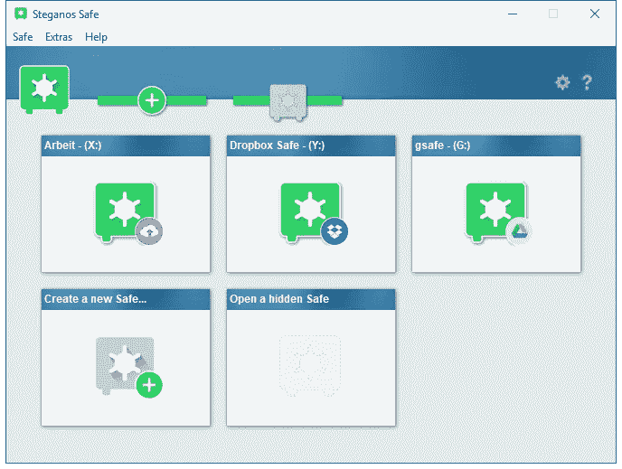

# 2018 年最佳加密软件工具

> 原文：<https://medium.com/hackernoon/best-encryption-software-tools-of-2018-6033e568a9bb>

人们说“数据是新的石油”一点也不夸张。如今，数据已经变得非常重要，以至于黑客们到处都在寻求通过任何必要的手段来获取数据。不管有没有许可，如果安全措施没有到位，我们的文件都可能成为目标，并在我们的眼皮底下被访问。

有不同的安全措施来防止数据落入坏人之手，使用加密工具就是其中之一。

在本文中，我们将了解 2018 年最佳加密软件工具。应该注意的是，这里的排列顺序并不表示哪种加密软件工具最适合您。

# [7-Zip](https://www.7-zip.org/)

**价格:**免费

**平台:** Windows，Linux

从遗留工具开始并不是一个坏的决定。是吗？

7-Zip 是一个流行的加密工具，已经存在很多年了，并且仍然是最有效的工具之一。

虽然许多人可能只知道 7-Zip 能够将文件压缩成 Zip、tar 等格式。格式，这个神奇的工具还有一个加密选项。

7-Zip 非常容易使用，可以用来快速加密文件和文件夹。这种加密工具使用 AES-256，它对于数据加密来说足够强大。

**优点**

*   使用方便
*   强加密
*   免费使用

**缺点**

# [BitLocker](https://docs.microsoft.com/en-us/windows/security/information-protection/bitlocker/bitlocker-overview)

**价格:**免费

**平台:** Windows

虽然上面讨论的 7-Zip 主要用于压缩或加密文件和文件夹，但 BitLocker 的工作范围更广。BitLocker 用于加密硬盘驱动器。

BitLocker 实施 AES-128 和 AES-256 加密方法，这两种方法对于加密硬盘驱动器来说足够强大。该工具在特定版本的 Windows 操作系统(如 XP Vista、7 和 8)上提供加密功能。

BitLocker 已正确集成到 Windows 操作系统中，因为它始终可用且易于使用。

但是，无论您的计算机上运行的是什么版本的 Windows，它都只能在具有可信平台模块(TPM)的计算机上运行，该模块用于生成强随机加密密钥。

**优点**

*   Windows 上的无缝体验
*   强加密
*   免费使用

**缺点**

*   仅适用于少数版本的 Windows
*   仅在装有 TPM 的计算机上有效

# [隐写保险箱](https://www.steganos.com/de/steganos-safe-20)

价格:19.97 美元

**平台:** Windows

大多数加密工具有助于加密文件，确保没有人能够访问它们。隐写术更进一步。Steganos Safe 不只是加密文件，它使它们隐藏起来，这样就没有人能够说出文件保存在哪里--没有人试图突破加密系统。

除了隐藏加密文件，它还清理任何删除文件的足迹。这确保了被删除的文件不能使用任何数据恢复机制来检索。

Steganos Safe 还实现了双重认证，因为您可以使用任何支持基于时间的一次性密码的软件，并通过输入扫描 QR 码后返回的代码将其链接到应用程序。

虽然 Steganos Safe 不是一个免费的加密软件，但当你真的有一些必须保持安全的关键数据时，它确实是值得的。

**优点**

*   使用方便
*   双因素认证
*   隐藏加密文件
*   移除已删除文件的足迹

**缺点**

*   不自由
*   加密文件只能传输到安装了隐写安全的电脑上

# [BoxCryptor](https://www.boxcryptor.com/en/)

**价格:**免费(简装)$48(个人)

**平台:**安卓、iOS、Mac、Windows

虽然我们看到的其余加密软件都是针对本地机器的加密，但 BoxCryptor 有一些特殊之处。BoxCryptor 有助于在云上加密你的文件。

这就带来了诸如“云服务不是已经实现了加密吗？."是的，他们有。然而，所实施的加密只是将外人拒之门外。云服务可以访问文件，如果他们愿意的话。

有了 BoxCryptor，即使是软件的开发者也无法获得加密密钥，更不用说云平台的管理员了。

如果您有非常重要的文件需要保密，BoxCryptor 将是解决方案。这个软件可能不便宜，但它值这个价钱。但是，您可以继续使用免费计划，该计划只允许您集成两个云提供商和两个设备。

**优点**

*   与云平台无缝集成
*   两步加密
*   使用方便
*   在许多操作系统上可用

**缺点**

*   昂贵的
*   移动应用程序有故障

# [确定安全](https://certainsafe.com/)

**价格:** $12(标准)

**平台:**云

虽然 BoxCryptor 有助于加密文件以用于云存储平台，但 CertainSafe 本身也是一个云存储平台。

与常规云存储平台不同，CertainSafe 采用端到端安全措施，旨在确保您的数据安全。

这是使用一个分裂的关键方法，使某些安全不能查看你的文件。CertainSafe 还确保加密数据被分解成不同的部分，并存储在不同的服务器上，以便在极少数黑客闯入服务器的情况下，整个文件不会被解密。

每月 12 美元的计划提供 100GB 的云存储空间，每月 15 美元的计划提供 200GB 的存储空间。

**优点**

*   不依赖于操作系统
*   远程访问文件
*   使用方便
*   不依赖第三方插件

**缺点**

*   没有互联网接入无法使用
*   小型云存储空间
*   每个文件不能大于 2GB

# [文件夹锁定](http://www.newsoftwares.net/folderlock/)

**价格:** $39.95

**平台:**安卓、iOS、云、Windows

文件夹锁表面上看起来可能像一个普通的加密软件。然而，有几个特性确保它在这个列表中。与其他工具相比，文件夹锁仍然是最快的加密工具之一。

文件夹锁定实施 AES-256 加密方法，以确保文件和数据得到足够的保护。它也有能力隐藏文件和清理足迹时删除文件就像隐写安全。

文件夹锁允许你创建“储物柜”。“储物柜”是对已经加密的文件的另一层保护，可以上传到云存储平台。

使用文件夹锁，你必须为每个加密文件创建一个安全的密码，除了主密码之外，才能访问该软件。您还可以设置诱饵密码来欺骗黑客，并查看不成功登录尝试的日志。

**优点**

*   可以在没有互联网接入的情况下使用
*   远程访问文件
*   使用方便
*   文件的快速加密
*   移除已删除文件的足迹

**缺点**

*   对某些人来说太复杂了
*   加密文件的安全备份不是免费的

# 荣誉奖

根据您的需求，还有其他高质量的加密工具。然而，本文无法涵盖全部。

以下是未讨论的优质加密工具列表:

*   **SecureIT:** 廉价的加密软件。
*   **遮瑕膏:**压缩和加密文件，与 Mac OS 无缝协作。
*   **SensiGuard 文件加密:**用于隐藏加密文件。
*   **蕾妮文件保护器:**用于密码恢复。

[*安东·谢列尼可夫写的*](https://www.linkedin.com/in/anton-shaleynikov-45812a1/)