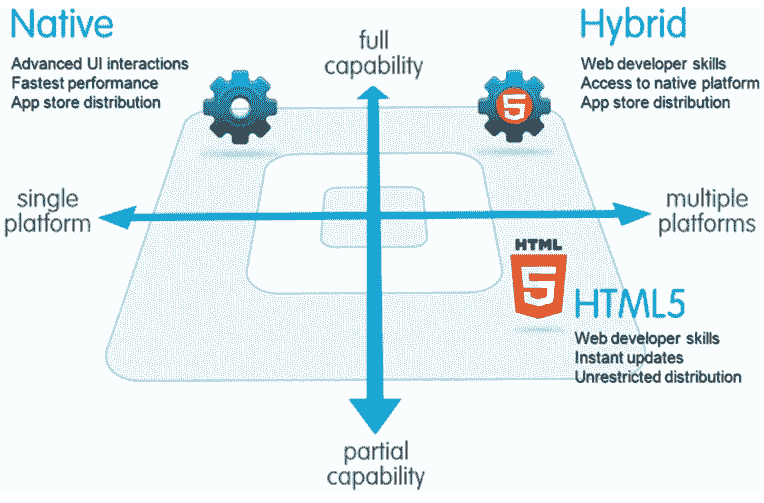

# React Native 在电子商务行业的最佳实现

> 原文：<https://medium.com/hackernoon/best-implementations-of-react-native-in-ecommerce-industries-in-2018-f12be1ae800b>

与过去相比，移动应用程序开发在电子商务行业中具有重要意义。成功的诀窍在于以较低的成本快速开发。应用程序应该与大多数设备兼容，应该能够同时在多个平台上运行，提供整体简单的用户导航，但当涉及到技术时，比较是必要的。您如何知道一个应用程序比另一个更好？在下载应用程序之前，您会找到评论和评级。你不可能买下这个世界上的每一部手机，这时候你就需要比较价格、功能和最适合你需求的东西。

在这篇文章中，我将带你们了解，为什么 react a native 是你们企业下一个电子商务应用程序开发项目的可行选择。

React Native 使您能够使用基于 JS 和 React 的一致开发人员体验，在本机平台上构建一流的应用程序体验。React Native 的重点是开发人员在所有您关心的平台上的效率——一次学习，随处编写。
***所以三言两语，我们可以把 React Native 定义为:***

1.  这是一个移动开发的框架
2.  负责构建本地移动应用程序
3.  为移动平台提供一组基本组件
4.  使用反应。Js 构建移动应用组件

原生是许多开发人员可能选择的经典方法。它帮助你创建一个奇妙的应用程序，但并不是所有的东西都符合这种方法。如果这种方法一切都很好，你就不会有更好的方法了，对吗？

当开发人员为移动设备创建应用程序时，他们希望访问第三方库和 API，这可以通过 Native 实现！有了 React Native，您就不需要第三方库了。在 React Native 中实现第三方库和 API 需要更多的时间。你看出区别了吗？

当你和一个开发人员交谈时，他/她会说 JavaScript 是弱类型的。看看 Native 方法，它是用强大的语言输入的，如果你想创建一个有动画、按钮和导航模式的应用程序，那么 Native 是最适合你的。我们不是告诉你不要选择反应本地。我们在一条船上，这两种方法对不同类型的开发人员来说都很棒。

Native 的缺点是它很耗时，而且不能保证你的应用程序会被批准。使用 react native，您可以为这两种设备构建应用程序。React Native 在不断改进，调试帮助您节省时间。

没有什么比组织和展示电子商务更疯狂的了。通常有一个完整的分类来处理，每个项目都需要一个相当高的重复数据基线，这取决于销售的项目:数据，如大小、质量、库存、颜色、版本等。

*[***在电子商务中实现 react native***](/@DannyvanderJagt/how-to-use-push-notifications-in-react-native-41e8b14aadae)***你需要从开发周期中了解的几件事:****

*   *根据客户需求定制的电子商务解决方案*
*   *整合所有分散的电子商务功能，提供卓越的客户体验*
*   *识别并修复使你很难在网上导航或购物的漏洞*
*   *拥有丰富 B2B 和 B2C 电子商务经验的电子商务顾问*
*   *创建引人入胜的 eStore 架构设计，打造强大的购物体验*
*   *制造商可以通过在全球范围内拓展新的细分市场和不断开辟新的销售渠道，轻松发展和扩大业务，以满足不断变化的客户需求和市场需求。控制高订单丢失率和弃车频率*
*   *制造商可以通过在面向公众的 B2B 电子商务网站页面上展示其产品目录来吸引新的 B2B 客户。对于制造商来说，这是一种强有力的方式，可以帮助他们进入更喜欢和要求在线购物的新时代。*
*   *设备[整体电子商务战略](https://www.bacancytechnology.com/blog/ecommerce-trends-2018)帮助您在竞争中领先*

*在电子商务行业，由于电子商务平台与后端业务系统(如企业资源规划(ERP)解决方案)的集成，制造商受益于巨大的效率。这意味着客户可以方便地在线订购，客户支持可以完全专注于客户服务角色，而不仅仅是接受订单。*

*吸引顾客的是界面。你的界面越吸引人，对观众的吸引力就越大。如果一个应用程序没有用户友好的设计，它可能会赶走潜在客户，从而大幅减少你的客户群。毕竟，竞争对手就在咫尺之遥。*

**

*为了进行应用程序的设计，最好去找一个专业的设计师，而不是自己做或与自由职业者合作。由于有如此多的不同元素需要不同程度的强调，设计师将能够巧妙地处理它们。*

*此外，如果全部工作都由专业人员来完成，设计矩阵出错的几率会更小。设计各种元素需要精确的策略和专业的态度。设计者将确保用户的便利性被放在第一位，并使导航系统对用户来说更容易。*

*专业设计师完全了解 Play store 和 App store 提出的设计准则。该设计应该是通用的，以便它可以很容易地与各种各样的 Android 和 iOS 设备很好地工作。根据你的目标，费用会相应增加或减少。请记住，如果你希望覆盖大量的 Android 设备和不同版本的 Android，这将花费你很多。*

*平均而言，app designer 根据平台和需求基础收取 20 美元/小时至 50 美元/小时的费用。这些比率会随着功能的增加和减少而变化，如改进的材料设计、应用程序屏幕总数和图形效果。仅不包括其他流程的设计成本就可能高达 2000 到 30000 美元，具体取决于所包含的功能。*

# **** *结论*****

*最后，2018 年是电子商务行业无与伦比的一年，这是一个巨大的承诺，可以采纳这些趋势，帮助你取得成功。有关该主题的更多信息或开始你的下一个项目，请随时聘请电子商务开发人员。
目标的参与度将越来越成为成功的关键。事实上，那些未能在实际接触点之外引起目标受众兴趣和好奇心的人，将不得不支持一个太大的数字，这将有助于他们吸引新客户或再次吸引老客户。*