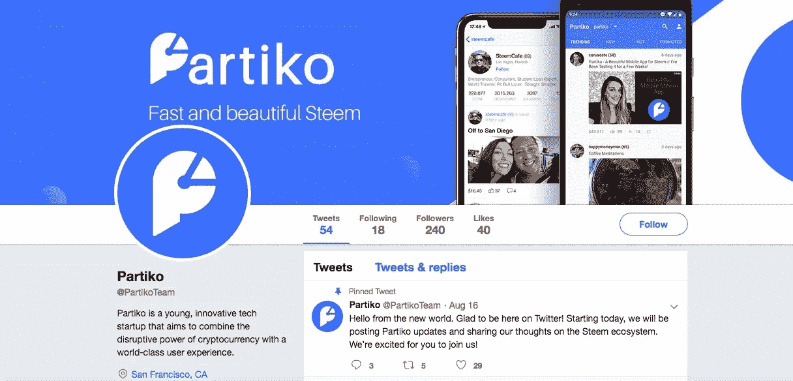
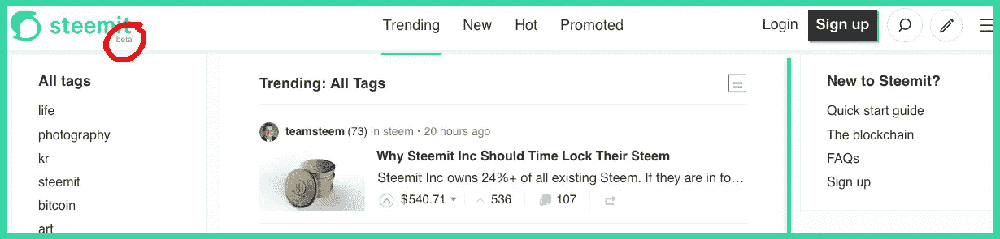
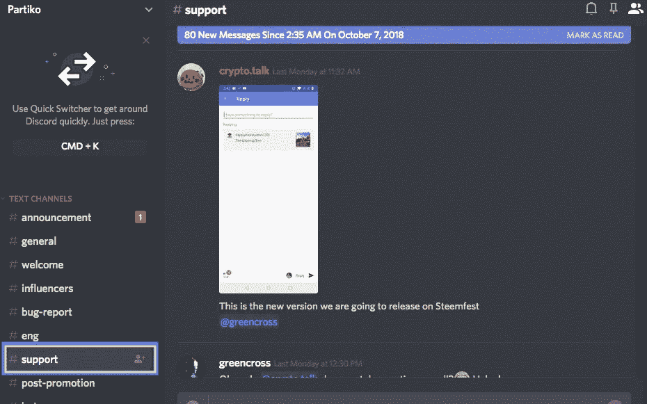

# Steem 区块链最佳移动应用:Partiko

> 原文：<https://medium.com/hackernoon/best-mobile-app-for-the-steem-blockchain-partiko-9c6843144d07>

## 如果你最近去过 steemit.com，你可能会对它的前 Myspace 用户界面和笨重的设计印象不深。

令人讨厌的薄荷绿标志也没有多大帮助。在它推出整整两年后，你仍然会在网站首页的 Steemit 标志下看到 beta 标签。如果你想在 Steemit 上搜索一些东西，祝你好运。搜索功能并不能真正给你想要的东西。Steemit 一直将大部分精力放在开发区块链理工上，而不是 UI 上。

Steemit Home Page

## 幸运的是，Steem 区块链公司开发的移动应用程序解决了大部分问题，甚至更多。

几个月前偶然发现了 [Partiko app](https://partiko.app/) ，立刻就被折服了，尽管这个 app 早几个月才推出。通常全新的应用程序都有很多不尽如人意的地方，但是这个完全让我大吃一惊。还有很多功能有待添加，但总的来说，这个应用程序是 Steem 区块链表现最好的一个。

[Partiko](https://partiko.app/) 的设计以用户快乐为核心，这款应用的一切都比其他任何一款都好。毫不奇怪，这位创始人/首席程序员/UI 设计师曾在硅谷的 Airbnb 工作，拥有 9 年的编程经验。作为这个应用程序的超级用户已经几个月了，我有点明白为什么我认为它是区块链斯蒂尔姆最好的移动体验。

## **不断更新**

## 软件项目只有在不断更新新功能、错误修复和调整的情况下才是好的。

Partiko 在不断地做更新，虽然我注意到 Android 往往比 iOS 获得更快的更新。但 Partiko 几天前刚刚发布了一个 iOS 更新，增加了新功能:申领奖励，用积分兑换 upvotes，通知的新类别，以及其他一些功能。我最感兴趣的未来功能是私人信息，因为 Steem 区块链上没有其他应用程序拥有它。我认为，一旦 Partiko 有了私人信息，即使是主流的脸书用户也可以设想一个可行的替代方案(一旦人们说服他们的朋友和家人迁移)。

## 直观设计

[Partiko](https://partiko.app/) 让 Steem 区块链变得非常容易使用。事实上，大多数使用 Partiko 的人根本看不出他们在使用区块链。与主流应用程序不同的唯一部分是登录系统。其他一切感觉都和现代应用非常相似。用户界面简单、实用、优雅。这些图标美观且易于使用。这个应用程序最好的功能之一是它的通知系统。当有人实时回复你的帖子或评论时，Partiko 会告诉你，当有人在 Steem 区块链的任何地方提到你的名字时，也会告诉你。正是这个通知系统让 Partiko 成为了一个真正有用的社交应用。Android 上已经有了即时消息，iOS 也即将推出。没有其他 Steem 应用程序有私人消息。

【Steemit.com】有一点需要改进:当你点击一个用户的名字时(例如，@cleverbot)，Partiko 应该能够把你带到 Partiko 内用户的个人资料，而不是把你带出应用程序到 Partiko 上。

## **速度**

Partiko 和 Twitter 或脸书等其他主流社交应用一样快。使用 Partiko 应用程序浏览时，你甚至不会意识到自己在区块链上。这是一件大事，因为大多数区块链应用程序可能有点慢。Partiko 更快的原因之一是因为它是使用原生 Android 和 iOS 编程语言构建的。这意味着两个独立的应用程序正在不断开发，这需要更多的时间，但却创造了更流畅的用户体验。所有的活动都很快，包括显示订阅源、上传照片、写帖子、评论、投票和恢复内容。

需要改进的一点是:能够在 iOS 上显示来自 Steepshot 等其他移动应用的内容。

## **搜索工具**

Partiko 的一个非常好的功能是它的搜索工具。当你搜索的时候，你可以选择文章或者账户。这个搜索工具使您能够找到您感兴趣的文章的主题或特定的帐户名称。当您搜索特定主题时，标题中会出现带有该词的文章列表。这个搜索功能比 Steemit.com 的好得多，也快得多。

*需要改进的一点:基于时间顺序和流行度获得搜索结果的能力。*

## **游戏化积分系统和排行榜**

每天登录 Partiko，会收到 10 分。评论、发帖、回复和投票都是 Partiko 给你加分的行为。这些点数可以换成 upvotes，这样你就可以获得 crypto。虽然数额不大，但也不算少。例如，我刚刚兑换了 7488 个积分，并获得了 0.37 美元的 upvote。我认为为了让骗子远离，upvote 的数量可以保持较小。如果数额太大，骗子的数量将很快淹没 Partiko 生态系统。

Partiko 还在应用程序中包含一个排行榜部分，根据获得的积分显示前 20 名用户。这款应用的竞争性和游戏化特点让人们参与进来，并有动力继续使用 Partiko。能够将社会能量直接转化为一点点秘密收入无疑是一个优势。使用 Partiko 你不会暴富，但对于社交媒体超级用户来说，这个应用程序超级有用。

## 客户服务

## 加密领域最大的痛处之一是缺乏客户支持服务。

这部分是由于密码市场是如此的新。有无数的故事，人们提交了一张票到一个密码交易所，但超过 6 个月没有得到回复。

在帮助用户并及时解决他们的问题方面，Partiko 的支持团队非常出色。他们的 discord 频道是大多数用户获得他们需要的支持的地方:[https://discordapp.com/invite/N7Et97G.](https://discordapp.com/invite/N7Et97G.)此外，Partiko 团队还在 Steem 区块链上的聊天中直接回答用户。这被称为“吃你自己的狗粮”，本质上意味着在与客户互动时使用你自己的产品，从而更好地理解用户体验。

当浏览 Google Play 商店上的用户反馈时，有几个关于用户首先给出 3 星评论，然后在他们的技术问题由 Partiko 团队成员在 Discord 频道中解决后将其更改为五星的故事。

## *退房 Partiko:*

【https://partiko.app/】游击队网站: [游击队](https://partiko.app/)

**下载安卓 Partiko:**[https://play.google.com/store/apps/details?id=io.partiko.android](https://play.google.com/store/apps/details?id=io.partiko.android)

**下载 Partiko iOS:**[https://itunes.apple.com/us/app/partiko/id1401033260](https://itunes.apple.com/us/app/partiko/id1401033260)

**博客:**【https://steemit.com/@partiko】T2

【不和谐支持:[【https://discordapp.com/invite/N7Et97G】](https://discordapp.com/invite/N7Et97G)

**推特:**https://twitter.com/PartikoTeam