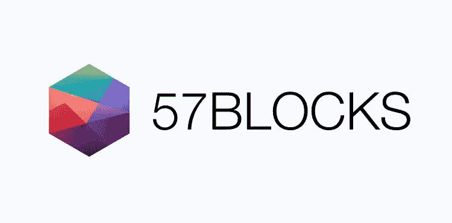

# 提升以太坊智能合约水平的最佳实践

> 原文：<https://medium.com/hackernoon/best-practices-to-level-up-your-ethereum-smart-contracts-944d5cea2cab>

大多数工程团队在尝试构建复杂的交互式智能合同时，迟早会遇到类似的问题。在 [57Blocks](https://57blocks.io) 中，我们已经为加密空间构建了多种产品，并希望我们的知识能够帮助整个生态系统蓬勃发展。下面，我们将介绍以太坊智能合约编程模式和帮助我们开发产品的公共资源。如果您是老手，也许您会发现我们对代理委托模式的新颖应用的讨论很有用。

# 1.模式

模式是架构设计和编程的最佳实践。理解模式不仅有助于我们理解如何处理一个问题，还有助于我们理解为什么我们需要以一种给定的方式来处理它，以及模式是用来处理什么问题的。它有助于我们更好地了解我们正在工作的平台。

https://fravoll.github.io/solidity-patterns/[上描述的以下模式涵盖了日常开发中的大多数情况。](https://fravoll.github.io/solidity-patterns/)

## **行为模式**

*   **:确保智能合约的行为及其输入参数符合预期。**
*   **[**状态机**](https://fravoll.github.io/solidity-patterns/state_machine.html) :使一个契约经历不同的状态，暴露出不同的对应功能。**
*   **[**Oracle**](https://fravoll.github.io/solidity-patterns/oracle.html) :获得对存储在区块链之外的数据的访问权。**
*   **[**随机性**](https://fravoll.github.io/solidity-patterns/randomness.html) :在区块链的确定性环境下产生一个预定义区间的随机数。**

## ****安全模式****

*   **[**访问限制**](https://fravoll.github.io/solidity-patterns/access_restriction.html) :根据合适的条件限制对合同功能的访问。**
*   **[**检查效果交互**](https://fravoll.github.io/solidity-patterns/checks_effects_interactions.html) :减少外部调用后试图劫持控制流的恶意契约的攻击面。**
*   **[**安全以太转移**](https://fravoll.github.io/solidity-patterns/secure_ether_transfer.html) :将以太从一个合同安全转移到另一个地址。**
*   **[**拉过来推**](https://fravoll.github.io/solidity-patterns/pull_over_push.html) :将转移乙醚的相关风险转移给用户。**
*   **[**急停**](https://fravoll.github.io/solidity-patterns/emergency_stop.html) :增加紧急情况下禁用关键合同功能的选项。**

## ****可升级性模式****

*   **[**代理委托**](https://fravoll.github.io/solidity-patterns/proxy_delegate.html) :引入升级智能合约而不破坏任何依赖关系的可能性。**
*   **[**永久存储**](https://fravoll.github.io/solidity-patterns/eternal_storage.html) :智能合约升级后保留合约存储。**

## ****经济模式****

*   **[**字符串相等比较**](https://fravoll.github.io/solidity-patterns/string_equality_comparison.html) :检查所提供的两个字符串是否相等，以使大量不同输入的平均气体消耗最小化。**
*   **[**紧密变量包装**](https://fravoll.github.io/solidity-patterns/tight_variable_packing.html) :存储或加载静态变量时优化气体消耗。**
*   **[**内存数组构建**](https://fravoll.github.io/solidity-patterns/memory_array_building.html) :以一种气体高效的方式从契约存储中聚集和检索数据。**

# **使用代理委托来更新智能合同**

**[**代理委托**](https://fravoll.github.io/solidity-patterns/proxy_delegate.html) 模式旨在解决智能合约可升级性问题。然而，在开发[令牌卡](https://tokenpad.io/)时，我们发现了这种模式的另一种用法。使用这种模式，当需要在区块链上部署相同合同的许多副本时，我们能够节省汽油。**

**Tokenpad 是一个联合 ICO 投资的平台。辛迪加领导可以创建资金池，为 ico 募集资金。每次领导想要创建辛迪加池时，他或她都会部署一个智能合同，智能合同包含池工作的所有代码。在 Tokenpad 的第一个版本中，创建一个池的成本约为 400 万天然气，如果天然气价格为 5 gwei，则成本为 0.02 ETH。这是我们将所有代码转移到库之后的成本，领导者部署的智能契约只将调用委托给库。考虑到天然气价格可能上涨到 20 千兆瓦、30 千兆瓦甚至更多，这仍然很高。**

**使用代理委派模式，我们将辛迪加池智能合同的单个实例与我们需要部署来支持产品的其他东西一起部署到区块链。当领导者想要创建辛迪加池时，我们创建一个代理实例，并将其指向我们已经部署的唯一实例。**

> **使用代理委托模式将我们的汽油成本降低了 60%以上，降至 150 万英镑左右！**

**理解这些模式是开发高效和安全的智能合约的良好开端，但是我们不需要从头开始实现所有这些模式，我们可以利用框架和库来帮助我们加速开发并减少错误。**

# **2.框架和库**

**框架和库是已知模式和最佳实践的经过充分测试和可重用的实现。在这一节中，我们介绍了我们在项目中使用的一些框架和库，以及它们提供的模式和它们可能没有解决的问题。**

****

## **OpenZeppelin**

**OpenZeppelin 是一个用于安全智能契约开发的库。它提供了 ERC20 和 ERC721 等标准的实现，您可以按原样部署或扩展这些标准来满足您的需求，它还提供了 Solidity 组件来构建定制合同和更复杂的分散式系统。结帐 Github 页面:[https://github.com/OpenZeppelin/openzeppelin-solidity](https://github.com/OpenZeppelin/openzeppelin-solidity)**

**OpenZepplin 提供了一些解决常见问题的契约/库。下面是我们的项目中使用的框架提供的一些最常见和最有用的特性。**

****math/SafeMath.sol** —防止上溢和下溢。永远不要使用默认的算术运算符。当有溢出或下溢时，算术运算符不会失败，这可能是可利用的。**

****ownership/Ownable**——将合同创建者地址保存为所有者，并检查呼叫地址是否为所有者，仅修改者为所有者。所有权可以转移到其他地址。这是[访问限制模式](https://fravoll.github.io/solidity-patterns/access_restriction.html)的一个应用。**

**Ownable 实现有一个我们需要注意的严重设计缺陷:当我们调用 transferOwnership 将契约的所有权转移到另一个地址时，如果该地址不是有效地址或者不是具有已知私钥的地址，我们将永远失去对契约的控制。处理所有权转移的一个更好的方法是，不要在所有权转移完成时立即转移所有权，而是允许当前所有者保持所有者身份，直到新所有者要求所有权。这样，我们可以确保合同总是由一个有效的地址拥有，并避免将所有权转移到一个不受我们控制的地址。**

****生命周期/可暂停** —提供紧急停止机制。在紧急情况下停止合同运行，以减少损失。这是[紧急停止模式](https://fravoll.github.io/solidity-patterns/emergency_stop.html)的一个应用。**

**如果我们在 production smart 契约中发现了一个错误，我们可以暂停这些契约，以避免第三方在修复它们之前利用该关键问题。**

****访问/rbac/RBAC** —基于角色的访问控制。[访问限制模式](https://fravoll.github.io/solidity-patterns/access_restriction.html)的应用。RBAC 比 Ownable 更灵活地管理访问控制。我们可以有多个管理员，而 Ownable 只允许一个所有者控制合同。**

****token/ERC20** —这里的文件提供了一组实现通用 ERC20 令牌功能的契约。通过使用多重继承，我们可以很容易地用这些基础契约构建一个 ERC20 令牌。**

## **ZOS 自由党**

**zos-lib 提供了一个库，用于在以太坊和其他 EVM 和电子货币支持的区块链上开发、部署和操作可升级的智能合约。结帐 github 页面:[https://github.com/zeppelinos/zos](https://github.com/zeppelinos/zos)**

****可升级性/代理** —代理实施。用低级别委托呼叫将呼叫委托给另一个合同。**

**该契约实现了[代理委托模式](https://fravoll.github.io/solidity-patterns/proxy_delegate.html)，并修复了该模式没有解决的一个关键问题。在代理委托模式文章中，有两个在代理契约中声明的存储变量，它们很容易被使用 delegatecall 调用的契约定义的存储变量覆盖，从而导致数据损坏。这个实现使用了一种叫做[非结构化存储](https://blog.zeppelinos.org/upgradeability-using-unstructured-storage/)的技术来避免存储变量被意外覆盖。**

****迁移/可初始化** —除了构造函数之外还提供初始化。与代理一起使用来初始化协定，因为在这种情况下不会调用构造函数。**

# **3.在合同和图书馆之间选择**

****

**以太坊区块链有一个区块气体限制，如果合同的规模太大，部署合同所需的气体可能会超过该限制，导致合同部署失败。为了成功地部署大型和复杂的契约，我们需要拆分契约并使用多个事务进行部署。有两种分割合同的方法:**

## **将一份合同分解为多份合同**

**一个大合同可以分解成多个小合同。然后，您可以在部署时将这些协定地址传递给第三调用协定，以将它们连接在一起。**

****优点:****

*   **契约可以小到足以进行部署**
*   **可以只更新一部分代码来升级整个应用程序或修复错误。这是通过部署其中一个协定的新版本，然后更新调用协定中的引用来实现的。**

****缺点:****

*   **消息发送方将是调用约定，而不是启动事务的地址，这可能很难管理**

## **将合同拆分为多个库**

**一个大的契约可以拆分成多个库，然后用一个契约调用那些库。**

****优点:****

*   **为了便于部署，库可以尽可能的小**
*   **库可以很容易地跨多个合同重用，并且只需要部署一次**
*   **没有消息发送者问题，库的代码在契约的上下文中执行**
*   **库可以单独升级**

****缺点:****

*   **每次部署库的新版本时，依赖于该库的任何库或契约也需要再次部署，因为库在部署时是静态链接的**

****

**57Blocks 是区块链的一个创新实验室，帮助公司将区块链的想法变成现实。如果您的公司正在使用智能合同，并希望获得反馈或帮助，请在 hello@57blocks.io 向我们大喊一声**

***本文由 57Blocks* 工程主管 Roy Xie 撰写**