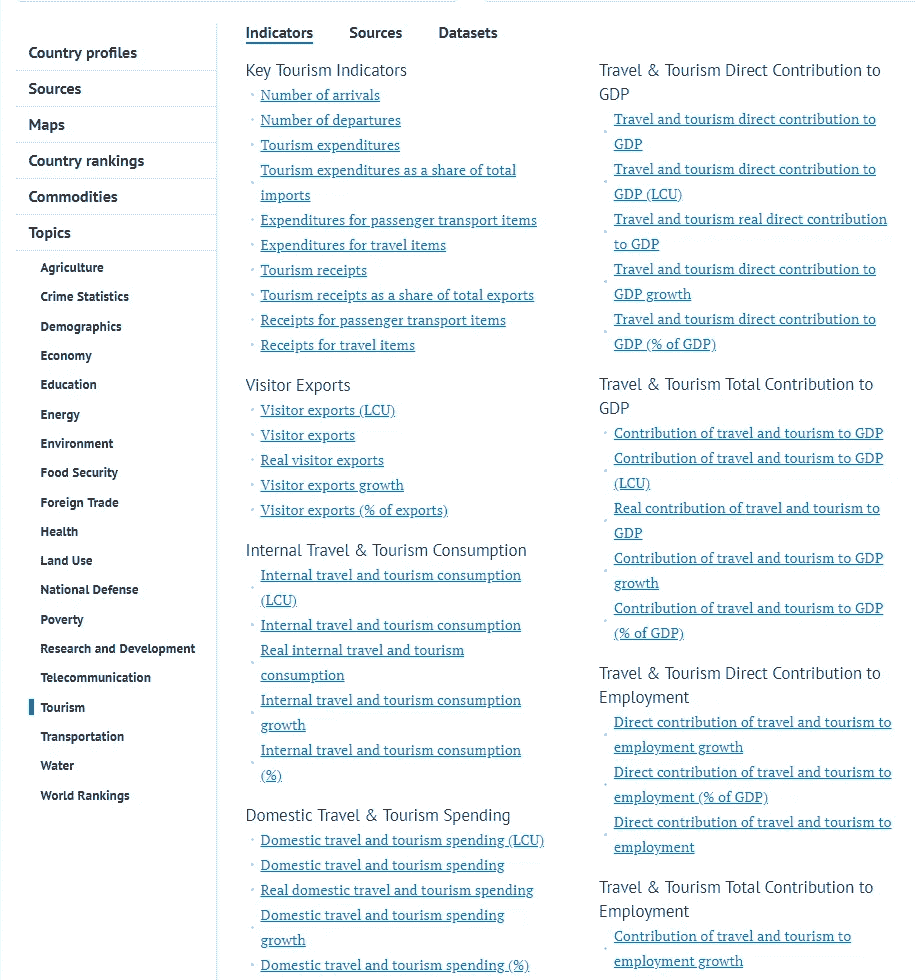
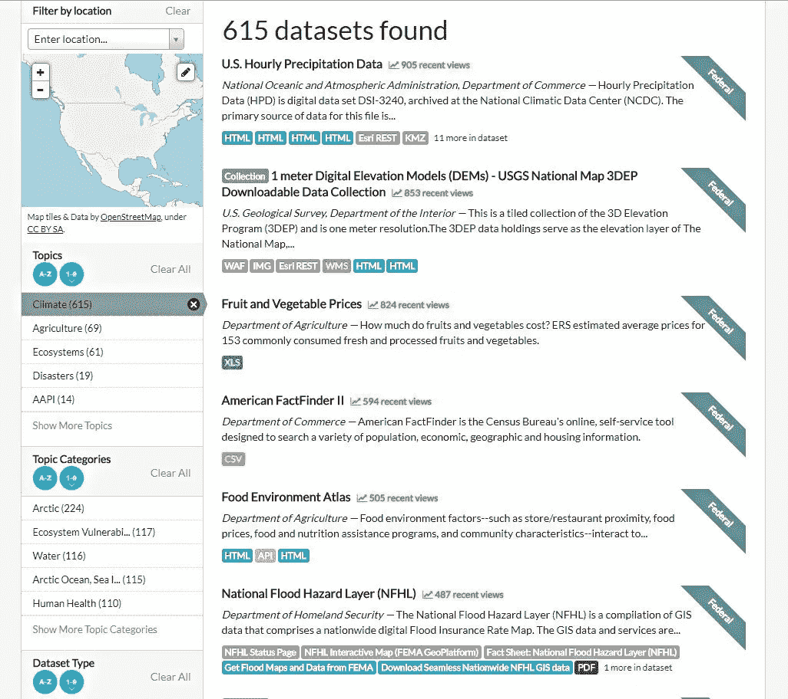
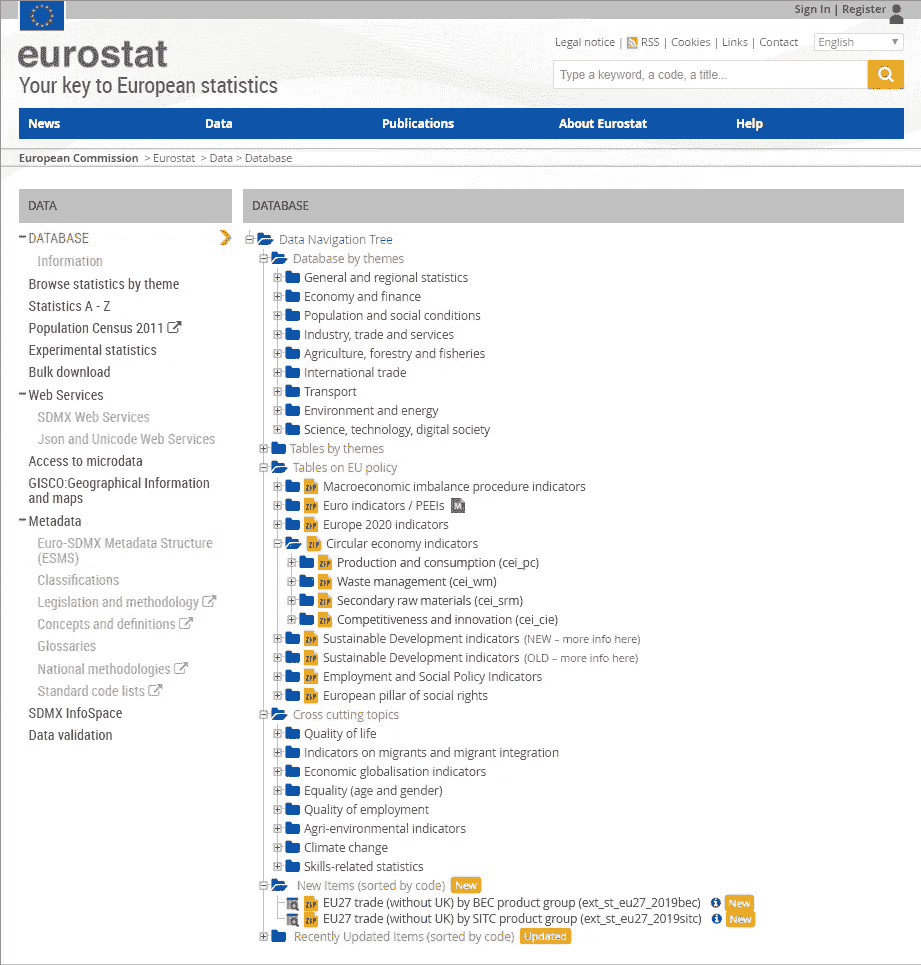
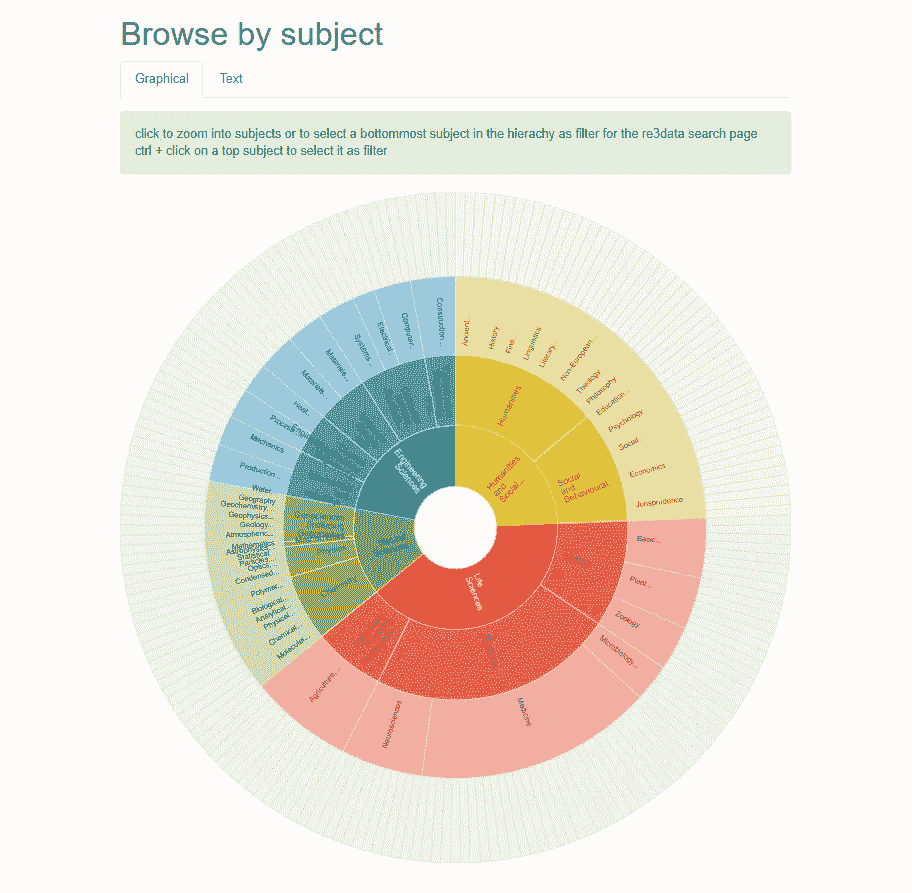
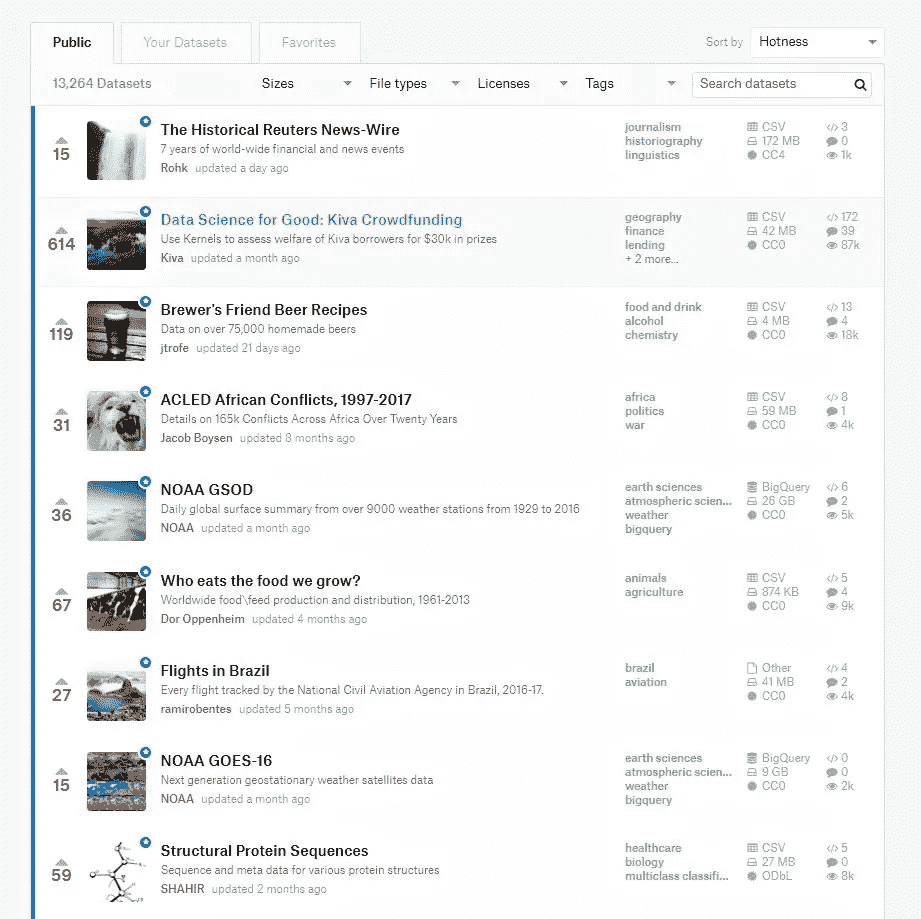

# 机器学习和数据科学的最佳公共数据集:来源和选择建议

> 原文：<https://medium.com/hackernoon/best-public-datasets-for-machine-learning-and-data-science-sources-and-advice-on-the-choice-6456fb0878b2>

在形成您的数据科学项目的想法时，您可能会梦想编写算法的变体，估计训练数据的模型性能，并与同事讨论预测结果。。。但是在你实现梦想之前，你不仅要获得正确的数据，你还必须根据你的任务检查它是否被标记。即使您不需要收集特定的数据，您也可以花费大量时间来寻找最适合项目的数据集。

成千上万不同主题的公共数据集——从顶级健身趋势和啤酒食谱到农药中毒率——都可以在网上找到。为了在搜索正确的数据集上花费更少的时间，您必须知道在哪里寻找它。

本文旨在帮助您为您的机器学习项目找到最佳的公开可用数据集。我们根据数据集来源、类型和一些主题对文章进行了分组:

*   数据门户和聚合器的目录
*   政府和官方数据
*   科研数据
*   来自数据科学社区的经验证的数据集
*   来自媒体的政治和社会数据集
*   金融和经济数据
*   医疗保健数据
*   旅行和运输数据
*   其他来源

所以，让我们深入数据的海洋。

# 数据门户和聚合器的目录

虽然您可以找到收集各种主题数据集的独立门户，但大型数据集聚合器和目录主要做两件事:

1.**提供其他特定数据门户的链接。**此类目录的例子有下文描述的数据门户和 OpenDataSoft。该服务不直接提供对数据的访问。相反，它允许用户浏览地图上带有数据集的现有门户，然后使用这些门户向下钻取到所需的数据集。

2.**聚合来自不同提供商的数据集。**这使得用户可以在一个地方找到来自开放提供商的健康、人口、能源、教育和更多数据集，非常方便。

让我们来看看这个群体最受欢迎的代表人物。

## 数据门户:具有 524 个数据门户的元数据库

这个网站的域名说明了一切。数据门户链接到全球 524 个数据门户。

主页包含一个可缩放的地图，因此专家可以很容易地找到他们感兴趣的门户。他们还可以使用搜索面板或转到列出和描述数据门户的页面。

用户可以对元数据库做出贡献，无论是添加新的功能和数据门户，报告 GitHub 上的错误，还是作为编辑加入项目团队。

## OpenDataSoft:包含 2600 多个数据门户的地图

OpenDataSoft 注册的开放数据门户令人印象深刻——公司团队已经收集了超过 2600 个。该列表看起来像一个交互式地图，类似于 DataPortlas 上的那个。数据门户也按国家分组，因此用户可以在两个搜索选项之间进行选择。

OpenDataSoft 通过构建数据门户提供数据管理服务。通过它的平台，客户可以发布、维护、处理和分析他们的数据。

## Knoema:拥有来自 1000 多个来源的 1000 个主题的近 25 亿个时间序列数据

这个搜索引擎是专门为元数据有限的数字数据设计的，这是专家在他们的机器学习项目中需要的数据类型。 [Knoema](https://knoema.com/atlas/sources) 拥有最大的网络公开数据和统计数据，其代表[声明](https://knoema.com/about/us)。用户可以访问来自 1000 多个来源的 1000 个主题的近 25 亿个时间序列数据，这些信息每天都在更新。

Knoema 提供了高效的数据探索工具，通过数据源和主题对数据集进行聚类。可以使用来源和指标过滤器缩小按主题搜索的范围。数据集也按字母顺序列出。

*Knoema’s data explorer*

例如，数据科学家可以在线研究表格和图表中的数据，或者下载为 Excel 文件。然而，出口不是免费的，需要一个高级账户。

# 政府和官方数据

## Data.gov:美国政府 14 个主题的 237，545 个数据集

在“美国政府公开数据之家”data.gov 搜索公共数据集既快又简单。用户可以在超过 237，545 个与 14 个主题相关的数据集中自由选择合适的数据集。当查找特定领域的数据集时，用户可以应用额外的过滤器，如主题类别、位置、标签、文件格式、组织及其类型和出版商。

*Various filters are available on data.gov*

## 欧盟统计局:来自欧盟统计局的公开数据

欧盟统计局提供了许多行业和生活领域的高质量统计数据。数据集是免费开放的，所以每个人都可以通过数据浏览器在线研究，或者以 TSV 格式下载。

数据导航树帮助用户找到方法并理解数据层次结构。数据库和表按主题分组，有些还有元数据。还有一些关于欧盟政策的表格，按照交叉主题分组。新的和最近更新的项目位于相应的文件夹中。

*Data navigation tree of Eurostat database*

如果你想获得更多国家机构、部门和团体的数据，你可以浏览英国国家统计局[和 Data.Gov.UK](https://www.ons.gov.uk/peoplepopulationandcommunity/leisureandtourism/datalist?filter=datasets)和 T2、[欧洲数据门户](https://www.europeandataportal.eu/data/en/dataset?page=1)、[欧盟开放数据门户](https://data.europa.eu/euodp/en/data)和 [OpenDataNI](https://www.opendatani.gov.uk/dataset) 等网站。[澳大利亚统计局](http://stat.data.abs.gov.au/)、加拿大政府和昆士兰州政府的数据门户也有丰富的开源数据集。这些网站的搜索引擎是相似的:用户可以按主题浏览数据集，并使用过滤器和标签来缩小搜索范围。

# 科研数据

您可以在此源类别中找到的数据集可能与上述政府和社会数据部分相交。然而，这里我们主要关注与科学相关的门户和数据集。

## Re3data: 2000 个灵活搜索的研究数据存储库

那些寻找研究数据的人可能会发现这个来源很有用。Re3Data 包含超过 2000 个数据仓库的信息。目录开发者关注它的可用性。它允许通过主题、内容类型、来源国家和“41 种不同属性的任意组合”来搜索数据存储库用户可以选择图形和文本形式的主题搜索。每个存储库都标有图标，提供其特征的简短描述，并解释访问和使用条款。

*Re3data provides two options of subject search*

## 研究管道:包含数据集和其他数据科学相关内容的维基页面

[研究管道](http://www.researchpipeline.com/mediawiki/index.php?title=Main_Page)是一个维基百科风格的网站。如果我们用一个短语来描述这种资源，它可能是“一切都在一个地方”用户可以在众多的[维基页面](http://www.researchpipeline.com/mediawiki/index.php?title=Main_Page)上寻找免费的数据集、数据处理软件、数据科学相关的内容来源或统计组织。数据源按主题分组，也可以通过搜索面板访问。网站创建者 Lyndie Chiou 欢迎用户上传数据集并在博客上发表评论。

## 公平分享:“数据和元数据标准资源，与数据库和数据政策相互关联”

[FAIRsharing](https://fairsharing.org/) 是另一个搜寻公开研究数据的地方。源上列出了 1058 个数据库，专家们有很大的选择余地。用户可以在数据库和数据使用政策的目录中搜索数据，也可以在按相似性分组的标准和/或数据库的集合中搜索数据。

用户也可以通过点击带有域、分类法、数据来源国家和创建它的组织的复选框来指定搜索。为了加速这个过程，用户可以选择一个记录类型。

# 来自数据科学社区的经验证的数据集

寻找机器学习数据集的一个真正有用的方法是应用数据科学家自己建议的来源。这些数据集不一定是由机器学习专家收集的，但由于它们对机器学习友好的性质，它们受到了广泛的欢迎。通常，数据科学社区通过 Kaggle 和 GitHub 等流行的工程和数据科学平台共享他们最喜欢的公共数据集。

## 数据中心:由数据科学家为数据科学家共享的高质量数据集

DataHub 不仅是一个数据管理和自动化平台，也是数据科学家的社区。项目创始人创建了 [Awesome section](https://datahub.io/awesome) ，其中包含各种主题和数据集集合的高质量公共数据集。机器学习数据集，关于气候变化、房地产价格、武装冲突、美国福祉甚至足球的数据集——用户有大量选项可供选择。除了链接其他提供商的数据集，DataHub 团队还在网站上提供了 333 个数据集供下载。

## UCI 机器学习库:拥有 427 个数据集的最古老的资源之一

这是互联网上最古老的数据库、领域理论和测试数据生成器的集合之一。该网站(当前版本开发于 2007 年)包含 [427 个数据集，](http://archive.ics.uci.edu/ml/datasets.html)最早的数据集是 1987 年的——那一年，机器学习实践者大卫·阿哈和他的研究生创建了这个知识库作为 FTP 档案。

UCI 允许通过机器学习任务的类型、属性及其类型的数量、实例的数量、数据类型(即时间序列、多元、文本)、研究领域和格式类型(矩阵和非矩阵)来过滤数据集。

大多数数据集——足够干净，不需要额外的预处理——可以在下载后立即用于模型训练。UCI 知识库的另一个优点是用户在上传之前不需要注册。

## data.world:开放数据社区

[data.world](http://data.world/) 是一个平台，数据科学家可以上传他们的数据，与同事和其他成员合作，并搜索其他社区成员添加的数据(也可以使用过滤器。)

data.world 提供了简化数据处理和分析的工具。用户可以编写 SQL 和 SPARQL 查询来一次浏览多个文件并连接多个数据集。该平台还为 R 和 Python 提供了 SDK，使上传、导出和处理数据变得更加容易。

## GitHub:由软件开发社区制作的令人惊叹的数据集列表

如果软件开发人员的大型社区 GitHub 没有专门针对数据集的页面，那将令人惊讶。它的[令人敬畏的公共数据集](https://github.com/awesomedata/awesome-public-datasets)列表包含 30 个主题的数据集。尽管大部分数据集不会花你一分钱，但还是要准备好为其中一些付费。由于贡献者必须遵守[格式指南](https://github.com/sindresorhus/awesome/blob/master/awesome.md)以获得他们添加到 Awesome 列表中的数据，因此它的高质量和一致性得到了保证。

## Kaggle: 13，321 个“数据人的脸书”主题数据集

Kaggle 是数据科学家们想要完善他们的知识并可能参加机器学习竞赛的地方，也有一个[数据集集合](https://www.kaggle.com/datasets)。注册用户可以在 13，321 个高质量的主题数据集中进行选择。

带有过滤器(大小、文件类型、许可证、标签)的搜索框使查找所需数据集变得容易。另一个很棒的功能——用户可以将他们喜欢的内容加入书签并预览。

*Searching for datasets on Kaggle is simple*

在处理数据时，有两种选择。用户可以下载数据集或在 Kaggle 内核中分析它们——这是一个允许在浏览器中运行 [Jupyter 笔记本](http://jupyter.org/)的免费平台——并与社区分享结果。

Kaggle 团队欢迎每个人通过发布他们的数据集来为集合做出贡献。

## KDnuggets:一个著名的数据科学网站上的数据仓库的综合列表

科学和商业社区中的一个受信任的网站， [KDnuggets](https://www.kdnuggets.com/index.html) ，维护着一个[列表](https://www.kdnuggets.com/datasets/index.html)，它链接到许多数据仓库，并附有它们的简要描述。来自国际政府机构、交易所和研究中心的数据，由用户在数据科学社区网站上发布的数据—这个集合拥有一切。

## Reddit:专门讨论板上的数据集和数据请求

Reddit 是一个社交新闻网站，有用户贡献的内容和称为 subreddits 的讨论板。这些委员会是围绕特定主题组织的。他们的成员通过分享与他们共同兴趣相关的内容、回答问题和留下反馈来相互交流。

浏览[数据集子编辑](https://www.reddit.com/r/datasets/)就像翻箱倒柜，因为你永远不知道你可能会遇到什么独特的数据集。

Datasets subreddit 成员编写关于他们正在寻找的数据集的请求，推荐定性数据集的来源，或者发布他们收集的数据。所有请求和共享数据集被过滤为热门、新、上升和热门。还有一个维基部分和一个搜索栏。

# 来自媒体的政治和社会数据集

媒体机构通常为他们的工作收集大量的社会和政治数据。有时他们会与公众分享。我们建议先看看这两家公司。

## BuzzFeed:一家媒体公司的数据集和相关内容

[BuzzFeed](https://www.buzzfeed.com/?utm_term=.llxQeMWrp#.hr0qpAxmv) 媒体公司共享记者在调查文章中使用的公共数据、分析代码、库和工具。他们建议用户在探索数据之前先阅读这些片段，以便更好地理解研究结果。数据集可在 [GitHub](https://github.com/BuzzFeedNews/everything) 上获得。

## FiveThirtyEight:来自数据驱动片段的数据集

以体育新闻以及政治、经济和其他生活领域的新闻而闻名的 FiveThirtyEight 的记者们也发布他们在工作中收集的数据和代码。像 BuzzFeed 一样，FiveThirtyEight 选择了 [GitHub](https://data.fivethirtyeight.com/) 作为数据集共享平台。

# 金融和经济数据

## Quandl:另类金融和经济数据

Quandl 是金融和经济数据的来源。这个平台的主要特点是，它还提供“从未接触过华尔街”的“非传统出版商”的替代或未开发数据。由于数字化，获取这些数据已经成为可能。[替代数据](https://www.quandl.com/alternative-data)由物联网生成。对交易数据的分析可以提供对消费者行为的有价值的见解。

客户端可以按类型、地区、发布者、可访问性和资产类别过滤数据集。

Quandl 分享了一些免费数据，但大多数都是有代价的。注册用户可以选择他们得到的数据的格式。他们可以通过 API 和 web 界面访问数据。

## 国际货币基金组织和世界银行:国际经济统计

国际货币基金组织(IMF)和世界银行分享对国际经济的见解。在 IMF 网站上，数据集按字母顺序排列，并按主题分类。世界银行用户可以通过应用许可证、数据类型、国家、支持的语言、出版频率和评级等过滤器来缩小搜索范围。

# 医疗保健数据

## 世界卫生组织:来自 194 个国家的全球健康记录

世界卫生组织(世卫组织)在全球卫生观察站(GHO)的倡议下，为其 194 个成员国收集并共享全球卫生数据。

源用户可以选择按主题、类别、指标(即[是否存在国家儿童约束法(道路安全)](http://apps.who.int/gho/data/node.imr.RS_213?lang=en))和国家浏览数据。元数据部分允许学习如何组织数据。数据集可以在线获得，也可以 CSV、HTML、Excel、JSON 和 XML 格式下载。

## 疾病控制中心(CDC):通过在线数据库搜索数据很容易

CDC 是美国健康相关数据的丰富来源。它维护着[用于流行病学研究的大范围在线数据(WONDER)](https://wonder.cdc.gov/wonder/help/about-cdc-wonder-508.pdf) —一个旨在与普通观众和医疗专业人员共享医疗保健信息的网络应用系统。

有了 [CDC WONDER](https://wonder.cdc.gov/Welcome.html) ，用户可以访问不同州源托管的公共数据，按字母顺序和主题排序。数据可以在桌面应用程序中使用，并可以 CSV 和 Excel 格式下载。

## 医疗保险:来自美国健康保险计划的数据

[Medicare](https://data.medicare.gov/) 是另一个提供医疗保健数据的网站。它拥有 143 个数据集，侧重于对其卫生机构提供的服务进行比较。

# 旅行和运输数据

## 国家旅行和旅游办公室:美国旅游景观概述

美国国家旅行和旅游局的网站是一个可靠的旅行数据来源。

它运行几个统计程序，旨在捕捉美国旅游业的大画面。例如，该办公室提供入境和出境旅游的最新统计数据，海外游客访问的城市和州，等等。用户可以将数据集保存为 Excel 和 PDF 文件。

## 联邦公路管理局:美国公路运输数据

[美国交通部联邦公路管理局](https://nhts.ornl.gov/)根据全国家庭出行调查(NHTS)计划，调查全国的出行偏好。例如，Received insights 显示了美国人在旅行时使用什么交通工具、家庭收入与交通工具出行次数之间的相关性以及出行时长等。

调查数据可用于在线探索，也可作为 CSV、SAS 传输文件下载。用户还可以在 dBase、SPSS 和 SAS Windows 二进制应用程序中使用它。

# 其他来源

## 亚马逊网络服务:免费公共数据集和付费机器学习工具

亚马逊在其 AWS 平台上托管大型公共数据集。专家可以在各种数据上练习他们的技能，例如金融、统计、地理空间和环境。

注册用户可以免费访问和下载数据。然而，AWS 提供了基于云的数据分析和处理工具([亚马逊 EC2](https://aws.amazon.com/ec2/) 、[亚马逊 EMR](https://aws.amazon.com/emr/) 、[亚马逊 Athena](https://aws.amazon.com/athena/) 和 [AWS Lambda](https://aws.amazon.com/lambda/) )。那些喜欢使用这些工具在线分析数据集的人需要为他们使用的计算能力和存储付费。

## Google 公共数据集:使用云中的 BiGQuery 工具进行数据分析

谷歌也为数据科学爱好者分享开源数据集。数据集存储在其云托管服务[谷歌云平台](https://cloud.google.com/) (GCP)中，可以使用 BiGQuery 工具进行检查。要开始使用数据集，用户必须注册一个 GCP 帐户并创建一个项目。虽然谷歌维护数据存储并提供访问权限，但用户为他们在上面进行的分析查询付费。每月处理的第一 TB 数据是免费的，这听起来很有启发性。

云提供商微软 Azure 有一个适用于测试和原型制作的公共数据集列表。由于它提供了描述并按一般主题对数据进行分组，所以搜索不会花费太多时间。

# 关于数据集选择的建议

由于如此多的所有者在网络上分享他们的数据集，你可能会想知道自己如何开始搜索或努力做出一个好的数据集选择。

当查找特定数据时，首先浏览数据门户的目录。然后决定信息必须来自哪个洲和国家。最后，探索该地理区域的数据门户以精确定位正确的数据集。

你可以通过浏览专注于研究某个行业的组织和公司的网站来加快搜索速度。如果您对政府和官方数据感兴趣，您可以在我们在该部分提到的许多来源上找到它。除此之外，数据科学社区是来自不同出版商的定性用户贡献数据集和数据集合的良好来源。

重要的是要考虑发布内容的整体质量，并在需要时为[数据集准备](https://www.altexsoft.com/blog/datascience/preparing-your-dataset-for-machine-learning-8-basic-techniques-that-make-your-data-better/?utm_source=MediumCom&utm_medium=referral)留出额外的时间。像 data.gov、data.world 和 Reddit 这样的来源包含来自多个出版商的数据集，它们可能缺乏引用，并且是根据不同的格式规则收集的。

与此同时，数据科学家[注意到](https://www.dataquest.io/blog/free-datasets-for-projects/)UCI、Kaggle 和 Quandl 的大部分数据集都是干净的。

# 一锤定音

每个可能主题的开放数据集都发布在众多数据门户上，包括在数据门户目录列表中，并由政府机构、私营公司和数据科学爱好者共享。

大部分信息是免费的，但其中一些，尤其是金融和经济数据，需要付费。

网上有大量的公开数据，找到合适的数据不成问题。但是，在选择数据集时，考虑项目类型很重要。

**喜欢这个故事吗？让我们和其他读者了解一下吧！👏**
最初发表于 AltexSoft 的博客:“ [*机器学习和数据科学的最佳公共数据集:来源和选择建议*](https://www.altexsoft.com/blog/datascience/best-public-datasets-for-machine-learning-and-data-science-sources-and-advice-on-the-choice/?utm_source=MediumCom&utm_medium=referral) ”

 [## 机器学习-黑客正午

### 在黑客正午阅读关于机器学习的文章。黑客如何开始他们的下午？

hackernoon.com](https://hackernoon.com/tagged/machine-learning)  [## 数据科学-黑客正午

### 阅读《黑客正午》中关于数据科学的文章。黑客如何开始他们的下午？

hackernoon.com](https://hackernoon.com/tagged/data-science)