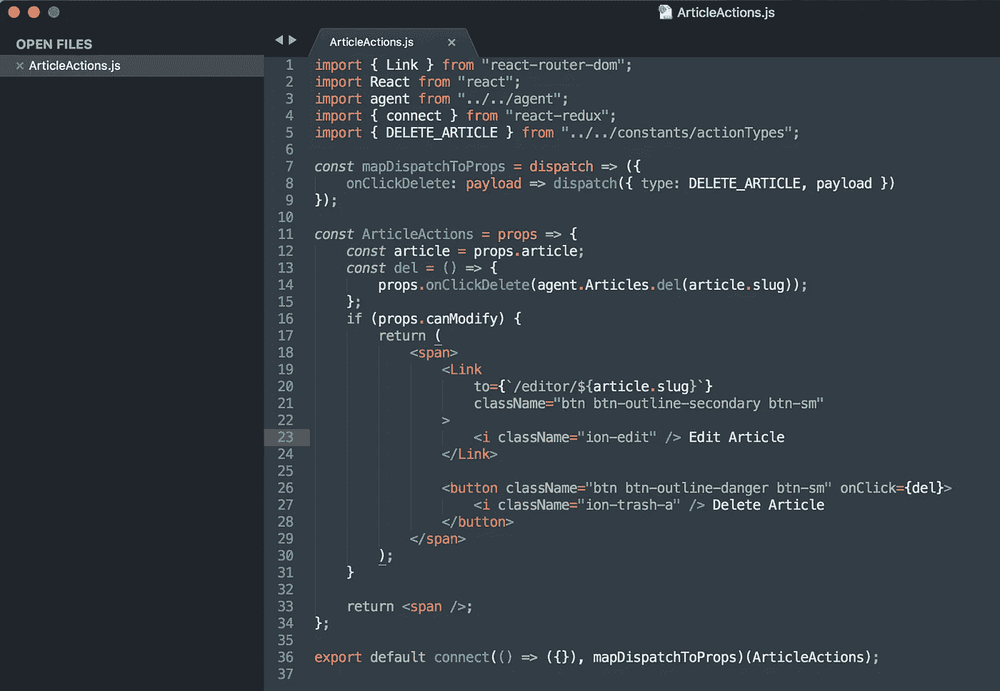
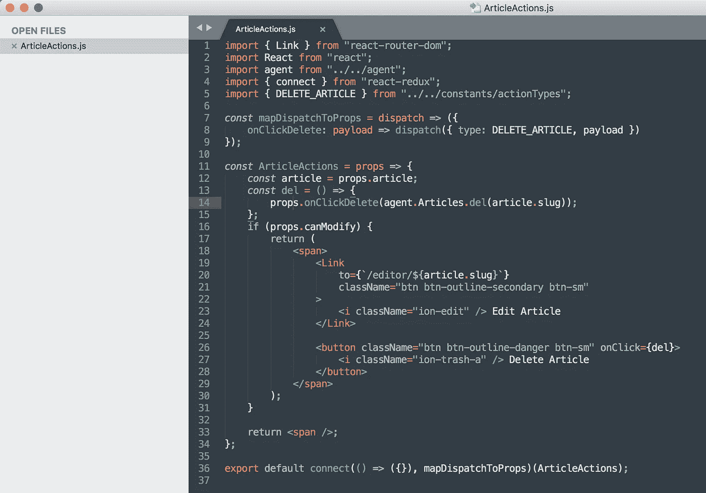
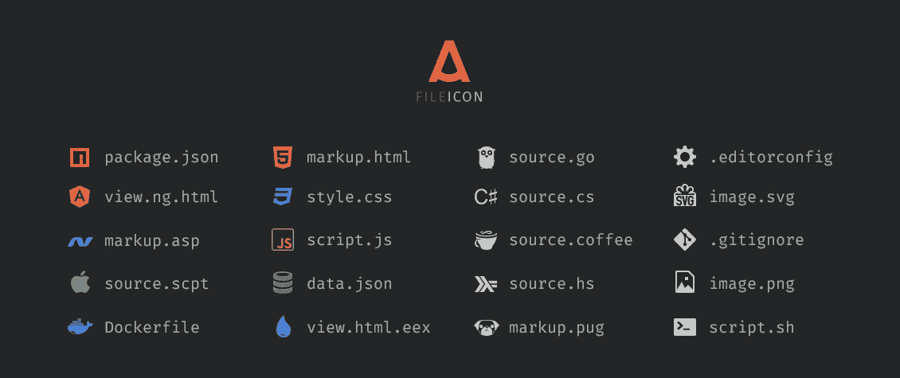

# 最佳崇高偏好—主题、字体、配色方案、代码修饰器和软件包

> 原文：<https://medium.com/hackernoon/best-sublime-preferences-theme-font-color-scheme-code-prettifiers-packages-b883ce668ed9>


Photo by [Clément H](https://unsplash.com/photos/95YRwf6CNw8?utm_source=unsplash&utm_medium=referral&utm_content=creditCopyText) on [Unsplash](https://unsplash.com/search/photos/code?utm_source=unsplash&utm_medium=referral&utm_content=creditCopyText)

我说，只有完美的 IDE 和它的首选项才能让你的代码更好。当我在 IDE 中拥有完美的配置时，我的项目看起来更干净、更好。当你有更健康的项目时，它帮助你的客户更好地理解你的工作，这直接有助于你的社区的福利，这是我所相信的。

在使用了成百上千的主题、修饰器和字体之后，我打算分享一下最适合我需求的偏好列表。作为一个专门研究 React 和 Node.js 的全栈开发人员，这些配置会以一种关心的方式进行。如果您不喜欢 JavaScript，不要担心。这些配置中的一些可能会帮助你，使你的项目更好。:-)

在进入之前，我将从最新的 IDE 开始，这样您就有大量的首选项可以选择。

## 安装 Sublime Text V.3.1.1 Build 3176

从配置开始…

# 1.最佳配色方案— Mariana(配色方案—默认)

点击选择一种配色方案，

`Sublime Text → Preferences -> Colour Scheme…`
并选择`Mariana` ( `Colour Scheme — Default`)。

这是最新版本中的默认配色方案，它为类、函数和语法高亮提供了合适的颜色。



Colour Scheme — Mariana | Theme — Adaptive.sublime-theme

# 2.最佳主题—自适应. sublime-theme(主题—默认/自适应)

点击选择一个主题，

`Sublime Text → Preferences -> Theme…`
并选择`Adaptive.sublime-theme` ( `Theme — Default/adaptive`)。

这也是最新版本的默认主题，给你一个理想的崇高布局，如上图所示。如果它看起来很暗，而你是那种需要给它一个完美的替代搭配的人，你可以选择，

`Default.sublime-theme`

给你一个如下的布局。



Colour Scheme — Mariana | Theme — Default.sublime-theme

# 3.文件图标—包

一个文件图标包给你的扩展文件漂亮可爱的图标。我建议您安装一个，您可以在

[https://github.com/ihodev/a-file-icon](https://github.com/ihodev/a-file-icon)



A File Icon Package

最简单的安装方法是使用 Sublime 的[包控件](https://packagecontrol.io/packages/A%20File%20Icon)。列为`A File Icon`。

1.  使用菜单项`Tools → Command Palette...`打开`Command Palette`
2.  选择`Package Control: Install Package`
3.  找到`A File Icon`并点击`Enter`

# 4.最佳字体—默认。

从上图可以看出，sublime 的默认字体对于任何语言都是最好的。但是，如果您希望更新字体，可以将其设置为

`Sublime Text → Preferences -> Settings`

在`Preferences.sublime-settings-Default`中，你可以找到`font_face`并更新它的值，

```
"font_face": "Source Code Pro"
```

# 5.最佳代码修饰器—特定于 HTML、CSS 和 JS

很抱歉在代码美化部分让你失望了，因为我没有机会用其他语言工作，所以我将专门为**HTML CSS&JavaScript**写代码。

## 对于巴别塔，JSX 档案用户…

但是为了让 JS 开发者吃惊，我给他们准备了两个包，涵盖了 JavaScript 的新旧语法(ES5，ES6 等等)。)

如步骤 3 中所述，

1.  打开`Command Palette`，选择`Package Control: Install Package`
2.  找到`Babel`并回车安装。

现在您已经支持语法了。**要美化 JSX 文件**，可以安装名为`JsPrettier`的美化器包。

1.  打开`Command Palette`并选择`Package Control: Install Package`
2.  找到`JsPrettier`并按回车键安装。

现在您已经成功地安装了您的`JsPrettier`包。为了美化，你可以右击 jsx 文件并选择`JsPrettier Format Code`或者在保存时选择自动格式化，

`Sublime Text → Preferences -> Package Settings -> JsPrettier -> Settings — Default`搜索下面提到的键，并将其值更新为 true。

```
“auto_format_on_save”: true,
```

## 对于纯 JavaScript 用户…

当您只使用纯 JavaScript 时，您可以安装以下名为

`HTML-CSS-JS Prettify`

*   Linux/Windows/OS X 中的`Ctrl+Shift+P`或`Cmd+Shift+P`
*   键入`install`，选择`Package Control: Install Package`
*   键入`prettify`，选择`HTML-CSS-JS Prettify`

现在做`Cmd+Shift+H`来美化你的 JS，HTML 或者 CSS 文件。

当你遇到任何你觉得更好的有趣主题时，欢迎在评论中提出来。
快乐编码。

感谢你们的掌声，并鼓励我做出更多贡献。

谢谢你。