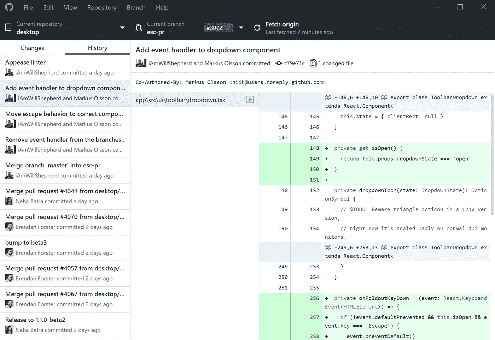

# 开发工具

> 原文：<https://medium.com/hackernoon/best-tools-to-become-a-productive-developer-2018-6b65cd5638c2>

拥有合适的工具真的可以帮助你成为一名高效的开发人员。我已经从我每天使用的工具中列出了一个清单，其中一些是我偶然发现的有用的工具，但最终并没有使用那么多(但这只是因为我的项目有不同的需求)。

这个工具列表来自我开发的 [Clipit:数字优惠券](https://getclipit.com)。我想尽可能地高效并保持在正轨上！

# 命令行

*   **康内姆**

ConEmu 是我作为 Windows 终端的首选。你可以自定义颜色，打开多个标签，运行多个应用程序，如 PuTTY。我甚至在 ConEmu 内部运行 Git Bash。

**网址:**[https://conemu.github.io/](https://conemu.github.io/)

**价格:**免费

**平台:** Windows

# **源代码控制**

*   **GitHub**

我在所有的项目中都使用 GitHub，自从我开始[编程](https://hackernoon.com/tagged/programming)以来就一直这样做。我现在是一名学生，所以我可以免费获得私有库，所以，我选择继续使用 GitHub。GitHub 基于 Git。

**网址:【https://github.com/】T22**

**价格:**对公共存储库免费。私有存储库每月 7 美元以上

**平台:** Windows，Mac，Linux(使用 Git)。桌面应用程序适用于 Windows 和 Mac

*   **比特桶**

Bitbucket 就像 GitHub 一样。我用 GitHub 多半只是个人喜好。最大的区别是 Bitbucket 免费提供私有回购，而 GitHub 不提供。Atlassian 也有许多不同的工具，如吉拉、Trello、Bamboo 和 Source Tree，这意味着许多工具可以相互集成，从而创建一个高效的工作流程。

**网址:**[https://bitbucket.org/](https://bitbucket.org/)

**价格:**对公共和私人存储库免费。无限用户 2 美元/用户。

**平台:** Web through Bitbucket。桌面通过 Git GUIs，如 Sourcetree

# Git 图形用户界面

*   **Github 桌面**

我主要使用命令行来满足我的 Git 需求，但当我需要看到一些可视化的东西时，我会使用 GitHub Desktop 或 Sourcetree。您可以轻松地查看所做的更改，获取、提交等等，而无需接触命令行。

**网址:**【https://desktop.github.com/ 

**价格:**免费

**平台:** Windows 和 Mac

*   **源代码树**

Sourcetree 是另一个 Git GUI。它肯定比 GitHub 桌面有更多的功能，工作流程也更好。你应该尝试一下 GitHub Desktop 和 Sourcetree，看看哪种更适合你。这是我熟悉的两个，但也有其他的，如 [GitKraken](https://www.gitkraken.com/) 。

**网址:**[https://www.sourcetreeapp.com/](https://www.sourcetreeapp.com/)

**价格:**免费

**平台:** Windows 和 Mac

# **代码编辑**

*   **Visual Studio 代码**

在做 web 项目时，我总是使用 VS 代码。它有这么多不同的插件，让我的生活变得更加容易。您可以定制文件夹图标、代码主题、各种框架的自动完成等等。它还内置了 VC，这使得将您的代码推送到源代码控制变得很容易。搜索速度也非常快，即使您的工作区中有多个项目。

**网址:**[https://code.visualstudio.com/](https://code.visualstudio.com/)

价格:免费

**平台:** Windows、Mac 和 Linux

*   **记事本++**

记事本++是另一个我很喜欢的。它一点也不花哨，但重量很轻，能完成工作。我用它来快速修改文件，打开我不需要添加到 VS 代码工作区的项目，以及做笔记。VS 代码是我的主要编辑器，但是我总是发现 Notepad++很有用。

**网址:**[https://notepad-plus-plus.org/](https://notepad-plus-plus.org/)

**价格:**免费

**平台:** Windows

# 连续累计

*   **特拉维斯 CI**

Travis CI 让您可以轻松测试和部署您的代码。您不必等到代码中有大的变化时再将它合并到源代码中，而是可以不断地推送小的变化，Travis CI 会确保运行测试，并让您知道是否有任何需要解决的问题。持续集成无疑使大型团队在不中断项目的情况下更容易合作。

**网址:**【https://travis-ci.org/ 

**价格:**开源项目免费。私人项目每月 69 美元以上

**平台:**网络

*   **詹金斯**

Jenkins 是一个开源自动化服务器，可用于测试、部署和交付。Jenkins 是我用来自动测试和部署服务器任务的首选工具。最棒的是它是开源的。

**网址:**[https://jenkins.io/](https://jenkins.io/)

**价格:**免费

**平台:** Jenkins 可以通过原生系统包、Docker 安装，甚至可以在任何安装了 Java 运行时环境(JRE)的机器上独立运行。

# 自动化移动部署

*   **快车道**

fastlane 是一个自动化移动构建和发布的神奇工具。我用它来构建并发布我的 iOS 应用程序到 TestFlight。它负责繁琐的任务，比如增加版本号、更新屏幕截图和代码签名。如果你需要帮助设置你的 Ionic 应用程序的 TestFlight，我有一个教程(大部分教程都很一般，也适用于本地应用程序):[https://medium . com/@ clipi application/fast lane-IOs-Ionic-2-3-tutorial-e 46d 0d 6 b 5943](/@clipitapplication/fastlane-ios-ionic-2-3-tutorial-e46d0d6b5943)。

# 项目管理

*   基地营

在尝试了许多不同的工具后，比如 Trello、Favro 和 Asana，对我来说最有效的是 Basecamp。我真的很喜欢一切都很精简。通过为整个团队设置自动签到，你可以避免大多数会议。每个项目基本上都有自己的页面，包括文档、日程表、聊天区、消息和待办事项。如果你想直观地看到正在进行的工作的进度，Basecamp 也有山丘图。

**网址:**[https://basecamp.com/](https://basecamp.com/)

**价格:**99 美元/月，无限用户、项目和 500GB 存储空间

**平台:** Windows、Mac、iOS、Android 和 Web

*   特雷罗

Trello 是 Atlassian 最近收购的另一个优秀的项目管理工具。它提供了大量被称为 Power-Ups 的功能，这是一些附加功能，如直接从电路板、GitHub Autosync 和 Slack webhooks 访问 Google Drive 文档。这些只是提供的几十个中的几个。使用 Basecamp 是我个人的决定，因为两者的工作流程绝对不同，Basecamp 更适合 mew。

**网址:**【https://trello.com/ 

**价格:**免费无限板，1 次加电，附件高达 10 mb。9.99 美元/用户/月，用于无限制开机、控制用户访问和获得优先支持

**平台:Windows、Mac、iOS、Android 和 Web**

# 沟通

*   **松弛**

无论你的团队是 1 万人强还是 2 个人，Slack 都是最好的沟通工具之一。您可以为不同的项目和事件创建频道，共享文件、图像、gif，并自动化几乎任何您想要的东西。你想创造一个能告诉你如何到达你不熟悉楼层的会议室的机器人吗？您可以在 Slack 中创建一个。事实上，我几乎每周都用它来做这件事，因为我总是记不住某个房间在哪里。在我看来，通信部门并不真正需要另一个竞争者，因为 Slack 是一个全才。还有其他工具，如 [SocialChorus](https://www.socialchorus.com) ，这些工具也很棒，但并没有解决 Slack 的相同目的。

**网址:**[https://slack.com](https://slack.com)

**价格:**免费为小团队提供 10k 条可搜索的最新消息。$ 6.67+/用户/月，用于无限制的消息搜索、多用户视频和语音通话等。

**平台:** Windows、Mac、Linux、iOS、Android、Windows Phone(测试版)，也可以在 Apple Watch 上使用

# API 开发

*   **邮递员**

Postman 非常适合 API 开发。该工具让您可以通过一种经过深思熟虑的用户体验轻松地设计、测试和发布 API。它允许您监控您的 API 以确保它们不会面临停机，自动化测试，并记录不同的端点。最棒的是，你可以与其他用户共享你的 Postman APIs，并允许他们在 Postman 中运行它。

**网址:**[https://www.getpostman.com/](https://www.getpostman.com/)

**价格:**每月最多 1000 次免费通话。每月通话超过 100，000 次、单点登录等费用为每个用户每月 8 美元以上

**平台:** Windows、Mac 和 Linux

*   **爪子**

Paw 是 API 开发的另一个伟大工具。它有一个很好的用户界面，用于测试端点、记录 API、检查服务器响应和导出 API 定义。Paw 唯一的缺点是它是 Mac 的专属。它允许您在相同的端点上作为一个团队工作，所有成员之间的测试和配置是同步的。

【https://paw.cloud/】网站:

**价格:** $49.99 一个用户，一次最多 3 台机器。团队的 Paw 为 10.99 美元/用户/月

**平台:** Mac

**代码质量检查**

*   **声纳座**

SonarQube 是一个持续的检查工具，用于查找 bug、漏洞和代码气味。它可以与几乎任何项目集成，支持 20 多种语言。SonarQube 可以与许多不同的工具集成，如 GitHub 和 Bitbucket。我个人在进行任何更改之后，在将任何东西部署到生产环境之前使用 SonarQube，这样我就可以修复需要修复的地方。最棒的是，它是完全开源的。

**网址:**[https://www.sonarqube.org/](https://www.sonarqube.org/)

**价格:**当地免费运行。免费在云中运行开源项目和€10+/月，从 100k 行代码开始

**平台:** Windows、Mac、Linux 和云

*   编码能力

Codacy 是一个自动化的代码分析工具，类似于 SonarQube。它有助于识别代码重复、问题、代码覆盖率和代码复杂性。它还帮助您在任何源代码的整个开发周期中跟踪您的进度，以查看问题是如何解决的，重复问题出现的频率，等等。我个人更喜欢 sonar cube，因为功能非常相似，sonar cube 是一个更发达的平台。

**网址:**[https://www.codacy.com](https://www.codacy.com)

**价格:**开源项目免费。私人项目 15 美元以上/用户/月

**平台:**云

**图标**

*   **羽毛**

Feather 提供了 300+个漂亮的开源图标。我在我的项目中大量使用它们，希望它们也能帮助你！

让我知道你们最常用的工具是什么，以及你最喜欢列表中的哪一个。当我决定更新这个列表时，我会研究你推荐的添加到我自己的工作流程中的工具或建议。祝您成为高效的开发人员！

读者推荐:

*   **每日—开发者的秘密来源**

作为开发人员，Daily 允许您通过浏览器中的扩展来了解软件开发的最新消息。我已经试过了，用户界面非常好，不会让人分心。你很快就能得到消息，然后你就可以自由地继续工作了！

【https://www.dailynow.co/】网站:

**价格:**免费

**平台:** [Chrome](https://chrome.google.com/webstore/detail/daily-developer’s-secret/jlmpjdjjbgclbocgajdjefcidcncaied) 和 [Firefox](https://addons.mozilla.org/en-US/firefox/addon/daily/)