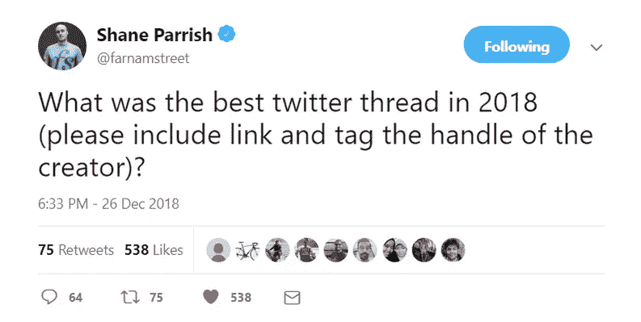

# 2018 年 20 个最佳科技 Twitter 话题

> 原文：<https://medium.com/hackernoon/best-twitter-threads-we-saw-in-2018-87cb2f53fefa>

## 所有这些都是必读的😃

This tweet inspired this blog post. CC: [Shane Parrish](https://medium.com/u/4e1546c1a1a1?source=post_page-----87cb2f53fefa--------------------------------)

Twitter 是一个神奇的地方。

事实上，它可能是建立品牌、社区、公司、[网络](https://hackernoon.com/tagged/networks)和**巨魔**的最伟大的工具。

这么说不会错，

> Twitter 是一个元思维。

事实上，我最大的[推特](https://hackernoon.com/tagged/twitter)幻想(😜)Arjun Balaji 的这条推文是真的吗？

## 我不想再废话了，下面我们来看看 2018 年最好的 Twitter 帖子列表

**1。** [**如何致富**](https://medium.com/u/67f5049293c7?source=post_page-----87cb2f53fefa--------------------------------)

**2。即将到来的主流领域/部门/技能组合现在看起来很傻**

**3。关于纵向一体化的技术公司由** [**王济民**](https://twitter.com/jwangARK/)

**4。** [**埃里克·托伦伯格**](https://medium.com/u/abcbbcac8a09?source=post_page-----87cb2f53fefa--------------------------------) **在职业循环上**

5.关于宗教

**6。** [**亚历山大·J·A·科尔特斯**](https://medium.com/u/c8e15e5e1733?source=post_page-----87cb2f53fefa--------------------------------)

**7。** [**帕特里克·奥肖内西**](https://medium.com/u/34543c0a3815?source=post_page-----87cb2f53fefa--------------------------------) **谈他如何选择书籍**

**8。由道格拉斯·克雷格****撰写的成吨书籍摘要的元线索**

****9。** [**海军拉维康**](https://medium.com/u/67f5049293c7?source=post_page-----87cb2f53fefa--------------------------------) **关于“什么是推特？”****

****10。** [**陈楚翔**](https://medium.com/u/8edc94d7a232?source=post_page-----87cb2f53fefa--------------------------------) **关于市场创业****

****11。**[**Suhail Doshi**](https://medium.com/u/e4eed523a27e?source=post_page-----87cb2f53fefa--------------------------------)**

**12。同样，[**Suhail Doshi**](https://medium.com/u/e4eed523a27e?source=post_page-----87cb2f53fefa--------------------------------)**在创业的前 18 个月****

****13。** [**安德鲁·鲁伊斯**](https://twitter.com/then_there_was/) **彼得·泰尔****

****14。脸书和谷歌商店有多少关于你的数据由** [**迪伦·柯伦**](http://Facebook and Google store about you)**

****15。** [**大卫·佩雷尔**](https://medium.com/u/39663aeb73b3?source=post_page-----87cb2f53fefa--------------------------------) **关于营销****

****16。**[**Amjad Masad**](https://medium.com/u/6ee592fadf41?source=post_page-----87cb2f53fefa--------------------------------)**给出了一些阅读技巧****

****17。** [**约什·沃尔夫**](https://twitter.com/wolfejosh) **论中国 vs 脸书/谷歌****

****18。** [**米尔恰·macavei‏**](https://twitter.com/mistermircea)**关于什么占据了我们的精神空间****

****19。再次，** [**大卫·佩雷尔**](https://medium.com/u/39663aeb73b3?source=post_page-----87cb2f53fefa--------------------------------) **谈互联网将如何变革教育****

****20。** [**约里克·德·mombynes‏**](https://twitter.com/ydemombynes)**比特币标准上的螺纹由** [**赛菲迪安·阿摩斯**](https://medium.com/u/becf6824fd89?source=post_page-----87cb2f53fefa--------------------------------)**

**暂时就这样了。我将在 2018 年更新这篇博文，因为我遇到了更多这样的帖子。**

**小心这个空间。**

# **关于我**

## ****我是 Ankit，**[**ELI5 Labs**](http://eli5labs.com)**创始人。如果你想和我谈论任何事情，从加密到创业，到我在生活中做什么(什么都不做)，你可以发电子邮件给我:**[**【ankit@eli5labs.com】**](mailto:ankit@eli5labs.com)**。****

## ****在**[**ankitkr 0**](http://www.twitter.com/ankitkr0)**随时关注我的推特。****