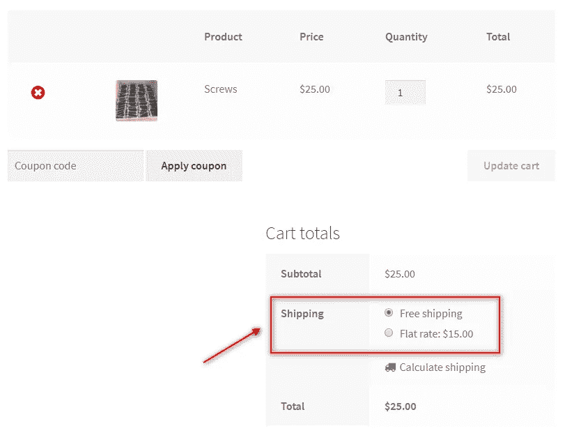

# 最佳 WooCommerce 航运计算器-表率航运专业

> 原文：<https://medium.com/hackernoon/best-woocommerce-shipping-calculator-table-rate-shipping-pro-339e7042e69e>

在设置 [WooCommerce](https://hackernoon.com/tagged/woocommerce) 店铺的同时，WooCommerce 提供的默认[运费](https://hackernoon.com/tagged/shipping)选项包括 [**免运费和统一费率运费**](https://www.pluginhive.com/woocommerce-shipping-a-complete-tutorial/) 。对于大中型企业的店主来说，仅满足于这两种运输方式可能行不通。店主可能需要根据不同的因素，如购物车价值、产品重量、每种产品类型的单位、运输类别等，定制他们的运输费率。针对店主的个性化需求，[**woo commerce Table Rate Shipping Pro**](https://www.pluginhive.com/product/woocommerce-table-rate-shipping-pro/)by**[**plugin hive**](https://www.pluginhive.com/)作为店主今天可以使用的 [**最佳 WooCommerce shipping 计算器**](https://www.pluginhive.com/woocommerce-table-rate-shipping-pro-the-most-flexible-woocommerce-shipping-rate-calculator/) 。**

****

**Default Shipping options in WooCommerce**

# **WooCommerce 表格价格运输专业版**

**woo commerce Table Rate Shipping Pro 是一个 Table Rate Shipping 插件，能够处理中型和大型企业的运输场景。这个插件帮助 WooCommerce 店主创建他们自己的运输规则。使用这个插件，WooCommerce 商店的店主可以根据他们的喜好个性化运输。*那么，这个令人敬畏的* [***WooCommerce 航运计算器***](https://www.storepep.com/storepep-woocommerce-shipping-calculator/) *是如何处理如此复杂的航运计算的呢..？*我们来看看。**

## **运输规则**

**就像任何复杂的计算器一样，woo commerce Table Rate Shipping Pro 使用的是可以在插件设置中配置的运输规则。该插件的用户界面允许店主轻松创建运费计算规则。对于中到大规模的运输场景，该插件还提供了以 **CSV 文件**的形式导入或导出运输规则的能力。作为一个额外的功能，插件**将复杂的运输规则**翻译成简单的句子。如果需要的话，这种能力使得除了店主之外的人更容易理解运输规则。**

****

**WooCommerce Table Rate Shipping Pro Shipping Rule**

**在上图中，您可以看到插件设置中配置的运输规则。然而，下图显示了这个插件将复杂的运输规则自动转换成易于理解的句子的惊人能力。**

****

## **运费计算的因素**

**woo commerce Table Rate Shipping Pro 允许根据以下因素计算运费:**

*   ****商品重量** WooCommerce 表率运费 Pro 允许店主配置 [**基于重量的运费**](https://www.pluginhive.com/woocommerce-table-rate-shipping-pro-ultimate-guide-weight-based-shipping/) 。该插件根据购物车中产品的总重量计算运费，然后显示给客户。**

**Weight-based shipping calculations**

*   ****产品数量** 该插件可以根据购物车中的产品数量来计算 [**基于数量的运费**](https://www.pluginhive.com/woocommerce-table-rate-shipping-pro-ultimate-guide-flexible-quantity-based-shipping/) 。一旦购物车中有了特定数量的商品，它就会增加店主指定的运费。**

**Quantity based shipping calculations**

*   ****产品成本** 购物车的总价值在决定运输价值时起着重要的作用。一些店主可能会选择提供特殊的运费折扣，并可以根据购物车的价值轻松设置运费。因此，这个插件允许你计算 [**基于价格的运费**](https://www.pluginhive.com/woocommerce-table-rate-shipping-pro-an-ultimate-guide-to-woocommerce-price-based-shipping/) 而没有任何麻烦。**

**Price based shipping calculations**

*   ****送货地址** 根据送货地址计算运费是目前店主可以要求的最实用、最简单的选项。然而，woo commerce Table Rate Shipping Pro 通过提供**国家、州、城市甚至邮政编码**作为计算运费的参数，将事情带到了另一个层面。更棒的是，您可以创建自己的运输区域，并为每个运输区域设置专用的运输计算规则。**

**阅读更多— [**如何建立 WooCommerce 运输区..？**](https://www.pluginhive.com/woocommerce-shipping-zones-ultimate-guide/)**

**Country based shipping calculations**

*   ****运输类别** 运输类别的概念被证明非常有助于对运输的相似类型的产品进行分类。使用运输类，店主可以为所有小商品创建一个单独的类别，为大商品创建一个单独的类别。因此，基于运输类别而非产品来配置运输规则，可能是计算运输费用的最明智的方法。**

**Shipping Classes based shipping calculations**

*   ****产品类别**
    WooCommerce 店主也可以根据产品类别计算运费。使用这个插件，店主可以根据产品类别收取固定的运费。或者，他们可以在固定费用的基础上配置每个数量的运费。**
*   ****捆绑产品** 对于中小型店主来说，销售捆绑产品的想法已经被证明可以增加销售额。在这种情况下，提供基于产品捆绑包的运输是商店所有者在寻找运输解决方案时试图找到的东西。woo commerce Table Rate Shipping Pro 以及免费的 [**捆绑价格 Add on**](https://wordpress.org/plugins/bundle-rate-addon-for-woocommerce-shipping-pro/) 像专家一样处理这种情况。**
*   ****添加到购物车的单位重量、数量和价格** 在计算运费时，一个有趣的因素是购物车中商品的额外重量、数量甚至价格。woo commerce Table Rate Shipping Pro 允许供应商根据添加到购物车页面的额外单位重量/成本/数量来配置运输规则。**

## **电子商务运费表的计算模式**

**woo commerce Table Rate Shipping Pro 是一个强大的插件，能够配置几乎任何运输场景。该插件自动检查符合条件的运输规则。比方说，*如果一个场景满足多个规则，会发生什么..？***

**woo commerce Table Rate Shipping Pro 能够同时检测和处理多个规则。它提供了以下内置模式来防止任何此类混淆，**

*   ****选择成本最低的规则。**
    如果有多个规则满足运输方案，此选项会强制在购物车页面上显示最低运输成本。**
*   ****选择成本最大的规则。**
    如果有多个规则满足运输方案，此选项会强制在购物车页面上显示最大运输成本。**

****

**Multiple Rule matching**

**除了这些选项之外，woo commerce Table Rate Shipping Pro 还提供了一些更有趣的**计算模式**，使用该插件可以轻松计算运费。这些模式包括:**

*   ****每件商品的运费计算**
    该计算模式允许分别计算购物车中每件商品的运费。以及基于运输规则计算的运输费率，将被添加到购物车中的每个不同商品。**
*   ****每份订单的运费计算**
    使用此模式，每份订单的运费计算一次，与购物车中的产品数量无关。**
*   ****单项运费计算**
    单项包括同一项目的单个和多个单位。因此，运费将计算每个单位的项目，并在最后得到最终的运费。**
*   ****按运输等级计算运费**
    该插件允许根据运输等级计算运费。为此，它会计算单个运输类别中每种产品的运费。如果有来自多个运输类别的多个产品，则计算两者的运输费用，最后相加得到总运输费用。**
*   ****每类运费计算** woo commerce Table Rate Shipping Pro 插件甚至可以很好地处理产品类别。无论是简单产品还是可变产品，通过提供基于产品类别计算运费的选项，该插件通过检查每类产品的规则，智能地显示每类产品的运费。**

# **摘要**

**这篇文章是写给那些需要定制自己[**woo commerce shipping**](https://www.pluginhive.com/woocommerce-shipping-a-complete-tutorial/)的店主的。有了如此强大的计算模式和如此多样的计算因素，个性化运费而不损害准确性和可靠性，是这个插件提供的没有任何借口的东西。**

**根据所附视频中配置的场景和最常见的所需计算因素，WooCommerce 表价运输专业插件是迄今为止 WooCommerce 运输计算方面最好的运输解决方案。**

**如果您对插件规格有任何疑问或要求，您可以在此查看[**woo commerce Table Rate Shipping Pro**](https://www.pluginhive.com/product/woocommerce-table-rate-shipping-pro/)。或者你也可以下载 [**免费表价运费插件**](https://www.pluginhive.com/woocommerce-weight-based-shipping-plugin-free/) 并在演示网站上测试。**

**如果你对这篇文章及其内容有任何疑问，请在下面的评论区分享你的观点。**