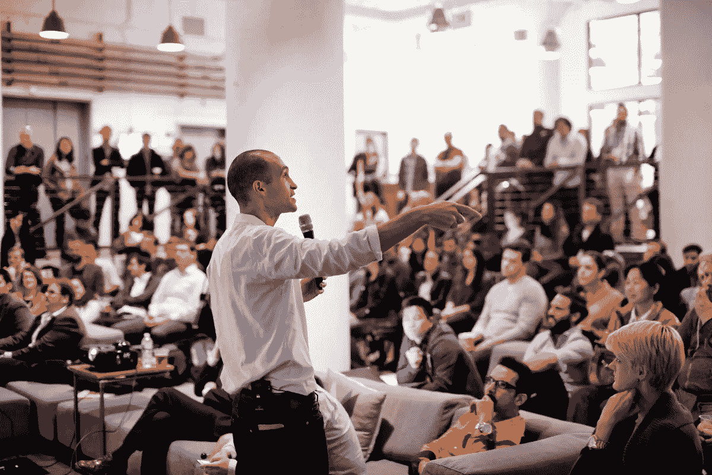

# 畅销书作家 Nir Eyal 讲述如何应对挑战、分心和压力

> 原文：<https://medium.com/hackernoon/bestselling-author-nir-eyal-on-how-to-handle-challenges-distractions-stress-e4676986c89c>

Nir Eyal speaks at FirstMark’s Design Driven NYC ([Full talk here](https://www.youtube.com/watch?v=LU2Je1n8DsM))

[*Nir Eyal*](https://www.nirandfar.com/) *撰写、咨询和讲授心理学、技术和商业的交叉领域。《麻省理工技术评论》称 Nir 为“习惯形成技术的先知”自 2003 年以来，他还创建了两家科技公司，并在斯坦福大学商学院和斯坦福大学哈索·普拉特纳设计学院任教。他是畅销书《上瘾:如何打造形成习惯的产品》的作者。*

*Nir 经常在 FirstMark 的*[*Design Driven NYC*](http://designdrivennyc.com/)*上发表演讲，这是一个向公众开放的月度活动，是同类中最大的月度创意社区，设计、UX 和产品负责人聚集在一起分享新想法。*

我们最近采访了 Nir，以了解他应对挑战、压力的方法，以及他即将出版的关于数字干扰的书。

# 当面临挑战时，你有没有一个特别的框架？

是的，有一个我在生活中的挑战时刻重复了好几次，它与管理你的精神状态有关。

从商学院毕业后，我创办了另一家科技公司——这家公司位于游戏和广告领域。我们出去筹集资金，不知何故，我们与凯鹏华盈(Kleiner Perkins)见了面。我记得我们与约翰·杜尔登和宾·戈登会面，他们是硅谷的传奇人物。我曾投过其他风投，但在这一点上，我记得当时感到非常紧张——这些人真的很重要。

> “看，都是舞会。”

就在我们会见约翰和宾之前，我和我的一个朋友聊了聊，他有一个很棒的比喻，这个比喻让我至今难忘。他说，“看，都是舞会。当你在高中时，舞会是一件大事，每个人都为此感到紧张。你要去问谁？你打算穿什么？等等。这是一件大事，但现在回想起来，这太荒谬了，这些都不重要。说到底，生活就像舞会，这些重要的时刻在整体计划中并不那么重要。”

所以今天，每当我处在一个看起来像是灾难或需要我去释放压力的情况下，我都会对自己重复这句小咒语，让自己知道没有什么事情像看起来那么糟糕或那么好。

# 在你的童年中，有没有一段艰难的时光给你上了一课，这一课你至今仍在应用？

直到高中，我一直是个胖乎乎的孩子。我父母带我去了减肥夏令营。我记得有一天坐在医生的办公室里，他给我看了这张图表，说:“好的，Nir，这里是正常，这里是肥胖，这里是你。”

这对我帮助很大。在我生命的那个时期，食物对我有着非常强大的影响，它似乎以我不喜欢的方式控制着我的行为。今天，我认为这转化为我所研究的技术在我们社会中的应用。我们如何确保我们设计到产品中的行为不仅有助于用户的生活，而且不会控制他们？

> “事实上，我可以控制我吃的东西，即使它看起来像是控制我的东西，这真的很强大。”

食物是我们生活中不可或缺的一部分，不像其他嗜好，它是我们无法逃避的；你可以戒烟，可以醒酒，但是你得吃饭。事实上，我可以控制我吃的东西，即使它看起来像是控制我的东西，这真的很强大。我认为克服逆境是我童年的第一件事，它至今仍伴随着我。

# 你如何处理压力？

最重要的是要认识到压力不是一件坏事，而是我们如何应对它才是有害的。

有很多研究表明压力是如何变得声名狼藉的。人们认为:“如果我感到有压力，那肯定对我不好——对我的身体不好，而且会让事情变得更糟。”

> “要意识到的最重要的事情是，压力不是一件坏事，而是我们如何应对它，这可能是有害的。”

其实，事实证明，你对压力的心态非常重要。如果你认为；“哦，我的天哪，我压力太大了，我不需要有压力，”这实际上造成了一个反刍循环，使事情变得更糟。另一方面，有些人对压力有一种心态，他们告诉自己:“这只是我的身体在为最佳表现做准备。”这些人与压力有着健康的关系，这实际上让他们变得更好。

例如，我做了很多公开演讲，实际上每年都有数百个演讲约会，我过去在舞台上很紧张。我告诉自己:“我要冷静下来，我要冷静下来。”但是现在，我不再告诉自己那段对话了。现在，对话实际上是:“我感觉到的是我的身体正准备以最高水平表演。”

这种心态的转变是一个巨大的优势，因为这意味着你不再与自己斗争。你在利用身体给你的动力。告诉自己:“我的心跳加快是因为我的大脑需要更多的氧气，我呼吸加快是为了吸入更多的氧气。”当你意识到你的生理感受可以成为一种资产，而不是可能伤害你的东西时，那才是真正强大的。

# 你即将出版的书是关于专注和分心的——你能告诉我们更多吗？

这本书叫做*不可分割:如何掌握世纪技能*，我在书中称分心为世纪技能。我们现在看到的是，未来的工作需要人类的独创性和创造力，而这种独创性和创造力只能来自专注。那些很难做的工作——会带来很大的不同，然后会赚很多钱——是那些需要你全身心地投入的工作。

如果你是一名风险投资人，在你应该全力关注一名企业家的时候，你忍不住经常被手机分散注意力，这表明了这一点，人们也感觉到了这一点。

如果你是一个程序员，你不能一次只做一件事，只是处理这个复杂的问题，并把它记在脑子里，这就说明了。对于很多工程师来说，不理会其他人，让他们不再打扰你，是你需要的一种策略。

如果你是一名企业家，你不能控制家里的事情，因为你没有给你爱的人适当的关注，你的个人生活正在崩溃，那么，这也会对你的公司产生影响。

> “未来的工作需要人类的独创性和创造力，而这种独创性和创造力只能来自专注。”

所以，这本书的真正问题很简单:我如何让自己去做我说过要做的事情？

无论是去健身房，无论是正确饮食，无论是与家人和朋友在一起，无论是做一个我现在不想做的很难做的大项目。我如何让自己去做我知道我想做并且我说我会去做的事情？

这确实是我在书中回答的问题，事实证明，我们可以系统地剖析这个问题，并找到许多伟大的解决方案。

*有没有你真正钦佩的领导者(不是在你现在的公司),你认为他会喜欢接受采访？*

把他们的名字和简要描述发给 jack@firstmarkcap.com 的 T4。