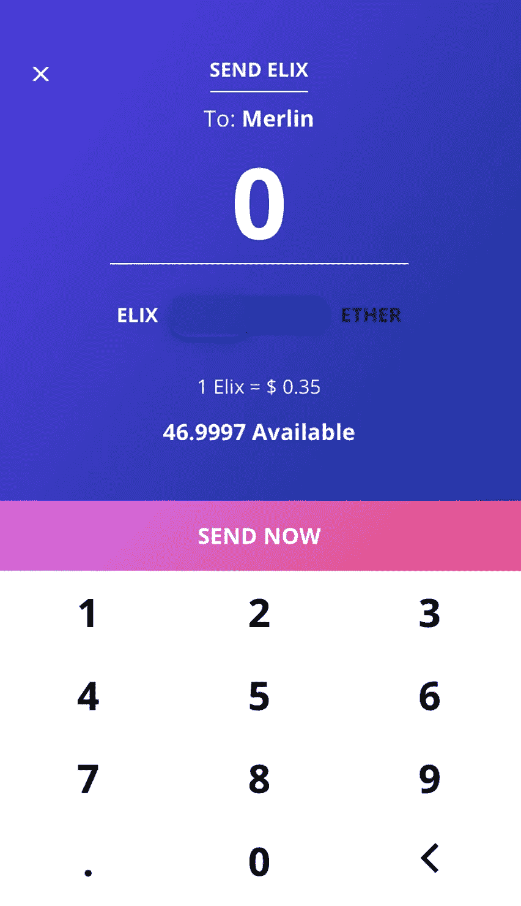
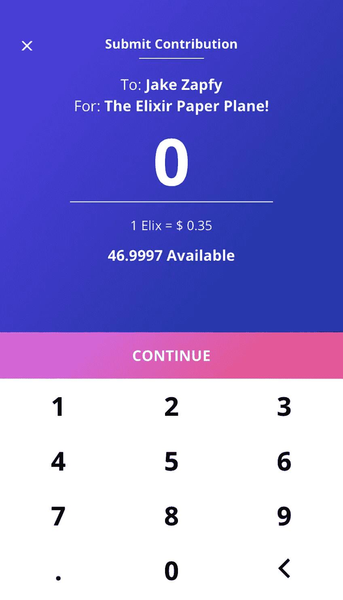
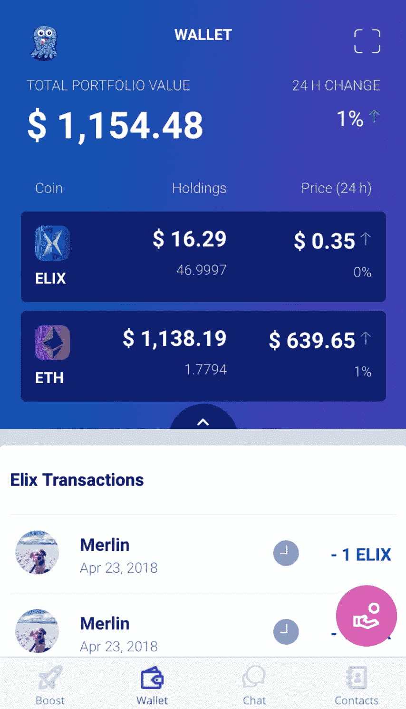
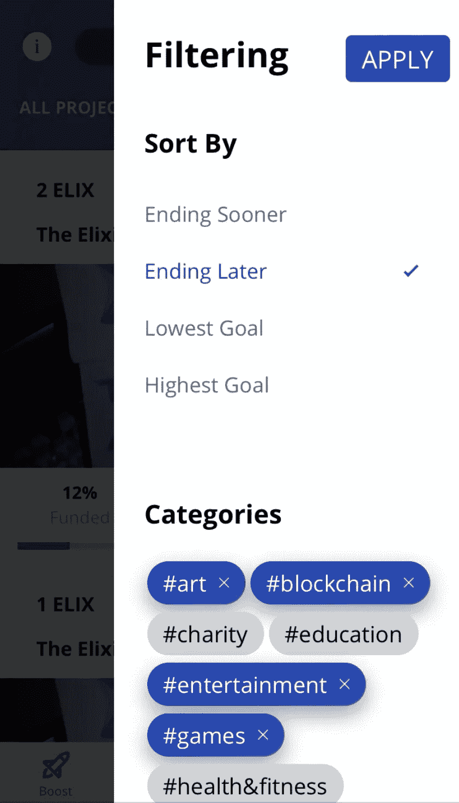
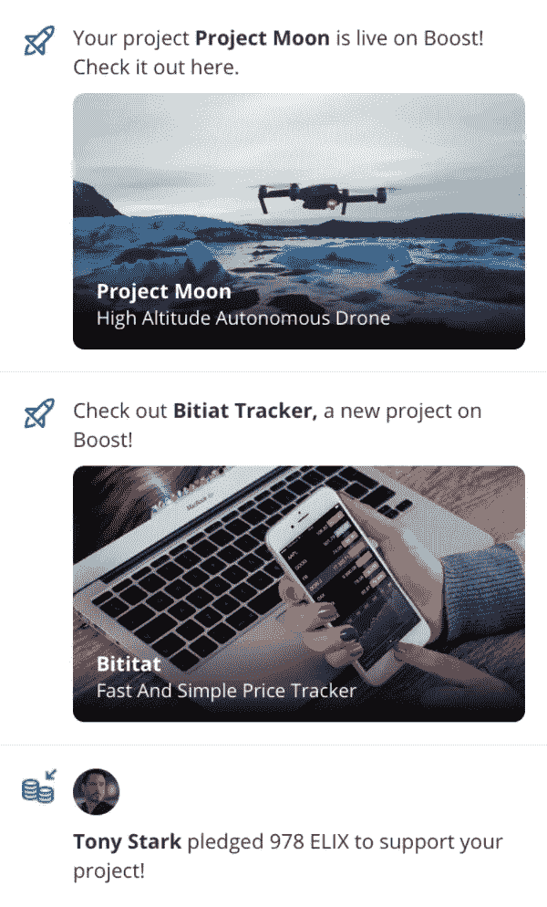
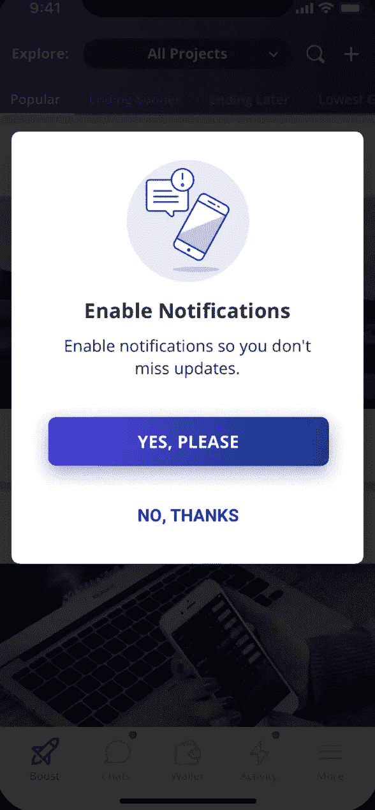

# 测试进展:全速前进

> 原文：<https://medium.com/hackernoon/beta-progress-full-steam-ahead-fc0e4eb46238>

我们一直在努力工作，对我们的测试版进行许多改进！我们的一些社区成员已经开始测试这款应用，并提供了宝贵的反馈。在接下来的几周内，我们将继续向更多人分发该应用。

**报名参加测试**

如果你还没有，一定要在这里注册测试版[！到目前为止，有 769 人在等待测试。](https://www.elixirtoken.io/)

**创作者门户**

我们的早期创建者门户网站正在接受项目提交。如果你是一名企业家或创造者，想要一种方式来支持你自己的项目，在这里提交你的想法。如果您的项目是特色，我们将匹配第一个 500 Elix 承诺。

**UI 进度**

以下是上周我们对测试版所做的一些前端改进的例子。

下面是发送页面现在的样子:

以下是我们更新 contribute 页面的方式:

钱包现在也显示未决的 Elix 交易。这允许用户在等待加入以太坊时验证其 Elix 交易的状态。钱包页面的内容如下:

过滤和排序页面现在具有以下外观:

这些仅仅是我们最近所做的许多 UI 改进中的一部分。

**设计**

这家设计公司最近推出了新的活动页面外观。活动页面将允许用户仔细阅读应用程序中最近动作的通知。我们的目的是保持活动页面的大部分引用基于区块链的活动，以保持设置侧重于权力下放。活动页面应该是这样:

要查看通知，将出现以下页面提示用户:

**发展**

本周，我们一直专注于迭代来自早期测试人员的反馈，并尽可能快地推出新版本。我们更新了部分用户界面，使其更加清晰，消除了一些错误，针对不同的 iPhone 型号优化了应用程序，并添加了一些新的小功能。本周，我们已经创建并检查了许多票证——例如添加自定义模态动画，更改 contribute 流程，以及确保应用程序的顶部在 iPhoneX 上仍然看起来很漂亮。我们要感谢我们的早期测试人员和我们将在接下来的几周内添加的人员，感谢你们的建议——他们对我们非常有帮助，因为我们实施了一些小细节，让每个人都能更好地使用该应用。

我们希望您能对我们的进展提出反馈！请在我们的社交渠道上告诉我们您的想法！请务必在此注册[参与测试，并在 ELIX 应用推出时试用它。](https://www.elixirtoken.io/)

请务必在我们的[主页](https://www.elixirtoken.io/)上注册，以便尽早获得测试版，并通过社交媒体在 [Reddit](https://www.reddit.com/r/elixirtoken/) 、 [Twitter](http://twitter.com/elixtoken/) 、 [Discord](https://discord.gg/mu4EJaz) 和 [Telegram](https://t.me/ElixirToken) 上进行联系。我们还有新的[脸书](https://www.facebook.com/elixirtoken/)和 [Instagram](https://www.instagram.com/elixtoken/) 页面，你可以在我们的[网站](https://www.elixirtoken.io/)底部订阅时事通讯。我们的创作者门户也开放提交[这里](https://www.elixirtoken.io/boost)！如果您有任何问题，请告诉我们，我们很乐意帮助您解决问题！