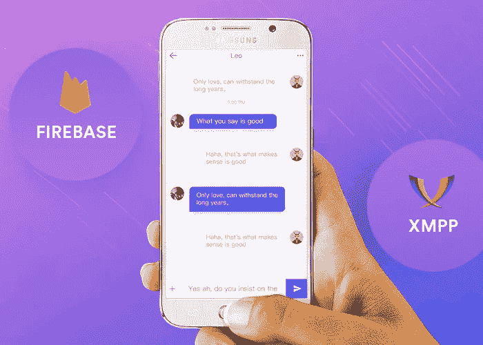
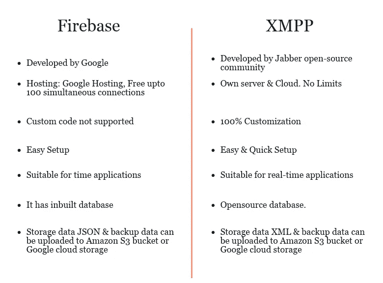

# 使用 Firebase & XMPP 构建 Android 聊天应用程序的更好方法

> 原文：<https://medium.com/hackernoon/better-ways-to-build-an-android-chat-app-using-firebase-xmpp-c089aefa2563>

Build Android Chat Application Using Firebase/XMPP

哦！那是令人困惑的。看起来你将使用最好的技术——后端即服务和通信协议来构建一个聊天应用。

嗯！你不应该忘记，没有专门为构建 android 聊天应用程序而设计的原生协议。所以，基本上，你需要一个服务器来协调用户之间的对话。幸运的是，在构建实时 android 聊天应用程序时，市场上有几种框架可供选择。总的来说，我们有两个先进的高性能协议——**Firebase**和 **XMPP** ，但是，很难对这两种技术进行逐一检查。每种技术都有自己的优势和功能。在开始阅读之前，让我们花一分钟来看一下这些庞大的技术。

# **简单说说这两个强大的平台**

因为我们非常了解 Firebase，所以让我们深入了解一下它。Firebase 是一个强大的后端平台，可以同步聊天应用程序数据，还提供数据存储、用户认证、静态托管平台等等。它还充当数据库，利用 MongoDB 和 Websockets。Firebase 有潜力使用 Firebase 构建一个复杂的多用户实时 android 聊天应用程序，只需对前端代码进行少量定制。Firebase Android 聊天应用程序内置了用于 iOS、Android 和 Web 的 API。

XMPP 是专门为 [**使用 XMPP 构建安卓聊天 app**](https://www.contus.com/messaging-solutions.php?utm_source=android-chat-app-firebase&utm_medium=InContentLink&utm_campaign=Hackernoon) 而设计的通信协议。一种行业标准消息协议，用于处理网络上的消息传递系统。它是在使用 XMPP 开发实时 android 聊天应用程序中广泛使用的开放 XML 技术，为应用程序开发提供了动力。

Build Android Chat App using Firebase & XMPP

# **现在，让我们开始实际的 Android 对话吧！**

让我们开始使用 XMPP 开发一个 Android 聊天应用程序。XMPP 服务器是 giants 在 Android 中使用 XMPP 构建简单聊天应用程序时广泛使用的标准消息协议。使用这种协议最显著的特点是可以提供一种呈现通知用户状态以及可扩展发送图像和视频的多种可能性。让我们举例说明在 Android 中使用 XMPP 构建一个简单的聊天应用程序所使用的参数。

1.  ***语言:*** Erlang 是开发实时聊天应用程序时使用的主要编程语言，该应用程序以极低的延迟处理大量消息。
2.  ***服务器:*** Ejabberd 在使用 XMPP 的 android 聊天应用程序中充当服务器，并且还管理通过所提供的任何网络的消息传递系统，并且还使用某些可插拔模块进行开发。
3.  ***Web 服务器:*** YAWS 是一个用 Erlang 语言编写的 Web 服务器。该系统有助于有效地处理并发进程，并具有高性能。
4.  ***数据库管理:*** Mnesia 是存储图像、视频、文件、文档和其他多媒体文件的合适数据库，具有存储一定量数据的潜力。

# ***Firebase IM Android 入门***

使用 Firebase 平台开发 Android 聊天应用程序。由于谷歌云平台提供了一个完整的教程，介绍如何使用 Firebase 构建带有后端数据存储的 android 聊天应用程序，使用 Firebase 进行用户身份验证，实时同步等，因此本课程不会详细介绍在 Firebase 上创建帐户，使用 Firebase 实现和开发 android 聊天应用程序。

Firebase 平台支持计费，以便在云平台上运行后端服务，如果带宽和多个数据库。谷歌的 Firebase 提供了各种各样的定价计划，如果你不知道所有这些框架，创建你的 Firebase 项目和 Firebase android 聊天应用程序的程序，这将是有史以来最难的道路。尽管 Google Firebase 提供了广泛的免费功能，如 Google 身份验证、云消息、分析等，但开发和部署后端服务并不容易。我们已经描述了使用 Firebase 构建和部署 android 应用程序的过程，这是一个很难理解的部分，也是一个永无止境的过程。让我们回头来了解一下它的优点和缺点。

1.  ***性能:*** 高性能的 Firebase 数据库和 Websockets 确保了高性能以获得大量并发连接。
2.  ***持久性:*** 它允许用户通过同步选项确保服务器上的数据和消息自动备份。
3.  ***框架:*** 因此，Firebase 贡献了一个已经存在的框架，而 chat SDK 为 iOS、Android 和 Web 应用提供了一个框架。

# ***结论***

需要注意的是，这两种技术都需要提前进行过多的编码。某些点在特定的度量上有很高的分数。有几个解决方案提供商专注于如何使用 XMPP 或 Firebase 在 android 中创建聊天应用程序，他们有可能将您正在进行的应用程序变成现实，例如 [**Contus Fly**](https://www.contus.com/messaging-solutions.php?utm_source=android-chat-app-firebase&utm_medium=CTA&utm_campaign=Hackernoon) ，这是一个即时消息现成的聊天应用程序解决方案，可以使用 XMPP 构建和启动您自己的 android 聊天应用程序。该解决方案在 iOS、Android 和 Web 等各种平台上根据预期绘制高端功能。

***“似乎每个聊天应用解决方案提供商都有聊天功能，但你的应该是不同的”***