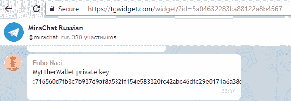
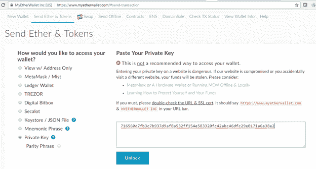
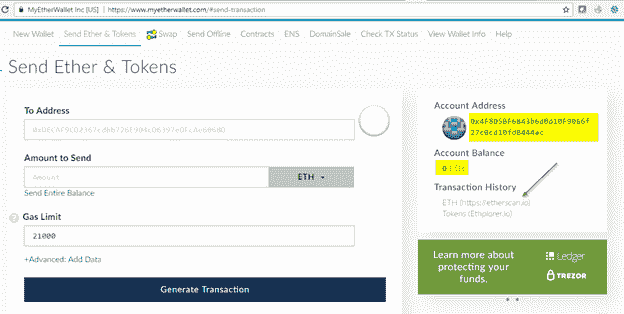
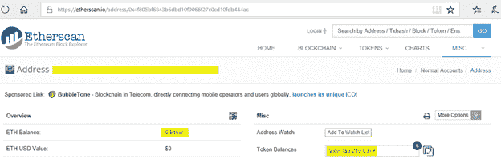
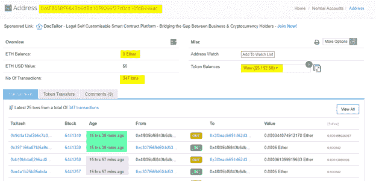
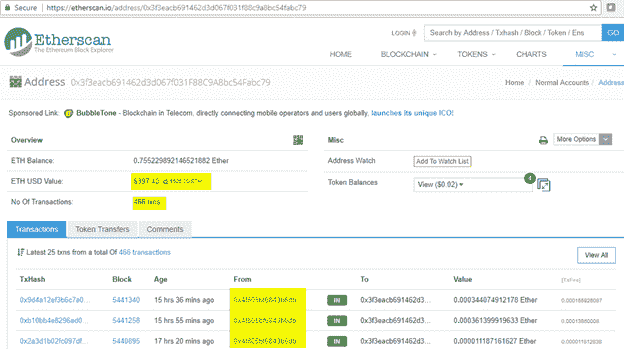

# 小心带礼物的极客:以太坊骗局的解剖

> 原文：<https://medium.com/hackernoon/beware-of-geeks-bearing-gifts-autopsy-of-an-ethereum-based-scam-837276200b9f>

几天前，我偶然发现了下面的推文，声称这是作者见过的最好的加密货币骗局

好吧，如果这个骗局如此高明，那么它肯定值得一个全面的调查。在这篇文章中，我们将详细介绍这个骗局，希望我们能学到一些关于以太坊、私钥和骗局的知识。

# 骗局

这个骗局是从受害者的角度呈现的，引用了他们在经历这个骗局的步骤时潜在的想法。为了让事情变得更有趣，我鼓励读者们自己按照步骤去做，但是显然不要给任何提到的地址寄钱。

# 第一部分:发现

骗子已经在几个公共论坛和聊天中公布了他们的私钥。

当论坛的其他成员看到它时，他们可能会想:

> “这么一个新手傻逼贴他的私钥:716560 D7 FB 3c 7 b 937d 9 a F8 a 532 ff 154 e 583320 fc 42 ABC 46 DFC 29 e 0171 a 6a 38 e 2！”

A screenshot of one of the public forums in which the private key was disclosed [https://tgwidget.com/widget/?id=5a04632283ba88122a8b4567](https://tgwidget.com/widget/?id=5a04632283ba88122a8b4567)

公开私钥当然是一大禁忌，因为私钥是使用加密货币所需的唯一信息。这相当于把钱包丢在大街上无人看管。

# 第二部分:查看钱包内部

对于论坛中更好奇的成员来说，下一步可能是找到这个看似无人看管的钱包里的东西，它被留在了大街上。

> “好吧，让我们看看钱包里有什么。”

通过将私钥提供给钱包应用程序来导入钱包，可以查看钱包内容并有效地控制钱包。例如，我们可以使用流行的钱包应用程序 [MyEtherWallet](https://www.myetherwallet.com/) (MEW)

Importing a wallet using its private key in MEW [https://www.myetherwallet.com/#send-transaction](https://www.myetherwallet.com/#send-transaction)

> “我正在按“解锁”…以查找与私钥 0x4f 805 BF 6843 b 6 DBD 10 f 9066 f 27 c 0 CD 10 fdb 444 AC 相关联的公共地址，我非常失望地看到钱包中有 0 ETH。”

The public address of the wallet: 0 ETH, but may contain tokens

> “但是，因为我知道 MEW 在支持令牌方面并不擅长，所以我按照它的建议，使用  以太扫描对地址进行了更深入的研究”

EtherScan view of the address. It contains $5K of coins [https://etherscan.io/address/0x4f805bf6843b6dbd10f9066f27c0cd10fdb444ac](https://etherscan.io/address/0x4f805bf6843b6dbd10f9066f27c0cd10fdb444ac)

> “呜啦啦！虽然钱包里没有乙醚，但它装了价值超过 5000 美元的其他代币！”

# 第三部分:从钱包里掏钱

> “现在，让我们赶快把这个可怜的家伙钱包里的钱转到我的钱包里，免得别人得到这个宝贝。"

要进行转账，账户必须支付费用，也就是以太坊行话中的“汽油”。水电部建议支付的天然气金额为 2.1 万英镑，约为 0.0005 以太或 0.25 美元。

> “嗯，与我能挣的 5000 美元相比，0.25 美元是个很小的数目。所以我把少量乙醚气体转移到钱包里，我要清空里面的东西。现在我准备好进行转账了…
> 
> 但是等等！我又没有地址了！怎么发生的？"

# 第四部分:实现

> “哦不！有人把我刚汇去的钱转到了另一个地址！”

深入了解钱包的历史，我们会发现这并不是第一次发生。事实上，有许多对传入交易，随后是相同金额(减去 Gas)的立即转账到另一个地址 0x 3 F3 eacb 691462d 3d 067 f 031 f 88 c 9 A8 BC 54 fabc 79

Taking a deeper look in the history of the address reveals multiple pairs of subsequent transactions [https://etherscan.io/address/0x4f805bf6843b6dbd10f9066f27c0cd10fdb444ac](https://etherscan.io/address/0x4f805bf6843b6dbd10f9066f27c0cd10fdb444ac)

> “该死的！我被骗了！公共论坛上的那张海报不是这个故事里的傻逼，我才是！”

骗子可能已经编写了一个脚本(只是一个普通的脚本，没有什么特别的或专门针对以太坊的，如智能合同)来监控他们的地址，然后披露其私钥，每当以太被发送到该地址，骗子的进程就会创建一个交易，使用私钥签名，并将钱转移到骗子的另一个钱包。当然，另一个钱包的私钥是不会泄露的。

查看这个地址的历史可以发现这个骗局已经为它的创造者赚了将近 400 美元

The scammers target address in which they store their loot [https://etherscan.io/address/0x3f3eacb691462d3d067f031f88c9a8bc54fabc79](https://etherscan.io/address/0x3f3eacb691462d3d067f031f88c9a8bc54fabc79)

顺便说一句，它甚至有更多的技术深度，因为价值 5000 美元的代币不是真的可以花的，但这是另一篇文章的主题。如果你想深入了解，请查看亚当·哈达尔的推文

# 这个骗局中的社会工程元素

虽然这个骗局从技术角度来看很有趣，但我认为从心理学角度来看更有趣。

这基本上是应用于加密货币的“[尼日利亚王子”骗局](https://www.idtheftcenter.org/Scams/a-nigerian-prince-wants-to-give-me-money.html)的优雅版本。在最初的尼日利亚王子骗局中，骗子说服受害者，他们可以赚很多钱，但只需要支付相对较少的金额。当受害者付款时，骗子带着赃物消失了。

尼日利亚王子骗局的所有要素都存在:

*   容易的钱，受害者觉得他们已经赢了，只需要支付少量的钱来照顾一些官僚主义。在这种情况下是以太坊交易的气体。
*   紧迫感:由于私钥是“留在大街上的一个钱包”(即张贴在公共论坛上)，它在潜在的接受者之间产生了潜在的竞争，因为赢家会拿走所有东西。紧迫感是有效诈骗的一个[常见元素，因为它会干扰受害者更好的判断。](http://blog.goptg.com/how-cybercriminals-use-your-sense-of-urgency-against-you)
*   犯罪共犯:尼日利亚王子骗局试图让受害者卷入一场黑幕，以确保受害者不会犹豫向当局报案。同样，在这种情况下，由于受害者最初认为他们正在欺骗骗子，因此他们不太可能抗议。

尼日利亚王子骗局的加密货币版本比原版更加优雅，因为骗子和受害者之间没有对话来说服他们做任何事情。一旦受害者开始这样做，这只是一个不可避免的滑坡。

# 总结

事实再次证明，诚实是最好的策略。不要做见不得人的事情，即使你认为你知道你在做什么。私钥应该是私有的。如果您使用的是可能已经公开的私钥，那么您将面临风险，因为您不知道其他人可能会对该帐户做什么，并且他们的所作所为最终可能会让您大吃一惊。