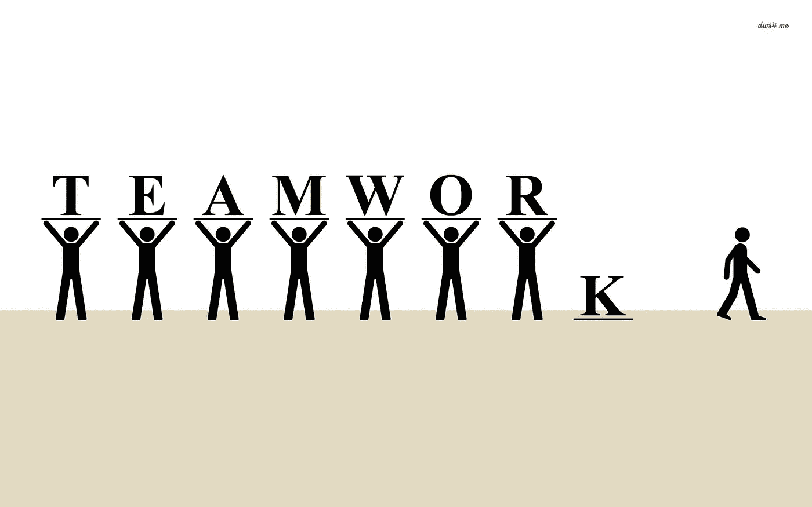

# 当心线下陷阱

> 原文：<https://medium.com/hackernoon/beware-the-offline-trap-72ddb49f44a2>

/via [http://www.fau.edu/research/research-communications/index.php](http://www.fau.edu/research/research-communications/index.php)

在过去的几年里，组织内部的沟通方式和渠道以惊人的速度扩张。与此同时，与这些通信形式相关的问题也在增加。例如，你可能以某种形式听过下面的话

*   "*我发现懈怠会适得其反*"
*   "*闲逛是浪费时间*"
*   "*比起 WhatsApp 我更喜欢电子邮件*"

诸如此类。

关于上述的事情是，他们中的每一个都是绝对有效的。例如

*   "我发现懈怠会适得其反， ***因为不断的干扰阻止我进入最佳状态*** "
*   *闲逛是浪费时间，* ***因为这里的每个人都喜欢自己的声音***
*   与 WhatsApp 相比，我更喜欢电子邮件， ***，因为你可以跟踪对话线索***

公平点对吗？尤其是关于分心的那个，对吧？毕竟，我们大多数人都遇到过上述问题，*我们所有人都讨厌分心(*松鼠！我们可能已经用(或 to)对此咆哮了很久。)我们的同事、朋友、咖啡店里的陌生人、[博客帖子](/@chrisjbatts/actually-slack-really-sucks-625802f1420a)以及贵族们知道还有哪里。**

然而，这里的关键是*你需要理解* ***为什么*** *做出上述陈述，并且* ***而不是*** *简单地根据你自己的假设、经验和偏见赋予这些陈述以意义*。

回去再读一遍——我不是说你的理由不成立！然而，我想说的是，你应该试着弄清楚为什么对方讨厌懒散/闲逛/诸如此类的事情。如果你不这样做，无论你在组织中遇到什么问题，你都无法解释清楚！。

*   *打断太多*？也许是时候开始制定[策略来减轻——并拥抱！—分心](/@robertoaloi/embracing-distractions-cb06e830d08)。
*   *太多喜欢自己声音的人*？您或您的技术主管/PM/…需要在团队动态、沟通策略、站立等方面下功夫。
*   *在 WhatsApp* 中追踪对话线索遇到麻烦？是时候认识到异步(电子邮件、文档、语音邮件)和同步(WhatsApp、语音)通信之间的区别，以及在与其他人互动时各自的适当角色了

这是容易的部分，你们大多数人已经知道，或者应该知道。设身处地为他人着想的要点是，他们时不时会揭示一个更深层次的问题，一个对你的组织来说可能是灾难性的问题——有时人们就是不善于协作！
让我们重做上面的陈述，用一个限定词围绕协作

*   "*我发现懈怠会适得其反， ***因为我不太擅长与人合作*** "*
*   "*闲逛是浪费时间，* ***因为我不太擅长与人合作*** "
*   "*比起 WhatsApp，我更喜欢电子邮件，* ***因为我不太擅长与人合作*** "

/via [http://www.theteamspace.com/how-much-does-poor-teamwork-cost-you/](http://www.theteamspace.com/how-much-does-poor-teamwork-cost-you/)

这听起来熟悉吗？你的组织中有适用的人吗？如果是的话，那你就有问题了。
如果这个人对你的组织来说是关键人物，比如说一个牛仔开发者，那么你就有大问题了。如果这个人也是某个处于权威地位的人——技术领导者/经理/创始人——那么，你就有一个大问题了

所以，是的，看看你的公司，注意关于协作的抱怨。确定——真正确定——这是**而不是**，因为他们很烂。你不会后悔的！！

***更多预警信号***

*   “比起谷歌文档，我更喜欢微软 Word”(除非他们是律师，或者有一个真正的*真正的*好理由。他们可能不知道)
*   *我经常出差，不可能一直在线*。是啊，公牛队，尤其是最近
*   *如果你正在做一个演示，并且不能(或者不愿意，或者不知道如何)关闭通知，你可能是个问题*

()说真的，在这种情况下，看看是否有任何解决的可能性。如果没有(坦白说，也不太可能会有。对于这个空间里的大多数人来说，权威就是“我总是正确的”，如果可以的话，你最好找一份不同的工作，这是得不偿失的。

*(* [*这篇文章也出现在我的博客上*](http://dieswaytoofast.blogspot.com/2018/04/beware-offline-trap.html) *)*