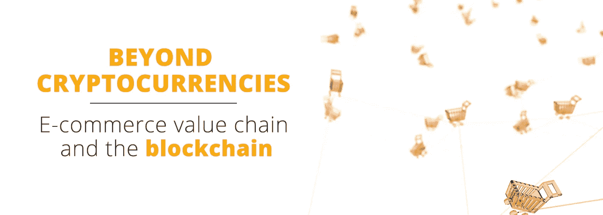
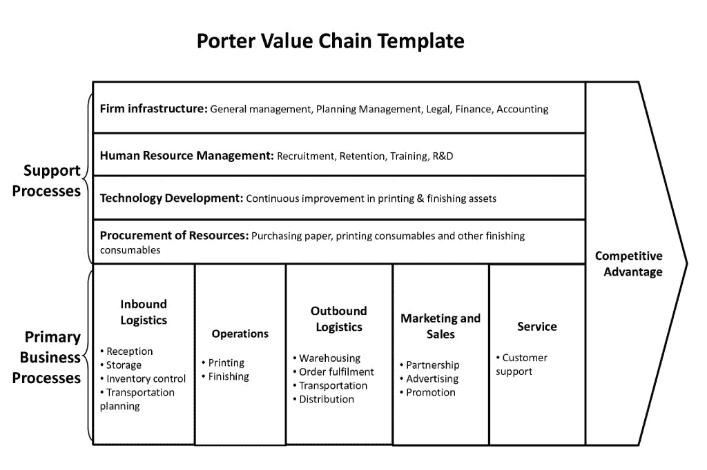

# 超越加密货币:电子商务价值链和区块链(上)。

> 原文：<https://medium.com/hackernoon/beyond-cryptocurrencies-e-commerce-value-chain-and-the-blockchain-part-one-36222cc6a4fd>

除了使用加密货币进行支付，区块链技术对电子商务的潜在价值才刚刚开始被认识和探索。

少数区块链电子商务项目已经启动，但它们实际上才刚刚开始触及表面。例如，OpenBazaar 仅使用比特币技术进行支付，其他一切都依赖于现有的技术栈。虽然也有其他电子商务公司在探索分散化技术的使用，但与金融业的投资相比，它们所投入的关注和研究是微不足道的。

**投资不足**

很难确定为什么会如此缺乏关注。电子商务是一个巨大的行业，与整个世界息息相关。大量的资源被投入到它的一般开发中，那么为什么不更深入地探索区块链技术的应用呢？电子商务的复杂性——涉及不同的商业模式和运营——可能会阻碍开发者和企业向前发展。还有一种可能是，金融领域采用区块链的大趋势(由许多新的去中心化应用程序所展示)已经将所有注意力从其他商业机会上转移开了。不管原因是什么，事实是:这里有一个巨大的机会，而且是敞开的。

在下面的帖子中，我们将尝试解释我们解决这个问题的方法。我们将使用商业分析工具来研究电子商务价值链的运作，探索区块链技术可能给他们带来的价值。

# 到底什么是电子商务？

在试图了解区块链在电子商务方面的潜力之前，我们应该首先界定电子商务本身。电子商务是一项复杂的事业，涉及许多要素，因此我们将使用波特的价值链分析图来解开整个过程的不同要素。

Michael Porter’s value chain canvas, applied to e-commerce.

这个图表虽然是一个简化，但反映了任何电子商务业务中不同操作的复杂性。出于我们的目的，我们可以指出可能受到区块链技术影响的五个一般领域:

1.  与入库物流相关的一切，包括接收、存储、库存和仓库中物品的计划。
2.  与运营相关的一切，比如上市、支付、托管、用户的数据管理，以及与平台内买卖双方运营的日常管理相关的一切。
3.  外向物流:订单履行、运输和配送中的所有操作。
4.  市场营销和销售:寻找、吸引和吸引新客户。此外，对任何电子商务企业来说，致力于提高客户忠诚度都是至关重要的。其实这才是真正的利润所在！
5.  服务:客户支持的主要操作，例如通过仲裁解决争议，以及解决任何履行问题。

所有这些业务流程都需要支持，包括开发新技术以保持相关性和竞争力。区块链在这方面有明显的可能性，在采购、人力资源和基础设施方面还有进一步的应用。

**竞争优势**

这些领域中的任何一个方面的改进都会导致相对于类似业务的竞争优势，但我们更愿意将其定义为对客户更好的价值。在电子商务中，这归结为**的便利。电子商务获得了越来越多的用户，而且每年都在增长，因为它非常方便:你可以在沙发上或办公室里以合理的价格购买任何东西。**

但是人们也需要一种他们可以**信任的服务。**如果你在购买一件商品之前不能亲手触摸它，你需要能够信任卖家准确地描述该商品，然后快速、安全地将它送到你家。

这些问题就变成了:

*   区块链能为用户提供更好的价值吗？
*   区块链会给用户带来更多的便利和信任吗？

我们认为这两个问题的答案都是响亮的“是”。为了解释我们的热烈反应，我们将分析使这些竞争优势成为可能的区块链技术的属性。这个话题将是我们下一篇文章的主题。

