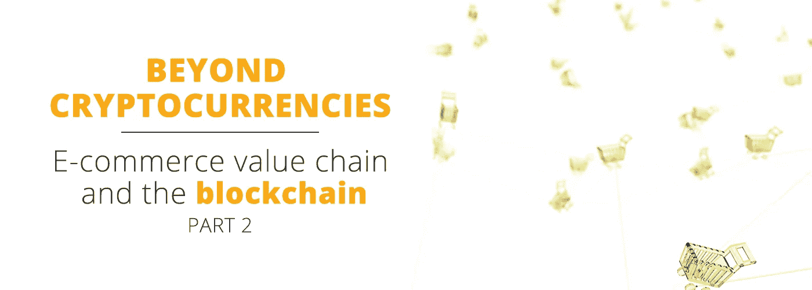

# 超越加密货币:电子商务价值链和区块链(下)

> 原文：<https://medium.com/hackernoon/beyond-cryptocurrencies-e-commerce-value-chain-and-the-blockchain-part-two-6c4905a33333>

当我们深入研究区块链技术时，我们发现有几种解决方案正在竞相成为标准。不是所有的区块链都做同样的事情，它们有一些共同的问题，比如可伸缩性和互操作性。但我们也可以说，该技术有几个共同的特点，每个人都同意这是任何区块链的基础(又名“分布式账本技术”(DLT)，或同时存储在多个设备上的共享数据库):

1.  分布式分类账将信息和交易存储在数字“块”中，每个数字“块”都有一个唯一的 ID，在不改变所有后续块的情况下，不能追溯更改，这几乎是不可能的。区块链的这个特性带来了它最显著的优势之一:**不变性**。如果黑客想要更改存储在区块链中的数据，他们需要在保存数据的大多数节点上进行更改。
2.  所有用户都可以完全使用整个分类帐，从而实现完全**透明**。
3.  因为每个区块都是独一无二的，几乎不可能伪造，所以我们可以在区块链内创建无法复制或伪造的数字资产。这些资产被称为代币。区块链**的共享性和不可改变性防止了双重支出问题**，即同一数字资产可以用于两次不同的支付。
4.  代币作为独特的信息单位，也可以代表任何形式的价值或资产的所有权，可以通过互联网轻松安全地进行交易。
5.  区块链上的每个用户都由一个唯一的 30 多个字符的字母数字地址标识。交易发生在区块链地址之间。这个特性给了用户另一个好处:**假名或者伪装身份。**这并不等同于匿名，而是带来了对个人数据更好的控制和保护。任何人都可以使用该网络，因为它只需要一个地址，在区块链上进行交易不需要任何个人信息。
6.  最近的发展，如以太网，为区块链增加了另一层功能:智能合约。这些小程序可以完全或部分激活，无需人工干预，一旦满足特定条件就执行给定的操作，并在区块链中注册这些操作。**节点之间的交互因此可以自动化。**

因此，任何区块链的基本优势可以概括为*不变性(永久性或不可逆性)、透明性、防止支付的重复支出问题、安全的价值转移和存储、匿名性，以及对于使用智能合约的人来说，节点之间的交互自动化。*

# 区块链技术为电子商务打开了全新的视野

区块链的这些特点带来了许多优势，为电子商务价值链的许多环节带来了巨大的潜力。在没有系统性的情况下，我们认为区块链将被证明具有革命性的主要领域将包括物流、平台运营、身份和数据保护以及客户支持。

# 物流

E-commerce logistics its a field with huge potential for blockchain applications.

先说物流。透明性和不变性对于任何供应链来说都是一个很好的组合。如今，任何供应业务的最大风险是“[牛鞭效应](https://en.wikipedia.org/wiki/Bullwhip_effect)”，当需求波动对供应链的影响放大时，任何种类的实物商品的运输和储存成本都会飙升。这种牛鞭效应来自于孤立的数据库之间缺乏透明度。区块链从一开始就解决了这个问题，因为每个人都能够在供应链的任何一点检查库存水平。事实上，许多 T2 公司已经在探索这些功能。结果带来了更高的效率，并应用于电子商务可以改善库存和履行活动。

# 电子商务平台运营

The blockchain technology might help to improve the efficiency and trustworthiness of digital platforms.

区块链将带来巨大价值的电子商务价值链的第二个要素是运营。每个电子商务业务的一个关键要素是交易发生的平台。区块链如何改善电子商务平台？基本上，这是一个信任和效率的问题**。区块链被称为“信任机器”。正如我们上次提到的，电子商务是基于信任的，所以这里有一个完美的匹配！但是它是如何工作的呢？通过区块链的不变性、透明性和支付机制。**

任何区块链记录的透明性和不变性将极大地有助于在没有中间人的情况下为电子商务带来信任。到目前为止，可信的交易总是需要第三方(在市场的情况下)或认证(在个体商店的情况下)。两者都应该确保卖家值得信赖，交易正常进行。

但是区块链改变了这一切。你只需检查网络和交易记录，就能确定卖家是否可靠。您可以在这些基本网络功能的基础上轻松构建进一步的**自动托管系统**，以保证客户资金的安全。

因此，智能合同可以为许多原本需要人工处理或需要大量费用的操作带来更高的效率。例如，争议仲裁可以部分自动化，甚至外包，为电子商务运营商**节省大量成本**(请记住，投诉和产品退货在这项业务的成本中占很大比例)。

这也适用于付款。区块链允许以安全可靠的方式在数字网络中进行价值转移，防止重复消费，并且对中间人没有任何成本(尽管网络维护者的硬件和能源成本会产生一些小额费用)。正因为如此，区块链带来了一个更便宜、更高效的数字支付新世界**，节省了公司处理支付的所有成本，就像 PayPal 或 Visa 一样。这可能是自比特币作为支付手段问世以来，区块链经受过最彻底考验的特性。**

**最后，由于诸如列表、支付以及买卖双方的互动等常规操作都是通过区块链进行的，电子商务企业不需要运行庞大、复杂且昂贵的服务器。分布式计算本质上承担了这方面的成本，而这些成本通常会加在卖家身上。**

# **数字身份和客户支持。**

****

**Digital ID will be better due to the blockchain technology, improving e-commerce convenience for both sellers and buyers.**

**区块链破坏电子商务的第三个因素是数字身份。顾客的隐私权是当今的热门话题。人们越来越担心数据控制和无垃圾邮件的数字体验(只需查看广告拦截器的[演变](https://blogs.harvard.edu/doc/2015/09/28/beyond-ad-blocking-the-biggest-boycott-in-human-history/)就能感受到这一趋势)。这个问题主要通过区块链地址的假名性质来解决。每个用户都将保留其个人数据的所有权，在需要时披露他/她想要的任何信息，有意识地始终控制他们的个人信息。**

**此外，我们可以在此基础上构建另一个功能:**客户支持和忠诚度**。由于每个客户都由一个地址标识，并且其交易记录是透明且不可擦除的，因此构建更高效、更值得信赖的客户支持服务(包括促销、争议管理和客户忠诚度计划)是轻而易举的事情。因为区块链提供伪匿名，我们可以在不披露或存储客户信息的情况下做到这一点。**

**所有这些功能及其带来的价值共同为人们提供了一种体验，在这种体验中，更容易跟踪物品，*交易可以自动验证，成本更低，维护客户权利更容易，并且个人数据始终在每个用户的控制之下。*结果是更方便、更值得信赖的体验，因此对每个人都更有吸引力。**

****