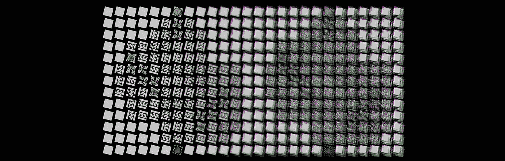
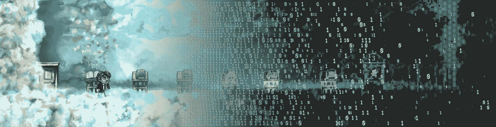
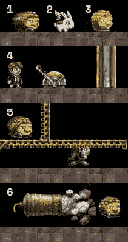
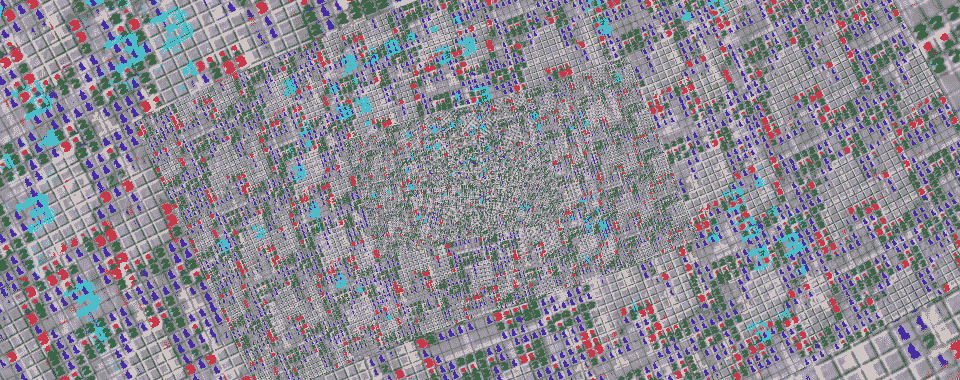
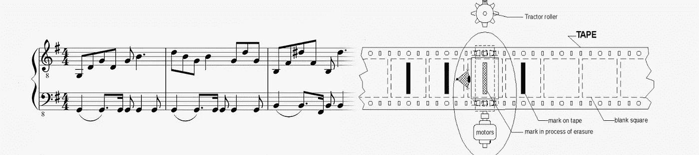
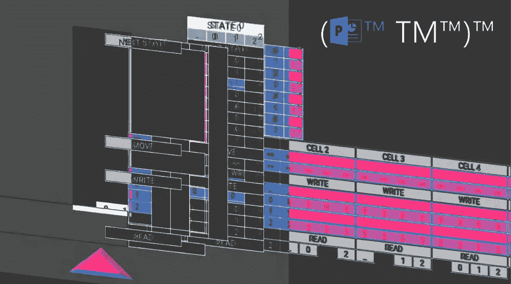
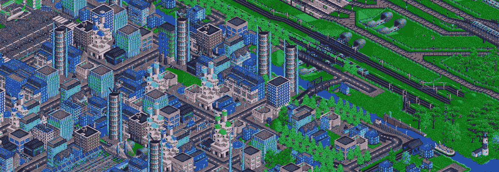

# 超越语言:无意中完成的 6 件事

> 原文：<https://medium.com/hackernoon/beyond-esolangs-6-things-that-are-unintentionally-turing-complete-60ab1e1b50f9>

*注意:这篇文章的一部分是由* [*Qwhex*](https://steemit.com/@zsh) *撰写的，他们也制作了所有令人敬畏的图片。一定要检查他！*

我们只给高效和多产的编程语言贴上*图灵完全*标签的时代已经一去不复返了，而“esolang”作为一种体裁已经成为一种普遍现象。Esolangs 是编程语言，通常唯一的目的是**而不是**有用。对于通常讽刺实际语言的程序员来说，它们是复杂的笑话。

但是*图灵完全*到底是什么意思呢？这意味着它可以计算任何可计算的东西。这不是一个令人满意的答案，所以让我们这么说吧:如果一个东西可以计算一台通用图灵机可以计算的任何东西，那么它就是图灵完全的(事实证明目前没有办法超越它)。

因此，图灵完备性是编程语言(真实的和深奥的)的目标，但这并不意味着它们是一些特权生物和唯一的候选人。如果你足够仔细地观察，你会发现它无处不在，在这篇文章中，我们想列出其中 6 个我们认为最有趣的。

# 1.制造厂

这是一个关于让机器人各就各位的游戏。更准确地说，这是一个可视化编程环境，你可以根据机器人磁带的内容来接受或拒绝机器人。在某些层面上，您还需要将他们的输入转换为有效的输出。

基本的构建模块是根据读取位将机器人发送到可选方向的分支，将机器人发送到预定义单元的传送带，以及在磁带末端添加新颜色位的写入器。从简单的迷宫开始，玩家学习如何创建越来越复杂的电路。当心！学习曲线相当陡峭。

这个游戏是图灵完全的并不奇怪。由[证明这个规则 110 解释器](http://pleasingfungus.com/?lvl=32&code=y12:2f3;r14:11f1;b11:10f2;c12:10f2;c13:10f2;p14:10f2;b15:10f2;b10:9f0;p11:9f4;c12:9f0;c13:9f1;b14:9f0;b11:8f1;c12:8f3;i13:8f0;c14:8f0;i12:7f5;c13:7f1;b14:7f3;b11:6f2;c12:6f3;c13:6f2;p14:6f2;r15:6f2;r10:5f0;p11:5f4;c12:5f0;c13:5f0;r14:5f0;r11:4f3;c12:4f3;c12:3f3;c16:10f1;c16:9f1;c16:8f1;c16:7f1;c16:6f1;c16:5f1;c16:4f1;c16:3f1;c15:2f0;c14:2f0;c16:2f0;c9:9f1;c9:8f1;c9:7f1;c9:6f1;c9:5f1;c9:4f1;c9:3f1;c9:2f2;c10:2f2;q13:2f5;q11:2f1;c11:7f2;&ctm=Rule_110;Turing_complete!;b:x;13;3;1;)本身是图灵完全的。然而，这是开始学习图灵机的好地方，也是锻炼大脑的好方法。

# 2.乔纳森·布洛的平台经典:辫子

首先:如果你没玩过这个游戏，你应该认真地玩一玩。这是我一直以来最喜欢的游戏之一，当我得知这个游戏不仅设计精美，故事情节引人入胜，而且是图灵完全游戏时，我被震惊了。公平地说，这个游戏并不是图灵完全的，而是 T2 的游戏机制。Linus Hamilton 在他的 2014 年白皮书中， [Braid 是不可判定的](https://arxiv.org/pdf/1412.0784.pdf)向我们展示了证明图灵完备性所需的具体游戏元素。这些要素是:

1.  怪兽之星
2.  兔子（尤其是小兔子）
3.  倒带时间
4.  杠杆+平台
5.  单向表面
6.  大炮

他展示了如何用以下元素创建一个[计数器机器](https://www.wikiwand.com/en/Counter_machine):

> 已知表现出图灵完全行为的最简单的机器类型之一。

这台机器相当复杂，但他为每一部分都提供了图像和解释，所以理解起来并不困难。后来他还证明了 Braid 是不可判定的，但这不是本文的范围。如果你想知道所有的细节，我强烈推荐你阅读整篇文章。

# 3.扫雷艇

最初我打算在这里加入游戏人生。的确，康威游戏的最终目标不是创造一个图灵完备的系统，而是一个有机的、混乱的、因此像生命一样的东西(因此得名)。但是它仍然是计算研究的产物，因此对于本文来说还不够无意。

然后我看到了理查德·凯写的一篇关于扫雷舰的论文。他将它类似网格的性质和每个单元格包含的值与《生命的游戏》进行了比较，并提出《扫雷》也是图灵完全的。

该论文进入了非常详细的细节，但是该概念的本质是将初始状态(当一些瓦片可见而一些不可见时)作为图灵机的指令集进行处理，并将该网格的“扩展”(当每个瓦片可见时)作为计算的结果。实际的证明有点难掌握，但是如果你不害怕数学，那就试试这张纸吧！

# 4.音乐符号

谁想到甚至音乐也能代表任意的计算？好吧，如果你做到了这一步，你可能不会再兴奋了(对不起，我想...).但这有多疯狂？音乐家们今天使用的标准记谱法已经有 300 多年的历史了，比图灵还早很多。然而，利用它并不简单，需要一些巧妙的解决方案。

2002 年，Stephen Sykes 发布了他的深奥的编程语言/解释器 Choon，它需要标准的音乐符号作为输入，并以*的形式输出真正的音乐。wav* 文件。我认为它最有趣的一点是，与普通编程语言不同，它不使用可变存储。不幸的是，他的原创文章已经没有了，你需要时光倒流机才能访问[的文章](https://web.archive.org/web/20160316172205/http://www.stephensykes.com/choon/choon.html)，但它确实值得一读。

# 5.墙边插座

(PowerPoint 图灵机)是一个过分玩笑的实现。第一次[展示](https://www.youtube.com/watch?v=uNjxe8ShM-8)在 SIGBOVIK，计算异端协会的旗舰会议上，汤姆·威尔登海因成功地利用自选图形、超链接和点击动画将一张 PowerPoint 幻灯片变成了经典的图灵机。

独特的动画支持使创建这台机器成为可能，但用户需要多次点击才能推进计算，但这一限制使它更加有趣。饼干点击技能转化为更快的 CPU！程序是通过用内置的 PP 工具手工编辑穿孔卡来创建的。

如果你对更多的技术细节感兴趣，查看一下[白皮书](http://www.andrew.cmu.edu/user/twildenh/PowerPointTM/Paper.pdf)(用 PowerPoint 排版)或者下载[机器](http://tomwildenhain.com/PowerPointTM/PowerPointTM.pptx)本身。

# 6.铁路运输

火车运输和它周围的基础设施的价格非常高，所以很容易理解为什么我们还没有在现实生活中看到一个完整的火车系统。但这并不意味着这样的事情不能做，为了证明这一点，我们只需要一个模拟平台，提供现实的积木和行为，就像真正的火车一样。最好的工具是 OpenTTD 和开源大亨游戏，你可以在那里建造和管理交通系统，但我们显然不需要整个游戏，只需要其中的火车。

第一个构建模块是由 Alienturnedhuman(这个名字似乎很准确)在游戏中实现的[二进制全加器](https://www.wikiwand.com/en/Adder_(electronics)#/Full_adder)，他在 2015 年初的 youtube 视频中演示了他的创作。不到一年前，他发布了一个 45 分钟长的[更新视频](https://www.youtube.com/watch?v=YyEzm1ghAsU)，在视频中，他用时钟、内存和一整套“连接电路”扩展了他的全加器，基本上创建了一台工作计算机。嗯，与其说是一台工作的计算机，不如说是一台工作的计算机，因为视频显示的是一个正在进行中的状态，并且仅仅是从那里勾勒出了创建一台完全工作的通用图灵机的路径。

Alienturnedhuman 项目的其他有趣方面是动机。他在视频中解释了他是如何与一位朋友发生争执的，这位朋友称赞《我的世界》可以在里面制造出功能正常的计算机。他回答说，你当然可以用旧游戏来构建电脑，并用这个令人兴奋的项目证明了这一点。所有细节绝对要看完整个视频！

我希望你和我一样对这些感兴趣。如果是，请不要忘记，介质上的 [*新鼓掌系统*](https://help.medium.com/hc/en-us/articles/115011350967-Claps) *最多允许 50 次鼓掌。据此评价帖子:)*