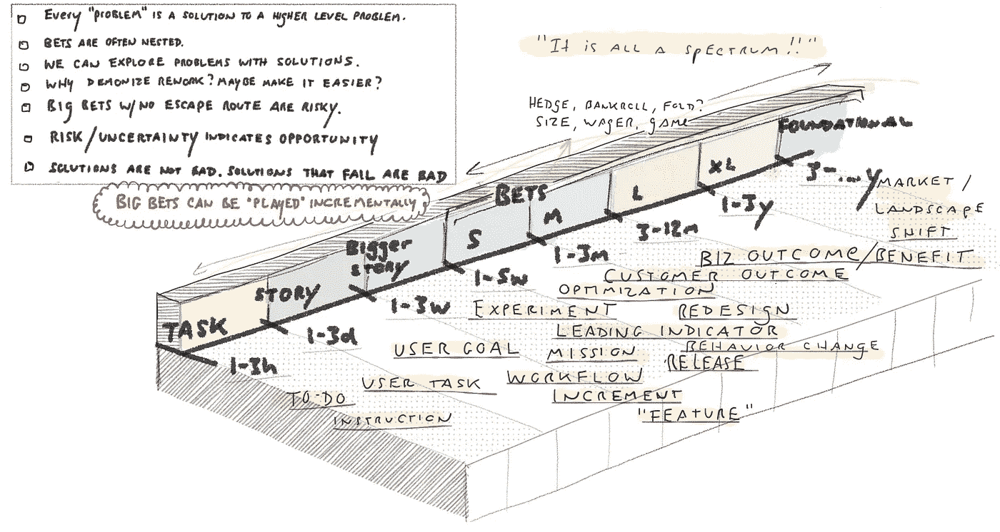
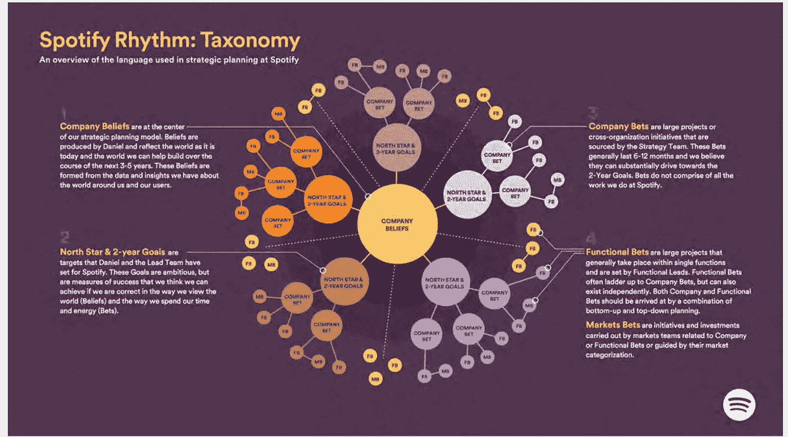
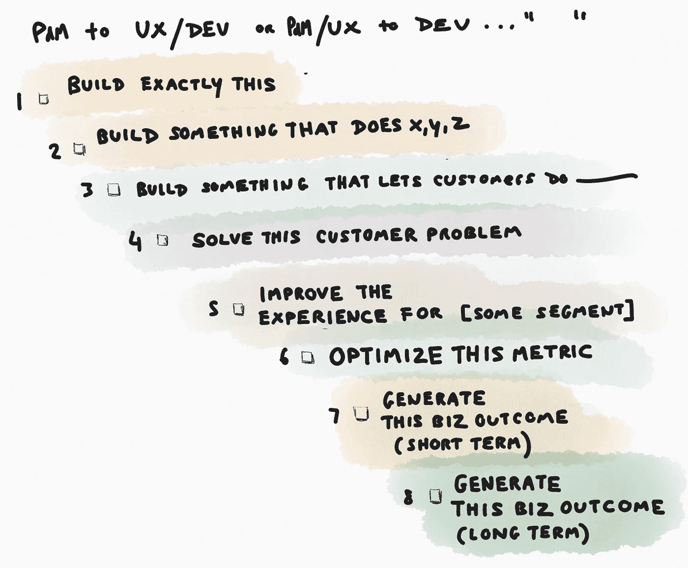

# 超越“结果胜于产出”

> 原文：<https://medium.com/hackernoon/beyond-outcomes-over-outputs-6b2677044214>

考虑一个产品开发团队的*任务类型(或任务范围)*的范围:

1.  建造这个
2.  构建能够完成[一些操作，一些工作流程]的东西
3.  建立一些让客户做[一些任务]的东西
4.  解决这个客户问题
5.  改善[部分用户/客户]的体验
6.  优化此指标
7.  产生这一短期业务成果
8.  产生这一长期业务成果

我经常遇到渴望更加“结果导向”(3/4 以上)的团队/个人。原因各不相同，但主要集中在 1)相信它将为企业创造更好的结果，2)“企业”在某种程度上怀疑或削弱他们的专业知识，只是追逐成功戏剧，以及 3)渴望更具挑战性、更有影响力和智力上更严格的工作。

“结果对产出”已经成为顾问、个人和团队的号召。有什么不喜欢的，对吧？

有一天，我问一个处于这种情况下的团队，如果他们知道这将有利于业务，他们是否会进行“完全按照这种方式构建”的努力。

> ***我们当然愿意！但是……(所有没有发生的原因)***

这让我开始思考。你必须区分问题。

公司如何:

*   做出可能的**最佳产品决策**？
*   将这些产品决策与**一致的高级产品战略**联系起来？
*   **展示实际影响** —将最规范的工作/行动与高级业务成果联系起来(本质上是从上面的 1 到 8“沿着树走”)。**规定与否，有效吗？**
*   **谈论不确定性**和嵌套赌注/假设。也就是说，解决这样一个事实，即大多数“问题”(甚至像 6“优化这个指标”这样非常开放的目标)本身就是更高层次问题/目标的解决方案？至少在近期/中期，有没有不容置疑的基本赌注？
*   **让员工参与**将他们的工作与实际影响联系起来，并允许他们从职业角度出发，享受更多的自主权、灵活性和创造性空间？

这些是重要的区别，因为许多组织缺乏将*任何与影响和/或更大的战略赌注相关的*非销售联系起来的能力，更不用说授权一线团队交付成果了。甚至销售目标也是为短期业务成果服务的(而不是业务、使命等的长期生存能力)。).此外，团队部分——甚至是大多数员工——对驱动更具规定性的近期目标的更高层次的假设和“赌注”以及它们如何“组合”一无所知。**所以……这个问题远远超出了“授权”团队(尽管这很重要)。有时产品团队需要构建“完全如此”…然后呢？**

考虑一下这里的范围，从 1-3 小时的任务到公司 3 年以上的基础赌注。在谈论是否应该给团队 A 一个粗略的模型，或者让他们自己做研究之前，你可能应该为你的公司绘制这些视野。这一切是如何组合在一起的？

因为即使团队 A 的任务是“解决该客户的问题”(4)，您仍然需要一种方法将其与短期和长期业务成果联系起来。如果你不能，你只是陷入了关于团队自治的理论讨论，以及它是否会导致主观上更好的近期、更低水平的结果。(这就是为什么“结果与产出”的讨论往往停滞不前，并决定产生一些短期的客户“结果”)。

下面是另一个来自 [Henrik Kniberg](https://medium.com/u/3ccad081c81a?source=post_page-----6b2677044214--------------------------------) 的 [Spotify Rhythm talk](https://blog.crisp.se/2016/06/08/henrikkniberg/spotify-rhythm) 的“下注图”:

当只关注近期结果时，这种一致性是罕见的。

这个问题的一个很好的例子是 OKRs(目标和关键结果)是如何被个人和一线团队普遍感知的。从定义上来说，近期目标更具规范性，即使是以量化的“结果”来表述。当我问一线人员——尤其是产品团队——他们的 okr 时，我总是听到这样的话:

> 这些都很好，但我不知道这一切如何融入更大的画面。我们现在所做的是为未来几个季度和几年的成功打下基础。这一季度以后的目标是什么？人们要对这些事情是否成功负责吗？还是他们每年都把战略石板擦干净，重新开始？我们如何让自己对衡量战略是否有效负责？

打 OKR 是*不够*。知道达到 OKR 将推动一些未来的结果，这些结果 1)对业务有影响，2)对员工有意义，这是至关重要的，也是 MBO(目标管理)的各种咒语中丢失的东西。为什么？如果没有基本的连贯故事(跨越多个时间跨度), okr 只是一个过程环，如果没有“闭环”,就没有学习:

> 有没有人回过头去看看打 OKRs 有没有什么不同？或者就此而言，当我们制造产品时——不管是接受订单，还是自己想出来——我们有没有回头审视过我们的决策？

真的，重要的是**的背景**，正如 [Spotify 注意到的，当他们在个人层面上离开 OKRs 的时候](https://hrblog.spotify.com/2016/08/15/our-beliefs/):

> 我们注意到我们把精力投入到一个没有附加值的过程中。所以我们决定放弃它，转而关注上下文和优先级。我们确保每个人都确切地知道我们要去哪里，当前的优先事项是什么，然后我们让团队负责如何到达那里。

我想我从这篇文章中得到的是“结果胜于产出”或“证据驱动的开发”或“击败功能工厂”听起来很棒。确实如此。我个人认为，以产生结果为任务的团队更有可能为他们自己、他们的业务、他们的客户，有时甚至是社会产生积极的结果。我已经写了很多关于[特性工厂](https://hackernoon.com/12-signs-youre-working-in-a-feature-factory-44a5b938d6a2)的文章。**但这比意图要多得多，你将总是有一系列不同时间范围、确定性水平、规定水平和“有待辩论”的嵌套赌注。换句话说，你认为问题只是结果多于产出和“信任团队”,而事实上这个问题有更深层次的原因。**

这需要:

*   尽可能缩短反馈循环
*   短期、中期和长期赌注的连贯地图/图表
*   愿意审查所有的决定和影响…指令性的，或其他的，短期或长期的，实验或“基础”赌注
*   一种将每一个行动——甚至是日常琐事——与短期、中期和长期赌注联系起来的方法
*   超越“赌注”…一种分享和建立对公司战略、核心信念和“为什么”的深刻理解的方式
*   谈论不确定性，在不确定条件下决策的质量，以及不可避免的失败
*   对专业知识的信任，培养和发展团队成员的意愿，以及他们对更多自主权和责任的渴望。员工的“参与”不仅仅是通过让团队“解决问题”来给团队扔骨头

现在，我认为“结果胜于产出”更多的是一种代理讨论，围绕激励、拉与推管理、一致性、心理安全、透明度、建立团队信任和自主性、战略和重点进行更深入的讨论。这是一句方便、无需动脑、永不丢失的口号。谁不想要结果呢？但是当我们设计这些其他的问题时，它变得更加微妙。

所以，总而言之…考虑你的团队在哪里运作。将日常工作映射回基本的公司赌注，接受一切的不确定性。最后，考虑这是否更多的是一个背景/故事、结果*认知*和整个“下注图”的一致性的问题，而不是团队 A 是否是从一个模型建立的。

每个问题都是更高层次问题的嵌套解决方案。

