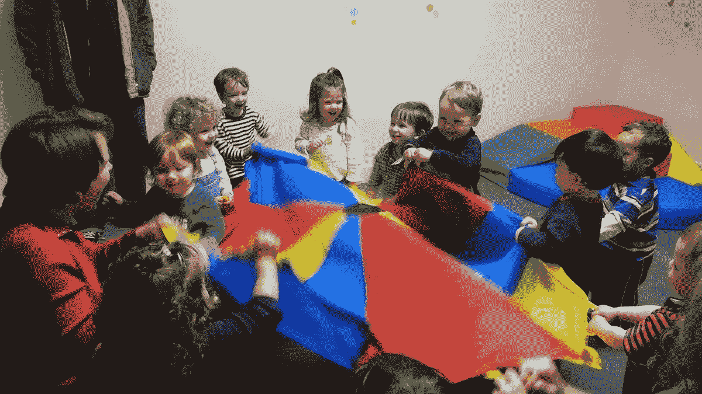
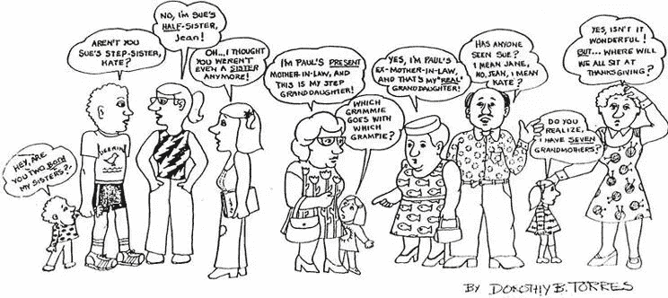
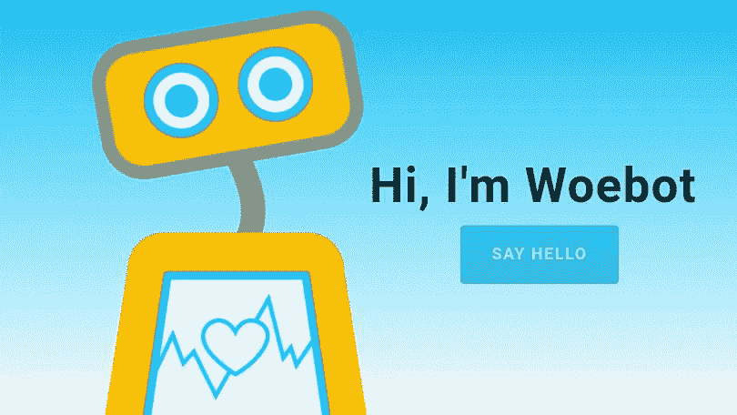

# 驱动千禧一代的心理因素。

> 原文：<https://medium.com/hackernoon/beyond-psychographics-the-psychological-factors-driving-millennials-2dd17119c58a>

在快节奏的技术和营销世界中，许多变量被用于通知创新和设计，以及识别潜在客户和目标市场。心理测量学是一个试图量化消费者活动、兴趣、观点(AIOs)、态度、价值观和行为等变量的研究领域。根据 Infusion.com 的说法，心理细分比了解顾客人口统计更重要。

> 心理细分有助于营销人员理解*为什么*——推动购买决策的目标、挑战、情感、价值观、习惯和爱好。

心理细分中缺失的一个重要变量是依恋动态的强大影响，或者用外行的话来说，我们与重要他人联系和保持联系的生理需求。

> 如果心理测量学是一种观察汽车外壳的方法，那么依恋理论就是一种观察汽车引擎部件的方法。

# 依恋理论

依恋理论试图解释在生命的前六年及以后与主要照顾者(通常是父母)的关系如何为未来的关系奠定模板，以及我们如何与世界联系。

更具体地说，由神经科学支持的依恋理论声称，在生命的前三年内，我们的深层大脑结构通过我们的主要依恋人物如何参与和回应我们对情感、刺激、安全、舒适和抚慰的言语前暗示而变得根深蒂固。

这一理论指出，在这些形成期，儿童需要关心、信任、稳定、可预测、情感上可接受和乐于接受的照顾者，以成长为健康的青少年和成年人。

如果有了这种理想的环境，我们就会发展出依恋理论家所说的安全依恋风格，通过这种风格，我们相信他人和自己能够以灵活性、韧性和情商应对生活的挑战。

在缺乏这种理想环境的情况下，我们会发展出一种不安全的依恋风格，这种风格会阻碍我们适应和形成有意义的、信任的关系的能力，并过度关注信任和自我怀疑的问题。

简而言之，我们与主要照顾者的关系为我们进化的思想提供了扎根的土壤，并为现实、身份、意义和价值提供了基础。根据地球的质量，我们要么兴旺，要么不兴旺，甚至在极端情况下死亡。通过不断扩大的人际关系网络，这个根系创造了文明。(更多关于依恋和心灵的内容，参见[心灵的连根拔起:AI 能否拯救我们](https://hackernoon.com/the-uprooting-of-mind-can-ai-save-us-b09bbc38e7c3))。

> **在过去的 30 年里，依恋和护理实践发生了重大变化。**

这些变化已经通过新技术及其使用得到反映。除了技术对解决现实世界的问题和满足相关的和人为的需求有用之外，为了使这些技术站稳脚跟，它们必须反映出采用这些技术的个人内部未被满足的需求。

# 机构日托

从历史上看，关系模板和结构是集中的和基于信任的，有工作的父母将他们的孩子交给信任的家庭成员或朋友照顾。然而今天我们有分散的依附结构，集中的养育被转移到分散的日托机构，一个月大的孩子被放在机构日托的匿名手中。

在这种分散式的看护经济中，匿名的日托提供者现在负责为我们的孩子提供初级护理。孩子们求助于多个非个人的、匿名的代理父母节点来满足他们的情感关系需求。

# 家庭结构的变化

此外，随着分居和离婚率的上升，中央核心家庭正在被分散的混合家庭网络所取代。混合家庭是分散的主要附件图形，其中更多的附件节点由继父母、继兄弟姐妹、继扩展家庭等创建。

混合家庭不太稳定，离婚率高于核心家庭，这为所有家庭成员之间的依恋波动和焦虑增加创造了环境。

这种焦虑的核心是新的家庭契约的模糊性，在这种契约中，关系信任(即，需要重新谈判超越家庭血缘关系的关系契约)是混合家庭不断发展的动力的核心。

# 同伴依附文化

儿童保育和家庭结构的这些重大变化给所有家庭成员带来了沉重负担，导致了更高程度的焦虑(本质上是扩散的恐惧、不信任和自我怀疑)，以及对更安全、稳定和可预测的关系结构的持续追求。在缺乏集中、稳定、信任和可预测的养育和照料关系的情况下，许多儿童会无意中向同龄人寻求指导和认可。

> 这创造了一种同伴依附的文化，在这种文化中，只有同伴才被认为是可靠和信任的盟友。

因为家庭和照顾者的分散结构未能为他们提供满足其依恋需求的最佳环境， ***新兴的以同伴为导向的文化成为这一代人的决定性关系模板。***

由此产生的心理后果是，一代缺乏安全感、焦虑的孩子会求助于其他缺乏安全感、焦虑的孩子，引导他们走过青春期和年轻成年期的迷宫。

这种以同伴为导向的趋势的基础是对中央集权的父母权威及其代理人的可靠性和可预测性的根本不信任，他们无法为父母提供他们需要的关系-情感环境。

> 以同伴为导向的关系的矛盾之处在于，尽管他们可能会感到紧张，但他们往往缺乏任何真正的亲密关系。

许多青少年和年轻人不愿意向他们的同龄人透露他们真正的弱点，即使他们声称这些同龄人是他们生活中最重要的人。

# 人工智能:越过真正的人类。

这种以同龄人为导向的文化的一个表现是焦虑地关注自己在社交媒体平台上的地位。亲密关系已经被肤浅的社交媒体互动所取代，害怕被真正了解和揭露是这种媒体的一个定义性特征。

> 由此产生的影响是，如今自尊就像天气模式一样不稳定，受无数不知名的朋友对一个人肤浅的个人活动的喜欢或不喜欢的支配。

难怪这一代人比前几代人更加抑郁、焦虑、孤独和无聊。然而，许多关于心理健康的研究表明，两到五个亲密的朋友以及家庭支持的重要性足以缓解人们经历的这种痛苦。

此外，脸书新机器人治疗师 Woebot 背后的开发者声称，青少年和年轻人更愿意与机器人分享他们的弱点，而不是真人。然而，这位新的机器人治疗师不受道德准则的约束[，你的私生活也不会对脸书完全保密。](https://www.wired.com/2017/06/facebook-messenger-woebot-chatbot-therapist/)

Woebot 的[治疗声明充其量只能说是微弱的](https://www.wired.com/2017/06/facebook-messenger-woebot-chatbot-therapist/)，就像在你的 X-Box 上玩 Fifa 2017 可能会让你更好地在你的 X-Box 上玩 Fifa 2017，但不一定会更好地在真实的球场上与真实的球员踢足球。那么，与机器人互动会让你更擅长与机器人互动，但不一定“更擅长”与其他人互动吗[(参见:人工智能心理治疗:我的理想治疗师？)](/@jacquesrlegault/ai-psychotherapy-my-ideal-therapist-eefd4217d9f3)。

## 注意力缺陷多动症

随着[大型制药公司](http://adhd-institute.com/assessment-diagnosis/diagnosis/dsm-5/)紧跟新的 DSM-V 诊断类别，ADHD 现在风靡一时，它基本上是不安全依恋类型的许多认知和注意力“T6”症状之一。这在一定程度上帮助我们理解应用程序和其他技术的吸引力，以及利用这种关系认知缺陷的媒体和营销策略。

## 颠覆性技术

此外，比特币和以太坊等新兴区块链技术的吸引力已经成熟，可以打消这一代人的顾虑。这些技术承诺建立一个不变的去中心化账本、不受中央权威机构监督或控制的点对点互动、分布式自治组织(DAO)、不可信的智能合约以及对个人隐私的控制。

## 政治派别

2016 年美国大选在一定程度上揭示了 75 岁的白人男性伯尼·桑德斯的竞选活动迎合了这一代 DPA 人的价值观、关注点和当务之急。

从融资到志愿服务，他的竞选结构是高度分散的。通过社交媒体平台动员支持，这些平台在很大程度上依赖于同行的可信度来动员地方行动，而不是由一个与中央权力结构有联系的无所不知的人物领导的中央组织。正如纽约州初选[出口民调](http://time.com/4301535/new-york-primary-sanders-clinton-millennials/)显示的那样:65%的 18-29 岁年轻人投票支持桑德斯，35%支持克林顿。

最后，作为一个物种，我们的大脑和基本需求在过去的三万年里没有太大的变化。但是在过去的三十年里发生了巨大变化的是我们可以用来相互联系的工具。这些工具也反映了我们不断发展的附件实践和关系模板。理解支撑这些变化的心理因素可以让我们更深入地了解如何最好地满足这一代人的需求。

因此，从依恋和心理健康的角度来看，负责任的创新、设计、营销和政策的挑战将是以培养更有意义的联系和亲密的人际交往的方式来满足这种去中心化的同伴依恋(DPA)一代的需求。

— — — — — — — — — — — — — — — — — — — — — — — — — — — — — — —

如果你和我一样对人类和技术，以及我们文明的未来充满热情，并想讨论这些想法，请留下评论并保持联系。我在推特上 [@jacquesrlegault](https://twitter.com/?lang=en)

*如果你喜欢这篇文章，欢迎鼓掌、分享和评论。*