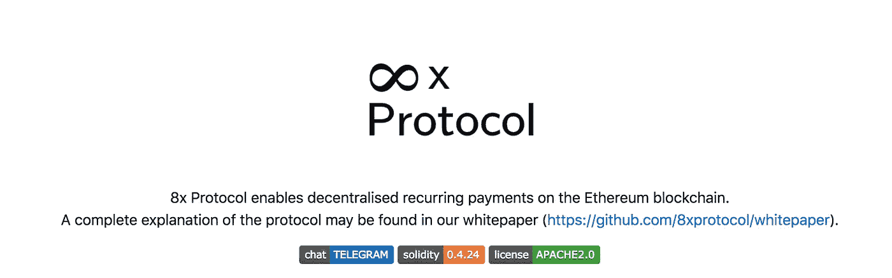
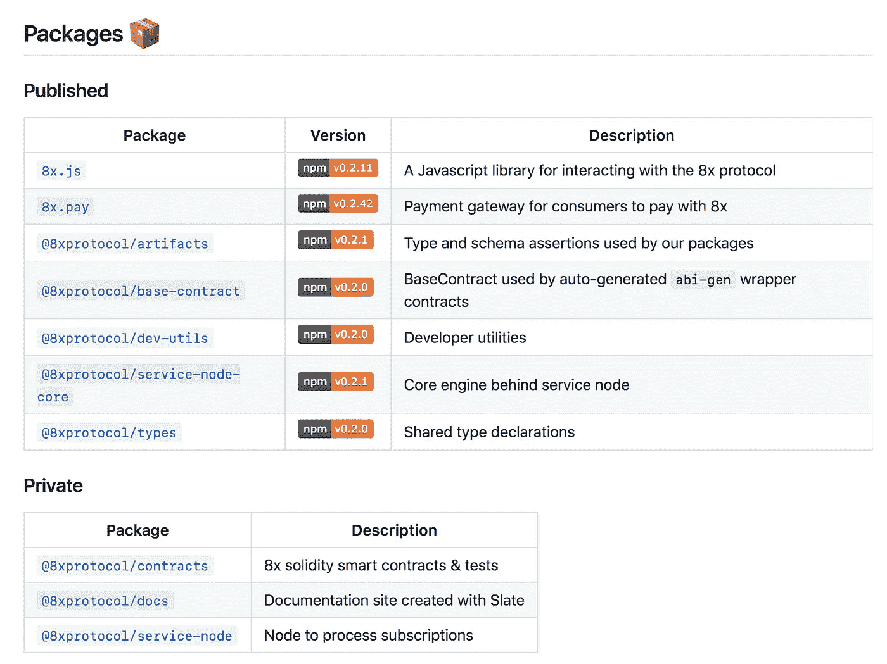

# 超越可靠性，第 1 部分:建立单一报告

> 原文：<https://medium.com/hackernoon/beyond-solidity-part-1-setting-up-the-monorepo-8db094ebbee5>

在为 8x 开发智能合约之后，我以为一切都结束了。那远非事实。随着时间的推移，对分散协议的要求逐渐增加，需要:

*   一个易于使用的 JS 库
*   最新的合同地址和 ABIs
*   文档(动态的，因为实际上是谁更新了静态文档)
*   开发者实用程序
*   dApp/widget 与底层协议交互
*   整合或包含您的 dApp/widget 的营销网站

这些要求或多或少都需要自己的回购。在你知道之前，你将会管理超过 7 个不同的回购协议，每个协议都有版本控制。突然，在一个包中做一个小的改变将需要在至少另外两个包中做一个`npm install`(最好的情况)。

那么这种疯狂的答案是什么呢？一个**单报告**。

我第一次看到 monorepo 的时候，感觉有点像这样:


一开始感觉有点违背直觉，为什么你会有一个包含所有回购的回购？微软、脸书和谷歌等许多大公司已经给出了答案，它们的整个代码库都有一个单一的回购协议。以下是其中的一些:

*   版本控制管理的简易性
*   通过引用它们的本地路径，以一些非常简洁的方式操作你的 repos
*   大规模重构变得容易(如果你搞砸了什么，你的整个代码库将立即崩溃)
*   整个组织代码库的可见性
*   避免团队间的非发明综合症

有些事情可能看起来有点抽象，但我保证你最终会明白的。


# 最底层的

*为了创建我们的 monorepo，我们将使用 Lerna:*[*https://github.com/lerna/lern*](https://github.com/lerna/lerna)

这是你在新文件夹中想要做的事情

1.创建一个新目录`mkdir monorepo && cd $_`

2.全球安装 lerna】

3.为您的新 monorepo 创建结构`lerna init`

4.使用`lerna import /path/to/your/contracts/repo`导入您现有的智能合约回购(这将保留您的提交历史，所以不用担心从零开始，年轻人)。

好了，在我们继续之前，你很快就会有一个看起来有点像这样的结构:

```
monorepo/
├── package.json
├── packages
│   └── contracts
│       └── package.json
│   └── another_one
│       └── package.json
│   └── another_one
│       └── package.json
```

本质上，这意味着您的所有依赖项都将相互关联，因此一个存储库中的更改会立即在其他存储库中显示出来，因为它们引用的是本地文件系统中的相同路径，而不是始终包含重复的代码。你需要做的就是运行`lerna bootstrap`一次。

但是你也可以开始做一些很酷的事情，比如:

`lerna run build`哪个将在每个回购**或**内运行`npm run build`

`lerna publish`这将把你所有的软件包升级到同一个版本(如果你要部署一套新的智能合约，这很有用)。如果你在你所有的 repos 中添加一个`prepublish`脚本，这个脚本将依次`clean`你的`dist`文件夹、`lint`你的代码库并生成你最终的`dist`文件夹，这将变得更好。

```
"scripts": {"clean": "rimraf -rf ./dist","lint": "tslint --project tsconfig.json -c tslint.json","build": "npm run clean && npm run lint && tsc,"prepublishOnly": "npm run build"}
```

# 自述文件

如果你要把所有的鸡蛋放在一个篮子里，确保那个篮子看起来很体面！

在`monorepo`文件夹的根目录下，创建一个名为`readme.mustache`的新文件

我知道，你在想为什么不是`readme.md`？我们稍后将回到这一点，但现在你可以这样炫耀你的回购:

```
<p align="center"></p> <p align="center">**insert-description-here**</p> <p align="center"> <a href="https://opensource.org/licenses/Apache-2.0">    
     
</a></p>
```

这会给你一些类似这样的东西(少了聊天和[坚固性](https://hackernoon.com/tagged/solidity)徽章，在我们将其转换为降价之后):



这是一个很好的开始，但是你的开发伙伴想要看到你的 monorepo 中的所有包以及它们各自的版本。让我们给我们的`readme.mustache`添加更多的代码:

```
## Packages### Published|   Package   |   Version   |   Description   |
-----------------------------------------------|**[`name`](/packages/path)** | **[](https://www.npmjs.com/package/name)** | a description |### Private|   Package   |   Description   |
---------------------------------
|**[`name`](/packages/path)** | a description |
```

如果你想知道，发布的包是你要用 npm 发布的包，以便在其他回购中使用。私有包是您不会导入到另一个项目中的包。示例包括智能合同、营销网站等。那么上面的净给我们带来了什么？**这个**:



现在，我们要添加的下一段代码是:

```
### Contracts (**insert network here**)
| Contract Name | Address |
| ------------- | ------- |{{#**network**.addresses}}
| {{name}} | {{address}} |
{{/**network**.addresses}} 
```

我们稍后将再次讨论这一点，但是现在您将想要插入您的项目当前所在的网络(kovan、main-net 等)。

# 暂时就这样吧！

现在，我们已经具备了创建实际协议的基础，并且拥有相关资源，任何访问者都可以(几乎)找到他们想要的东西。

请继续关注下一期教程，在那里我们将详细介绍如何生成 Typescript 工件，以及如何编写后续的 JS 库供其他开发人员使用。