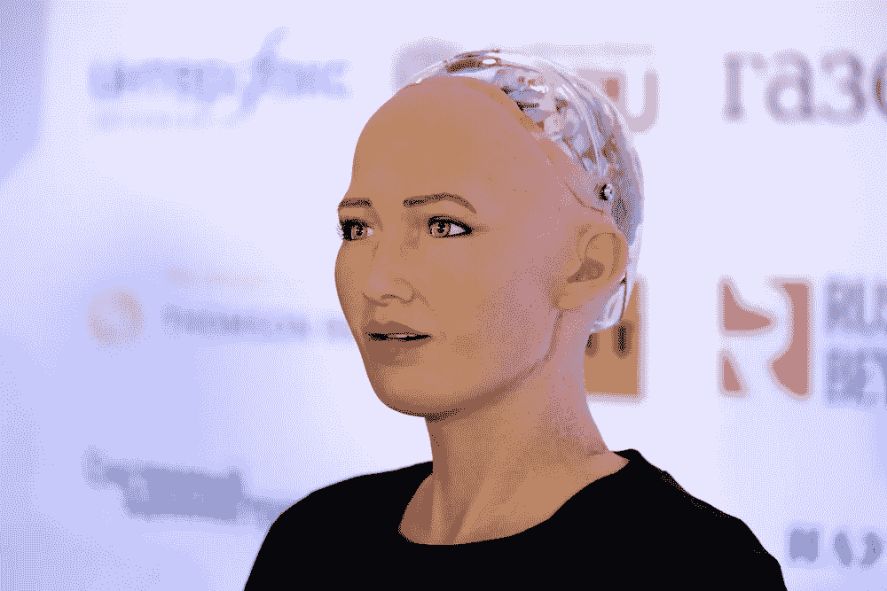

# 超越索菲亚:关于人工智能的 3 个误解，以及为什么是时候进化了

> 原文：<https://medium.com/hackernoon/beyond-sophia-3-misconceptions-about-ai-and-why-its-time-to-evolve-57b9a76dbace>

首先，有了电子鸡，一种在 20 世纪 90 年代末风靡全球的儿童电子宠物。接下来是机器宠物狗[艾博](https://us.aibo.com/)，以及被设计用来解读情感的半人形机器人佩珀。现在，[数字人形机器人](https://www.forbes.com/sites/paularmstrongtech/2018/10/27/ai-humanoid-sophia-is-granted-first-ever-robot-visa-speaks-with-president/#9a534891f398)索菲亚正在世界各地巡回演出。

所有这些都是说，我们已经以这样或那样的形式围绕人工智能(AI)很多年了。

即便如此，人们仍然普遍担心即将到来的恶意的人工智能革命的可能性。这很傻。在我最近的一次日本之旅中，我有机会与三个胡椒机器人互动。观察那些你认为不会对科技感兴趣的人的反应很有趣。这些人会突然变得兴奋起来，完全被迷住了。

我看着他们对人工智能的先入为主的恐惧实时粉碎。

事实是，人工智能改善人类做生意甚至参与民主的方式的潜力是无限的。然而，如果我们屈服于对技术的目的或迫在眉睫的危险的误解，我们将永远不会意识到它的潜力。

以下是我们必须解决的主要困惑点:

# **1。人工智能不仅仅是机器人。**

也许我们关于人工智能的最根深蒂固的观念可以归因于好莱坞。当我们想到机器人时，我们可能会想到*二百年人类*、*瓦力*或*机器人*。也就是说，我们想象机器人看起来像我们，拥有我们可以识别的人类特征——像索菲亚。

这也有舒适的一面。

> 与陌生的、没有人情味的机器相比，我们更容易接受与类似我们的东西互动。

但是 AI 不仅仅是人形机器人。而是它背后的技术，它的应用是无限的。今天，人工智能正在帮助科学家预测地震，打扫我们的房子，给汽车保险定价，帮助药物测试，等等。更普遍地说，人工智能可以提高效率和产量，腾出我们的时间来做其他事情。

# **2。人工智能不会夺走我们所有的工作。**

一次又一次，我听到人们担心人工智能会抢走他们的工作。

我理解——我们经常被令人沮丧的统计数字轰炸。例如，英国最近的一项调查[估计，自动化](https://www.theguardian.com/technology/2017/sep/19/robots-could-take-4m-private-sector-jobs-within-10-years)可能会在未来十年夺走 400 万份英国私营部门的工作。在美国， [47%的工作岗位](https://www.cnbc.com/2017/11/13/ex-google-china-president-a-i-to-obliterate-white-collar-jobs-first.html)被认为处于人工智能流失的“高风险”中。

虽然负面预测充斥着媒体，但也有很多理由充满希望。

人工智能阐明了人类的洞察力和专业知识对成功的重要性。这项技术确实擅长加速和自动化，但它不擅长人类擅长的事情——如移情、判断、一般生活经历和关系。许多人把智力和意识混为一谈。人工智能擅长解决问题，但不太擅长移情。

正是因为这个原因，人工智能不会剥夺或侵犯我们的人性。事实上，它将创造更多的机会。

随着机器和人工智能设备数量的增加，对它们周围工作的需求也将增加。人工智能在每个阶段都需要定期的人类干预才能保持运行——没有人类的持续关注，它就无法发挥作用。例如，总是需要编辑或熟练的作家来检查机器人的写作，就像总是需要人类来做出关于人事、招聘和项目管理的微妙决定一样。

我们不应该让恐惧控制我们，我们应该看到人工智能是什么 **—** 一个用我们的时间做更多事情并利用我们的技能完成新事情的机会。

# **3。人工智能落入坏人之手是危险的，但真正的问题是平台的责任。**

与任何创新一样，人工智能技术可以用于善或恶。

以 2016 年大选为例。坏演员用假新闻、政治宣传和充满政治意味的模因攻击弱势群体，最终促使他们投票反对他们的利益。他们利用机器学习技术做到了这一点。

> 但问题实际上从来都不是技术——而是不负责任地使用技术的人**以及** **和**平台所有者未能采取必要的预防措施来确保他们的平台不被滥用。

不说别的，假新闻现象说明技术进步的速度往往比人脑跟得上。现在，我们在玩追赶游戏。脸书和其他主要的社交媒体公司终于开始认真对待社交媒体的力量，并有员工专门负责控制不良行为者。

与此同时，加州最近出台了一项法律，要求聊天机器人公开他们不是人类——这是人工智能的首次立法。

最终，我们的不适并不真的与社交媒体或技术有关，而是与克服我们先入为主的观念和迎头赶上有关。

# 行业领导者不应该害怕人工智能，而应该关注技术背后的衡量标准。

根据以色列作家和历史学家尤瓦尔·诺亚·哈拉里的说法，人工智能的好坏取决于所使用的衡量标准。

人类控制着这些指标。

我们定义标准，然后让人工智能做出可能的最佳决定。鉴于我们的非理性情绪和偏见，人类经常做出可怕的决定。这就是人工智能可以介入的地方。它对世界的理解比我们更现实。

人类应该关心如何最好地控制这些指标，而不是对人工智能让我们变得过时的一些自由浮动的存在主义担忧。

哈拉里教授预计人工智能革命至少在 5-10 年内不会完全实现。与此同时，人类有机会将伦理道德构建到人工智能中。当机器能够处理更平凡的任务时，我们也可以建立更高级的技能，这将是更令人向往的。

科技的发展并非没有减速带，但净好处往往大于坏处。当你[把 AI 和人类智能](https://www.liftigniter.com/blog/leveraging-ai-to-boost-your-content-marketing-impact/)结合起来，结果是前所未有的有效性。人工智能使我们能够从重复的任务中退一步，释放自由，利用我们的创造力、经验和关系来创造新的机会，让我们的世界变得更美好。

我们必须克服我们对人工智能的误解、担忧和障碍，并将我们的精力转向建立行业最佳实践和指标，让人类处于控制之中。

否则就会落后。