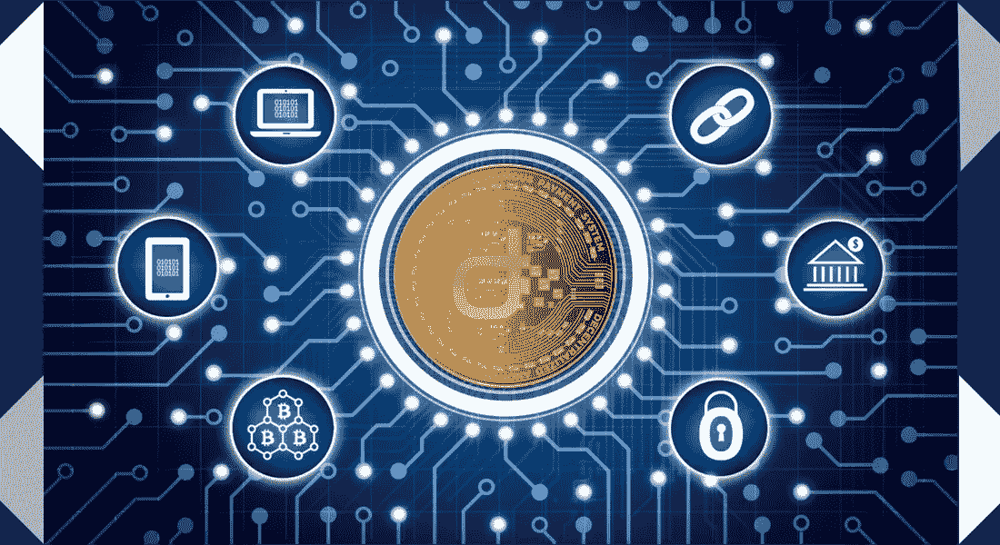

# 超越比特币革命:区块链技术将改变世界

> 原文：<https://medium.com/hackernoon/beyond-the-bitcoin-revolution-blockchain-technology-will-change-the-world-b188eaabf67e>

技术来来去去，但有些技术会一直存在并改变世界。使互联网成为可能的通信协议就是这样一种变革性技术，但另一种技术即将出现。

到目前为止，你可能已经听说过加密货币——比特币价格的快速上涨产生了数百万新投资者和数百万狂热的观察者。另一方面，即使是许多比特币爱好者也并不真正熟悉区块链，这种使加密货币成为可能的变革性技术。

不管比特币、以太坊之类的东西会发生什么，区块链技术已经在改变世界。以下是区块链科技将会让世界变得更好的一些方式。

**更好更稳定的互联网**

商业互联网的发展已经远远超出了其创造者的范围。最初是政府和军方官员跨越巨大差异进行安全沟通的方式，现在已经以无数方式改变了世界，但这场革命并非没有问题。

在未来，区块链技术可能会第二次改变商业互联网，将其提升到一个全新的水平，并为世界各地的用户提供更高的速度和稳定性。通过使用去中心化和利用区块链的力量，未来的因特网工程师可以更有效地分配万维网的各种功能。这不仅能提高速度和效率，还能增强抵御黑客和其他不良分子的能力。

**更高效的市场**

区块链技术推动了加密货币市场——每个拥有比特币账户或以太坊钱包的人都已经知道这一点。但许多人不知道的是，这种新兴技术也拥有彻底改变更广泛市场的力量。

从交易所交易基金和共同基金到个人股票和债券，交易员们已经在考虑利用区块链为他们的市场提供动力，提高市场效率。在未来，传统的交易模式，即使用集中的清算所，可能会让位于分散的区块链模式，从而为专业人士和个人交易者带来更快、更安全、更高效的交易。

**更简单的合同**

众所周知，法律合同非常复杂，难以理解。即使是最简单的商业协议，也可能需要一大群律师花上几个小时来阅读和审查，而且所有这些工作都要花钱。

未来，合同可能会更简单，也更容易执行。区块链开放透明的世界赋予了它创造和执行智能合同的能力。这些智能合同已经在一些地区使用，随着这些协议证明其价值，它们的使用只会增加。

**更安全的云存储**

云存储帐户现在到处都是，但它们仍然有其局限性。已经有一些高调的云存储账户被黑，从令人尴尬的名人照片到私密的个人信息都被公布。

这种缺乏安全性的情况让许多用户对在云中存储他们的敏感文件保持警惕，但区块链技术可以让这些存储网站更加安全，保护他们免受最复杂的黑客攻击。区块链模式的云存储本质上是分散的，它不依赖于易受黑客攻击的集中式存储站点，为每个相关人员提供了增强的安全性。

**安全信息**

消息应用程序如今风靡一时，但如果这些消息落入坏人之手，可能会造成毁灭性的后果。从名人到首席执行官，许多男人和女人都因为公开发表自己的私人观点而感到沮丧，但区块链科技有望让沟通变得更加安全。

一些点对点通讯应用已经开始利用区块链技术，允许个人安全地分享信息。如果没有一个中央存储库被黑客攻击或破坏，这些分散的消息应用程序应该更加安全，给用户额外的信心，使他们的通信更加隐私。

近年来加密货币市场火热，比特币百万富翁的故事比比皆是。鉴于加密货币受到的压力，很容易认为这些虚拟货币就是整个故事，但事实远非如此。最终，区块链技术才是真正的故事，区块链将继续存在——不管比特币、莱特币、以太坊和其他虚拟支付形式会发生什么。

**关于作者:**

公关专家和顾问，Adel de Meyer 与区块链企业合作，专注于游戏、分散市场、隐私和收藏品。