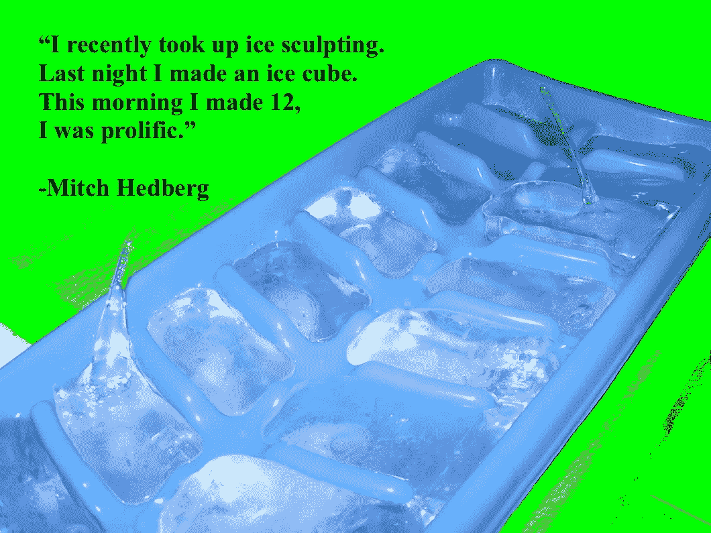

# 超越艾斯·库伯托盘

> 原文：<https://medium.com/hackernoon/beyond-the-ice-cube-tray-eac1cb9fa416>

# 来自[黑客正午](http://hackernoon.com)宇宙的问候。以下是本周最热门的科技故事。

深刻的思想，戏剧和可操作的密码和软件开发技巧。

# 深入的开发者思考

[**计算机科学:社区的期望 VS 现实**](https://hackernoon.com/computer-science-expectation-of-community-vs-reality-f11e7a3ae47e) 作者[皮尤什·巴德库尔](https://medium.com/u/5e4b05a498cd?source=post_page-----eac1cb9fa416--------------------------------)

[**如何讲述自己的故事:炒作卷轴**](https://hackernoon.com/how-to-tell-your-own-story-hype-reels-f070704f2fe7) 作者[梅格·亚当斯](https://medium.com/u/82e0ca534818?source=post_page-----eac1cb9fa416--------------------------------)

[**以防万一与及时学习**](https://hackernoon.com/just-in-case-vs-just-in-time-learning-c87f61d24360) 作者[奥斯曼·艾哈迈德·奥斯曼](https://medium.com/u/779ff253725e?source=post_page-----eac1cb9fa416--------------------------------)

[**我见过的产品/工程过程中最常见的问题**](https://hackernoon.com/the-most-common-problem-ive-seen-in-product-engineering-process-debd821a423f) 作者[陈莉莉](https://medium.com/u/b1190b9d7fa0?source=post_page-----eac1cb9fa416--------------------------------)

# 深藏的思想

[**加密护城河**](https://hackernoon.com/crypto-moats-dc14f453e22a) 作者[罗伯特·米勒](https://medium.com/u/d447585773df?source=post_page-----eac1cb9fa416--------------------------------)

[**数字资产所有权:为什么重要&区块链将如何拯救世界**](https://hackernoon.com/digital-asset-ownership-why-it-matters-how-blockchain-will-save-the-day-79847e7d554a) 作者[卢克·拉帕拉](https://medium.com/u/3e7c1d423a97?source=post_page-----eac1cb9fa416--------------------------------)

[**脸书的(假想)加密策略**](https://hackernoon.com/facebooks-hypothetical-crypto-strategy-3fa6ec61fab2) 作者[莫妮卡·德赛](https://medium.com/u/50afecf1b0e?source=post_page-----eac1cb9fa416--------------------------------)

[**为什么比特币的价格无关紧要**](https://hackernoon.com/why-the-price-of-bitcoin-doesnt-matter-155e8400557b)**by[beauty on](https://medium.com/u/e6958b5742d2?source=post_page-----eac1cb9fa416--------------------------------)**

# **秘密戏剧**

**克雷格·赖特是否犯了伪证罪？克雷曼案新信息 作者[彼得·麦科马克](https://medium.com/u/79b96a130697?source=post_page-----eac1cb9fa416--------------------------------)**

# **开发者戏剧**

**[**为什么开发者不应该使用 MacBook Pro**](https://hackernoon.com/why-developers-should-not-use-macbook-pro-3b6a4aeeee64) 作者: [Charlee Li](https://medium.com/u/e36ca8291af4?source=post_page-----eac1cb9fa416--------------------------------)**

# **可行的开发人员技巧**

**[**使用 Kotlin**](https://hackernoon.com/build-a-realtime-map-using-kotlin-8f99ebd15fc) 由 [Neo Ighodaro](https://medium.com/u/c95f1478f80d?source=post_page-----eac1cb9fa416--------------------------------) 创建实时地图**

**[**如何用柏林噪音让群山难忘**](https://hackernoon.com/how-to-make-mountains-memorable-with-perlin-noise-76f93da23601) 作者[约翰·大卫·马丁](https://medium.com/u/5e67925049bd?source=post_page-----eac1cb9fa416--------------------------------)**

**[**编写复合组件的 3 个简单步骤**](https://hackernoon.com/3-easy-steps-to-writing-compound-components-5d4647b7bb7)**by[Steven Natera](https://medium.com/u/d101daba9985?source=post_page-----eac1cb9fa416--------------------------------)****

****[**React 16.0–16.3 每天使用的新功能**](https://hackernoon.com/react-16-0-16-3-new-features-for-every-day-use-f397da374acf) 作者 [Artem Sapegin](https://medium.com/u/b031a508ddaf?source=post_page-----eac1cb9fa416--------------------------------)****

# ****可操作的加密提示****

****[**由**](https://hackernoon.com/a-huge-list-of-crypto-influencers-to-follow-on-youtube-813f4590da2b) **[Crowdcreate](https://medium.com/u/9cff8aabdce7?source=post_page-----eac1cb9fa416--------------------------------) 在 Youtube** 上关注的一大串秘密影响者****

****[**投资 VS 交易加密货币**](https://hackernoon.com/investing-vs-trading-in-cryptocurrencies-4cb4d64ed9bf) 作者:[汉瑟](https://medium.com/u/eb7e0c1e8e89?source=post_page-----eac1cb9fa416--------------------------------)****

****[**投资组合多样性:技术分析**](https://hackernoon.com/portfolio-diversity-a-technical-analysis-c2c49f4d3a77)**by[ShrimpyApp](https://medium.com/u/df23e4200890?source=post_page-----eac1cb9fa416--------------------------------)******

******[**交易:赚取收入还是积累财富？**](https://hackernoon.com/trading-earning-an-income-or-building-wealth-25578c7f56de) 由[和](https://medium.com/u/426e435e6332?source=post_page-----eac1cb9fa416--------------------------------)组成******

****直到下一次，不要把世界的现实想当然。****

****亲切的问候，****

****[大卫·斯穆克](http://www.davidsmooke.net/)，[阿米网络](http://ami.network)****