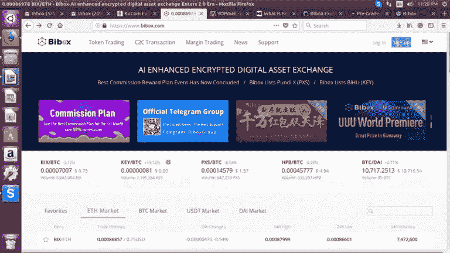

# Bibox Exchange —初学者指南

> 原文：<https://medium.com/hackernoon/bibox-exchange-beginners-guide-afae4cb44077>

Bibox exchange 由中国区块链巨头的顶级团队创建，该团队由早期的比特币爱好者组成；业内知名企业家、风险投资家(VC)、专业证券交易员、人工智能专家和高科技天使投资人。

# Bibox 有什么特别之处？

[Bibox](https://cryptopotato.com/pl/bibox) 与 ETH、、、戴配对。这是一个完全人工智能增强的加密数字资产交易所。在这里，您将获得与 EtherDelta 分散式交易所相同的点对点交易选项。主要目标是提供交易的定量计算和分析。还有一个计划是在不久的将来将法定货币纳入交换。

目前还不清楚该公司如何融入人工智能。他们仍然没有公开他们平台的内部运作。当你将 Bibox 的核心功能与其他交易所进行比较时，它看起来与大多数集中式交易所非常相似。

如何在 Bibox 交易所注册并开始交易？

# 第一步:去 Bibox 的网站

[点击此处](https://cryptopotato.com/pl/bibox)进入 Bibox，链接将在一个新窗口中打开，因此您仍然可以按照该指南进行操作。

您需要将此页面加入书签，因为有各种各样的钓鱼网站，它们与这个真实的网站非常相似。您必须仔细检查网站的 URL，并检查用于认证原始站点的安全证书。

# 步骤 2:完成注册过程

Bibox 的账户注册是一个非常简单的任务。您必须输入您的电子邮件地址和 8 到 20 个字符的强密码，其中包含一个数字和一个特殊字符。当您提交并通过身份验证后，您将收到一封帐户确认电子邮件，发送到您输入的电子邮件地址。该链接存在于电子邮件本身中。

从那里，您可以登录到您的 Bibox 帐户。

# 步骤 3:启用双因素身份验证(2FA)

有三种类型的身份验证可用:

*   短信认证
*   谷歌认证 2FA
*   资金密码

建议您在启动和使用您的帐户之前，启用所有选项，以便为您的帐户添加推荐的安全级别。

为此，您必须查看账户信息，它位于您的电子邮件 id 下方的左上角。在那里你会找到所有的认证选项。在进行谷歌身份验证之前，你必须下载谷歌身份验证应用程序，它位于移动设备应用商店或 Google Play 上。添加密钥，然后扫描二维码。在这之前，把你的秘密密钥写在一张纸上(外部备份——以防你失去对手机的访问)。然后你会看到一个 1 分钟 6 位数的换码，从现在开始每次登录都需要插入。

当您完成安全过程后，这就是您的帐户的基本设置，现在您可以存款了。

# 第四步:存款

Bibox 网站有一个干净和现代的布局。当您点击左上角的资金时，您将能够看到所有可用于交易的硬币。这些硬币从最受欢迎的到罕见的都有。

当您选择交易硬币时，您将被重定向到交易屏幕，在这里您可以看到硬币的图表和订单簿。

当你第一次来到这个屏幕时，你必须给出谷歌验证码。然后你就可以交易了。这看起来很烦人，但对网站的安全性很重要。

# 第五步:如何在 Bibox 上交易？

从右上方的菜单中选择“Token Trading ”,然后从表格中选择所需的货币对。

例如，如果我们想用 Bibox 硬币交易以太坊，我们首先在市场上选择一对。

交易显示:在您的右侧窗格中，您将看到特定市场的最后交易。然后在左侧窗格中，有一个订单簿，其中的图表上显示了买入和卖出。中间是价格图，后面是交易量。

我们所有的有效订单也显示在屏幕上。在这个例子中，我们用 Bibox coin (BIX)交换以太坊(ETH)。在这种情况下，设置您想要的价格，并选择以 BIX 为单位的金额。总 BTC 或成本将自动计算，然后显示在“体积”旁边。销售是一样的，但过程相反。别忘了交易费，也有显示。

[点击此处](https://cryptopotato.com/pl/bibox)进入 Bibox，链接将在一个新窗口中打开，因此您仍然可以遵循该指南。

*原载于 2018 年 3 月 7 日*[*【cryptopotato.com*](https://cryptopotato.com/bibox-exchange-beginners-guide/)*。*