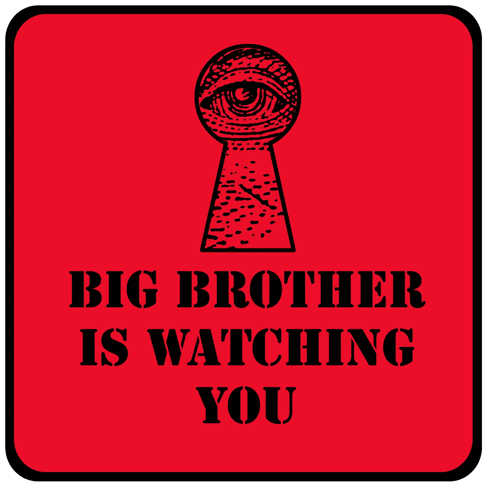
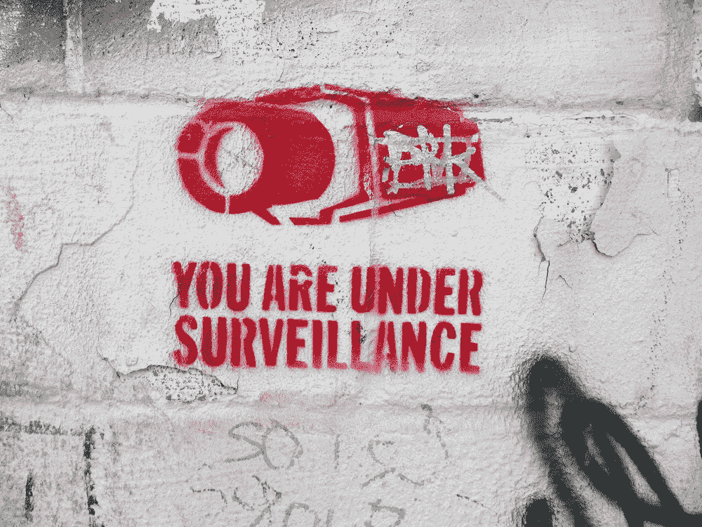
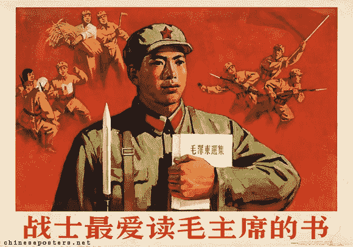
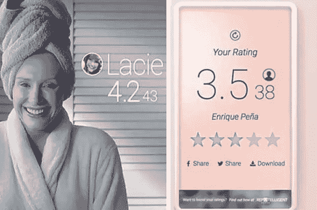
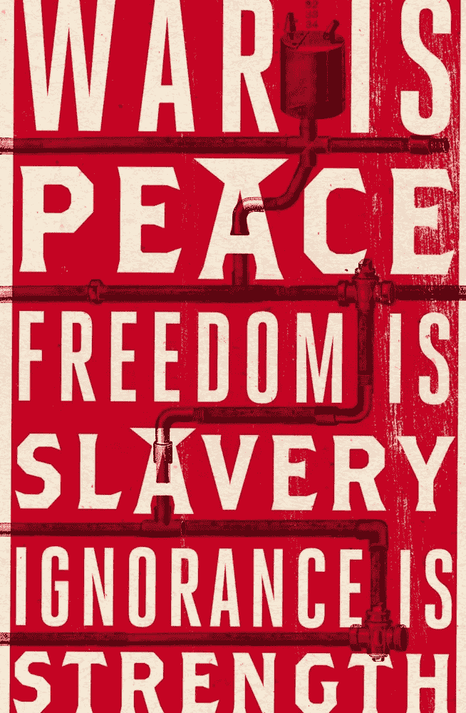
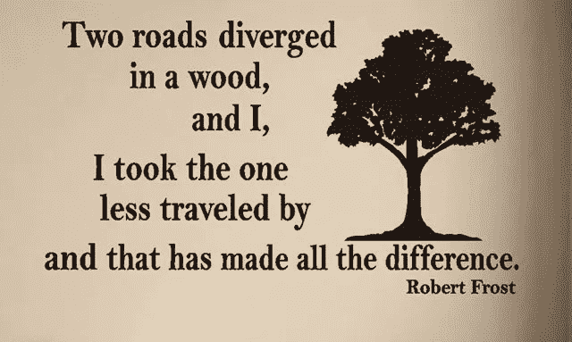

# 大哥在中央王国遇到黑镜

> 原文：<https://medium.com/hackernoon/big-brother-meets-black-mirror-in-the-middle-kingdom-3febe4574467>

想象一个世界，你做的或说的每一件事都被无形的眼睛观察和评价。

*   你和谁说话？
*   为什么？
*   你买了什么？
*   你刷牙吗？
*   你忘记用牙线了吗？
*   你看太多电视或玩太多电子游戏或打太多电话吗？
*   你有枪吗？
*   你回收吗？
*   你的政治观点与当权者一致吗？
*   你按时交水费或税了吗？

[The Scarlet Letter](https://creativeaction.network/products/the-scarlet-letter-by-mrfurious) the follows you forever you go.

现在想象一下，如果你做过的所有错事都像一个大红的斯佳丽字母一样跟着你。

无论事情有多糟糕，你都无法逃脱。当你在 30 多岁和 40 多岁时试图找工作或进入安全旅行名单时，它会永远困扰着你。

你在高中吸过毒吗？你十三岁的时候在商店偷东西？在酒吧打架？喷漆墙面？

如果你在社交媒体上说的一切都被监控、收集、整理和评级，会怎么样？实际上，这一点也不难想象。从[到你的即时消息](https://arstechnica.com/information-technology/2018/03/facebook-scraped-call-text-message-data-for-years-from-android-phones/)，再到你搜索和说的内容，一切都是如此。你在网上做的每一件事都会被强力软件代理人记录下来，耐心地对每一个数字点进行分类。最新的[脸书和剑桥分析公司丑闻](http://time.com/5216291/facebook-cambridge-analytica-companies-advertising/)只是一长串数据滥用中的一个。

你可能认为你是脸书的客户，但你不是，广告商是脸书的客户。

你就是产品。

那是因为互联网的业务是监视。

**我们的社交媒体平台实际上只不过是秘密监视平台。**

在互联网的早期，每个人都推出免费服务，但最终这些公司不得不继续运营。因此，他们将数据挖掘作为保持业务的关键。他们监控我们的关系网，我们喜欢什么，不喜欢什么，并以此来投放广告。

但是如果这些信息不仅仅是为了提供广告，而是被用于更邪恶的事情呢？

**如果政府给你一个分数，规定了你一生中能做什么，不能做什么，会怎么样？**

想买房还是买车？抱歉。你没有资格。不是因为你的经济状况，而是因为你曾经说过政府的坏话。需要公共汽车票吗？你不能登机，因为你被禁止公开反对一些不公正的政策。哦，你也不能坐火车或飞机，因为你 15 岁的时候曾经在一个聊天论坛上说过话。

你的分数不止于此。

如果你甚至不能约会或结婚，因为这个分数让你成为一个社会弃儿？

现在想象一下，你在一场可怕的车祸中，医院不愿意治疗你。

想象一下你的孩子因为这三个小数字急剧下降而被一所好学校开除。

这不是什么科幻幻想。这是真的，现在正在中国推广。

**它被称为社会信用体系(SCS ),如果它听起来像一个反乌托邦科幻噩梦，那是因为它是一个反乌托邦科幻噩梦。**

Resolutely resolve to carry forth propaganda!

# **奥威尔和毛走进一家酒吧**

这一切都始于 2014 年，当时中国国务院发布了一份文件，这份文件是从黑镜剧集《社会信用体系建设规划纲要》(T8)中摘录的。

像所有的社会主义国家文件一样，阅读起来非常枯燥，并且荒谬地覆盖了可以追溯到共产党宣传时代的顶级语言，如“弘扬中华民族积极向上、诚实守信的传统文化”和“充分发挥电视、广播、报纸和互联网的宣传和引导作用。”

“真诚”一词在文件中出现了数百次，有时出现在同一个句子中:

> “弘扬以社会成员为对象、以诚信宣传为手段、以诚信教育为载体的诚信文化，弘扬中华民族积极向上、诚信守信的传统文化和现代市场经济的契约精神，形成崇尚诚信、践行诚信的社会道德。”

快速阅读它，你可能会被愚弄而认为这个系统是个好东西。毕竟，真诚是一个强大社会的基础。谁不想生活在一个每个人都信守诺言的地方呢？

但是就像生活中的所有事物一样，一个系统的好坏取决于它的创造者。

创造者们是如何定义“真诚”这个词的，这让一切变得不同。对你我来说，真诚可能意味着用爱和尊重对待你的兄弟姐妹，在你父母年老生病时照顾他们。

**对一个极权主义政权来说，真诚完全意味着别的东西:**

**服从国家意志。**

宣传的本质是用好话为邪恶服务。它用词并扭曲它们，使它们的意思与它们应该表达的意思完全相反。就像一个连环杀手在黑夜中用奉承来引诱你上他的车一样，宣传是为了掩盖宣传者的真实意图。

从表面上看，这个系统只不过是一个信用评分，类似于美国生活中无处不在的信用评分。但是当你看得更深时，就会越来越明显地发现这与事实相差甚远。

该系统仍处于早期阶段，但进展迅速。它正在和八家大公司一起进行试点项目。支持社交操纵平台的两家最大的公司是腾讯和蚂蚁金融服务集团，腾讯是微信的制造商，微信是世界上最大和最广泛使用的应用程序，拥有超过 8 亿用户，蚂蚁金融服务集团是中国的易贝。蚂蚁拥有支付宝(AliPay)，这是一个集中的数字支付系统，人们可以用它来做任何事情，从点餐到打车，再到在线购买各种东西，而不仅仅是阿里巴巴易贝风格的商品。支付宝推出了名为[芝麻信用](https://www.cnbc.com/2017/03/16/china-social-credit-system-ant-financials-sesame-credit-and-others-give-scores-that-go-beyond-fico.html)的社交系统的第一个分支之一，可以跟踪你的财务生活。

但这远远超出了你是否按时支付账单或债务过多的问题。

该系统已经跟踪了你所有的购物习惯，并通过黑盒算法根据这些购物习惯来判断你是什么样的人。换句话说，你的购物习惯会成为你的性格。

买尿布？这意味着你可能是一个好母亲，值得信赖。除非你是 17 岁的未婚单身母亲，这意味着你更有可能是机器的社会毒瘤。玩太多电子游戏，你会被认为是一个懒惰的吃白食的人，而不仅仅是一个暑假里的孩子。

正如雷切尔·博茨曼在一篇关于该系统的广泛报道中所写的:

> "阿里巴巴承认，它根据人们购买的产品类型来判断他们. "例如，一天打 10 个小时游戏的人会被认为是一个无所事事的人，”芝麻的技术总监李应云说。

这个系统已经将越来越多的数据拖入了它的独裁漩涡。

其他监控和大数据领域的大师也加入了这个团队，比如中国最大的在线数据服务公司 [Bahie](https://en.wikipedia.org/wiki/Baihe.com) 和中国版的优步[滴滴出行](https://en.wikipedia.org/wiki/Didi_Chuxing)。

[Black Mirror](https://amzn.to/2HoOpZe)’s Nosedive

如果你密切关注，这使系统能够访问聊天应用程序、约会应用程序、旅行应用程序、电子商务和社交媒体。

**换句话说，它告诉他们你和谁说话，你对他们说什么，你买什么，你去哪里，你和谁是朋友，你在和谁约会。**

**简而言之，一切让你，你。**

该系统从四个方面对公民进行评分。前三个足够无辜，至少原则上，信用记录，合法，个人识别信息的准确性。第四类非常可怕。它追踪社会行为、偏好和信仰。

这个系统中最阴险的部分利用你的人际关系网来诱捕你，就像黑寡妇诱捕苍蝇一样。如果你的朋友和家人的分数下降，你的分数也会下降。如果你和他们解除好友关系或者停止和他们一起聊天，你的分数会提高。

你说的话也会伤害你。想投诉北京污染的[肺碎云导致婴儿](https://www.youtube.com/watch?v=V5bHb3ljjbc) [*生肿瘤*](https://www.youtube.com/watch?v=V5bHb3ljjbc) ？最好三思，因为它会粉碎你的分数。也许你想谈谈那个政府官员，他把你的小镇变成了一个电子垃圾垃圾场，或者强行卖掉了国家宝贵的土地来建造高尔夫球场？你的分数下降了，因为你公布了黑暗的真相。

但是继续发推文[假的经济统计数据](https://www.reuters.com/article/us-china-economy-data/another-chinese-city-admits-fake-economic-data-idUSKBN1F60I1)说经济繁荣多么美好，你的分数就会上升。反刍党的喉舌《中国日报》的文章，看你的分数坚决提高社会主义！不追随反动派和社会离经叛道者，它又会上升！

**当谎言等同于真理时，社会就会崩溃。**

令人惊讶的是，这个体系在中国有它的辩护者，他们自豪地展示他们的高分，并憎恨爱管闲事的西方人指出反乌托邦体系的黑暗潜流。他们发誓这只是一个简单的信用评级系统，就像美国的信用系统一样。他们也很快指出这是一个私人系统，而不是政府系统。

即使是最粗略和最基本的谷歌搜索，这些谎言也无一幸免。

虽然这个系统在这一点上确实主要是私人的，但这是因为政府希望用其最强大的数字公司的庞大 it 部门来测试这个系统。但是不要搞错了，这是政府授权的倡议。腾讯并不是自己想出这个主意的。国务院是中国的官方行政机构，他们发布文件，概述了他们希望从私人合作伙伴那里得到什么。

第二个谎言是，这只是一个信用体系。一个追踪你的朋友是谁，以及你是否通过“人口和生育控制”来支持[独生子女政策](https://en.wikipedia.org/wiki/One-child_policy)的系统不仅仅是追踪你是否按时支付账单。

中国有句谚语叫“天高皇帝远”，意思是政府的监视并不像每个人担心的那样远，如果你保持低调，你就可以不被发现。与普遍看法相反，中国一直是一个高度分散的地方。在日常事务上，地方领导人总是比中央政府拥有更大的权力。这几乎就像南方赢得了美国内战，建立了一个更弱的中央政府，拥有更强的州权力。这就是中国一直以来的运作方式，可以追溯到军阀时代，在那之前的皇帝时代。

不再是了。

[Chinese propaganda poster](https://chineseposters.net/index.php).

社会信用体系把皇帝装进你的口袋。

更糟糕的是，该系统使用一个黑暗的激励网络来奖励和惩罚那些不惜一切代价追随党的路线的人。

换句话说，中国政权只是想出了如何将威权主义游戏化。

现在这个系统是可选的。这是可选的，就像脸书为广告收集你的所有数据是可选的一样，无论发生什么都是可选的。

到 2020 年，它将成为完全强制性的。

这意味着，如果你在中国生活或工作，无论你喜欢与否，你都会得到评价。

而这就是黑镜成为现实生活的时候。

# **看不见的圆形监狱**

是时候面对一个严酷的事实了。

我们用乌托邦梦想创造的技术让我们失望了。他们越来越多地被大公司和政府劫持来奴役我们所有人。

乌托邦意味着“没有地方”是有原因的

乌托邦不存在，也永远不会存在。任何着手建立乌托邦的人最终都会失败，不管是虚拟的还是现实的。

我们开始创造技术来解放我们。相反，我们到处都在建造隐形的圆形监狱。

现在，社会信用体系、间谍机构的秘密数据收集、大公司对我们个人和私人生活越来越多的滥用已经成为常态。而且会越来越差，直到人们划清界限。

也不只是中国。如果你生活在一个表面上民主的社会，你可能会自鸣得意地看着对岸，认为“这不可能发生在这里”，但这已经发生了，间谍机构和大公司通过我们留下的数字痕迹跟踪我们的整个生活。很少有中央大国能够抵制收集越来越多人民信息的冲动。

数据是新的石油和新的黄金。

无论政府和企业公开还是秘密收集我们的数据，结果都是一样的，一个巨大的数字控制数据库。

在美国，我们没有一个公开的分数来让人们遵循政治路线，但有时我们所拥有的分数的隐形力量在塑造行为的方式上同样阴险。

你知道吗，你的美国信用评分实际上是在惩罚你欠了*更少的*债务？没错。

当我长大了，并在多年后设法摆脱信用卡债务时，我决定我再也不想要任何债务，所以我没有自己的房子或每隔几年买一辆新车。我会一直开着我的车直到门掉下来。起初，随着我削减赤字开支，我的分数不断攀升。但是后来，当我在这个世界上闯出一片天地，并且永远摆脱了债务之后，我注意到了一些奇怪的事情。我的分数持平或略有下降。当我深入调查时，我发现我因为*没有*有抵押贷款和*没有*携带足够的信用卡余额而受到惩罚。

换句话说，我因为没有更多债务而受到惩罚。

这有多变态？

这些分数就是这样操纵我们的。

他们用丑陋的方式将行为游戏化。他们推动你去做分数希望你做的事，而不是你想做的事。分数想要的不是对你好而是对创造分数的人好。

这就是为什么中国的体制如此阴险。它带来的不仅仅是债务。它将对国家的顺从游戏化，并促使人们接受谎言。

随着时间的推移，谎言会让人疲惫不堪。在战争中被困在酷刑监狱的士兵经常以斯德哥尔摩综合症告终。他们开始相信并喜欢捕获他们的人的虐待。

起初，人们可能只是转发虚假的经济统计数据来玩这个系统，但随着时间的推移，慢慢地，肯定地，巧妙地，他们会相信这些谎言。他们会全心全意地相信经济正在蓬勃发展，而外来者正试图搞垮他们。

他们会一直相信他们，直到经济崩溃，他们失业，这将是一个完全的惊喜，因为他们完全完全地相信了谎言。

这就是为什么在 1984 年底，温斯顿不只是在老大哥无情的冲击下崩溃。老大哥最终感染了他的思想，所以他背叛了他唯一爱过的女人，更糟糕的是，他背叛了他的本性。

**书的最后一行是“** [**他爱老大哥。**](https://amzn.to/2GfHcXy)

# **树林中分出两条路**

**我们正处于历史的十字路口。**

****

**数字技术改变了一切，从旅行到教育，再到通信。它将知识民主化，将地球上最远的地方连接成一个地球村。在很多方面，它让我们的生活变得更加丰富，但有一股我们从未预料到的黑暗潜流，一场魔鬼的交易在起作用。**

**现在，让我们变得更加智能、更加互联的同一项技术正在与我们作对。我们以为我们已经建立了一个不可阻挡的自由表达和自由交流的系统，但相反，我们秘密地建立了数字链来束缚我们所有人。**

**不一定非要那样。**

**现在还有时间补救。**

**但这取决于每个人。我们每个人都必须醒来，看到即将到来的风暴，并认识到一旦最邪恶的人以数字方式控制了我们的整个生活，没有可怕的可能性就没有回头路可走。**

**生活中的任何东西都可以善用，也可以恶用。数字系统也不例外。是意图塑造了这些系统。**

**错误的意图，错误的系统。毒树，毒果。**

****

**人们认为法律和规则普遍都是好的，但它们只有在当权者创造它们的时候才是好的。如果有可能建立一个客观的系统，一个可以准确评估人们的可信度和真实性的系统可能是一件好事。但是人类不做客观。我们有偏见、贪婪和错觉。**

**永远不要忘记，纳粹所做的一切都是合法的，因为他们使压迫和种族灭绝合法化。在邪恶的人手中，技术变得邪恶。**

**这就是为什么唯一好的系统是一个不可知论者的系统，用制衡来粉碎任何试图抓住它来实现自己黑暗计划的团体。这就是我支持分散化系统的原因，这样就没有任何一种力量可以把他们扭曲的意识形态强行灌输给每个人。即使一个系统是由地球上最开明的男人和女人建立的，最终也会有一个有着完全不同欲望的人掌权。他们会想方设法利用任何设计不良的系统的弱点来为自己谋利。**

**只有几种解决方案:**

**我们必须设计分散的系统，首先不要给他们数据。如果没有数据，就没有可以利用的东西，没有可以破坏和滥用的东西。**

****第二个目标是建立一个我们拥有完全主权的数据系统。如果人们想要它，他们必须来找我们。我们必须建立制衡制度，让** [**永远锁定**](/@cdixon/why-decentralization-matters-5e3f79f7638e) **。****

**这是任何强大系统最本质的特征。它必须不惜一切代价，在任何情况下抵制任何一个集团接管该系统的权力。**

**历史是开放与封闭、集权与分权的较量。**

**任何试图巩固一个群体对其他所有人的权力的体系最终都会崩溃。**

**但是，对于经历噩梦的人来说，这通常算不上什么安慰，因为噩梦不会在一夜之间发生。这需要人们清醒过来，为自己的生活挺身而出。**

**这需要时间和牺牲，但是一旦人们意识到需要真正的改变，没有什么能阻止这种改变。**

**最终没有一个笼子能装下人类的精神。**

****

**###########################################**

## ****我将在迪拜举行的** [**Futurama 会议**](https://goo.gl/Mq2g3Z) **上与约翰·迈克菲、布洛克·皮尔斯和其他密码界的杰出人士一起演讲。出来，看我谈论人工智能，加密和未来的金钱和社会，同时有一个令人难以置信的时间这样做。使用我的链接立即获得 20%的折扣，因为谁不喜欢折扣！****

****

**###########################################**

## **如果你喜欢我的作品，请访问我的个人主页,因为那是我和我所有粉丝分享特别见解的地方。顶级赞助人可以独家访问传奇的硬币表 Discord，在这里您可以找到:**

*   ****市场来电**来自我和其他专业技术分析大师。**
*   **进入**硬币的**只能**私聊**。**
*   ****幕后**看看我和其他专业人士是如何解读市场的。**
*   ****你还可以独家参加每月一次的虚拟聚会**，在那里我会分享我正在做的一切，让你看看我的幕后进程。**
*   **我会跟踪每一次与**的谈话。问我任何问题，我都会回答。****

**############################################**

**你也可以在 [**DecStack 停下来，这是加密货币和分散式应用项目**](http://decstack.com/) 的虚拟合作点，在这里你可以接触多个项目。永远完全免费。只是进来和社交，一起工作，分享代码和想法。通过反馈让你的想法更好。寻找新朋友。见见你的新家人。**

**############################################**

****

**[Photo credit](https://extranewsfeed.com/the-winds-of-world-war-iii-8bc369584f67)**

**关于我:我是一名作家、工程师和连续创业者。在过去的二十年中，我涉及了从 Linux 到虚拟化和容器的广泛技术。**

***你可以看看我的最新小说，* [***一部史诗般的中国科幻内战传奇***](http://amzn.to/2gAg249) *在这部小说中，中国挣脱了共产主义的枷锁，成为世界上第一个直接民主国家，运行着一个高度先进、人工智能的去中心化应用平台，没有领导人。***

## **当你加入我的读者群，你可以免费得到一本我的第一部小说《蝎子游戏》。读者称之为“神经癌的第一次严重竞争”和“黑色侦探会见约翰尼记忆术。”**

**############################################**

## **最后，你可以[加入我的私人脸书小组，Nanopunk Posthuman 刺客](https://www.facebook.com/groups/1736763229929363/)，在这里我们讨论所有的科技、科幻、幻想等等。**

**############################################**