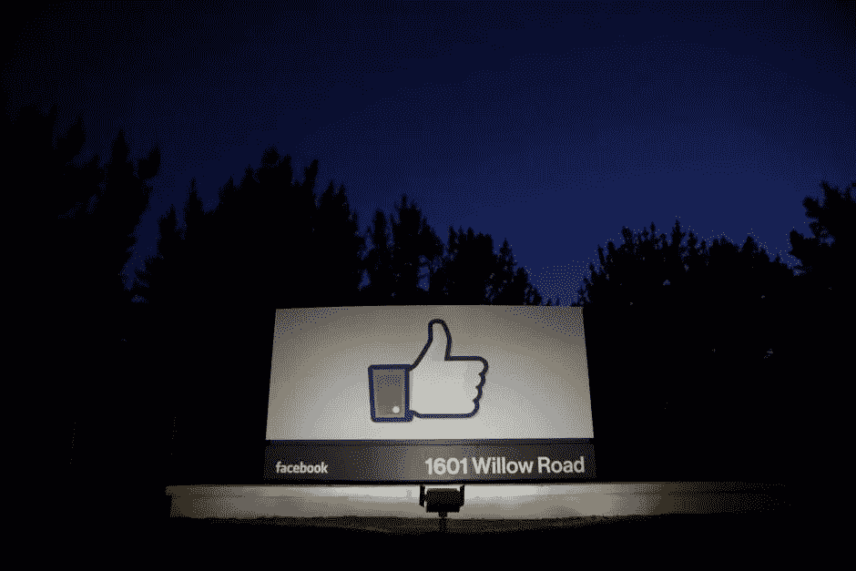

# 脸书-剑桥分析公司丑闻后的大科技

> 原文：<https://medium.com/hackernoon/big-tech-after-the-facebook-cambridge-analytica-scandal-bfe452a23e49>

The sun rises behind the entrance sign to Facebook headquarters in Menlo Park before the company’s IPO launch, May 18, 2012\. (Credits: REUTERS/Beck Diefenbach/File Photo)

## 现在，就连科技高管也呼吁加强监管。

> “科技肯定会受到监管。或许这是最好的结果。”

这是来自 [Aaron Levie](https://medium.com/u/c72d99a62d0d?source=post_page-----bfe452a23e49--------------------------------) 的一条推文，他是 Box 的联合创始人、首席执行官和自封的*首席魔术师*。这是他在与特朗普竞选团队和亲英国退出欧盟竞选团队合作的数据分析公司剑桥分析公司(Cambridge Analytica)非法获取 5000 万份美国选民的脸书个人资料的消息传出后发表的首次评论。

几天后，列维又在推特上评论道:

“科技公司的责任呈指数增长，”他指出，同时承认说它们“仅仅是平台和管道”不再是一个可持续的论点。

他在接受美国消费者新闻与商业频道的迪尔德丽·博萨采访时做了更多的阐述。“在过去的 10-20 年里，我们有大量的技术创新，现在开始影响我们生活的每一个元素，”他说。“这是我们从数字革命中看到的:它正在改变我们的汽车和交通；它正在改变生命科学和医疗保健；它正在改变投票和民主。”

Levie 解释说，“有时候我们把这些技术平台当作公用事业，所有的用户都要对这些平台负责。”

“但最终，随着你看到机器学习和人工智能的用例越来越多，平台本身将代表我们做出更多决定。这意味着我们必须确保他们的决定能够保护消费者，让我们更安全，保护我们的信息隐私。”

他提到现在监管几乎不存在。“我们没有很多真正了解这个未来世界将会是什么样子的自我监管或政府强制监管，”他说。“就如何看待这些公用事业和科技公司而言，我们正处于转变的早期阶段。”

[在接受](https://www.wired.com/story/facebook-privacy-transparency-cambridge-analytica/)[连线](https://medium.com/u/ecdcb63e1a76?source=post_page-----bfe452a23e49--------------------------------)的 [Brian Barrett](https://medium.com/u/39fb548f1378?source=post_page-----bfe452a23e49--------------------------------) 的采访中，电子隐私信息中心(EPIC)的 Sam Lester 说，在安全带成为标准之前，询问脸书用户可以做些什么来保护自己就像询问司机在车里可以做些什么来保护自己一样。

然而，莱斯特提到，欧洲的新法规可能是解决这一问题的一种方式。“好消息是，某种版本的数据隐私安全带可能正在酝酿之中，”他说。“欧盟通用数据保护条例(GDPR)，[将要求公司](https://www.wired.com/story/europes-new-privacy-law-will-change-the-web-and-more/)公开他们收集的数据类型，以及将如何使用这些数据。虽然美国国内似乎没有这样的法律，但马萨诸塞州总检察长宣布对脸书和剑桥分析公司进行调查，至少可以让人们对发生的事情有更多的了解。参议员罗恩·怀登周一接着提出了一系列详细的问题让脸书回答

甚至在上周晚些时候脸书和剑桥分析公司丑闻爆发之前，万维网的发明者和网络基金会的创始人蒂姆·伯纳斯·李爵士就呼吁对大型科技公司进行监管，以防止网络被“大规模武器化”。

伯纳斯-李的声明是纪念万维网 29 周年的公开信的一部分。预言？还是只是常识？

“近年来，我们已经看到社交媒体平台上的阴谋论趋势，虚假的推特和脸书账户加剧了社会紧张局势，外部行为者干预了选举，犯罪分子窃取了大量个人数据，”他写道，并指出立法者目前的反应是“从平台本身寻找答案”——他认为这既不公平，也不太可能有效。

“企业意识到了这些问题，并正在努力解决它们——它们做出的每一项改变都会影响数百万人，”他继续说道。“做出这些决定的责任——T0 和 T1、T2 有时是负担 T3——落在了公司身上，这些公司是为了实现利润最大化，而不是社会公益最大化。”

> 考虑到社会目标的法律或监管框架可能有助于缓解这些紧张关系。

“我希望网络反映我们的希望，实现我们的梦想，而不是放大我们的恐惧，加深我们的分歧，”伯纳斯-李说。

[麦克·艾萨克](https://medium.com/u/2394d159fb05?source=post_page-----bfe452a23e49--------------------------------)来自[《纽约时报》](https://medium.com/u/b42354b051f1?source=post_page-----bfe452a23e49--------------------------------)，目前正在休书，他在推特上评论说“我一直听到的一件事是‘无论科技公司搞得有多糟，邀请监管会让事情变得更糟’。不过，请向我解释一下，如何允许科技公司继续自我监管。”

“相信我，我不是一个赞扬官僚监督效力的人——尤其是在这个特殊的政治时刻——但自我约束似乎在很大程度上已经失败了，”他继续说道。

截至目前，马克·扎克伯格或雪莉·桑德伯格还没有公开谈论过丑闻或未来的计划。Axios [的 Mike Allen](https://www.axios.com/zuckerberg-speak-publicly-cambridge-analytica-data-10f0c29a-465b-4f2b-baf7-b8391d7b1d75.html) 今天报道称，脸书的首席执行官“计划在接下来的 24 小时内就数据收集事件发表讲话，这些事件已经重创了他的股价，激怒了华盛顿和欧洲的立法者，并使他的社交网络陷入信任危机。”

一位接近扎克伯格的消息人士告诉 Axios:“这是一件大事，他知道这一点。”。“我们被告知，扎克伯格的言论将旨在重建信任，他想说一些有意义的事情，而不是匆忙离开。”

有趣的是，Salesforce 的马克·贝尼奥夫(Marc Benioff)在推特上用“哇”(两次)和“越来越陌生”这样的词评论脸书和剑桥分析公司的新闻，现在他将注意力集中在信任上。