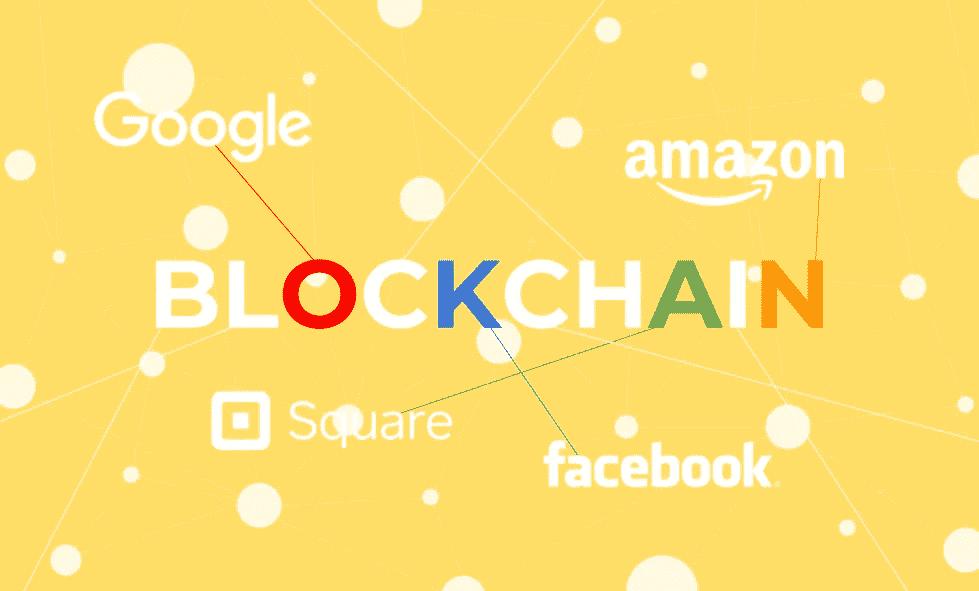

# 大型科技公司对区块链越来越感兴趣

> 原文：<https://medium.com/hackernoon/big-techs-growing-interest-in-blockchain-8100b6daa2b5>

## 谷歌、亚马逊、脸书、Square……这个名单还在增长。似乎每个人都想在餐桌上占有一席之地。

谷歌发言人[最近告诉](https://www.bloomberg.com/news/articles/2018-03-21/google-is-said-to-work-on-its-own-blockchain-related-technology) [彭博](https://medium.com/u/3d76181076e6?source=post_page-----8100b6daa2b5--------------------------------)“像许多新技术一样，我们在不同的团队中有个人在探索区块链的潜在用途，但对我们来说猜测任何可能的用途或计划还为时过早。”。

早在 2016 年，[谷歌云](https://medium.com/u/4f3f4ee0f977?source=post_page-----8100b6daa2b5--------------------------------)就加入了亚马逊、微软和 IBM，在其云上测试加密货币和机载银行客户端之外的区块链服务，提供清算和结算等服务。现在，该公司正在探索更广泛的方式来部署这项备受关注的技术。

根据彭博的说法，在科技巨头中，IBM 和微软迄今为止在提供区块链相关工具和让公司使用他们的云服务修补数字账簿方面处于领先地位。另外两家大型科技公司亚马逊和脸书也在尝试区块链。根据创始人兼首席执行官马克·扎克伯格的说法，第一个项目帮助公司建立区块链应用程序，而第二个项目正在研究加密货币、加密和其他分散计算方法。

对于谷歌来说，其中一个目标就是避免竞争，不仅是来自已经测试区块链多年的大公司，也包括正在挤占这个领域的新兴创业公司。

彭博报告称，谷歌“正在开发自己的分布式数字账本，第三方可以用它来过账和核实交易”。“尽管任何产品发布的时间都不清楚，但该公司计划提供这一服务，以将其云服务与竞争对手区分开来。它还将提供一个白标版本，其他公司可以在自己的服务器上运行。”

据 AWS 区块链全球合作伙伴技术主管 Lana Kalashnyk 的博客文章称，今年 3 月早些时候，亚马逊网络服务将区块链描述为“一项既有前景又令人兴奋的基础技术”。

但是谷歌、脸书和亚马逊并不是唯一关注区块链的大型科技公司。毫不奇怪，区块链相关产品和服务的市场有潜力从 2017 年的 7.06 亿美元增长到 2024 年的 600 多亿美元，据 WinterGreen Research 称。

【Twitter 和 [Square](https://medium.com/u/589d4400b6a4?source=post_page-----8100b6daa2b5--------------------------------) 的联合创始人兼首席执行官杰克·多西，最近谈到了区块链和他对这一领域的兴趣。

在接受 Gren Manuel 的采访时，他提到了金融服务和移动支付公司 Square 对将区块链作为内部账本以提高可靠性的兴趣。

“很难攻击整个系统，或者整个系统都失败了。因此，它将增加更多的可靠性，更多的正常运行时间，”他告诉曼纽尔。

> 我们刚刚开始了解它能做什么。

“这真令人兴奋。不仅仅是财务方面，而是所有方面，”多尔西说。

早在去年 9 月，多尔西就提到了“加密货币在服务和商业方面都有明显的全球利益”。

2017 年夏天，[在加利福尼亚州山景城的计算机历史博物馆接受](https://www.theverge.com/2017/8/11/16126610/square-twitter-founder-jack-dorsey-blockchain-bitcoin-banks)劳伦·古德[的采访时，多尔西称区块链是“下一个大解锁”，但也警告说:“我们需要更加深思熟虑。”](https://medium.com/u/e30df99fcdfe?source=post_page-----8100b6daa2b5--------------------------------)

> 人在纠结什么？技术是如何帮助他们进步的，还是分散了他们的注意力？

Square 曾在 2014 年短暂地被接受为一种支付形式，现在它正在更多地尝试比特币。

“我认为我们还不知道它会是什么，但我认为，绝对地，作为一个创新者，Square 必须让客户做他们想做的事情，”该公司首席财务官[莎拉·弗莱尔](https://medium.com/u/c6ca3a60c2ae?source=post_page-----8100b6daa2b5--------------------------------)T2 告诉美国消费者新闻与商业频道。

“你在谈论它，它就在那里，所以我们想做一个实验，并说，‘好吧，这是真的吗？“客户真的想这样做吗？”修士说。然后，它在内部做的是，它让支持这种创新的每个人都开始工作，并弄清楚我们如何以正确的方式做到这一点？。"

当谈到加密货币时，多尔西确信“世界最终将有一种单一货币，互联网将有一种单一货币，”他在最近的一次采访中告诉[伦敦《泰晤士报》的](https://medium.com/u/5dc1889e9732?source=post_page-----8100b6daa2b5--------------------------------)。“我个人认为，未来十年可能会是比特币的时代，但它可能会更快。”

“这很慢，而且成本很高，但随着越来越多的人拥有它，这些东西就会消失。多尔西说:“有更新的技术建立在区块链**的基础上，让它变得更加平易近人。”。**