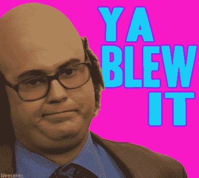
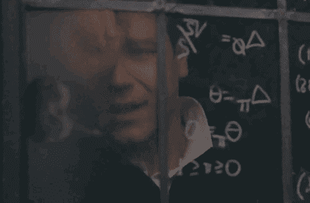
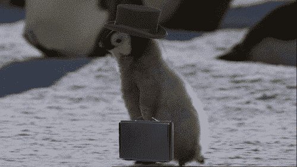

# 产品经理面试中最大的错误和克服它的 7 个步骤

> 原文：<https://medium.com/hackernoon/biggest-mistake-in-a-product-manager-interview-and-7-steps-to-overcome-it-441b205c52b7>

我们都经历过。我们彻底搞砸了。说错话了。我们低着头走了出去。我想说的是，我们都经历过那次不像我们希望的那样顺利的面试。

[https://gph.is/1ctB2Qm](https://gph.is/1ctB2Qm)

谈到产品经理面试，这很容易做到——这也是我写这个故事的原因。在这种类型的面试中，你可能犯的最大错误是什么？让我们现在来回答这个问题。

无论你面试的是哪家公司，你的经验水平如何，或者产品是什么，你都必须向*展示你是如何*思考的，而不一定要向*展示你是如何*思考的。

# 错误

让我们把它分解一下。当(不是*如果*而是*当*你被要求解决一个[假设](https://hackernoon.com/tagged/hypothetical)的问题时，无论你做什么，都不要激动，要根据你的教育年限、经验或直觉开始思考可能的解决方案！即使你知道一个合理的解决方案。相信我——我曾经犯过这样的错误，失去了一份令人难以置信的工作。

有两种情况你可能会犯这种错误:1)这是你的第一次 PM 面试(或者是一份相当于你梦想中的约会的工作)，你真的很兴奋，想给对面的人留下深刻印象，并开始提出解决方案，而忘记了过程；2)你不完全明白如何回答这个问题。无论是哪种情况，对于你试图给面试官留下深刻印象的人来说，这都是一个巨大的危险信号，你很可能得不到工作。这将是这条路的尽头。

如果你感到兴奋，忘记了如何找到一个可能的解决方案的步骤，那就慢下来，花时间反思你过去的经历，并在你的思考过程中走一遍。更多关于这方面的内容将在后面介绍。

另一个场景呢，两个场景中更可怕的一个？如果你在问自己“我知道答案，为什么我不能告诉他们我的想法？”暂停并退出游戏，重新装备。除非你知道如何使用已被证实的方法来结束假设性问题，否则不要参加另一个面试。

# 如何不犯这个错误

还记得很久以前，你的数学老师会因为你没有展示你的作业而责骂你吗？同样的规则也适用于这里。即使你可能知道答案，请不要只是写下或说出答案。

[https://gph.is/2c9ZYoN](https://gph.is/2c9ZYoN)

回到*你认为如何*是这一切的关键点。面试官可能甚至不关心你最终得到了什么解决方案，但他们更关心你是如何解决 XYZ 问题的。

作为一名产品经理，最重要的一个方面就是成为用户的代言人。不是你自己的声音。证明这一事实的方法是展示你是如何得出结论的。毕竟，有问题的是用户，对吗？

# 克服这个错误的基本步骤

根据面试时间的长短，你可能只有时间陈述你的步骤，而不是演示它们。你可以要求他们以潜在用户的身份合作，或者你可以说“我会…”并给出一个简单的例子。不要害怕提出有助于界定场景边界的问题。

如果给你一个可以带回家完成的项目，这些步骤也会引导你找到一个可靠的解决方案。

1.  如果有机会使用白板，请接受他们的提议。如果不是这样，给他们一个惊喜，要求使用它(如果房间里没有，拿出你的素描本和铅笔)。这将立即向他们表明你知道需要什么。
2.  根据手头的信息，从写下为什么问题存在的假设开始。他们很可能会给你一些信息，比如反馈卡和约束条件。
3.  最可怕的假设应该是你的假设。你的假设就是你的实验。
4.  识别或询问产品的用户角色是什么(目标客户)。这应该包括用户/购买者属性、棘手问题、需求和目标，以及与它们相关的一些内容，以展示同理心。
5.  接下来是你的用户面试。这是你的实验。*问正确的问题至关重要*。由此，您应该能够确认问题/难点以及可能的解决方案。
6.  在你的访谈([Jakob Nielsen](https://www.nngroup.com/people/jakob-nielsen/)博士，一位用户研究专家，发现 85%的问题在仅仅五次用户访谈后就被发现)和文档之后，是时候用调查来验证了。调查是测试你的结果的一种方式，用更大的范围来验证它们。
7.  在你的面试和调查之后，你会知道该把船驶向哪里，而不会浪费很多时间或公司的钱。如果他们指出了不同的东西，没关系。这只是意味着你将不得不迭代。

在你验证了数据之后，你现在可以根据它作为假设问题的可能解决方案来给出你的答案。

# 结论

是的，这可能并不适用于所有可能的面试场景，但这是证明你有能力用一个以用户为中心的、经过验证的过程来建立解决方案的坚实一步。展示*作为一名产品经理，你是如何思考的。*

我希望这有助于你下一次的产品经理面试，并且你能够得到你梦想的工作！

[https://gph.is/15FE5lQ](https://gph.is/15FE5lQ)

附:如果你的面试官没有问你如何思考，这是一个危险信号，说明公司可能不了解产品经理的工作。