# BigQuery:用这些高级技巧提升你的查询水平

> 原文：<https://medium.com/hackernoon/bigquery-level-up-your-queries-with-these-advanced-tricks-c87de1fde235>

## **以大都会艺术博物馆和云视觉 API 为特色**


[BigQuery](https://hackernoon.com/tagged/bigquery) 是 Google Cloud 提供的数据仓库解决方案。组织使用数据仓库将多个数据源收集到一个实体中，并使用面向业务的模式将它们重新整合到 SQL 数据库中。

> 这使得组织的合作者可以通过一个独特的服务，只需几个 SQL 查询就可以访问多个分析就绪数据源。

因此，跨源数据分析很容易实现。

这种类型的服务对于任何数据驱动的公司功能都非常有用，特别是[业务](https://hackernoon.com/tagged/business)情报分析师或数据科学家。

BigQuery 还带有公共数据集(*如* `hackernews`、`stackoverflow`或`github_repos`)。最好的是，该列表定期更新。

如果你是 BigQuery 的新手，想要探索这些开放数据，你可以在这里找到有价值的信息:[免费试用 big query](https://cloud.google.com/bigquery/)。

此外，Felipe Hoffa 还提供了一些关于 BigQuery 公共数据集的有趣分析:

*   [*Github 中的所有开源现在在 BigQuery 内共享:分析所有代码！*](/google-cloud/github-on-bigquery-analyze-all-the-code-b3576fd2b150)
*   [*这些是真实的栈溢出趋势:使用浏览量*](https://towardsdatascience.com/these-are-the-real-stack-overflow-trends-use-the-pageviews-c439903cd1a)
*   [*2017 年谁对开源贡献最大？我们来分析一下 Github 的数据，一探究竟。*](https://medium.freecodecamp.org/the-top-contributors-to-github-2017-be98ab854e87)

作为我工作的一部分，我个人已经使用 BigQuery 将近一年了，这里是我在这个过程中获得的一些经验，可能对你有用。为了支持我的陈述，我将使用公共数据集`bigquery-public-data.the_met`。

# 数据集

`the_met`数据集从纽约大都会艺术博物馆的 20 万件艺术品中收集数据。数据包括对象元数据和图片表示。


最重要的是，由于有了[云视觉 API](https://cloud.google.com/vision/) ，所有的图像都得到了注释:这个 API 具有几个预先训练好的计算机视觉模型，提供了丰富的视觉信息(其中包括图像分类、人脸检测和定位、光学字符识别)。

这些注释在数据集中可用，并包含许多嵌套字段，这使得它成为与数据争论的一个很好的场所。

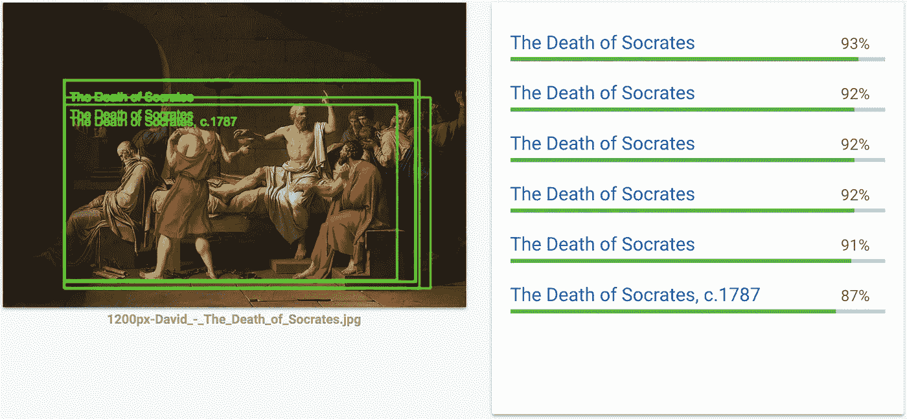

Logo Detection request to Cloud Vision with **The Death of Socrates**, David (1787)

数据集由 3 个表组成:

*   `the_met.images`为图片网址
*   `the_met.objects`对于对象元数据
*   `the_met.vision_api_data`对于 vision api 生成的注释

常用键是`object_id`。

更多关于`the_met`的信息可以从萨拉·罗宾逊的[这篇文章](https://cloud.google.com/blog/products/gcp/when-art-meets-big-data-analyzing-200000-items-from-the-met-collection-in-bigquery)中获得。

# 招数怎么样？

这里描述的技巧不一定能解决复杂的情况。它们更倾向于帮助您编写更短、更高效的查询，通常会忽略一些命令。

我们将讨论的主题如下:

1.  **等幂随机拆分表格行**
2.  **使用**和`**EXCEPT**`缩短您的查询
3.  **用**修改数组内联`**ARRAY**`
4.  **当 SQL 无法处理它时，就 JS 它**
5.  **big query ML 上的附加部分**

> **免责声明**:下面的例子将使用标准 SQL，一般来说，它比 BigQuery 遗留 SQL 提供了更多的特性[。它们假设您已经熟悉 BigQuery、行聚合、记录、重复字段和子查询。](https://cloud.google.com/bigquery/docs/reference/standard-sql/migrating-from-legacy-sql)

# 1.幂等随机拆分表格行

当试验机器学习和 BigQuery 数据时，能够以给定的分数随机拆分表听起来可能很有用。

如果查询是幂等的，那就更好了:无论运行多少次，结果都是一样的。

用例出现在将数据集划分为训练集和开发集时。

例如，让我们对`the_met.objects`进行 80–20 分割。这个想法在于散列一个存在于所有行中并且对于每一行都是唯一的列字段，*例如*和`[FARM_FINGERPRINT](https://cloud.google.com/bigquery/docs/reference/standard-sql/functions-and-operators#farm_fingerprint)`。

然后可以利用整数散列的算术属性来幂等地区分行。

对于 20%的分割，可以使用模 5 值。在这里，这个字段可以是`object_number`。

上面的查询返回了 401596 行中的 80221 行。 19.97%)。耶！

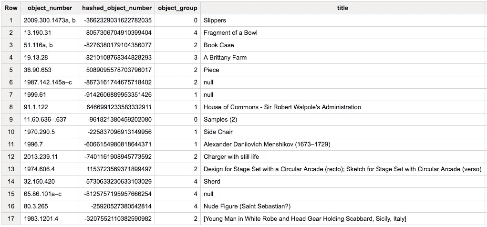

Samples of objects with their number, FARM_FINGERPRINT hash, corresponding group and title

# 2.使用`EXCEPT`缩短您的查询

一个经常被忽视的关键词是`EXCEPT`。这允许您查询除了它们的子集之外的所有列。

事实证明，当表模式非常完备时，如在`the_met.objects`中，这是非常有用的。

例如:

With `EXCEPT`, 4 lines

Without `EXCEPT`, 43 lines

`the_met.vision_api_data`中提供的另一个图像注释示例。在可用的注释中，有`faceAnnotations`:

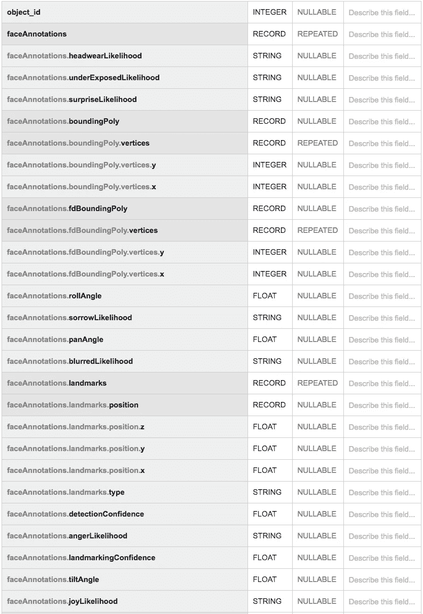

Schema for `face_annotations` in `the_met.vision_api_data`

如果我们对除了`faceAnnotations.surpriseLikelihood`和`faceAnnotations.sorrowLikelihood`之外的所有列都感兴趣，这个查询会起作用吗？

This query references nested queries and is invalid.

实际上，这个查询是不允许的，因为它引用了`EXCEPT`中的一个嵌套字段。`faceAnnotations`需要`UNNEST` *ed* 才能引用。

This query is valid but the `faceAnnotations` are now unnested.

上面的查询有效，但是`faceAnnotations`现在没有嵌套。

下一节将展示如何在保留嵌套结构的同时执行任务，这要归功于关键字`ARRAY`。一般来说，与完全扁平化的表相比，维护嵌套结构在存储和处理能力方面更具成本效益。

# 3.用`ARRAY`修改数组

在 BigQuery 中，`ARRAY`字段(又名。`REPEATED`字段)指一行可以有多个对应值的列。例如在`vision_api_data`中，一个对象可以对应多个`faceAnnotations`:

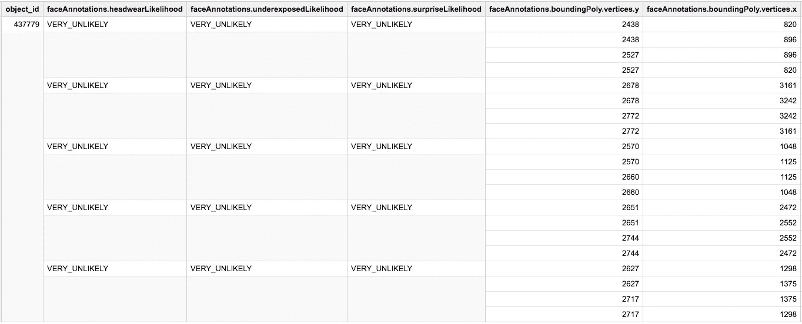

To one line (=one `object_id`) can correspond several `faceAnnotations`

你可能知道`ARRAY_AGG`或`ARRAY_LENGTH`，但你听说过经常被忽视的`ARRAY`吗？

根据[文档](https://cloud.google.com/bigquery/docs/reference/standard-sql/array_functions) , `ARRAY(subquery)`返回一个`ARRAY`，子查询中的每一行都有一个元素。让我们看几个用例。

## 3.1 过滤掉嵌套字段，同时保留嵌套结构

让我们再次处理前面的例子，但是这次用一个更优雅的方法。

And I never unnested any column

注意，当在一个`ARRAY`子句中查询多个列时，`SELECT AS STRUCT`是必需的。

## 3.2 筛选数组字段中的行

这一次，我们将根据嵌套列上的条件，过滤掉`ARRAY`中的行，而不是过滤掉列。

假设我们对很可能曝光不足的人脸不感兴趣。 `underExposedLikelihood='VERY_LIKELY'`)。

The query

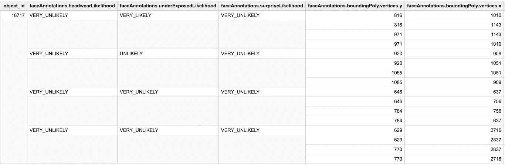

Above: `faceAnnotations` before `WHERE` filtering

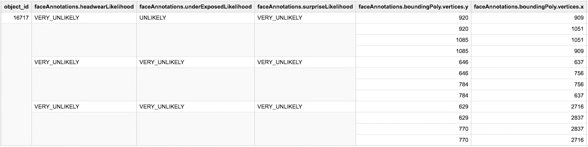

Above: `faceAnnotations` after `WHERE` filtering

## 3.3 用嵌套字段上的连接来丰富数组

在面部注释的顶部，云视觉 API 提供了网络检测功能，类似于谷歌图像反向搜索。

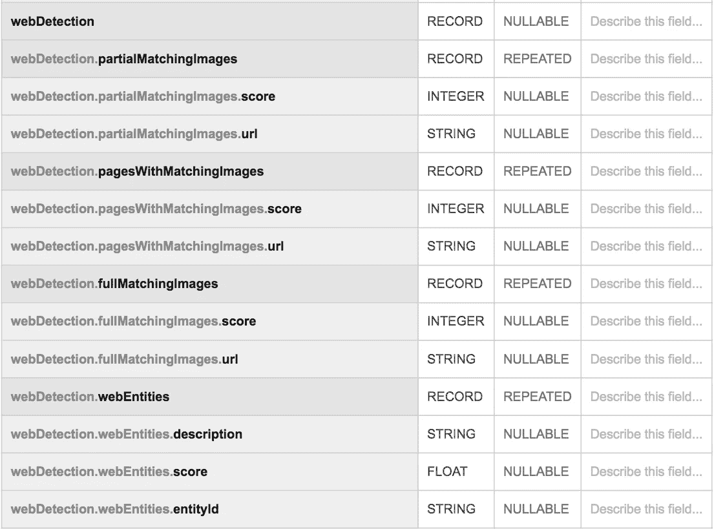

`webDetection` schema

让我们用来自`the_met.images`的匹配`object_id`(博物馆物品的图片 URL)来丰富这个模式。这是目标模式:

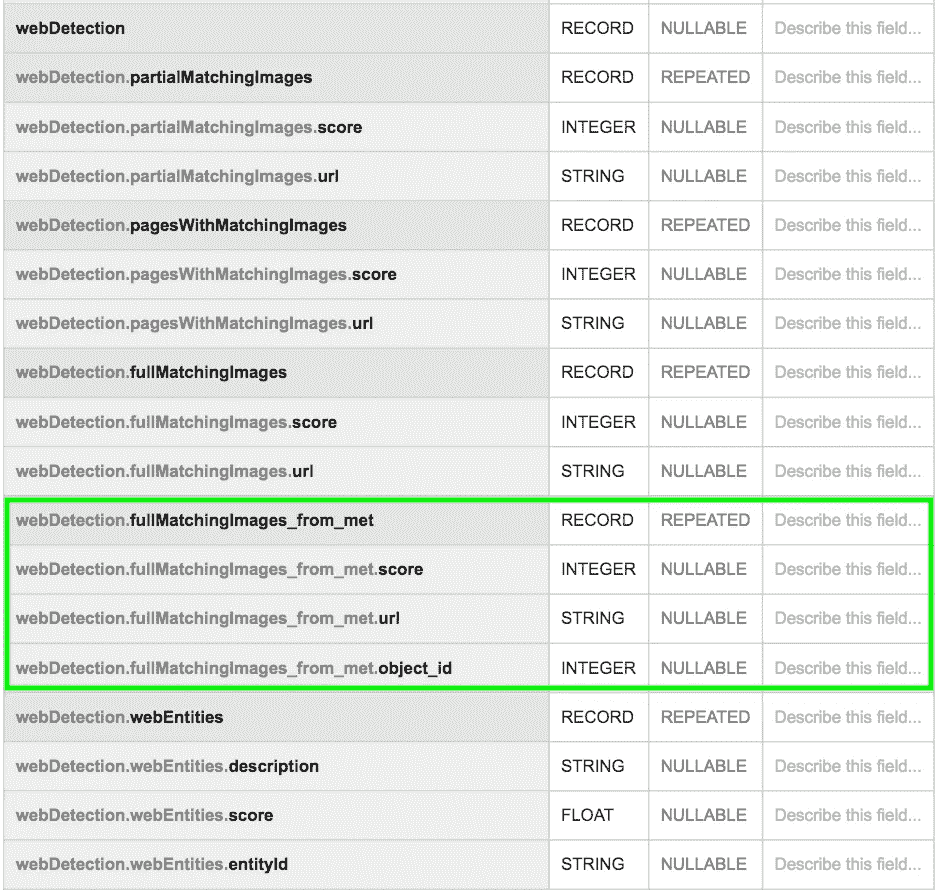

Target enriched `webDetection` schema

相应的查询

结果呢

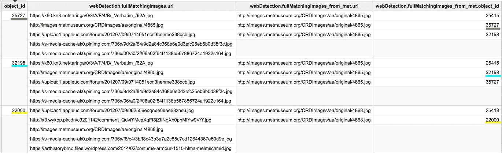

Samples of the `webDetection` schema enrichment. The output schema has been simplified for readability.

例如，从那里你可以评估谷歌反向图像搜索的图像检索性能。

# 4.当 SQL 不能处理它时，就用 JS

BigQuery 允许您用 JavaScript 编写自己的[用户定义函数](https://cloud.google.com/bigquery/docs/reference/standard-sql/user-defined-functions)(UDF)，这在 StandardSQL 不支持您想要实现的功能时会很有用。

例如，我们可能对从`vision_api_data`中为每个`object_id`提取具有第二高`score`的`labelAnnotation`感兴趣。在 StandardSQL 中，可以选择第一行，但不能选择第二行(至少不能在单个查询中)。

> **编辑:**后一项任务实际上很容易实现。请参考评论部分，看看如何做到这一点。

这可以通过以下方式实现

结果呢

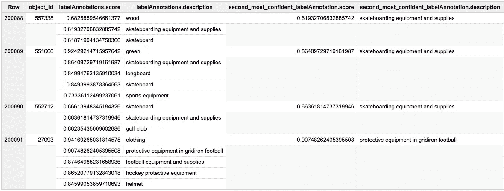

We prepended the table schema with the argument of the UDF for convenience.

请注意，在撰写本文时，BigQuery 视图不支持 UDF。

# 5.BigQuery ML 的附加部分

BigQuery ML 是 BigQuery 的最新特性之一。它允许您只使用几个 SQL 命令来构建、训练和部署机器学习模型。这可以节省你建立数据管道的时间，或许还可以加速其他服务，比如 Google AppEngine。

为了这个例子，让我们看看一个对象的一些元数据是否可以很好地预测一张脸是否出现在它上面。

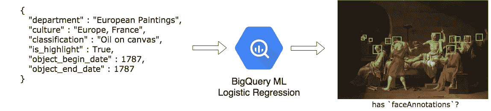

Logistic Regression task: predict whether or not an art piece has a face representation

我们将依靠云视觉 API 对人脸的存在进行地面实况标记:

```
IF(
  ARRAY_LENGTH(faceAnnotations)=0 OR faceAnnotations IS NULL
  , 0
  , 1
) AS label
```

为此，我们将使用线性[逻辑回归](https://en.wikipedia.org/wiki/Logistic_regression)。

在 BigQuery 上创建模型就像用几个命令预先挂起训练集查询一样简单。

假设您已经创建了一个名为`bqml`的数据集(如果没有，则创建它)，语法如下所示:

注意输入特性中的混合类型:`STRING`、`BOOLEAN`、`INTEGER`。

默认情况下，BigQuery 通过对非数字特征进行一次性编码来处理这种多样性。还要注意，我们使用了上述幂等分裂技巧来训练 80%数据的模型。

培训结束后，让我们用以下方法在开发集(其他 20%的数据)上评估模型:

评估查询返回

```
[
   {
      "precision": "0.6363636363636364",
      "recall": "4.160228218233686E-4",
      "accuracy": "0.8950143845832215",
      "f1_score": "8.315020490586209E-4",
      "log_loss": "0.3046493172393632",
      "roc_auc": "0.857339"
   }
]
```

顺便提一下，先验分布如下:

```
[
   { 
      "pc_with_faces": "0.1050043372170668", 
      "pc_no_faces": "0.8949956627829332" 
   } 
]
```

给定非常低的召回分数和几乎不超过先验分布的准确度分数，我们不能说模型已经从输入特征中学习了😊。

然而，这个例子可以作为 BigQuery ML 的介绍。

为了提高模型的性能，我们可以对像`culture`和`classification`这样的字段进行字符串预处理和分解。可以利用其他非结构化的描述文本字段，但是这超出了 BigQuery ML 的当前范围。

如果您热衷于在云中提供机器学习，但发现 BigQuery ML 有局限性，您可能会发现我的[上一篇文章](https://towardsdatascience.com/https-towardsdatascience-com-deploying-machine-learning-has-never-been-so-easy-bbdb500a39a)很有用。

*在写这篇文章的时候，BigQuery ML 是一个测试版。*

> **就这样结束了！谢谢你读到这里。我真的很喜欢分享这些知识，所以我希望它们对一些人有用。**

在 Sephora South-East Asia(Sephora SEA ),我们利用 BigQuery 实现更简单的数据支持决策，并更好地了解我们的客户。

*Sephora SEA 的数据团队尽可能地关注数据的内部民主化，部分是通过关于 BigQuery 的 SQL 培训。*

*本文献给他们，也献给我们所有的实习生和往届毕业生。*

*正如我的同事*[*aurélien*](/@auvalade_52739)*会自豪地说:*

```
SELECT thanks FROM you
```

*照片致谢:* [*凯文·拉明托*](https://unsplash.com/@kxvn_lx?utm_source=medium&utm_medium=referral) *上*[*Unsplash*](https://unsplash.com?utm_source=medium&utm_medium=referral)