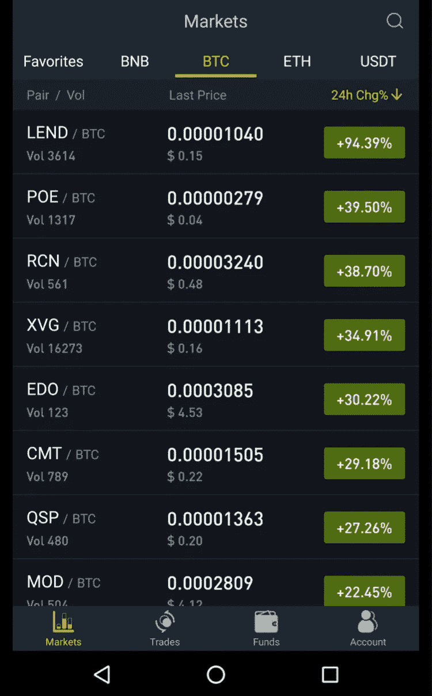

# 币安替代方案:科比恩古德

> 原文：<https://medium.com/hackernoon/binance-alternative-cobinhood-61890b373075>

如果你正在寻找币安的替代选择，或者只是尝试不同的交易所，T2 的科比伍德会很不错。在这篇文章中，我将讨论这些平台的相似之处，包括:交易对(例如:瑞士联邦理工学院/USDT，BTC/USDT)，功能，费用，UX/UI，以及两个平台即将推出的功能。

COBX app front page

## 交易对

根据硬币市值[的数据，截至 2018 年 8 月 3 日，Cobinhood](https://coinmarketcap.com/exchanges/cobinhood/) (COBX)拥有约 121 个交易对，而[币安](https://coinmarketcap.com/exchanges/binance/)拥有更强劲的 380 个交易对。由**和**两个交易所提供的**前 20 个**硬币/代币(根据硬币市值)交易对包括在以下列表中:

*   BTC/USDT
*   BTC/联邦理工学院
*   USDT 联邦理工学院
*   BTC 联邦理工学院
*   EOS/BTC
*   EOS/ETH
*   LTC/USDT
*   LTC/BTC
*   米奥塔/BTC
*   MIOTA/ETH
*   近地天体/BTC
*   NEO/ETH
*   OMG/BTC
*   OMG/ETH

## 特征

两个平台都是计划提供或提供**美元**(非 USDT 或其他稳定币)**交易对。**您现在可以开始为的[cobin good](https://hackernoon.com/tagged/cobinhood)**存入美元，因为*菲亚特*到 [crypto](https://hackernoon.com/tagged/crypto) 的交易于 7 月 27 日开始，而我们预计下个季度将在币安看到这一功能。Epay 是 Cobinhood 的菲亚特至加密网关的提供商。COBX 最初将从 3 个交易对开始，包括:美元对 BTC，美元对瑞士联邦理工学院，美元对 USDT。要开始与菲亚特(美元)进行交易，您需要:**

*   在 [Epay](http://www.epay.com/) 注册一个账户(相应地验证您的账户)
*   验证您的 COBX 帐户达到 KYC 3 级
*   将法定货币存入您的电子支付账户
*   从您的 COBX 账户中提取菲亚特
*   在 COBX 交易**美元/BTC、美元/瑞士法郎、**和/或**美元/USDT**
*   提取*菲亚特*(美元)回到您的 Epay 账户

*完整教程* [*点击这里*](https://cobinhood.zendesk.com/hc/en-us/articles/360006692852-Trading-with-fiat-tutorial) *。*

Cobinhood 目前也在测试他们的**保证金交易**平台，在该平台上，用户将能够通过持有他们的本地令牌 COB 以更高的利率借款，类似于在 BNB 币安支付交易/取款费用的方式(有关保证金交易的更多信息，请点击[此处](/cobinhood/margin-trading-funding-beta-to-begin-on-cobinhood-ff8e964b57a1?source=linkShare-5f6545e5a578-1533359697))。这两个平台也向近地天体持有者输送气体，这是我希望在每个交易所看到的一个特征。同样，两家交易所都计划在不久的将来推出一款 **DEX** ，这对于长寿至关重要，因为在这个领域，集中化是非常不可取的。最后，两家公司都有一个针对 ICO 项目的孵化器。

Login Security Puzzle Challenge

两家交易所的安全性都是一流的。两人都通过电子邮件和谷歌验证码获得 2FA，而 Cobinhood 也通过文本获得。两者都在登录时发送电子邮件确认，从新设备登录时发送预防性电子邮件，大多数操作(存款、取款)的验证电子邮件，并包括一个“拼图挑战”来代替初始登录的标准验证码。

如前所述，两个平台都有自己的本机令牌； **BNB** 和**玉米棒**。持有这两种代币各有各的好处。BNB 或 COB 都不是费用分享代币，但是 Cobinhood 允许持有一定数量 COB 代币的持有者接收与项目一起运行的促销空投，并允许以折扣 ICO 购买价格购买与 Cobinhood 一起孵化的项目。持有 BNB 不具备这些特征(尽管自其上市以来价值的大幅上升可能足以激励持有 BNB)。币安用户每月支付 0.1 BNB 就可以为社区月度硬币竞赛投票。通过持有更大的金额，您可以将您的投票增加到 500 倍(最大乘数)。在社区月度硬币投票 6 和 8 惨败后，这种做法最近受到了审查。众所周知，Cobinhood 提供类似的投票竞争，要求持有最低数量的 COB 才能投票，但没有乘数。

## 费用

费用是我们将看到相似之处嘎然而止的地方。Cobinhood 对所有交易和交易对都实行零费用交易，而币安对每笔交易收取 0.1%的费用(使用 BNB，你可以节省 25%)。相比之下，币安目前的平均取款费用略低于 COBX。例如:

**BTC 提现费用**

*币安— .0005 BTC*

*科比伍德— .001 BTC*

**ETH 提款费用**

*币安— .01 ETH*

*Cobinhood — .007ETH*

**EOS 提现费用**

*币安— .01EOS*

*Cobinhood — .05EOS*

零交易费伴随着它的错误，这主要是最受欢迎的市场资本和交易信息来源，硬币市场资本的感知惩罚。由于 Cobinhood 没有任何交易费用，硬币市值没有考虑到他们的交易量，显示它是一个错误的低交易量。要查看 COBX 的正确交易量，您必须选择交易所“24 小时交易量排名”下的“所有”选项卡(除了“收费市场”和“免费市场”)。

## 用户界面和用户体验(用户界面/UX)

UI/UX 当然是主观的，所以我已经包括了每个平台移动应用的截图(桌面截图不包括在内，可以通过访问各自的网站来查看)。整篇文章都是基于观点的，所以我将分享我对这两者的看法。我更喜欢 Cobinhood 更干净、更明亮的用户界面。除了在 COBX 上交易，还可以完成用户验证关卡，加入空投/交易比赛等等。这些功能不包含在币安中，但目前包含在任何其他 exchange 移动应用程序中。当然，在两者的桌面交换系统上，差异要小一些。Cobinhood 拥有迄今为止市场上最先进的移动应用之一。

## **即将推出的功能**

虽然有很多交易所，包括最近涌现的一系列新交易所，但筛选它们以找到更好的选择变得越来越重要。

币安虽然还很新，但最近收购了 Trust Wallet，并将其作为币安官方钱包进行推广。币安实验室，币安的孵化器部分，也正在形成新的合作伙伴关系，最近与天秤座信贷和枢机主教沥青俱乐部。参观币安[点击这里](http://binance.com)。

[Join Cobinhood](https://cobinhood.com?referrerId=02f28225-d0b6-40ae-adae-59c33023cce5)

Cobinhood 已经推出了美元对(这不仅是最受欢迎的功能之一，也是新手轻松交易的必要条件)，并计划推出保证金交易，同时扩大其硬币/代币清单，孵化更多 ico，并向 COB 持有者提供更多空投。但是，您需要 KYC 验证才能使用保证金交易和美元对交易(没有它您将无法存入美元)。访问[cobin good Exchange](https://cobinhood.com?referrerId=02f28225-d0b6-40ae-adae-59c33023cce5)了解更多信息或开始零费用交易。

通过访问他们的媒体页面[这里](/cobinhood/bounty-program-usd-on-cobinhood-exchange-c60d57c92dd7)加入 Cobinhood 的[奖励](https://cobinhood.com/fiat-deposit-withdrawal-cryptocurrency-exchange)和交易竞赛。