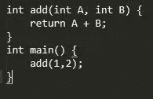

# 二进制开发 Eli 5–第 1 部分

> 原文：<https://medium.com/hackernoon/binary-exploitation-eli5-part-1-9bc23855a3d8>

Binary Exploitation ELI5 — Part 1

# 0x00 —前言

在本系列文章中，我将详细介绍不同类型的二进制漏洞，解释它们是什么，它们是如何工作的，它们背后的技术，以及针对它们的一些防御措施。在整个系列中，我将尽我所能以任何人，从初学者到 1337 h4x0r，都能理解的方式解释这些攻击、防御、技术和概念。

请注意:虽然我将添加一些关键的先决知识部分，希望使这些攻击的更多技术解释更容易理解，但本系列文章不会介绍精通二进制开发领域所需的所有信息/概念/技术。

在本文中，我们将讨论:

*0x01。必备知识:应用内存
0x02。必备知识:堆栈
0x03。必备知识:函数调用并返回
0x04。攻击:堆栈缓冲区溢出
0x05。攻击:返回到 libc (ret2libc)攻击*

点击下面阅读本系列的下一部分:

[二进制开发 ELI5 —第二部分](/@danielabloom/binary-exploitation-eli5-part-2-8fd71bf214b9)

# 0x01—必备知识:应用存储器

当执行时，应用程序被加载到内存中，然而，众所周知，计算机的内存量是有限的，因此，在加载内容时必须非常小心，以免覆盖任何其他应用程序。为了做到这一点，计算机使用了一个叫做*虚拟内存*的概念，这个概念可以用 21 世纪初的电视节目 [*德雷克和乔希*](https://www.imdb.com/title/tt0363328/?ref_=tt_ov_inf)*中的场景来完美地总结，在这个场景中，德雷克和乔希[负责将寿司组织到容器中](https://www.imdb.com/title/tt0838736/):*

> *在场景中，德雷克和乔希得到一份工作，他们拿着通过传送带送来的寿司，他们必须将寿司碎片整理到容器中。此外，虽然所有的寿司容器看起来完全一样，但每个容器只装一种寿司是至关重要的。*

*所以，让我们打破类比，把它和*虚拟内存的概念联系起来:**

*寿司传送带:正如我在上面所说的，计算机必须非常小心和精确地将应用程序数据放在内存中的什么位置，这样才不会被覆盖。虽然一台计算机*可以*只是简单地小心翼翼地将应用程序放入物理内存，但这最终会导致问题，因为应用程序碎片会很快填满整个空间。在上面的例子中，单个的寿司可以看作是应用程序的碎片或应用程序分配的内存块，而整个寿司集(每个容器 6 个)可以看作是应用程序本身。*

***德雷克和乔希:**为了避免在传送带上塞满一块块寿司，德雷克和乔希将它们放入单独的容器中，然后让它们沿着传送带向下移动。与 Drake 和 Josh 非常相似，您的计算机也将应用程序组织和设置到称为虚拟内存位置的容器中。这些虚拟内存位置(或*虚拟地址空间*)允许应用程序认为它拥有对整个内存范围的完全控制。然而，当应用程序调用一个位置或试图在其虚拟地址空间内分配内存，而不是被授权访问任意物理内存时，计算机 CPU(中央处理单元)中一个很小但极其重要的硬件 MMU(内存管理单元)将应用程序的调用映射到物理内存的特定区域，并方便任何内存操作。这种内存映射允许计算机通过集中组织的查找表来组织和处理具有动态内存需求的多个应用程序。*

**

*An ASCII Diagram of the Virtual Memory Process*

*同样重要的是要注意，虽然应用程序的所有代码都包含在它的虚拟地址空间中，但应用程序通常使用动态链接库(DLL)，如 *libc* 或 *kernel32。*这些 dll 只是**外部**(不存储在应用程序的地址空间内)系统应用程序或程序从中导入代码的其他自定义应用程序。以下面的代码为例:*

**

*A Basic C function*

*如你所见，在这个 6 行程序中，我没有真正定义什么是 *printf* 。但是，该程序仍将正常运行，并打印出“Hello World”。这是因为 *printf* 函数是在标准 C 库 *libc、*中定义的系统函数。在编译过程中， *libc* 从外部链接到可执行文件。在 linux 系统上，您可以使用 *ldd* 命令查看程序的共享库依赖关系。*

**

*Displaying a program’s shared library dependencies with **ldd***

*如果你正在看上面的截图，并想知道*0xb7e 99000*到底是什么，嗯，那是内存中 *libc* 库的地址。内存地址以十六进制格式表示。请[点击这里获取更多关于十六进制数字系统](https://www.khanacademy.org/math/algebra-home/alg-intro-to-algebra/algebra-alternate-number-bases/v/hexadecimal-number-system)的信息。*

# *0x02—必备知识:堆栈*

*堆栈只是一个大型数据结构，用于在运行时存储应用程序信息和数据。堆栈的功能可以通过以下类比来简单解释:*

> *鲍勃是一家高级餐厅的洗碗工，每天晚上他都有一堆盘子要洗。此外，在整个晚上，每当桌子被清理干净时，更多的盘子可以被添加到鲍勃的堆栈中。如果鲍勃从盘子堆的顶部以外的任何地方拿走一个盘子，它上面的所有盘子都会掉下来摔碎。*

*现在，简单地想象一台计算机和一堆数据对象，而不是鲍勃和一堆盘子。每当有东西*被推*到堆栈上时，它就被添加到堆栈的顶部，每当有东西*弹出*堆栈时，它就被从堆栈的顶部移除，使其成为一个**L**ast**I**n**F**first**O**ut(LIFO)机制。*

*程序使用堆栈来保存各种东西，比如函数指针(函数在内存中的位置)和变量。*

# *0x03 —必备知识:函数调用和返回*

*看看下面的代码:*

**

*A basic C program*

*在这个代码片段中，我们看到函数 *add* 有两个整型参数，分别叫做 *A* 和 *B* 。在*主*函数中，我们可以看到我们调用了 *Add* ，其中参数 *A* 的编号为 1，参数 *B* 的编号为 2。如果我们将这段代码分解成它的底层机器代码，我们会看到:*

**

*Calling the add function with 2 arguments*

*如你所见，当调用带参数的函数时，程序首先将两个参数都推到堆栈上，然后执行一个 *call* 语句。这个*调用*语句重定向了程序的指令指针(指令指针就像你用来记录你正在阅读的单词的小铅笔。指令指针总是指向即将被执行的指令(即将被读取的字)，指向被调用函数的地址。然而，在导航到被调用的函数之前， *call* 语句将它下面的下一条指令的地址推到堆栈中，这样当 *add* 函数返回时，它将知道从哪里继续处理。函数应该返回的位置的地址被称为函数返回指针。*

# *0x04 —攻击:堆栈缓冲区溢出*

*在深入了解什么是堆栈缓冲区溢出以及它们如何工作的技术细节之前，让我们先来看一个快速、易于理解的类比:*

> *爱丽丝和鲍勃曾经约会过，但是爱丽丝最终和鲍勃分手了。随着时间的推移，爱丽丝继续前进，但鲍勃从未真正走出心碎的阴影。现在，爱丽丝要和鲍勃的死对头罗伯特·哈克曼结婚了。鲍勃是一个令人毛骨悚然的怪人，他通过秘密进入爱丽丝的电子邮件帐户窥探爱丽丝的所有婚礼计划。Bob 发现 Alice 雇佣了一位著名的婚礼蛋糕设计师，这位设计师希望 Alice 根据自己的口味偏好修改部分食谱。设计师给了爱丽丝一份推荐的配料清单，但说他会准确地做她想要的任何事情。Bob 打开了附在设计师电子邮件中的文档，看到配方的自定义行如下所示:*

**…然后，我们将通过添加 ______ 来增加糖霜的味道。之后，我们会加一些巧克力…**

> *Bob 注意到，如果您在行中输入“Banana ”,文本看起来会像这样:*

*然后，我们会加入香蕉来增加糖霜的味道。之后，我们会加入一些巧克力…*

> *但是，如果 Bob 在该行中输入“Strawberry ”,文本将看起来像这样:*

**…然后，我们会加入草莓来增加糖霜的味道，然后，我们会加入一些巧克力…**

> *鲍勃意识到这将是破坏爱丽丝婚礼的完美方式，他所要做的就是用他自己恶心的版本覆盖食谱的其余部分！在爱丽丝结婚那天，设计师终于展示了他做的蛋糕——上面爬满了虫子，是用冷冻蛋黄酱做的！*

*堆栈缓冲区溢出很像 Bob 的攻击，会覆盖开发人员不想覆盖的数据，从而完全控制程序及其输出。*

*那么，现在让我们在现实世界中看看。看看下面这段来自[exploit-exercises.com](https://exploit-exercises.com/protostar/stack0/)的代码:*

**

*Exploit-Exercises.com Protostar Stack0 Code*

*在上面的函数中，我们看到创建了一个名为 *buffer* 的字符类型数组，大小为 64。然后，我们看到*修改的*变量被设置为 0，并且*获取*函数被调用，其中*缓冲*变量作为参数。最后，我们看到一个 IF 语句，它检查 modified 是否不为 0。很明显，在这个应用程序中没有将*修改后的*变量设置为除 0 以外的任何值，那么我们要如何改变它呢？*

*好吧，我们先来看看*获取*函数的文档:*

**

*gets function defined*

**

*gets function bugs section*

*如您所见， *gets* 函数只是接收用户输入。然而，该函数不检查用户输入是否真正适合我们存储它的数据结构(在本例中，是 *buffer* ),因此，我们能够溢出数据结构并影响堆栈上的其他变量/数据。此外，因为我们知道所有变量都存储在堆栈中，并且我们知道修改的变量是什么(0)，所以我们所要做的就是输入足够的输入来覆盖修改的变量。让我们来看一个图表:*

**

*an ASCII diagram of a stack buffer overflow*

*如您所见，如果恶意用户输入了太多的文本，他们可以覆盖修改后的变量和堆栈上的任何内容，包括返回指针。这意味着，如果一个恶意代理能够控制一个程序堆栈，他们就能够有效地控制整个程序，并使它为所欲为。他们可以简单地将堆栈上的函数返回指针改写为指向恶意负载的自定义指针。*

# *0x05 —攻击:ret2libc*

*在我们讨论 ret-to-libc(ret 2 libc)攻击之前，让我们花点时间更深入地讨论一下 *libc* 。*

*我们知道(从 0x01 节)， *libc* 是标准的 C 库。这意味着它包含了 C 编程语言中所有的通用系统函数。现在，如果一个恶意用户能够控制程序来执行这些功能，那会怎么样呢？*

*嗯，ret2libc 就是这么回事。ret2libc 的后果的一个完美类比是[黑客帝国系列](https://www.imdb.com/title/tt0133093/)。回想一下经典的“枪，很多枪”场景。坦克，操作员，能够完全绕过并重新编程矩阵，让一吨的枪凭空出现。*

*你可以这样想回到 libc，我们能够控制 matrix(标准 C 库),让它做我们想做的任何事情。*

*从根本上说，ret2libc 攻击实际上是基于堆栈缓冲区溢出。回想一下我在第 0x04 节末尾说过的话，如果恶意代理可以覆盖堆栈上的数据，他们可以简单地覆盖返回指针以指向 libc 中的特定函数，并向其传递传递有效负载所需的任何参数。*

*ret2libc 攻击最常用的函数之一是*系统*函数。让我们看看它的文档:*

**

*the system command’s documentation*

*如您所见，系统命令只是执行 shell 命令(T2 shell T3 是 linux 命令行)。此外，如果我们仔细阅读描述，我们可以看到系统只是简单地执行了 */bin/sh -c <命令> (/bin/sh* 是实际的 shell 命令)，并且该命令是通过一个参数传递给函数的。*

*因此，要获得对运行有漏洞的应用程序的**机器**的**命令行访问权，我们所要做的就是将“/bin/sh”作为参数推送到堆栈上，然后用系统函数的内存地址替换返回或调用指针，这样就可以使用/bin/sh 作为参数来调用函数，启动 shell 并授予我们对系统的完全访问权。***

**战功，很多战功。**

# *0x06 —第 1 部分结论*

*在本文中，我们讨论了:*

**0x01。虚拟内存以及如何在内存中处理应用程序
0x02。动态链接库和 libc
0x03。堆栈
0x04。函数如何被调用以及从函数返回如何工作
0x05。堆栈缓冲区溢出
0x06。返回到 libc (ret2libc)攻击**

*我希望这篇文章是有帮助的。点击下面继续阅读本系列的第 2 部分:*

*[二进制开发 ELI5 —第二部分](/@danielabloom/binary-exploitation-eli5-part-2-8fd71bf214b9)*

*另外，如果你对逆向工程感兴趣，请查看我的*博洛:逆向工程*文章系列:*

*[BOLO:逆向工程—第一部分(基本编程概念)](/bugbountywriteup/bolo-reverse-engineering-part-1-basic-programming-concepts-f88b233c63b7)
[BOLO:逆向工程—第二部分(高级编程概念)](/@danielabloom/bolo-reverse-engineering-part-2-advanced-programming-concepts-b4e292b2f3e)*

*而且，如果你正在寻找更多的 ELI5 内容，请查看我的[解释 Spectre 和 Meltdown Like I 5](https://hackernoon.com/explain-spectre-and-meltdown-like-im-5-494a6ba61061)文章。*

****推【感谢】
推【感谢】
呼唤阅读****