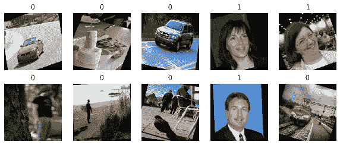
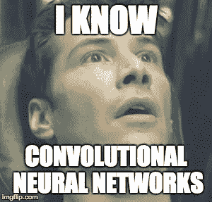
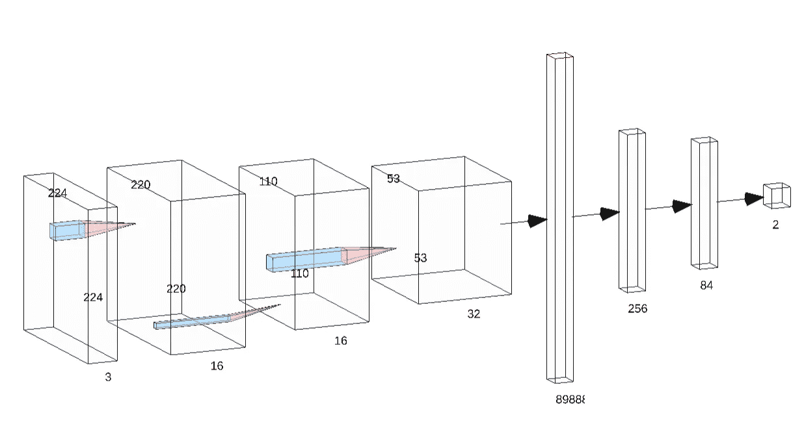

# 使用 PyTorch 的二值图像分类器

> 原文：<https://medium.com/hackernoon/binary-face-classifier-using-pytorch-2d835ccb7816>

# 基于 PyTorch 的虚拟图像分类


[Source](https://cdn-images-1.medium.com/max/2000/1*LLVL8xUiUOBE8WHgzAuY-Q.png)

脸书最近发布了名为 PyTorch 1.0 的深度学习库，这是该库的稳定版本，可用于生产级代码。

我是 Udacity 的 PyTorch 奖学金挑战项目的一部分，学到了很多关于 PyTorch 及其功能的知识。来自喀拉斯的 PyTorch 看起来没什么不同，需要时间来适应。

在本文中，我将指导您使用 PyTorch 中的卷积神经网络从头构建一个二值图像分类器。

整个过程分为以下步骤:

1.加载数据
2。定义一个卷积神经网络
3。训练模型
4。在数据集上评估我们的训练模型的性能

# **1。加载数据**

当加载/预处理数据时，PyTorch 比其他库简单得多。然而，PyTorch 有一个名为 transforms 的内置函数，使用它您可以一次执行所有的预处理任务，我们稍后会看到。

对于数据集，我找不到一个正面标记的人脸，因此我手动制作了自己的数据集，将来自 [LFW 人脸数据集](http://vis-www.cs.umass.edu/lfw/)的图像用于正面，并为负面添加了一些随机图像，包括车辆、动物、家具等图像。
如果你愿意，你可以从这里下载数据集:[链接](https://drive.google.com/file/d/1nt-Orxqh-5b1XwBcU3CHz4i0vEOGwt0J/view?usp=sharing)

在训练之前，需要在训练、测试和验证集中拆分数据。训练集将用于训练模型，验证集将用于在每个时期后验证模型，测试集将用于在模型被训练后评估模型。

首先，我们需要将数据集放入环境中，这可以通过:
( *注意:“face”是包含正面和负面 faces 例子的目录名*)

```
train_data = datasets.ImageFolder('face',transform=transform)
```

我们还需要定义一个转换对象来执行预处理步骤。我们可以在对象中提到我们需要什么类型的处理。在下面的代码中，我定义了 transform 对象，该对象执行水平翻转、随机旋转，将图像数组转换为 PyTorch(因为该库只处理张量，类似于 numpy 数组)，然后最终归一化图像。

```
transform = transforms.Compose([
    transforms.RandomHorizontalFlip(),
    transforms.RandomRotation(20),
    transforms.ToTensor(),
    transforms.Normalize((0.5, 0.5, 0.5), (0.5, 0.5, 0.5))
    ])
```

一旦我们完成了数据集的加载和转换对象的定义，我们就可以像前面讨论的那样将数据集分成训练集、测试集和验证集。进行分割时:

```
#For test
num_data = len(train_data)
indices_data = list(range(num_data))
np.random.shuffle(indices_data)
split_tt = int(np.floor(test_size * num_data))
train_idx, test_idx = indices_data[split_tt:], indices_data[:split_tt]#For Valid
num_train = len(train_idx)
indices_train = list(range(num_train))
np.random.shuffle(indices_train)
split_tv = int(np.floor(valid_size * num_train))
train_idx, valid_idx = indices_train[split_tv:],indices_train[:split_tv]# define samplers for obtaining training and validation batches
train_sampler = SubsetRandomSampler(train_idx)
test_sampler = SubsetRandomSampler(test_idx)
valid_sampler = SubsetRandomSampler(valid_idx)#Loaders contains the data in tuple format 
# (Image in form of tensor, label)
train_loader = torch.utils.data.DataLoader(train_data, batch_size=batch_size, sampler=train_sampler, num_workers=1)valid_loader = torch.utils.data.DataLoader(train_data, batch_size=batch_size, sampler=valid_sampler, num_workers=1)test_loader = torch.utils.data.DataLoader(train_data, sampler = test_sampler, batch_size=batch_size,num_workers=1)# variable representing classes of the images
classes = [0,1]
```

train_loader、test_loader 和 valid_loader 将用于向模型传递输入。

以下是应用变换(包括调整大小、随机旋转和归一化)后来自数据集的一些随机图像:



# **2。**初始化卷积神经网络(CNN)



PyTorch 中的 CNN 定义如下:

```
torch.nn.Conv2D(Depth_of_input_image, Depth_of_filter, size_of_filter, padding, strides)
```

输入图像的深度对于 RGB 通常为 3，对于灰度通常为 1。滤波器的深度由用户指定，用户通常提取低级特征，并且滤波器的大小是在整个图像上卷积的核的大小。

为了计算新卷积层的维度，使用以下公式:
*dimension =
(dimen _ of _ input _ image-Filter _ size(int)+(2 * padding))/stride _ value+1*

现在是初始化模型的时候了:

```
class Net(nn.Module):
    def __init__(self):
        super(Net, self).__init__()
        # convolutional layer
        self.conv1 = nn.Conv2d(3, 16, 5)
        # max pooling layer
        self.pool = nn.MaxPool2d(2, 2)
        self.conv2 = nn.Conv2d(16, 32, 5)
        self.dropout = nn.Dropout(0.2)
        self.fc1 = nn.Linear(32*53*53, 256)
        self.fc2 = nn.Linear(256, 84)
        self.fc3 = nn.Linear(84, 2)
        self.softmax = nn.LogSoftmax(dim=1)

    def forward(self, x):
        # add sequence of convolutional and max pooling layers
        x = self.pool(F.relu(self.conv1(x)))
        x = self.pool(F.relu(self.conv2(x)))
        x = self.dropout(x)
        x = x.view(-1, 32 * 53 * 53)
        x = F.relu(self.fc1(x))
        x = self.dropout(F.relu(self.fc2(x)))
        x = self.softmax(self.fc3(x))
        return x# create a complete CNN
model = Net()
```



Model Architecture

我们还需要初始化我们的损失函数和一个优化器。损失函数将帮助我们通过比较预测和原始标签来计算损失。优化器将通过在每个时期之后更新模型的参数来最小化损失。它们可以通过以下方式初始化:

```
# Loss function
criterion = torch.nn.CrossEntropyLoss()# Optimizer
optimizer = torch.optim.SGD(model.parameters(), lr = 0.003, momentum= 0.9)
```

# **3。训练模型**

是时候训练模型了！


训练模型需要我们遵循以下步骤:

1.  **清除所有优化变量的梯度:** 可能存在以前批次的梯度，因此有必要在每个时期后清除梯度
2.  **正向传递** :
    该步骤通过将输入传递给卷积神经网络模型来计算预测输出
3.  **计算损失:** 当模型训练时，损失函数在每个时期后计算损失，然后被优化器使用。
4.  **反向传递:**
    该步骤计算相对于模型参数的损失梯度
5.  **优化**
    这为模型执行单个优化步骤/参数更新
6.  **更新平均培训损失**

以下是训练模型的代码(*这是针对单个时期的*

# **4。模型评估**

为了评估模型，应该将它从 model.train()更改为 model.eval()

```
model.eval()
# iterate over test data
len(test_loader)
for data, target in test_loader:
    # move tensors to GPU if CUDA is available
    if train_on_gpu:
        data, target = data.cuda(), target.cuda()
    # forward pass
    output = model(data)
    # calculate the batch loss
    loss = criterion(output, target)
    # update test loss 
    test_loss += loss.item()*data.size(0)
    # convert output probabilities to predicted class
    _, pred = torch.max(output, 1)    
    # compare predictions to true label
    correct_tensor = pred.eq(target.data.view_as(pred))
    correct = np.squeeze(correct_tensor.numpy()) if not train_on_gpu else np.squeeze(correct_tensor.cpu().numpy())
    # calculate test accuracy for each object class
    for i in range(batch_size):       
        label = target.data[i]
        class_correct[label] += correct[i].item()
        class_total[label] += 1# average test loss
test_loss = test_loss/len(test_loader.dataset)
print('Test Loss: {:.6f}\n'.format(test_loss))for i in range(2):
    if class_total[i] > 0:
        print('Test Accuracy of %5s: %2d%% (%2d/%2d)' % (
            classes[i], 100 * class_correct[i] / class_total[i],
            np.sum(class_correct[i]), np.sum(class_total[i])))
    else:
        print('Test Accuracy of %5s: N/A (no training examples)' % (classes[i]))print('\nTest Accuracy (Overall): %2d%% (%2d/%2d)' % (
    100\. * np.sum(class_correct) / np.sum(class_total),
    np.sum(class_correct), np.sum(class_total)))
```

经过评估，我们发现以下结果:

```
Test Loss: 0.006558Test Accuracy of     0: 99% (805/807) 
Test Accuracy of     1: 98% (910/921)Test Accuracy (Overall): 99% (1715/1728)
```

我们得到的结果是仅使用 2 个卷积层，尽管研究人员正在使用可以提取更多细节特征的更深层次的网络。

由于这个模型已经学会了提取面部特征，这可以进一步用于面部识别，其中你可以在你自己的图像上训练这个面部分类器，并使用迁移学习创建面部识别系统。

此外，编辑其中的几行代码将生成另一个带有适量数据和标签的图像分类器。可能性是无限的，你只需要实践它，并将其应用于任何你想要的问题！

> 快乐学习！

GitHub 回购:[https://github.com/jayrodge/Binary-Image-Classifier-PyTorch](https://github.com/jayrodge/Binary-Image-Classifier-PyTorch)

我们上 [LinkedIn 连线吧！](https://linkedin.com/in/jayrodge)

了解更多关于我的。