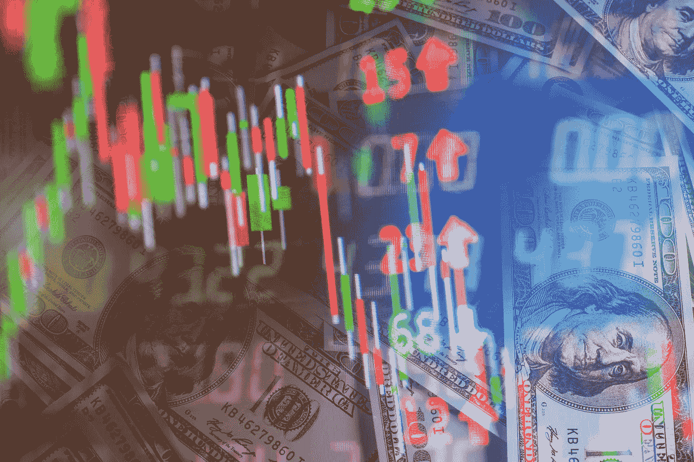
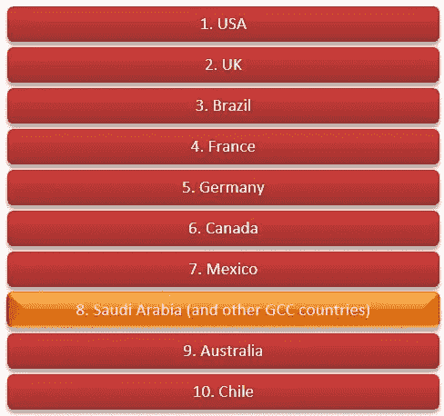

# 二元期权交易陷阱—陷阱 10

> 原文：<https://medium.com/hackernoon/binary-options-trading-trap-trap10-e041e9ce04f9>

二元交易(通常也称为二元期权交易或二元期权)是一种期权，交易者对股票或其他资产的价格采取是或否的立场，最终的回报是全部或没有。可以作为二元期权交易的资产有指数、外汇、大宗商品和股票。

**海湾合作委员会的二元交易。**

所有二元期权交易都是通过基于互联网的交易平台进行的，这给人的印象是这些交易平台位于 GCC，不符合适用的 GCC 监管要求，并且可能从事非法活动。以沙特阿拉伯为主的 GCC 在二元期权交易市场十大榜单中排名第八。

**十大二元期权市场**

**海湾合作委员会的诈骗类型。**

骗子们使用各种技术引诱海湾合作委员会的居民参与陷阱 10。暗示与 GCC 金融机构的关联是最令人担忧的部分。以下是我们能够识别的欺诈技术列表:

**品牌滥用:**诈骗者滥用 GCC 组织的品牌名称来吸引居民与之合作。最简单的方法之一是在公认的 GCC 组织的相似域名上托管二元贸易业务。另一种是通过创建公认的 GCC 品牌的相似社交媒体档案，联系并邀请目标个人，向他们暗示他们是合法的 GCC 组织。在调查 GCC 证券交易所的一个类似名称时，我们的分析师发现了一个实体[optional](https://www.optionrally.ae)注册的相同名称的多个变体，该实体是 GCC 中最受欢迎的经纪公司之一，但完全不受监管。(期权拉力赛在塞浦路斯注册，大概是在 CySec 名下)

**未注册的机构:**通过对其他网站的分析，如 [BancoFX](https://bancofx.com/ar/Home) 、[股票对](https://www.stockpair.net/link/373.html?p=24392&r=0.24392&bta=24392&lng=ar)、[热豪仁](http://rehaoren.com/sistem/info-616617.html)、 [Top Option](https://topoption.com/ar/) 和 [Option Rally](https://www.optionrally.ae/) 等，这些私营企业似乎是在巴林、沙特、阿联酋等海合会国家经营，而没有在国内正式注册。这些实体在其网站上列出了模糊的实际位置，似乎不受任何官方机构的监管；此外，电话号码在工作时间也无人接听。因此，我们认为它们很有可能是欺诈性的，没有注册为本地或分支机构。

**身份盗窃:**由于经纪人不受监管或监控，我们认为提供个人和信用卡信息的客户面临很高的风险，因为这些信息可能被用于欺诈目的。一个这样的例子是 No1Options.com，它需要用户的个人信息来注册。

**虚假陈述:**大多数二元交易网站都在使用致富营销方案，比如“想每天赚 1000 美元或更多吗？”吸引基于 GCC 的客户，并提供数倍于存款金额的奖金；然而，有相当大的细则，使其不太可能实现巨额利润。这方面的一个例子是在 [Banc De Binary](https://bancdebinary.com/) 、 [RehaOren](http://rehaoren.com/sistem/info-616617.html) 和其他银行，消费者被存款 200%回报的主张所吸引；然而，实际上，只有当交易金额是存款和奖金的 20 倍时，这种情况才有可能发生。

**操纵软件:**在不受监管的环境下，操纵 TRAP10 软件产生亏损交易是可能的。经纪人可以操纵交易软件来扭曲价格和支出。例如，当客户的交易是*赢*时，到期倒计时任意延长，直到交易变成亏损。我们确实发现了一个案例，其中一名交易员成为了这个骗局的受害者。其背景是，每个经纪人都有一个系统，在这个系统中进行交易，并开始倒计时。当时钟滴答到零时，受害者/交易者要么赢，要么亏损。这是一个标准的二元期权交易；然而，在时钟滴答到零之后会发生什么，状态改变为*到期*至少另一个 30 到 60 秒。在此期间，如果交易被关闭，股票可能会移动到足以让交易者/受害者失去他们的钱。OptionBit 就是大规模投诉的一个例子。

**未经授权的文章:**在我们的研究过程中，我们发现 GCC 中由支持 TRAP10 的未经授权的人撰写的文章正在误导公众。[arabicbinaryoption.com](http://arabicbinaryoption.com/)就是这样一个网站，它误导用户说，海湾合作委员会的著名股票交易所交易二元期权。

**二元交易在海合会合法吗？**

海湾合作委员会没有专门针对二元交易的法律框架。如果我们从赌博的角度来看二元交易，那么根据目前的框架，所有海湾合作委员会国家和整个阿拉伯地区都禁止赌博。与其他金融衍生产品不同，二元交易不受任何一个 GCC 国家的中央机构监管。

**二元交易在国际上合法吗？**

二元交易在美国最为常见，大量交易发生在北美衍生品交易所(Nadex)。根据我们对 Nadex 的分析，我们发现它是一家成立于 2004 年的私人实体。它是美国商品期货交易委员会(CFTC)正式认可的三家交易所之一。虽然 NADEX 是合法的，但它并没有受到定期的密切监督[2]。典型的交易上限在 1 美元到 15，000 美元之间，每次交易的购买成本偏高(交易双方各 90 美分)。很明显，Nadex 对于小预算的投资者来说仍然是一个低利润/高交易量的平台。Nadex 还没有被华尔街接受。

**二元交易平台:**

美国的一些二元期权在注册交易所上市，如 Nadex、Cantor Exchange LP 和芝加哥商品交易所，这些交易所受监管机构的监督，但这只是二元期权市场的一小部分。许多二元期权市场是通过不受监管、未注册和非法的互联网交易平台运作的。近年来，提供购买和交易二元交易机会的平台数量激增。塞浦路斯和直布罗陀等离岸目的地仍是经纪商颇具吸引力的大本营。

**GCC 实体和社区面临的风险**

海湾合作委员会的居民被骗走了钱，成为社会工程欺诈技术的牺牲品。

海合会金融机构和监管机构的负面声誉。

对被滥用来进行诈骗的品牌的直接影响，GCC 居民也可能出现在总部或相关机构，报告他们被滥用品牌的组织诈骗。

**海合会中很少的二元交易场所**

1.【https://www.24option.com/ar/ 

2.[https://bancdebinary.com/ar/](https://bancdebinary.com/ar/)

3.[http://ar.opteck.com/](http://ar.opteck.com/)

4.[https://www.optionbit.com/ar/](https://www.optionbit.com/ar/)

5.[https://www.optiontrade.com/eu/ar/](https://www.optiontrade.com/eu/ar/)

**结论&建议**

二元交易在其发源地美国没有被知名机构和市场专家广泛接受；这种做法可能会导致欺诈活动。我们也无法确定在 GCC 开展此类业务的许可法规。此外，我们不能确定任何海湾合作委员会的业务从事二元贸易，甚至认可它。

我们的建议是:

1.GCC 监管机构应审查这一业务实践，并对二元期权交易的合法性和法规采取立场。

2.海湾合作委员会电信当局至少应封锁暗示与海湾合作委员会国家或组织有虚假联系的网站。

3.GCC 金融机构应在内部以及向客户宣传 TRAP10 和相关诈骗。

4.在此类骗局中被滥用的 GCC 组织名称应采取持续行动，关闭反映与其名称有关联的网站。

**参考文献**:

1.[http://www . finance magnates . com/forex/brokers/binary-options-attraction-bcsc-warns-of-rboptions-24 options-goooptions and-trade rush](http://www.financemagnates.com/forex/brokers/binary-options-crackdown-bcsc-warns-of-rboptions-24options-gooptionsand-traderush)

1.[http://www . CFTC . gov/press room/press releases/fraud adv _ binary options](http://www.cftc.gov/PressRoom/PressReleases/fraudadv_binaryoptions%0d)