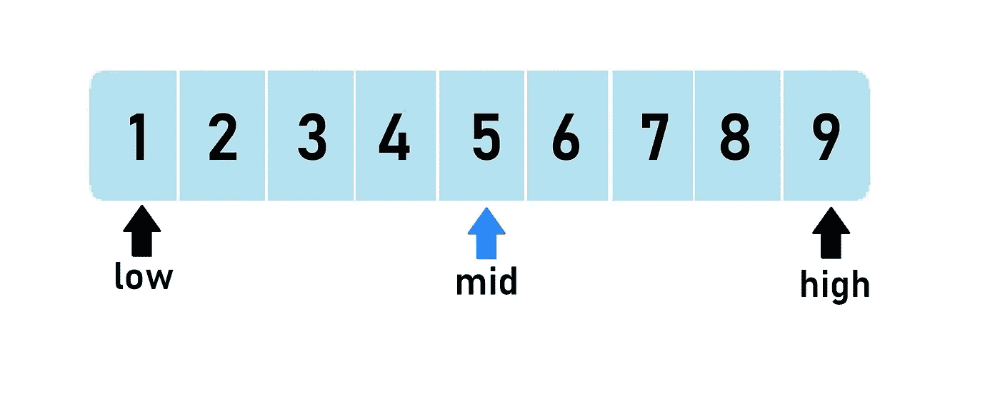

# 二分搜索法的细节

> 原文：<https://medium.com/hackernoon/binary-search-in-detail-914944a1434a>



我希望我们都对二分搜索法有所了解。但是我不会一步一步地解释这个算法，相反，我会深入了解二分搜索法是如何工作和使用的。

看看:[geeksforgeeks.org/binary-search](http://geeksforgeeks.org/binary-search)如果你不知道二分搜索法。

给定一个已排序的数组，我们找到最中间的元素并用键检查该元素。如果最中间的元素等于 key，我们就找到了 key。如果最中间的元素大于键，我们在最中间的元素的左半部分搜索，否则在右半部分搜索。

这是 Java 中二分搜索法的迭代代码

注意，在第 6 行，我们使用

```
int mid = (low + high) / 2;
```

但是这样计算 mid 是无效的。为什么？我们举个例子。
让我们取整数从整数低到整数高(两者都包括)。

请注意第 3 列和第 4 列中的公式计算出的中间值。

*   对于 low = 3 和 high = 11，元素数量(#elements) = 9
    ，因此只有 1 个 mid，即 7 个
    *两个公式都正确计算了 mid
*   对于 low = 3 和 high = 10，#elements = 8
    ，因此有 2 个 mid，6 个(较低 mid)和 7 个(较高 mid)
    *两个公式都正确计算了较低 mid
*   对于 low = -11 和 high = -3，#elements = 9
    ，因此只有 1 个 mid，即-7
    *两个公式都正确计算了 mid
*   对于 low = -10 和 high = -3，#elements = 8
    ，因此有 2 个 mid，-7(较低的 mid)和-8(较高的 mid)
    *公式`(low + high) / 2`未能正确计算较低的 mid，但另一个公式计算正确。

因此，我们应该始终使用下面的公式来计算较低的 mid，因为它要可靠得多:

```
int mid = low + ((high - low)/2);
```

当#elements =奇数时，我们只有 1 个 mid。所以我们可以用上面的公式来计算 mid。
当#elements =偶数时，上面的公式只给出了较低的 mid。
较高的 mid 可通过以下公式计算:

```
int mid2 = low + ((high - low + 1) / 2);
```

现在，有趣的部分…

让我们回到二分搜索法的迭代代码。注意三件事。
1。我们如何在低处和高处移动
2。我们如何计算 mid
3。while 循环中的条件

二分搜索法的美丽就在于这三样东西。让我们进一步探讨这个问题。

对于一个简单的二分搜索法，我们只需要找到数组中的元素，
我们使用下面的:
1。`low = mid - 1`为移动`low`为移动
为 2。`high = mid + 1`为动`high`为动
3。`mid = low + ((high - low) / 2)`(为什么？
以上讨论)4。`low <= high`在 while 循环中

我们对二分搜索法总是使用同样的条件吗？这取决于我们的问题陈述。

示例#1:

给定一个整数 x，在一个大小为 N 的数组中找到满足条件`y <= x`的最大元素 y

解决方案:

我们知道 x 可能不在数组中。所以给定数组中 x 的简单二分搜索法不起作用。但对二分搜索法来说，我们只知道 x，关键。我们需要找到数组中最接近 x 并且小于或等于 x 的元素(如果它存在的话)。

使用二分搜索法时，你应该记住三件事。应该如何低移高？
2。我们应该如何计算 mid？
3。while 循环中的条件是什么？

*我们总是从“如何在低位和高位移动？”然后了解如何计算 mid 以及 while 条件是什么。而不是相反。*

1.  *如何移低移高？*
    当`array[mid] < x`时，有可能当前元素可能就是答案(因为 y 可以小于 x)。
    所以，我们不应该在低位运行时丢弃 mid。
    于是，低就变成了`low = mid`，而不是`low = mid + 1`
    高保持不变，因为它与我们的问题陈述无关。
2.  *如何计算 mid？* 当我们使用`mid = low + ((high - low) / 2)`时，我们是在计算较低的 mid。因此，当数组中的#元素为偶数时，
    `if(array[mid] > x)`变为 false，因此控制将转到 else 子句，其中`low = mid`。这会导致无限循环。(为什么？举个例子)
    因此，我们取较高的 mid，即`mid = low + ((high - low + 1) / 2)`
3.  *while 循环中的条件是什么？* 由于我们是在 low 中存储小于等于 x 的最大元素，所以当 low = high 时应该停止，返回`array[low]`或`array[high]`。因此，while 循环中的条件是`low < high`。

Java 中的解决方案如下所示:

示例 2:

给定一个整数 x，在大小为 N 的数组中找到满足条件`y >= x`的最小元素 y

解决方案:

使用我们在示例 1 中使用的类似分析方法(自己尝试一下)，我们可以说

1.  `low = mid + 1`用于移动低位
2.  `high = mid`用于移动高位
3.  `mid = low + ((high - low) / 2)`用于计算 mid
4.  `low < high`对于 while 循环中的条件

因此，我们可以将使用二分搜索法的不同场景列表如下:

请随意试验这些条件，我希望您已经对如何使用二分搜索法有所了解。

合十礼！