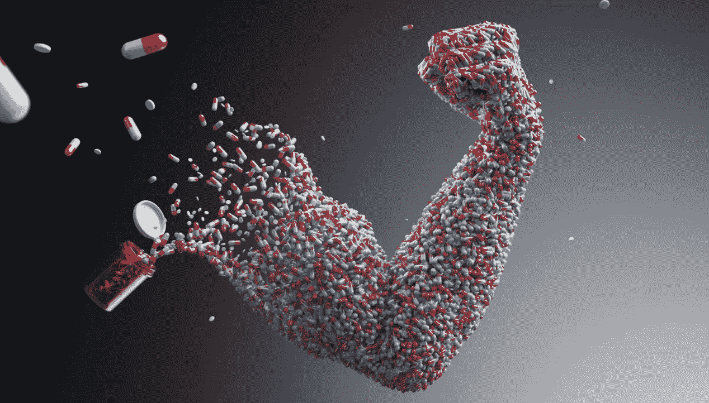
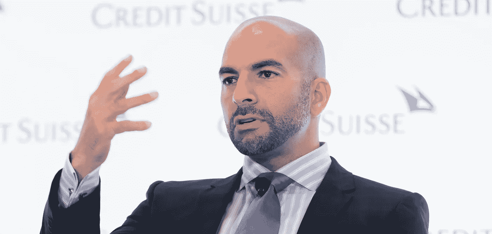
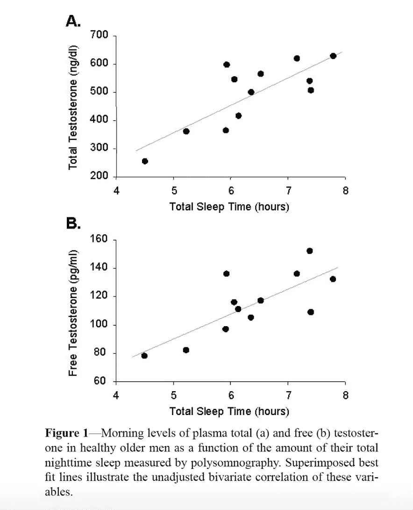
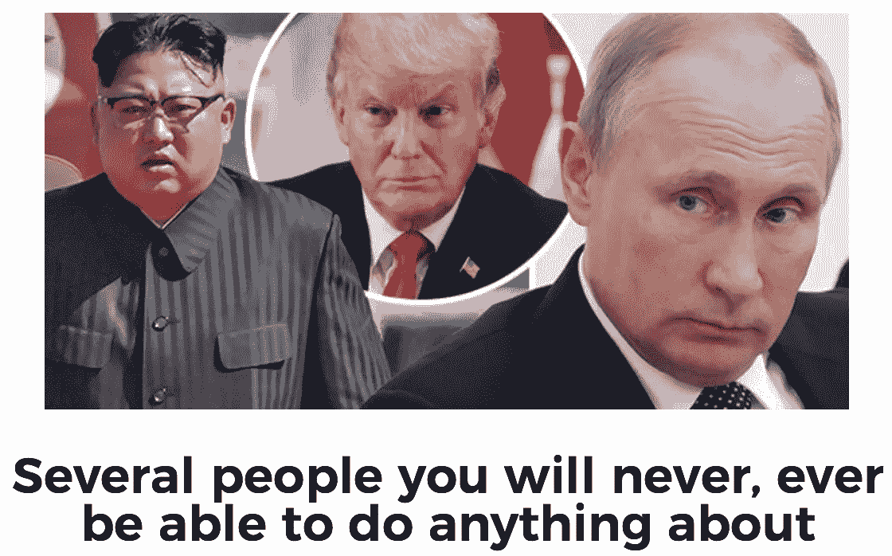
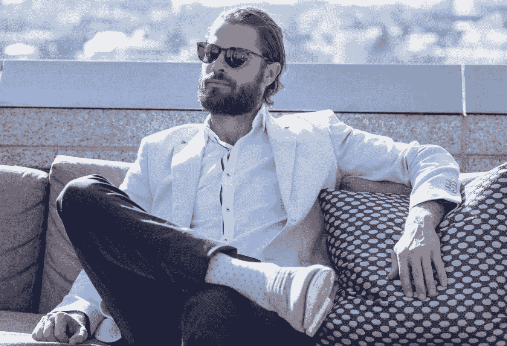
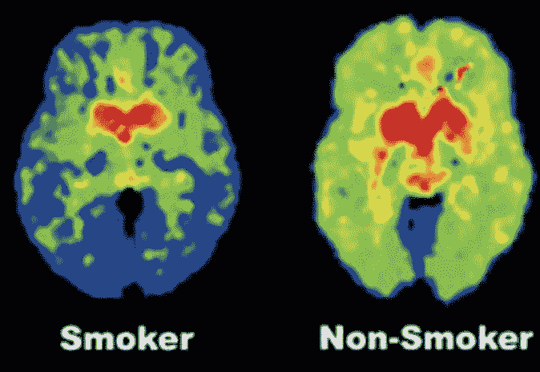

# 如何生物破解你的智力——从性到莫达非尼到摇头丸

> 原文：<https://medium.com/hackernoon/biohack-your-intelligence-now-or-become-obsolete-97cdd15e395f>

## Serge 的其他深度文章:

 [## 我如何设定和执行 50 年目标

### 在我以前的文章中，我谈了很多关于如何使用生物黑客变得更有效率、更健康、更…

hackernoon.com](https://hackernoon.com/how-i-set-and-execute-50-year-goals-why-i-see-cutting-in-lines-as-morally-right-f4d0ce28574f)  [## 我 32 岁，花了 20 万美元在生物黑客上。变得更平静、更瘦、更外向、更健康、更快乐。

### 这篇文章是关于如何使用现代科学和个性化医学让自己更健康，更有效率和…

hackernoon.com](https://hackernoon.com/im-32-and-spent-200k-on-biohacking-became-calmer-thinner-extroverted-healthier-happier-2a2e846ae113) 

# 更新时间:2019 年 1 月

> 作者注:写这篇文章以来，我想了很多。我故意让它变得非常具有攻击性，因为我想让人们谈论它并关注它。但是有些攻击性太过了，不符合我的价值观。
> 
> 我希望我们这些(像我一样)想成为后人类的人有一个美好的未来。我想鼓励所有人探索增强他们的健康、智力和生产力。如果你不这样做，就真的有被落下的危险。我也希望所有的人类共享一个惊人的、宏伟的未来，不管他们是否选择成为跨人类/后人类。
> 
> 如果我们做得好，我们将拥有无限的资源，这样每个人都能受益。人类和后人类的宏伟未来是兼容的。
> 
> 为此，我编辑了这篇文章，删除了一些我认为不能反映我如何看待这个世界的语言。要明确的是，我不会以任何方式背弃我的激进信念或目标。我刚刚意识到，我认为这些目标必须与他人的目标对立是错误的。每个人都有美好的未来。
> 
> 稍后我会写另一篇关于这个主题的文章。

# 介绍

我在假期有一些空闲时间，写了这篇文章，以个人故事为基础，展示了许多高度可操作的、基于科学的方法和工具，它们可以用来显著提高智力。

对我来说，这些包括合法/非法药物；利用性作为生物黑客工具；饮用酮酯；使用β受体阻滞剂或睾酮在谈判中获得优势；一天只吃一次；还有很多。

> 编者按:这个故事包含了一些限制级的生物黑客方法。我们出版它是因为我们想让读者了解科技行业的真实情况。继续进行，风险自负。

# 背景

我是一个老套的硅谷技术人员——俄罗斯人，斯坦福人，YCombinator，创办了几家大的/成功的公司，现在从事人工智能工作。

我之前的[文章](https://hackernoon.com/im-32-and-spent-200k-on-biohacking-became-calmer-thinner-extroverted-healthier-happier-2a2e846ae113)详细描述了，作为一个没有任何健康问题的 32 岁的人，我如何花费了大约 20 万美元来增强我的健康。成千上万的测试，医疗团队，几十种处方药。

我公开了我所有的数据。它显示了许多健康益处——身体脂肪减少 3-4 倍，非常高的运动表现(VO2Max ~70)，可忽略不计的炎症过程，睾酮增加 80%以上，以及许多衰老生物标志物的改善。

生物黑客很管用。

这篇文章非常受欢迎，拥有数百万读者。你们很多人都喜欢它。你们中的许多人感到愤怒和恐惧。对人类能力进行积极的生物增强长期以来一直是一个科幻梦。

而且(如果你读过前一篇文章)这里有具体的证据和大量的数据表明 ***已经在*** 工作了。

Credit to New Yorker for this awesome illustration

我认为我们正在做的生物黑客是人类分裂成不同物种的开始。增强型后人类，看起来一点也不像今天的人类。出于自身原因选择不这样做的未增强人类。

这一灾难性转变即将到来的原因是:智力已经可以被提高。

# 第一部分:智慧、财富和权力

## 那么什么是“智能”呢？

让我们使用麻省理工学院的马克斯·泰格马克教授在他的新书《T4 生活 3.0 》中使用的定义。

***— —智力=完成复杂目标的能力— — — —***

智能是 ***应用******多维*** 。智力不仅仅是智商或数学技能。

上面的定义对理解这篇文章至关重要——再读几遍。

智能有很多应用。但是如果我们深入研究，几乎所有复杂的人类目标都需要一系列的智力能力。这些可以分为:

1.  经典智力(CI):逻辑、问题解决、创造力、策略
2.  应用智能(AI):精力、注意力、意志力、情绪控制
3.  社会智力(SI):说服力、同理心、“社会技能”
4.  动态智能(DI):学习、记忆、知识的能力

“智力”指的是这些“普遍有用的智力能力”。我们可以说，我们当中那些拥有它们的人是“聪明的”，那些没有的人是“愚蠢的”。这可能会惹恼你们中的一些人，但是现在真的是时候停止假装我们都一样聪明了。这听起来很好，也很 PC，但是声称每个人都有大致相同的能力来实现复杂的目标显然是错误的。

智力:

*   个体之间*大相径庭。原因有很多——智商有 50 %- 80%是遗传的，而我认为其他类型的智力主要是环境因素。*
*   *在一个人的一生中不断发展，永远不会停止变化。*
*   *在一个发生生化变化的个体内部*大幅波动。**

**如果最后一部分不明显，测试你在根本不睡觉的情况下完成复杂目标的能力，当你患流感时，在激烈争吵后或喝了 10 杯浓缩咖啡后。**

## **那么，为什么智能增强会将人类分成不同的物种呢？**

****

## **先说一个很傻的故事:**

*   **试想世界上只有一种赚钱的方式:跑马拉松。我们所有人每天都在运行它们。**
*   **进一步想象一下，世界上所有的马拉松比赛正在迅速地联合成一场，获胜者获得的奖金份额在增加，获胜者可以参加比赛的寿命也在延长。预计这些趋势将继续下去。**
*   **在过去的 30 年里，出现了一批昂贵的新兴奋剂药物和技术，它们是无法检测的，健康的，并且在跑步中具有很大的优势。**
*   **此外，在接下来的 30 年里，将会出现更多这样的药物。一开始会很贵。只有我们这些已经赢了的人才买得起。**
*   **我们开始看到我们中的一些人谈论我们使用所有这些药物有多好。**

## **这与提高我们的智力有什么关系？**

**以上是 ***确切的说是*** 当今世界的样子。我们只需要用“智力”来代替“马拉松式跑步”**

****

**原因如下:**

1.  **有许多医疗和生活方式干预可以显著提高日常智力。莫达非尼，SSRI 微剂量，摇头丸，激素信号，最佳睡眠，线粒体增强运动，与成瘾新闻/社交媒体隔离，以及许多其他事情。**
2.  **这些干预措施中有许多是复杂的、昂贵的、需要毅力的、不容易带来回报的，而且如果做错了是危险的。这就是为什么我们中的许多人可能会晚几十年才采用它们。**
3.  **这些干预措施产生的更大的应用智能直接创造了巨大的**金融**、**社会、生理(健康)**和**智力**财富。当我们总是精力充沛，极具说服力，能够集中注意力的时候，生活是如此的容易。**
4.  **这些财富可以再投资于进一步提高智力，创造一个向上的财富螺旋。**
5.  **这种投资循环的回报将(a)随着生物技术的加速发展而增加(b)随着世界竞争越来越激烈而提供更大的比较优势(c)在几十年内复合，寿命大大延长。**

****

**US data on income quintiles vs life expectancy**

**收入已经在推动生物不平等，而且每年都在加剧。从上面的统计数据中，我们可以推测出，出生于 1985 年且收入最高的 1%的男性的预期寿命至少为 95-100 岁；对于女性来说，这个数字甚至更高。甚至在生物黑客之前。或者未来几十年生物技术的巨大进步。**

**为了确保活到 100 岁，我们这些生活富裕、身体健康的人只需要关注这些数据。**

**这些趋势感觉不可阻挡，甚至可能加速。**

# **第 2 部分:提高智能的框架**

## **从目标开始**

****关键点** : *不知道自己想要什么就不可能聪明***

****

**如果我们在不考虑目标的情况下阅读下面的所有策略，我们可能会留下这样的印象，Serge 基本上是在说“*我的是一条真正的道路，每个人都需要模仿我，在摇摆俱乐部里一边喝着 clomid-ketone 冰沙一边和模特做爱！！***

**我朝着自己特定的 50 年目标优化自己的智力。来建立一个平台公司，给我们一个奇点。帮助我们成为不朽的后人类神，摆脱我们生物学的限制，并传播到整个宇宙。拥有无限的丰富。**

**我们并不都有相同的目标。但我们应该接受，以上确实是我的*目标 ***我觉得它无比有意义。比浪费我的生命去买游艇和喷气式飞机，生孩子，或者给慈善机构捐款要多得多。******

**下面的框架旨在增强我们的智力，让我们得到我们想要的任何东西。但是你需要准确地知道那是什么，我不能帮你弄清楚。**

**我想成为神。注意“一个神”(就像许多超酷、超能力、超聪明的后人类中的一个)不是“神”**

## **第 1 部分:从应用智能开始**

****

****重点** : *如果你不能集中注意力，你真的真的他妈的蠢***

**总是从人工智能(精力、注意力、意志力等)开始。这是我们用来驱动其他一切的引擎。**

**这意味着:**

1.  **学会每天进入高能深流状态。关键干预措施:**固定睡眠**，做**间歇禁食**，让**荷尔蒙**达到最佳水平，使用**莫达非尼**，建立正确的**习惯/触发器**，拥有高质量的**深度停工期**。**
2.  **无情地移除一切阻止或中断我们心流状态的东西。关键干预:让自己对压力免疫(**冥想**、**锂**、**SSRIs**)；排除杂念(**去除新闻、社交媒体、拖延触发器**)；随着时间的推移，培养正确的习惯。**

**我们将在本文稍后深入研究所有这些工具。**

**每次我们成功进入深度流，我们就适应。下次就变得容易了。每当我们拖延，心流就会变得更加困难。**

**我们聪明的一个标志是，如果我们能够做到完全专注、真正深入、不间断地工作 5-8 个小时，没有拖延。**

**还有时间和精力去健身、交友、旅游、音乐、运动、睡觉、冥想等等。—所有这些我们都能够深入参与。**

**这是可行的。在 12 月，我用了 23 天完成了这件事，完全休息了 3 天，并且因为各种原因(可以进一步删减)有 5 天被中断到 0-3 小时的深度工作。**

**这种深度的工作很容易保持，但极难达到。我们很容易分心。这个世界很让人分心。**

**我们愚蠢的一个明显标志是，如果我们不读新书，不注意自己的健康，很少与朋友深入交谈，不学习新技能。因为我们“太忙了。”**

**虽然在一天结束时，很难准确地写下我们在忙碌中取得了哪些有价值的进步。**

****

**在这种情况下，我们实际上并不“忙”。我们是“愚蠢的”好消息是我们可以变得更聪明。**

**这是你写下愤怒的评论的时候，你的工作/孩子是如何阻止你深入工作的。建议:每天找一个小时深度工作。用它来学习一项新技能——图形设计，编码，等等。换个工作。请保姆帮忙带孩子。将你腾出的时间投入到更深入的工作中。这是一个智力逐渐上升的循环。**

**我们这些觉得以上太长/太难，想要更简单的东西的人，只会一直傻下去。**

**高应用智能让我们成为生活的主宰。**

## **第二部分:投入时间/精力来积累知识财富**

****

****关键点** : *每日聚焦+生物黑客=极限智能***

**如果我们在人工智能方面做得很好，我们将拥有巨大的能源和集中的时间。那(我们可以推测)只有无限期的<1% of us will ever achieve.**

**The question is what to invest it into. Key candidates:**

*   **Further enhancements to AI— i.e. obsessively thinking about the reasons we did not hit our deep work goals and fixing them. Remember: this is the engine that powers everything else. Call distracted you? Turn on Do Not Disturb. Laptop discharged? Carry a battery. Braindead after lunch? Don’t have lunch. Couldn’t get back into flow after a 10am meeting? Don’t have meetings until afternoon. And so on, *。***
*   ***社交智能。知道如何说服他人比“书本型聪明人”更能提高我们的智力。而且是极其“可生物破解的”——**冥想**，**摇头丸**，更高的**睾酮**，**β受体阻滞剂**， **SSRIs** 。这些东西可以增强我们的肢体语言，让我们自信、冷静、有同理心、有自知之明。这按下了其他人类所有的劝说按钮。另外，我们大量的深度工作资源可以用来在镜子前练习肢体语言，阅读合适的书籍，写有说服力的文章。高 SI 是让生活变得轻松的超能力。而且是 ***远比高智商的*** 更强大。世界只是为了适应我们想要的而弯曲。***
*   **动态智能(即学会学习)+经典智能(即智商)。我们也许可以通过已知的增强神经可塑性和成人神经发生的东西来直接促进这些。**营养素/补充剂**如**镁**、**胆碱**、 **EPA/DHA** 、**姜黄素**或**香蕉**。像 SSRIs 和锂这样的药物。**冥想**和任何其他**减压**。让**睡得特别好**。**间歇性禁食**。**间歇训练**。 **LSD** 或 **psilocybin** 。**已知莫达非尼**可安全/直接增强认知能力。更重要的是，几十年的高 AI 使我们能够不断学习新的复杂技能和思想；让我们更聪明，因为我们训练大脑；让增强这一切成为一个简单的日常习惯。**

****

**上个月，我花了几天时间阅读罗伯特·恰尔迪尼(说服大师)的《预先说服》。进展缓慢。做笔记。在接下来的一周将想法应用到一个关于生物黑客的公开演讲中。在一篇长长的推荐中提炼出核心概念——给朋友们的回顾。这本书成了人类行为的精神模型。它的许多要点使得这篇文章极具说服力。**

**这是 deep work 让我们做的许多事情之一——真正理解、内化和应用复杂的新想法。**

**在过去的一年里，我读了大约 40 本书+上了大约 8 门在线课程([这里是推荐列表](/@sergefaguet/books-moocs-i-recommend-e17972960bc) )+学会了编码；创办了一家新公司([镜子表情键盘](https://www.mirror-ai.com/) ) +在硅谷筹集了估值最高的 Q1 种子轮+推出了一款高评级的产品，很可能创造物质财富；撰写生物黑客文章，吸引了数百万读者，并帮助在硅谷结识了令人惊叹的志同道合的领导者；平均睡了 8.5 小时(睡眠部分 proofpic！)+每周健身，隔天打坐；结交了令人惊叹的新朋友+去了可怕的毒品之旅+有很棒的性+住在世界各地。感到真正的快乐。并对几十年来每年都保持这种增长轨迹感到兴奋。**

**但让我们与 5-10 年前相比。我不开心，没效率，很胖(27%的男朋友)。在生活中被运气、完全否认和极端的野心所推动。我很愚蠢。我从来没有向别人或自己承认过，但我的生活糟透了。自杀的念头出现过几次。幸运的是从来没有在一个严重的方式。**

**重点是:生物黑客可以极大地改善我们的生活。让我们利用一切可以得到的医学技术来增强我们的智力。现在开始。用几年甚至几十年的时间把所有的钱再投资到建立智力、财务、社会和生理财富上。利用即将到来的新技术。我们会实现我们想要的一切。引领未来。健康快乐。**

# **第 3 部分:可操作的智能增强器**

**如果你想讨论健康问题，请阅读上一篇文章。这个也会提到一些相同的东西。让我们健康的东西也是让我们聪明的东西。但是这篇文章是专门为了帮助我们所有人提高智力而写的。**

**(我花这么多时间写这个，还有一个更深刻、更有趣的原因。到最后就很明显了)。**

## **免责声明:**

**不要盲目地复制这个。我和一个拥有几十年医疗经验的医学博士团队一起做这些事情，这个团队由世界上最顶尖的健康优化医生之一[彼得·阿提亚](https://peterattiamd.com)领导。**

****

**Peter Attia**

**如果你读了他的一些文章，比如关于预防心脏病的文章，关于 T2 胆固醇的文章，关于 T4 酮症如何提高运动能力的文章，以及关于为什么你是否肥胖并不真正与卡路里有关的文章，你就会理解我们在做决定时所考虑的深度。彼得和他的团队真的以同样的坚韧和奉献精神去追求他们的任何建议。**

****

**特别是，我们做了数千次测试，知道我们的干预对我来说没有太大风险。但是我们每个人都有不同的身体。例如，我的肾功能 eGFR > 160(30 岁人群中的前 1%)，而你可能没有。这意味着你的风险可能更高。小心点。**

*****再次声明:我只是一个来自互联网的家伙。不是你的医生。我不对你的健康负责，也不是让你盲目听从我的建议。*****

# **第 3.1 部分:应用智能—能源和焦点**

## **睡眠**

****

****关键点** : *如果你睡眠不足 8 小时或者睡眠时间不一致，你就是在操自己，让自己变笨，帮自己得老年痴呆症*。**

**如果有人想要所有的科学，看看这本书——它引用了数百项研究，其中许多是作者(加州大学伯克利分校睡眠实验室主任，世界领先的睡眠神经科学家之一)亲自进行的。这里我们将只列出重点。**

**即使是轻微的睡眠剥夺(睡眠 6-7 小时)；昼夜节律转换(从一个晚上到下一个晚上每天改变 1-2 小时的睡眠时间)；或者深度 NREM 睡眠或快速眼动睡眠的减少会以下列方式降低我们的智力:**

*   ****应用智力**:严重降低情绪控制力、抗压能力、意志力和专注力。拖延症明显增加。**

****

*   **荷尔蒙失调。会导致情绪恶化和精力下降。而且睾丸尺寸更小([没错，真的是](https://academic.oup.com/aje/article/177/10/1027/101677))。见上图——你睡得越多，荷尔蒙分泌越多。**
*   ****免疫力明显降低** = >多生病= >生产力降低。他们通过给人们注射鼻病毒并剥夺其中一些人的睡眠来测试这一点。为了科学！**
*   **动态智力(Dynamic Intelligence):记忆前一天所学内容的能力显著下降，第二天的学习能力也显著下降。**
*   ****经典智力**:显著恶化的认知和看到创造性的非平凡解决方案的能力。**
*   ****社交智能**:有实际实验显示，睡眠不足的人更难读懂面部表情，被认为更不具吸引力和说服力等。**
*   ****大脑废物清除恶化**(发生在 NREM 深部)= >导致老年痴呆症的蛋白质积聚= >对睡眠使能中心的永久损害= >进一步的睡眠退化= >我们完蛋了。我奶奶有老年痴呆症。如果有任何迹象表明我得了这种病，我会亲自冷冻自己。如果冷冻不是一种选择，我宁愿去死。**

**此外，除了上述让我们变得愚蠢的事情之外，我们还有:恶化的胰岛素抵抗、癌症、心血管疾病、车祸风险、运动表现等等。**

**我没有时间把所有的研究联系起来，但它在书里。此外，我们大多数人从个人经历中肯定知道以上是真的。我觉得自己在睡懒觉后的下午像个白痴。**

**换句话说，睡眠是提高智力的主要机会。它影响了许多其他的事情。对于我们大多数人来说，睡眠质量很差。**

****

**首先是一个重要的理论:**

*   **睡眠由两个独立的功能驱动:积累睡眠压力(腺苷)和昼夜节律(生物钟+褪黑激素)。如果这些不同步，睡眠质量就会下降。**
*   **睡眠有许多不同的阶段(快速眼动、浅 NREM、深 NREM 是一个简单的分类)。**
*   **这些阶段(1)具有非常不同的功能(2)以不同的顺序、在夜晚的不同时间发生，并且取决于睡眠压力/昼夜节律(3)都是必要的。**
*   **睡眠其实并不是你“关机”的状态；这是一个大脑和身体非常活跃的阶段。**

**这意味着，如果我们花 7 个小时在床上，我们会睡大约 6 个小时，并切断睡眠的最后阶段，使它们的独特功能退化 80%以上。如果我们从一天到下一天改变我们的就寝时间 2 小时，我们破坏了睡眠的早期阶段，并使他们的独特功能下降 80%。**

****重点:***你以为睡 6 个小时或者晚睡 2 个小时会稍微降低睡眠质量，但实际上他们做得非常严重*。**

**因此，睡得更好意味着花更多的时间睡觉，在正确的睡眠阶段(T21)，在一天中正确且一致的时间(T23，T24)。**

**首先要做的是测量。彼得、其他领先的健康优化者和我推荐奥拉环。使用代码“sergef”从他们的新版本中获得 100 美元；我没有从中赚取介绍费(他们好心提供，我拒绝了)。我们更喜欢这种特殊设备的原因是，它比所有腕带提供的数据更准确。就血流分析而言，皮肤厚度、皮肤颜色和接触紧密度对手指都更有利。**

****

**My sleep metrics on a given day**

****

**My monthly sleep metrics over the last 9 months**

**以下是我们想要的关键东西:**

*   **每天 8 小时的 ***实际睡眠*** 。这意味着我们在床上度过了 8.5-9 个小时。我平均 8:30 在床上度过，其中 7:45 是睡眠。目标是每天睡 8:10 左右，所以要睡 9 个小时。**
*   **每天相同的睡眠时间。当我们每天的睡眠时间以小时为单位变化时，我们实际上是生活在一种永久的时差状态中。这使我们的睡眠压力与生理节奏不同步，破坏了睡眠的某些部分，尤其是深度 NREM 睡眠。**
*   **每天 1-2 小时的 NREM 深度睡眠。根据我从 Oura 看到的数据，这将是我们大多数人面临的最大挑战。平均每天我得到大约 1:20；我的目标是达到 1:30，并持续保持良好状态(我有时会莫名其妙地下降到 20-30 分钟)。**
*   **每天 2 小时以上的快速眼动睡眠。我平均 2:45，脑力劳动多的时候到 5:30。这已经很高了。**

********

**Resting heart rate trends through the night**

*   **低而稳定的静息心率。我们可以在上面看到每个人引用的不同年龄的大致参考范围。我在好的时候是 47 左右，坏的时候是 56，平均 52，这很好。我们希望它在夜间保持低+稳定，如上图所示。这表明睡眠非常宁静。**
*   *****这一生一世*****

**为了睡得更好:**

*   **选择一个我们在床上度过 8.5-9 小时的睡眠时间，并且每天不要超过 20 分钟。这是现代社会难以置信的困难，也是让我们睡得更好的第一件事。**
*   **睡觉前戴上 3-4 小时的防蓝光眼镜。Gunnars 不错。另外，最近我一直在使用[这些](https://www.amazon.com/Blue-Blocking-Amber-Glasses-Sleep/dp/B01GSFTX08/ref=sr_1_45?ie=UTF8&qid=1516300534&sr=8-45&keywords=blue+light+blocking+glasses)，因为它们阻挡了更多的蓝光。他们看起来确实很奇怪，但是我们必须决定我们的自我是否比我们的健康/智力更重要。**
*   **不要喝酒。即使少量也会降低快速眼动睡眠，而快速眼动睡眠是专注于智力的睡眠的关键部分。有趣的花絮:人类和猴子睡眠的主要区别是人类有更多的快速眼动。所以我们这些喝酒的人基本上把我们的睡眠质量变成了猴子睡眠，我们可以推测这种睡眠的长期影响。顺便说一下— [那些关于红酒好处的研究都是扯淡，抱歉](https://www.google.com/search?q=red+wine+benefits+debunked&oq=red+wine+benefits+debunc&aqs=chrome.1.69i57j0l2j69i64l2.6237j0j1&sourceid=chrome&ie=UTF-8)。**

****

*   **睡觉前 9 小时内不要喝咖啡或茶(如果代谢快)或完全不喝(如果代谢慢)。咖啡因的半衰期出奇的长。上面的图表是平均的，但我们中的 50%(像我一样)代谢快得多，50%代谢慢得多，根本不应该喝咖啡因(对他们来说，它与主要的健康风险有关)。这种区别纯粹是遗传性的，基于[基因 rs762551](https://www.snpedia.com/index.php/Rs762551) 。**
*   **在凉爽的温度下睡觉(18 摄氏度；65 华氏度)睡觉前尝试热水或冷水淋浴。低体温有助于进入深度 NREM 睡眠。我发现冰浴让我很快入睡(违反直觉)。**

****

*   **确保我们的卧室完全黑暗和安静。使用耳塞和睡眠面罩。即使是不叫醒我们的声音，实际上也会让我们的睡眠更糟糕。**
*   **锻炼可以改善睡眠，但要在睡前 3 小时以上进行。考虑睡前至少 3-4 小时不要吃太多。**
*   **糖和碳水化合物会降低 NREM 深度睡眠的质量。又一个不吃那玩意的理由。**
*   **不要使用安眠药。它们让我们失去知觉，但实际上并没有让我们入睡。这些是不同的事情。**
*   **考虑在睡觉前冥想或者关掉它。**

**事情是这样的:就像本文中的大多数建议一样，上面的东西有复合的好处。每晚糟糕的睡眠都会对我们造成永久性的伤害，我们永远无法完全恢复这种伤害。部分损害是对睡眠本身的破坏，随着时间的推移，睡眠会让我们变得愚蠢、衰老甚至死亡。**

**我们中的许多人不想改变我们的社交生活、约会等。为了睡觉。**

**这是一个轻重缓急的问题。你想去俱乐部，还是不想得老年痴呆症。**

## **压力:尽一切可能降低压力**

****

****关键点** : *压力过大、消极、情绪化的人基本上都有长期脑损伤***

**持续的压力确实会伤害一切:它会让认知能力变得更差[ [1](https://www.ncbi.nlm.nih.gov/pubmed/7620309) [2](https://www.ncbi.nlm.nih.gov/pubmed/21376129) ]，耗尽能量，甚至切断我们大脑中的成人神经发生和神经可塑性[ [1](https://www.nature.com/articles/1301574) [2](https://www.ncbi.nlm.nih.gov/pubmed/20451611) ]。使内存变得无用。干扰荷尔蒙系统[ [1](https://news.utexas.edu/2010/09/27/stress-hormone-blocks-testosterones-effects-study-shows) ]。它以多种方式使我们衰老和死亡。这里有另一个关于长期压力如何毁了我们的 50 多项研究。**

**换句话说，持续的压力让我们变得愚蠢。我们能做的任何减少它的事情都是一个巨大的胜利。以下是我发现的对此有用的具体工具:**

****

*   **SSRI 抗抑郁药艾司西酞普兰(我每天服用 10 毫克)可以增加血清素。它消除了过去每月 1-2 次的“坏心情日”。减少对压力的反应倾向。生活总是感觉好一点。它还被证明可以促进成人大脑中新神经元的生长[[1](https://www.newscientist.com/article/mg21028083-500-how-antidepressants-boost-growth-of-new-brain-cells/)23]。**

********

**艾司西酞普兰即使在大剂量下也是非常安全的，尤其是对我来说，因为我的基因与这种特定药物的高阳性率和低阴性率有关。**

**旧的抗抑郁药(如 MAOI)是危险的。也有研究表明，即使是最新最好的抗抑郁药对你也是有害的。我的医疗团队对这些研究持怀疑态度。最大的原因是“病态队列偏倚”这些“研究人员”将一群开了抗抑郁药的抑郁症患者与未服用抗抑郁药的人进行比较(同时声称神奇地补偿了后一组人显然更健康的事实)。得出结论，广告组在某种风险上有一点点不同，并向容易受骗的媒体宣传这一点。这是扯淡，不是科学。**

**我的医生自己服用 SSRIs，并没有从给我开处方中获利。所以我相信他们的结论。**

****

*   **锂。我们每天从水中获取大约 1-3 毫克。它被开给双相情感障碍患者，剂量为 800 毫克-2000 毫克/天。我每天服用 100 毫克(即比已知的安全剂量少 10-20 倍)。原因:(1)它被证明可以促进神经发生，并与大量的医学益处相关联[ [这里是一份关于其各种益处的> 50 项研究的列表](https://selfhacked.com/blog/the-benefits-of-lithium/)(2)从主观上看，它似乎促使我的压力恢复能力略有增加。在这个剂量范围内，似乎没有很好的理由不服用锂。**

****

*   **冥想。我每天冥想 30-45 分钟，结合正念和自由式记谱法。从吃饭、听音乐到坐在滑雪缆车上，在做事情的时候冥想“生活”。我和我的朋友们有一个私人的 Slack 社区，我们在那里分享冥想日志，并与一位才华横溢的冥想教练讨论它们。我的冥想时间是无组织的——一种在汽车后座，有一点空闲时间，或者只是无聊的时候进行冥想的习惯。这比无意识地浏览互联网更好地利用了时间。随着时间的推移和指导，冥想变得越来越好——现在我非常擅长冥想，仅仅通过观察身体的表现，我就可以在 5 分钟内消除一种极其强烈的情绪。**

**我们可以完全不信教，不需要相信冥想(可悲地)被包围的任何神秘的废话。有大量严肃的科学证据表明，冥想对从神经发生到认知、情绪、注意力和疾病风险的一切都有价值[ [这里收集了大约 50 项关于这个](https://selfhacked.com/blog/meditation/)的研究]。**

**一旦我们擅长冥想，它提供了我们可以使用的非常具体的应用技巧。以下是我每天都会用到的一些:**

1.  **情绪是一系列特定的身体感觉[ [链接](https://www.theatlantic.com/health/archive/2013/12/mapping-how-emotions-manifest-in-the-body/282713/) ]。一旦它们显现，它们就会被关于它们的[思想](https://en.wikipedia.org/wiki/Rumination_(psychology))的循环所强化。因此，当你想轻松摆脱一种情绪(例如孤独、愤怒或自我怀疑)时，你可以坐下来，找到你身体中的那种情绪，并密切关注它。这打破了沉思循环(因为你没有思考)并增强了你的自我意识(因为你发现情绪驱动的身体感觉= >理解你的自我怀疑仅仅是一种瘙痒)。我可以在 30 秒— 5 分钟内消除负面情绪。他们就这样消失了。**
2.  **我可以“从侧面”看到自己我睁开眼睛，在笔记本电脑上打字，但同时我也能看到我面前的自己。闭上眼睛更容易做到这一点，这是一项可训练的技能，也相当困难。这很有用的原因是它让你从自己的情绪和自我中分离出来。你可以对自己说“*为什么坐在那边的那个家伙对一些工作上的废话感到恼火？他很清楚，各种屁话无时无刻不在发生，这只是普通的一天。***

**虽然我冥想了(不正确的)5 年，但感觉在冥想中我只是触及了表面。我已经很容易控制自己的情绪了。我今年的目标是达到负面情绪甚至不会出现的地步。这是可行的。**

****

*   **将消极的人从生活中移除。有些人让我们快乐，充满活力和灵感，我们从他们身上吸收新技能，我们期待看到他们。还有一些人让我们精疲力尽，让我们充满了他们自己的不安全感、恐惧和消极。即使后者是我们的老板、亲戚、朋友、配偶，我们也要减少和他们在一起的时间。我们可以感同身受，但我们没有责任去修复他人。很难自我修复。**

**此外，我还看到了其他章节中描述的增强抗压能力的材料。最重要的是更好的睡眠，性，摇头丸，新闻/社交媒体的去除，以及荷尔蒙的增加。**

****

**关于压力的最后一个要点:我们对压力的偏好是长期的。**

**压力和恐惧增加了杏仁核(我们大脑中产生恐惧的部分)的大小和力量，这反过来使我们更容易感到压力和恐惧。**

**如果我们不断地恐惧、紧张、沮丧、消极、怀疑他人——从医学角度来说，我们是“有病”的，因为我们的大脑结构由于长期的损害正在做一些对我们有害的事情。这是有害的——对此有大量的科学证据(参考上面列出的所有研究)。我们可以变得更好，但这需要时间和努力。**

**积极保持低压力水平。它不仅让我们更快乐、更健康。它让我们变得更加聪明。**

## **性:也是生物黑客工具**

***【2019 年 10 月:我编辑了这一部分，以反映我对该主题的最新想法】***

**向女性观众道歉。这个部分是面向男性的。这就是我所知道和优化的。**

****

****要点** : *性=对你有好处。人类=不是一夫一妻制。不谈恋爱的时候，我只是雇时装模特来做爱，这样可以节省约会的时间，专注于其他更重要的事情。伟大的性=生物化学。***

**我认为性类似于锻炼、冥想或食物。另一个生理需求需要以省时的方式解决；另一个增强健康(显然是指安全性行为)和智力的工具。性爱对智力有益的原因有很多:**

*   **如果我们没有得到它，我们会花很多时间去思考它。追求它，看黄片等等。无用的分心。**
*   **社会是性别化的，它将男性自我与性联系在一起。这样做会让自我满足，也更容易控制。**
*   **性爱会带来有益的荷尔蒙变化，增强情绪，减轻压力，甚至有助于睡眠。有趣的是，我甚至注意到性和我自己的深度睡眠水平之间有非常明显的相关性，任何改善深度睡眠的东西都是非常有价值的。**
*   **有证据表明，性促进了我们的神经发生和神经可塑性。[ [1](http://journals.plos.org/plosone/article?id=10.1371/journal.pone.0011597)**

**获得美妙的性爱需要太多的时间和精力:**

*   **为了性而约会，而不是深入的关系，需要很多时间。很多时间都被浪费了。对不适合的人。在一些愚蠢的事情上，比如在 Tinder 上刷卡或者去俱乐部(睡觉)。随意约会=用我们的时间和精力换取性，并让我们的自我确信我们是受欢迎的。**
*   **如果我们和一个真正的朋友在一起，分享我们的价值观，一夫一妻制的长期关系会很好——我现在正处于一段长期关系中，我非常珍惜这段关系。但是一夫一妻制对于性欲来说是一个具有挑战性的解决方案。人类生物学不是一夫一妻制。我引述:“*总体而言，在人种学地图集的 1231 种文化中，84.6%被归类为一夫多妻制(一男多女)，15.1%被归类为一夫一妻制，0.3%被归类为一妻多夫制(一女多男)。*”[[1](https://www.psychologytoday.com/blog/darwin-eternity/201108/are-people-naturally-polygamous-0)]。**
*   **这意味着人类并不倾向于一夫一妻制。要么出轨，要么在感情中受挫。这两个我都不能接受。这适用于男人和女人，然而女人有更糟糕的遭遇——社会因她们不是一夫一妻制而羞辱她们，而男人却默许她们追求自己的性欲。“玩家”是正的，“荡妇”不是。**
*   **坦白地说，在网上的一次性现金会议上直接为性付费是令人不快的。**
*   **出于某种原因，手淫并没有带来同样的好处。似乎我们确实欺骗了我们的大脑，但并不完全。**

****

**在人生的这个阶段，我的解决方案很简单:**

*   **我有来自俄罗斯/欧洲模特行业的代理，他们为我安排约会/性爱(我付钱，他们安排所有的后勤，我什么都不用做)。**
*   **整件事组织得出奇的好。想想“messenger bot 或封闭的 instagram 个人资料，每天发送大约 50 个新的投资组合——高调、详细的投资组合，带有视频、杂志封面链接和 instagram 个人资料。”**
*   **如果我和某个女孩很合得来(这种情况发生过很多次)，我们只是在喜欢的时候见面。没有对关系的期望或对彼此的任何要求。**
*   **有一些简单的方法可以破解情感化学。一起冥想或小心地服用正确的药物，在健身房锻炼后立即做爱，做一些有趣的事情，比如去秋千俱乐部。**
*   **我认为这是最佳选择的一个重要原因是所有“有钱人骚扰女人”的故事。这样每个人都毫不含糊和诚实地同意。带着明确的期望。和数据轨迹。**

**基本上:当我喜欢的时候，我可以和我觉得有魅力的女人做爱。性的所有心理和生理价值，用很少的时间或情感成本。帮助我对我拥有的长期关系有更多的欣赏，因为我满足了性欲，感到自由，对女朋友限制我没有怨恨感。没有风险，因为每个人都很开心。**

**社会告诉我们,“正确的”性行为需要 X 个月/日期的相互了解才是好的。当然，它必须“不以外貌或金钱为基础”(这一理论很容易被化妆品和兰博基尼的存在推翻)。**

****

**事实上，美妙的性爱只需要按下正确的生化按钮。仅此而已。**

**你们很多人都默默地做着我做的事情。或者幻想着去做。公开做就好了。你会看起来自信且充满力量。这个世界不会告诉你不要做你想做的事。**

**顺便说一句，正确的长期关系可以是惊人的和有价值的。我希望这些是诚实的，基于真正的联系。不要说“我真的很饥渴，我要浪费我的时间去找那些我根本没有长期兴趣的女人。”**

**最后，如果你认为追求自己的欲望，鼓励所有人，不分性别，都这么做，这就是“厌女症”，你可能要查一下“厌女症”的定义了。**

## **荷尔蒙:**

****

****重点:** *你的荷尔蒙很可能出问题了。修复它们，它能改善情绪、精力和健康。总的来说让生活变得精彩。***

**由于与现代生活相关的原因(压力、睡眠不好、污染等。)我们大多数人都会有次优激素。**

**如果没有昂贵的专业帮助和测试，这个问题很难解决。但确实值得探讨。总的想法是:**

1.  **多次测试我们所有的荷尔蒙系统**
2.  **了解研究或让高质量的内分泌学家来识别机会(例如，如果 TSH > 2，我们可能有与甲状腺功能相关的机会)。**
3.  **探索干预措施，尝试它们，看看我们的感受，再次测试生物标志物。**
4.  **优化并重复**

****

**My testosterone change in ~2 months (after blocking pituitary estrogen receptors with clomid)**

**我的甲状腺激素和睾丸激素水平“低于平均水平，但在临床上是正常的”。通过我在之前的帖子中描述的有针对性的干预来促进这两者。**

****

**这在物质上改善了情绪，增加了能量。此外，睾丸激素对社会智力非常重要(在后面的章节中解释)。它增加自信、侵略性、支配行为以及承担风险的意愿。相关的肢体语言和行为使人们更容易听你说什么，做你想做的事。**

## **间歇性禁食:**

****

****重点:** *每天吃一次让你更聪明更健康。***

**我一天只吃一次——下午晚些时候/晚上早些时候，24 小时禁食。我几乎每天都这样做。这个:**

*   **通过促进自噬(2016 年[诺贝尔生理学或医学奖](https://www.nobelprize.org/nobel_prizes/medicine/laureates/2016/press.html)授予了这一机制的发现者)，降低癌症、心脏病和阿尔茨海默氏症的概率，具有重大的健康益处。**
*   **节省了大量时间。每天吃一次是一个巨大的时间胜利，因为它消除了上下文切换。**
*   **防止下午精神萎靡，让我们的思维更加敏锐。**
*   **通过改善 BDNF/神经可塑性直接提高智力。**

**以下是 [~70 项支持性研究](https://selfhacked.com/blog/intermittent-fasting/)。科学界有一个非常广泛的共识，那就是 IF 对你有好处。**

**基本上，它让我们更聪明，节省宝贵的时间，让我们更健康。想想看，30 年来每天多一个小时的集中注意力是多么大的优势。我们会活得更久！**

**这也是自然的。所有那些关于吃早餐和一天吃 5 次的愚蠢的狗屎忽略了一个非常明显的问题:你真的认为你进化到可以吃 24 小时自助餐了吗？你认为狩猎采集者一天吃 5 次吗？**

**这是一个显而易见的问题。刚开始有点辛苦，但是身心适应的很快。**

## **饮食性酮病**

****

****要点** : *如果你不吃糖、加工食品和谷物，你的身体和大脑会工作得更好。因为你猜他妈的什么？进化设计你主要吃脂肪！***

**酮症的一个简单解释是，我们正在将我们的身体转换成燃烧脂肪，而不是葡萄糖。这需要我们从脂肪中摄取几乎所有的热量，并且可以通过手指血棒非常精确地测量。**

****

**My ketone (left) and glucose (right) in mmol/l on a random day**

**为什么酮症是好的基本论点如下:**

*   **对于一个氧化反应，酮的分解比葡萄糖的分解提供更多的能量(多 20-30%)[[1](https://www.ncbi.nlm.nih.gov/pubmed/7768357)]。从根本上说，这是一种更清洁的燃料，每单位性能更少地“腐蚀”我们所有的系统。我的医生彼得·阿提亚在这里的一系列文章中很好地解释了这些细节。**
*   **我能听到你在争论"*是的，所以进化并没有以这种方式建造我们，Serge 认为他可以将他身体的新陈代谢效率提高 20-30%*"实际上——这让我们回到了进化创造我们的初衷。在我们开始种植谷物之前，碳水化合物和糖类很少。我们基本上只能从浆果丛和蜂箱中得到它们。高膳食脂肪消耗和酮症是我们的自然状态。**

****

**有大量证据表明酮症是有利的。如果你想了解的话，这里还有另外 70 多项研究。**

**问题是酮症在现代社会非常棘手。比间歇性禁食难多了。原因是糖和碳水化合物无处不在+它们非常容易上瘾。为了防止酮症，我们真的必须吃接近零的糖，我们的碳水化合物必须限制在少量的水果+我们将从蔬菜中获得的。**

**看起来有一项有趣的技术即将出现——马克·安德森资助的生物黑客公司 HVMN 开发出了第一种商业级[酮酯](http://hvmn.com/ketone)，它确实可以快速而显著地提高酮含量(我在 15 分钟内获得了 0.5= > 3.4，对于那些知情人士来说)，并降低血糖。旧的酮盐产品没有得到同样好的结果。**

**当我服用他们的酮酯时(注意:虽然我是创始人的朋友，但我并没有从他们那里获得任何介绍费或类似的收入)，我感到能量/注意力快速而持久地流入。另一个特别严重的影响是需要少呼吸——在正常活动、桑拿浴和间歇跑中。**

**目前，这很昂贵(一整天呆在 keto 每月约 3000 美元)而且令人不愉快(这东西尝起来……真的很糟糕，尽管首席执行官 Geoff 说这个问题很快就会解决)。希望两者都会变得更好。我真的很喜欢到目前为止我所感觉到的效果，以及酮健康益处背后的科学。除了断断续续的酮饮食之外，我可能每天都要吃这个。**

## **锻炼:**

**我在之前的文章中写道，没什么可补充的——做间歇训练(不要胡说八道长时间的有氧运动或马拉松)，做大量的髋关节铰链练习，少坐。这可能通过激素系统、睡眠、压力控制等促进智力。；即使它没有，你会想这样做的健康福利。**

## **分心和上瘾的认知垃圾:消除它们**

****

****关键点:** *技术、通知和新闻媒体都是吸吮我们时间和精力的吸血鬼。***

**许多事情都需要深入、专注的工作。切换上下文非常昂贵。如果我们被一个 5 分钟的电话从编写代码中分心，我们不会损失 5 分钟，我们可能会损失几个小时的出色工作。**

**还有更多。每当一个通知，一个电话，一个 YouTube 视频分散我们的注意力，我们的神经网络就会重新布线。我们变得更容易分心。注意力不太集中。更沉迷于这些东西。**

**我们变得更加愚蠢。**

****

**现代科技和媒体是故意设计来让我们上瘾的。脸书高管对此的一些名言:**

*   **“*你的行为——你没有意识到，但你正在被编程……你必须决定你有多愿意放弃，你的智力有多独立，”“我的解决方案是我不再使用这些工具了。我已经很多年没有这样做了。”“[我的孩子]不允许使用这种狗屎。* " — Chamath Palihapitiya，前脸书增长部主管[ [1](https://gizmodo.com/former-facebook-exec-you-don-t-realize-it-but-you-are-1821181133) ]**
*   **“*构建这些应用程序的思维过程，脸书是其中的第一人，……都是关于:‘我们如何尽可能多地消耗你的时间和有意识的注意力？’…正是像我这样的黑客会想出的那种东西，因为你在利用人类心理的一个弱点。*”—脸书前总统肖恩·帕克[ [2](https://www.axios.com/sean-parker-unloads-on-facebook-2508036343.html)**

****

**这不仅限于社交应用。新闻媒体，从 Buzzfeed 到《纽约时报》,都在过度渲染威胁，优化点击诱饵式的标题，并尽一切可能让我们关心那些实际上与我们生活完全不相干的事情*。***

***没错——声称让我们了解信息并抱怨脸书设计令人上瘾的技术的新闻媒体实际上靠劫持我们的思想、消耗我们的时间和精力而繁荣。并直接让我们成为更有压力、消极、愚蠢的人。***

***你真的想把你的时间和有限的注意力资源花在担心金正恩会做什么上吗？为什么。他妈的。你愿意吗？在乎吗？***

***(如果你认为担心金正恩确实有价值，我要求你在评论中列出阅读政治新闻帮助你在 2017 年做出的具体决定，以及这些决定带来了哪些 ***具体、有价值的结果*** )。***

**以下是我们如何应对这一挑战的一些想法:**

****

*   **这是我的 iPhone 主屏幕。它被故意设计得井井有条，并触发我看书(Kindle)、听播客和有声书(多云、可听)和使用我的最新产品([镜像表情键盘](http://mirror-ai.com))。考虑将 Safari 和 messengers 从这个屏幕中移除，因为虽然它们是不可或缺的，但我们不想让我们的大脑使用它们。有一个明显的效果——在我把它们从视线中移开后，我没有一个好的理由就停止检查它们。还有我的 iPhone 被切换成灰度变暗了(但是我不能截图)。这个想法是让一切变得不那么丰富多彩/吸引人/令人上瘾(你可以在可访问性中做到这一点)。**

****

*   **我的桌面同样整洁简约。**
*   **除了日历和优步，我所有的电话通知都关闭了。脸书、Instagram 和类似的应用被删除。**

****

**Futile attempts to reach Netflix**

*   **我的 Mac 和 iPhone 上都有一个虚拟专用网，可以随时禁止社交媒体和所有新闻网站的网络流量。**
*   **我将这个网站黑名单添加到 Mac 主机文件中，这样就更难绕过禁令了。这里有一个[指南](http://osxdaily.com/2007/03/19/block-access-to-specified-sites-by-modifying-etchosts/)来做这件事。**
*   **我确实使用信使/电子邮件，但没有通知。试着每天回复不超过 2-3 条。我很少接电话，也从不接陌生人的电话。当然，我们可能会失去一些机会，但说真的，谁在乎呢？如果我们有大量的时间和精力，生活充满了机遇。**
*   **我住在旅馆里。但是如果我买了房子，它也会被设计成引发正确的行为。从引起关注的整洁的房间，到厨房里癌细胞旁边的糖的照片。这玩意管用。**
*   **我已经至少 10 年没有打开过一个电视频道了。不夸张。**
*   **有物理黑客可以通过减少传入的感官数据来帮助保持专注。我最喜欢的是 Etymotic 耳塞+ Bose 主动降噪耳机顶配；和帽衫来缩小视野。有魅力女人在身边的时候有用:)。我在哪里读到过，你们中参加记忆比赛的人会买一副遮光眼镜，并在上面钻孔，以便在聚焦时进一步缩小视野。我想试试这个，考虑到我们的视觉使用了多少脑力，它实际上很有意义。**
*   **我几乎忽略了所有的请求；只有在我能从他们身上学到东西或者他们是朋友的情况下，才和他们见面；几乎从不在下午两点前开会。**
*   **还有很多其他的事情。关键的一点是，我坚持不懈地寻找为什么我在某一天不能获得足够的流量的原因，并修剪这些原因。**

**你们中的一些人可能会觉得这是极端的，不值得花时间投资。记录你在拖延症、社交媒体、新闻文章等方面浪费了多少时间。在一个典型的月份里。对我来说，这个数字曾经是一天几个小时，现在接近于零。我们在控制信息空间方面的投资可以获得数倍的回报。一旦习惯了就容易了。**

****

**这一段也是我选择不生孩子的原因。我们没有人会不同意，孩子是非常分散注意力，扰乱睡眠多年；通常耗费大量的时间、精力和精力；而且由于我们无法控制的原因，他们有很大的失败风险。**

**鉴于我的目标，我只是看不到孩子的投资回报。他们永远也不会把我的时间、注意力和精力还给我。一旦我们自己能够长生不老，就没有必要把我们的基因传递下去(而且有充分的理由认为我们中的一些人会这样做)。我们可以有其他有意义的长期项目。如果我们感到孤独，我们可以和朋友一起服用摇头丸，或者提高我们的激素和神经递质。真正的幸福是在我们的生化状态中。我们可以不经过中间步骤就得到它。**

## **第 3.2 部分:社会智能——说服**

## **社交智能:比智商聪明得多**

**对于我们当中的高智商内向者来说，这是个坏消息。唐纳德·特朗普比我们聪明。**

****

**Just radiating intellect**

**他一次又一次地从破产中幸存下来，如果我们处在他的位置，这些破产会毁掉我们大多数人。像玩小提琴一样玩弄媒体。成为美国总统。他也不是一个幸运的昙花一现的奇迹。几十年来，他一直在实现我们大多数人非常想实现的事情。**

**这不是对他的认可。我不喜欢他做的事。但他的“执行复杂任务的能力”(即智力)很高。并且它是基于 SI 的。肢体语言。对人类情感按钮的理解。人脑把注意力和可信度等同起来。即使你真的不喜欢他，学习他的一些技巧也是有意义的。**

**(在大选前 15 个月，我下注 2 万美元赌特朗普会赢得总统大选。对于我们这些社交智商高的人来说，特朗普总是会赢。**

**我们应该认识到，社交智能远比智商强大得多。社交智能如此强大的原因是它的规模。对人类情感按钮的理解使我们能够用他们的技能让别人喜欢和支持我们——不管他们是谁。**

**高智商和用形式逻辑辩论的能力当然也是有用的。飞机不是靠情绪飞行的。但如果我们，在观察了我们自己和其他人类一辈子之后，认为我们可以用逻辑/事实/智商说服/领导/联系他人，我们就是真正的*他妈的愚蠢。***

***有大量证据表明，社会智力和社会地位对智力有许多二级影响:神经发生、快乐、智力、脑容量、竞争欲望、降低压力等。这是一整本书，书中充满了罗伯特·萨波尔斯基的支持证据，他是斯坦福大学的首席神经学家。为了避免我们认为这仅仅是因为人类的社会不平等，大量的研究被重复，甚至对猴子的社会智力和社会地位也是如此。***

***那么——我们如何提升它呢？***

******

***前提是要真正内化人类是“非理性的”。但这种不合理性是高度可预测的。我们必须在内心深处理解并相信这一点。***

***最喜欢的“非理性”的例子(我很清楚启动研究是有争议的):***

***当我们在葡萄酒店里听到法国音乐时，我们的偏好就会转移到法国葡萄酒上。即使我们从来没有意识到音乐。***

***事情以这种方式运行的原因实际上是高度合乎逻辑的。***

***在我们大脑的某个地方有法国的神经网络，法国音乐，法国葡萄酒，法国国旗图像。它们是相互联系的。这就是我们如何知道这些在某种程度上是相关的。触发法国音乐网会触发所有链接的网，包括法国和法国葡萄酒的网。因此，此时此刻，传入法国葡萄酒网的信号比传入意大利葡萄酒网的信号强一点。这改变了我们的决策概率。我们都不会注意到。***

***我们所有人都是可编程、可破解的机器。***

***那么——生物黑客如何帮助我们的 SI？***

******

***An example of confident body language***

*   ***肢体语言、眼神交流和声音音调比我们说的话更有说服力。生物化学会影响这些东西。例如，睾丸激素既是自信肢体语言的原因，也是其结果。看起来并表现出主导地位反过来会增强我们的说服力——其他人对我们要说的话更感兴趣。这种对自信的偏见如此根深蒂固，只要我们还是人类，它就会一直存在。我通过定制疗法大大提高了我的睾酮水平(详见我之前的文章)。***
*   ***所有抗压工具——SSRIs，Lithium 等。—进一步增强你放松自信的肢体语言。我们都想与积极、自信、无压力的人交往。***
*   ***最近，一位顶级硅谷企业家告诉我，他在大型公开会谈中使用β受体阻滞剂来保持冷静。然后我发现这是你们当中钢琴演奏者的最爱。还没试过，刚弄了点心得安。听起来是个很棒的主意。如果在一场紧张的谈判中，我们头脑冷静，心率 70，而对手是 120+，我们就有实质性的智力优势。***
*   ***摇头丸有一个独立的部分。***
*   ***还有很多其他的黑客。如果我想在公共场合表现得积极/热情，我会先做 50 个俯卧撑。如果我想更平静，我就冥想。***

******

*   ***最重要的是，凭借我们庞大的应用情报储备，我们可以投资于 SI。阅读书籍[[]我的清单包括一些我最喜欢的关于这个话题的书籍](/@sergefaguet/books-moocs-i-recommend-e17972960bc)。看我们自己的视频，在镜子前练习。做公开演讲。写有说服力的博客文章。与朋友&家人深入交谈。学习神经科学课程。几十年后，我们可以成为斯科特·亚当斯所说的说服大师[ [读读他那本关于说服、川普以及为什么人类不理性的令人敬畏的书](https://www.amazon.com/Win-Bigly-Persuasion-World-Matter/dp/0735219710)。***

## ***摇头丸:社会智能药物***

***最近，我在旧金山给大约 200 名成功的领导者做了一个关于生物黑客的演讲。当我问他们中有多少人服用摇头丸(附表 1 在美国是非法的)，超过 50%的人举手。***

***想一想。***

***我没让你接受。但以我的主观经验来看，摇头丸比其他任何东西都更能提升社交智能。它的影响是永久的，而且非常有益。***

******

***科学研究表明，MDMA(摇头丸)的风险似乎远低于酒精和烟草。这对于任何研究过科学的人来说都是显而易见的]。FDA 即将批准它用于治疗创伤后应激障碍，并称这是一项“突破”[1](https://www.popsci.com/fda-says-mdma-is-breakthrough-drug-for-ptsd-patients)。***

***我拍摄的场景是与朋友/家人在寒冷的房子里聚会，美妙的音乐和氛围，有精确测量的已知供应。***

******

***对于我们这些没试过的人来说:效果是:***

*   ***社交焦虑和自我消失了。我们可以自由地告诉别人我们真实的想法和感受，而不用担心被评判。我们可能认为我们无论如何都会做这些事情，但这是情感开放、自信和自由的不同层面。***
*   ***我们非常喜欢与周围的人互动，并对他们深感同情。我们非常外向——与刚认识的人建立深厚的联系是微不足道的。***
*   ***没有关于未来或过去的自我对话。我们完全沉浸在那一刻，就像是在一次深度冥想之后。***

***有趣的是，对我来说，以上所有的效果都是永久性的，尽管它们在 MDMA 上没有那么强。***

******

***最大的好处是，我变得非常乐于公开我是谁和我的感受。在这篇文章中，我公开承认服用非法药物和花钱买春。对我来说，说出我过去最大的不安全感是什么(*身高——5 英尺 8 英寸，并为此花费了数年时间*)或者我一生中最尴尬的谎言(*在我实际上被斯坦福 GSB 大学录取之前撒谎；它传到了招生办主任那里；尽管如此，我仍然不确定我是如何说服他让我加入的。顺便说一句，我所有的朋友和家人都读过这些文章。****

**完全不在乎别人对我们的看法是极其自由的。做我们自己。**

**事情是这样的:我们都喜欢那些如此开放和诚实的人。这让我们变得有趣。难忘。值得信赖。有关系。自信。这使得深入交谈变得容易，从而建立关系。当我们无所畏惧，直接去要求的时候，我们就很容易得到生活中想要的东西。很少有人使用这种极其强大的黑客技术。**

****

**酒精(美国每年 88，000 人死亡)、烟草(480，000 人死亡)和阿片类止痛药(15，000 人死亡)是合法的，但摇头丸(50 人死亡)不是。显然，我们中的许多人明白这一点，但不尊重这条法律(在我的旧金山样本中，超过 50%的人公开表示他们使用摇头丸，而几乎没有人吸烟)。**

**不科学、不合理的药品法律从整体上破坏了法律的道德权威。**

# **第 3.3 部分:动态和经典智能——智商和学习能力**

## **莫达非尼:被证明能增强我们的应用和经典智力**

****

**牛津大学最近的一项研究回顾了 25 年来所有关于莫达非尼的英国研究，并得出结论认为，当**执行复杂任务**和**时，莫达非尼显著增强了**健康的非睡眠剥夺人类**的注意力、执行功能和学习能力(*即智力，以其可以想象的最清晰的形式*)，而没有任何副作用或情绪变化**。【 [1](http://www.ox.ac.uk/news/2015-08-20-review-%E2%80%98smart-drug%E2%80%99-shows-modafinil-does-enhance-cognition) 】。**

**我每天早上(越早越好)服用 100-200 毫克，并计划一直这样做。有趣的是，有些人发现他们的睡眠被打乱了。**

**首先决定向所有公民免费提供莫达非尼的国家将在全球经济中获得巨大的竞争优势。**

## **有它的用途**

****

**我曾经服用 Adderall XR(多年来每天服用)。Adderall 非常有效，也非常安全(这里有一篇关于科学的大型综述，它清楚地表明 Adderall 可以给你超人的专注力，而没有太多真正的风险)。**

**我改用莫达非尼是因为我发现 Adderall 让我更焦虑+让我太容易专注于不重要的事情。**

**当我需要做一些无聊但重要的事情时，我仍然偶尔服用它。例如，在我上一家公司，我阅读/编辑了关于 Adderall 的关键法律文件。我建立的机制在几年后给了谈判优势。当审阅 200 页厚厚的法律术语时，一个每小时 1000 美元的投资者律师被 Adderall 的创始人删除了。**

**但总体来说我不推荐。太厉害了。**

## **神经发生、神经可塑性和学习**

****

****重点:** *这篇文章里的很多东西都有助于你长出新的神经元。那有助于你学习。如果你不经常学习新的和有挑战性的东西，你的智力会下降。哦，还有迷幻药。***

**学习本身就是一种需要培养的技能。为了全面了解学习的神经生物学，我强烈推荐完成 Coursera 上的[学习如何学习课程。这对我们所有人来说都很容易，也很有价值——无论是高中生还是 CEO。](https://www.coursera.org/learn/learning-how-to-learn)**

**学习依赖于神经可塑性和神经发生——即我们的大脑生长新神经元和重新构建现有神经元之间的突触连接的能力。这些是由一种叫做 BDNF 的东西驱动的，这种东西是高度可变的。**

**我们已经提到了一些东西可以增强这些:锂，SSRIs，睡眠，冥想，减压，性，禁食。这里还有一些:**

*   **补品。我吃的:EPA/DHA Omega-3，镁，姜黄素，烟酸，红景天，Bacopa。你可以在 Examine.com 的[读到所有这些。](http://examine.com)**
*   **运动，尤其是高强度的间歇训练。**
*   **LSD [ [自然杂志](https://www.nature.com/articles/nrn2884)上的一堆相关研究**

**[这是另外 50 多项支持性研究](https://selfhacked.com/blog/a-comprehensive-list-of-natural-ways-to-increase-bdnf/)。**

**关于迷幻药的最后一点值得单独提及。我最近开始服用迷幻药。有趣的经历。没有幻觉，但是思想在游荡，强烈地关注各种感官输入，并以新奇和不可预测的方式联系想法。我发现不可能做专注的工作。但这似乎是一种令人难以置信的方式，可以深入享受音乐、艺术甚至洗澡之类的东西。这似乎也是一种非常强大的方法，可以在一段时间的高度集中之后，将思维转移到一种分散的思维模式，这对于学习来说是必不可少的(详见上文提到的课程)。即使是大剂量的迷幻药也是极其安全的。当我想休息一天时，我会不时地使用它们。*注意:不要混合 LSD 和锂*。**

****

**如果你是那种看不起那些服用非法药物的人，你应该知道史蒂夫·乔布斯、比尔·盖茨、理查德·费曼、托马斯·爱迪生和许多其他顶级商人、科学家和领导人都使用非法药物，并经常谈到他们的成功至关重要。**

**当然，为了提高我们的学习技能，我们需要不断学习。我们可以自学编码或完成神经科学或遗传学或量子物理学或法语或弹钢琴的课程，而不是把我们宝贵的时间和神经元花在政客的失败、名人的习惯或恐怖袭击的细节上。即使我们从来没有使用过量子物理学，学习它也会让我们更聪明，更有能力学习任何其他概念，以及以新颖的方式将它们与量子物理学联系起来。**

## **补充品:**

****

**这篇文章已经够长了。我服用大量的补充剂——每天 50 片以上(这是上面的真实图片)。它们基本上是超级安全的东西(如浓缩大蒜)，可能有看似合理的好处。更多详情请见健康文章。**

## **避免污染和毒素**

****

**重点: *污染，尤其是吸烟会损害你的大脑。***

**众所周知，许多污染物直接损害智力(铅、汞)；具有广泛的负面神经影响(挥发性有机化合物，如苯乙烯)；并破坏激素信号(在世界各地观察到，外源性雌激素与长期睾酮下降有关)。**

**我尽可能地避免所有这些。实际上，这意味着:**

*   **尽量生活在空气清洁的区域+在通风良好的空间度过。我期待着有人创造一个方便，不太可怕的个人空气过滤口罩，我可以在城市中佩戴。**
*   **不要喝塑料容器中的热液体，通常尽量避免塑料靠近你的食物。**
*   **吃昂贵的本地/有机食物。当然，我们真的不知道里面有什么。但是昂贵的食物是一个概率游戏。便宜的食物保证充满了从抗生素到杀虫剂的各种狗屎。他们就是这么便宜的。**

****

*   **不要吸烟或花时间在吸烟者附近。尼古丁是一种促智剂，但是香烟中的其他物质——苯、苯乙烯等。——不仅仅是给我们癌症， ***从这个词最清晰的意义上来说，它让我们变得他妈的愚蠢。这里引用美国环保局的一段话:“人体接触苯乙烯会对中枢神经系统(CNS)产生影响，如头痛、疲劳、虚弱、抑郁和 CSN 功能障碍*。”[ [1](https://www.epa.gov/sites/production/files/2016-09/documents/styrene.pdf)****

**我知道我在这篇文章中多次使用了“愚蠢”这个词，但与吸烟的愚蠢相比，这些都相形见绌。**

## **安慰剂**

****

**Placebo: definitely good for you**

**这些干预措施中的许多很可能带有明显的安慰剂效应。安慰剂太棒了。如果我们真的相信一种干预的有效性，这种信念本身就会产生部分预期效果。这是医学上最可靠的观察结果之一。**

**乐观本身对我们是健康有益的。**

## **摘要**

****

**我多次提到这一点。但是这东西会合成。想想看，如果你有几十年专注的学习，令人敬畏的睡眠，健康的身体，练习社交技能，积累财富和权力，你会变得多么聪明。一个别人永远追不上的向上螺旋。因为社会中的收益以指数形式集中在最顶端，最大化你的智力收益是巨大的。**

**深度工作习惯也训练我们有“深度停工期”与我们的朋友和家人进行深入的交流，展示我们的弱点，了解我们的本质。而不是盯着我们的手机，心烦意乱地讨论天气(正如我们大多数人所做的)。**

**这整个方法不仅对创造财富和影响力是健康和有用的。也是他妈的牛逼的生活方式。**

# **第三部分:结论**

**让 AlphaGo 在下围棋的(非常狭窄的)领域里变得超级聪明的，并不是轻松乘以大数的能力，而是持续获胜的能力。**

**同样，如果我们完成了复杂的目标，我们也是聪明的。如果我们不这样做就太傻了。智力是基于我们的生物化学。**

**这篇文章是关于执行得非常好。你还应该选择正确的目标，并在不同的时间框架内将它们联系在一起。我对未来 40 年的十年有非常笼统的目标= > 2018 年相当具体的 OKRs(目标和关键结果= >季度 OKRs = >它们通知我每周和每天的优先事项。换句话说，我可以将我今天的行动项目“*寻找教练，帮助我训练我的声音变得更慢*”与“*的年度 OKR*”和“*在 2060 年后的某个时候成为不朽的后人类之神*”联系起来**

# **现在，为了本文的真正目的:**

**这篇文章有许多建议，可以让我们这些采纳它们的人变得更聪明、更快乐、更有影响力。我真心喜欢帮助别人。**

**但还有一个更深层次的目的。**

****

**我想生活在一个人类消失后的未来，与我认同的价值观一致:知识、科学、技术、自由、进步、权力、富足、纯粹的精英管理、乐观主义。部落主义、宗教、传统、民族国家、非理性情绪、保守主义和社会主义对世界的影响力要小得多。**

**我知道，只有你们当中持有非常相似的技术官僚世界观的人，才会内化并痴迷地适应这些黑客技术。相信不同价值观的人会说这是未经证实的。太激进了。太诡异了。太没人性了。太遥远的未来而不在乎。太复杂了。**

**这些工具将帮助采用它们的团队获得更大的影响力。从而有助于进一步推动这样一种局面，即我们这些具有与我相似价值观的人能够影响人类的议程。这将创造一个比我们今天拥有的更好的世界。**

**所以对我来说，我们在这种方法上的分歧本身就是这种方法的一个特征。**

****

**这篇文章——精心构思了诸如性、非法毒品和恐惧等引人注目的概念——旨在帮助实现我所相信的美好未来。**

***********************************************************************

## **Serge 的其他深度文章:**

** [## 我如何设定和执行 50 年目标

### 在我以前的文章中，我谈了很多关于如何使用生物黑客变得更有效率、更健康、更…

hackernoon.com](https://hackernoon.com/how-i-set-and-execute-50-year-goals-why-i-see-cutting-in-lines-as-morally-right-f4d0ce28574f)  [## 我 32 岁，花了 20 万美元在生物黑客上。变得更平静、更瘦、更外向、更健康、更快乐。

### 这篇文章是关于如何使用现代科学和个性化医学让自己更健康，更有效率和…

hackernoon.com](https://hackernoon.com/im-32-and-spent-200k-on-biohacking-became-calmer-thinner-extroverted-healthier-happier-2a2e846ae113)**