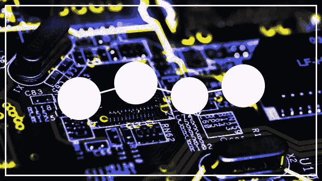
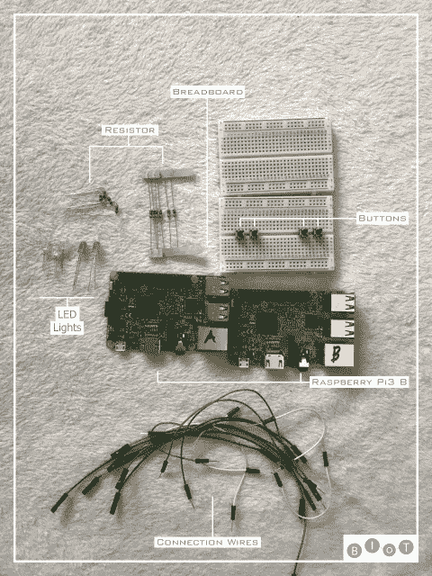
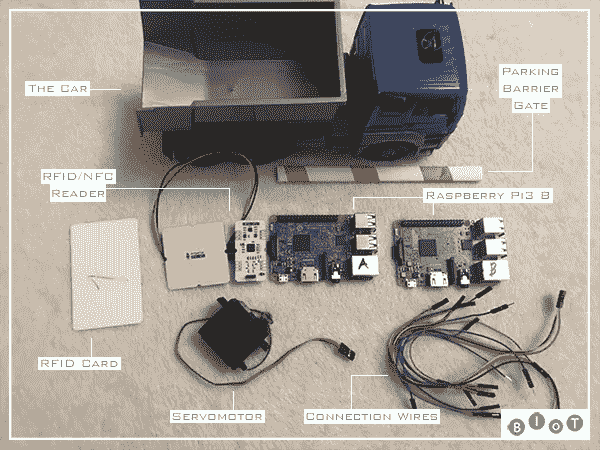
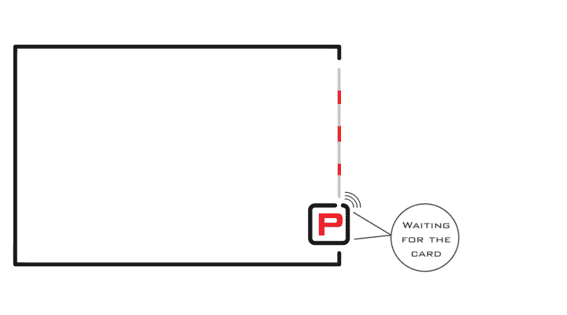

# BIoT:我们系统工作的真实例子

> 原文：<https://medium.com/hackernoon/biot-real-examples-of-work-of-our-system-20ed741c74a1>

我们系统的主要核心和支付渠道的开发被带到了每个人都可以测试我们的解决方案的状态。在[第一篇文章](/@BIoT/welcome-to-biot-iot-solutions-on-byteball-platform-94c4d7640f03)中有更多关于我们项目的信息。因此，现在是将言辞转化为行动的时候了——我们希望展示我们系统的真实运作情况。为此，我们构建了两个 DIY 项目:“获取活动”和“按使用付费”。

## 项目# 1——活动的获取

对于第一个项目，我们采取了一个简单的想法——通过我们的系统，使用[支付渠道](https://docs.google.com/document/d/19s4LYDfbWDREzVzUwxPuoKANeIGOgPGKV2zI9jTsPSg/edit#)购买东西。在这种情况下，我们以购买不同颜色的 led 灯为例，当您点击按钮时。

Devices for DIY #1

为了实现，我们需要两个“Raspberry Pi-3 B”:第一个设备——购买，第二个设备——销售。以及连接和激活项目设备的其他细节。

观看此视频，了解它的实际应用:

【https://github.com/BIoTws/DIY-1_Acquisition_of_activity】源代码:

## *项目# 2——按使用付费*

*我们的第二个项目是一个可以在现实生活环境中广泛使用的想法——按使用付费。这种做法的本质是，在使用某样东西的同时付款。在我们的案例中，我们采用了“停车”用例，即按使用停车位的单位时间付费。*

**

*在进入停车场之前，汽车扫描 RFID 卡，之后支付通道打开，允许进入停车场——付款开始到达。当汽车离开停车场时，它再次扫描 RFID 卡，然后支付通道关闭，系统允许汽车离开停车场。*

**

*观看此视频，了解它的实际应用*

**源代码:*[*https://github.com/BIoTws/DIY-2_Pay_per_use*](https://github.com/BIoTws/DIY-2_Pay_per_use)*

## *BIoT 系统可以应用在哪里？*

*我们不仅希望创建一个物联网系统，还希望创建一整套应用程序，作为一个套件，用于支付、数据收集、设备监控和通信，以及所有类型的管理。*

**

***BIoT 解决方案及示例:***

*   ***智能物流**
    -监控交付货物的条件和路线
    -根据路线和条件支付交付费用
    -收集和监控存储物品的数据以加快仓库运营*
*   ***智慧城市**
    -收集可用停车位的数据，监控并支付占用空间的费用
    -自适应路灯照明并支付电费
    -收集数据并监控高速公路上的通信情况*
*   ***智能农业**
    -控制温室中的小气候条件，管理和支付资源
    -收集他们的牛的位置和健康数据。
    -农场和附属建筑的远程保护和控制*
*   ***智能零售**
    -为所倒饮料的数量付款
    -使用与付款相关的无人机向客户交付货物
    -收集和监控库存商品的数据*
*   ***智能家居**
    -支付暖气费管理室内温度
    -智能家电监控
    -控制窗户和门锁*
*   ***工业物联网**
    -由几台机器生产选定的零件并支付资源
    -监控仪器的位置以加快生产过程
    -确保机器人之间的通信*
*   ***物联网医疗**-远程健康监控
    -控制服用药物的剂量
    -收集和监控设备、工作人员和患者的位置数据*
*   ***网络解决方案** -付费阅读文章及其存储
    -赌博解决方案-付费观看视频和广播*

*这只是我们能做的一些例子。*

## *BIoT 的未来*

*我们正开始一个新的阶段，有着宏伟的计划:*

*   *优化和提高我们系统的稳定性*
*   *在其他编程语言上实现协议和实例*
*   *支持离线工作，以及微控制器上的工作*
*   *文件的创建*
*   *在 PC / Android / iOS 上开发客户端，通过使用 HTML5 上的迷你应用程序或聊天来管理设备并与之交互*
*   *创建一个展示真实案例的布局，用于参加展览*
*   *商业模式的阐述*

*还有更多…*

*为了所有计划的实施和增加竞争力，我们需要大量的资源和努力，这就是为什么我们开始寻找合作伙伴和资金(可能是一个 ICO)。*

## *联系我们*

*关注我们的 [*Twitter*](https://twitter.com/BIoT_ws) 获取最新消息，并在 [*Telegram*](https://t.me/BIoTOfficial) 上加入我们的社区。我们的 github 简介—[*biot ws*](https://github.com/BIoTws/biot-core)*。*将您的问题和建议发送至—[*team @ biot . ws*](mailto:team@biot.ws)*。**