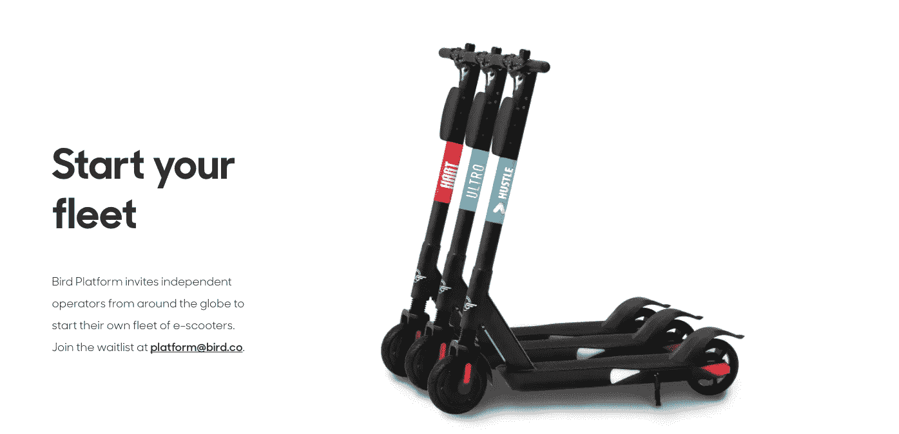
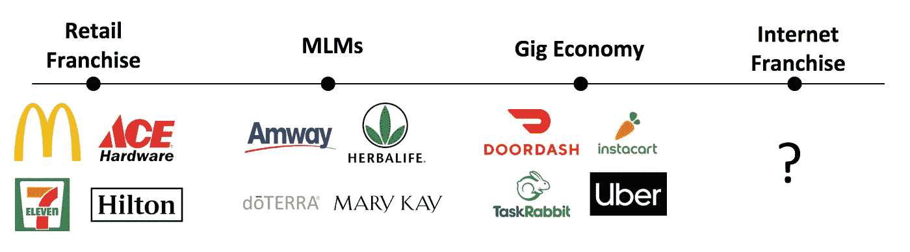
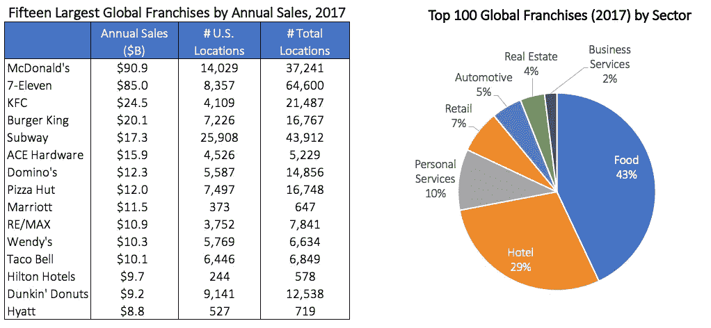
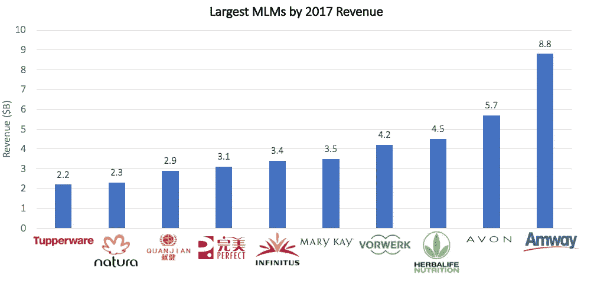
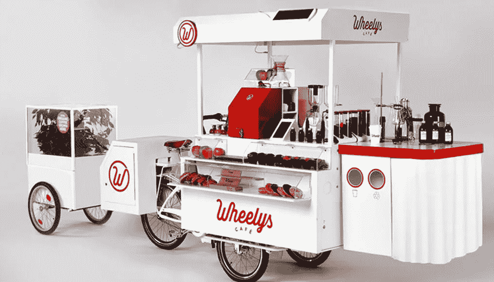
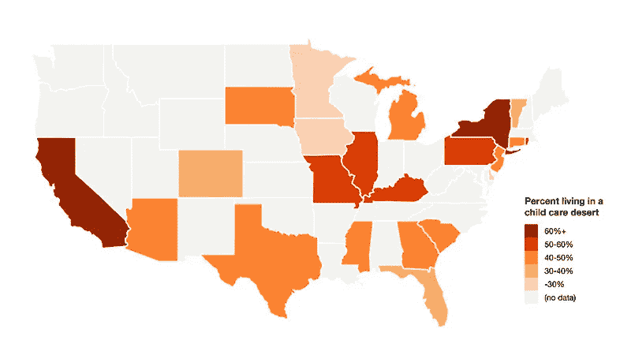
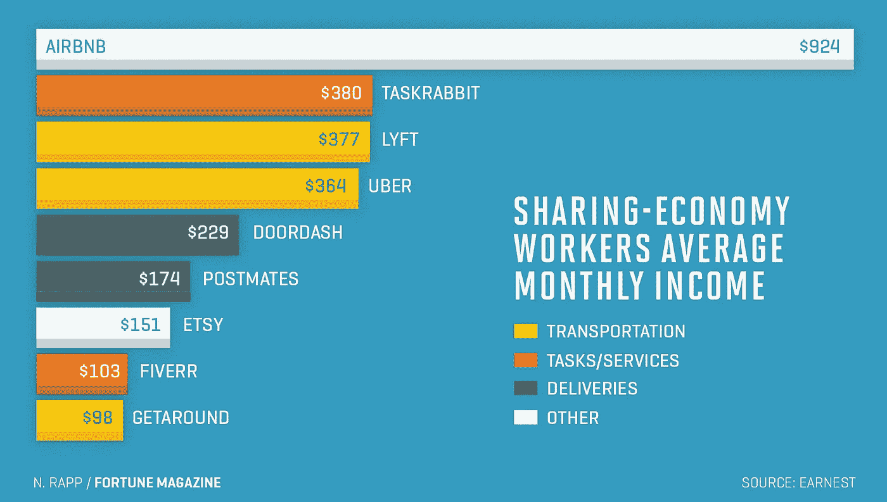

# 波导的新平台计划和“盒子里的生意”的兴起

> 原文：<https://medium.com/hackernoon/birds-new-platform-program-and-the-rise-of-the-business-in-a-box-899f7ac58abb>

本周，CRV 投资公司 Bird [公开宣布了一个新平台](https://techcrunch.com/2018/11/27/for-a-small-fee-entrepreneurs-can-now-manage-their-own-fleet-of-bird-e-scooters/)，供独立运营商管理他们自己的摩托车车队。伯德将出售这些滑板车，并提供进入充电器和机械市场的渠道，以换取 20%的收入分成。我们对这一计划感到非常兴奋，因为它允许 Bird 在地理上快速扩张，同时让运营商有机会在一个出色的产品上建立一个伟大的业务。

Bird 的这一努力完全符合我们非常兴奋的一个类别，即“**盒子里的业务**”这些平台为企业家提供了经营企业的机会和基础设施，避免了从零开始建立公司的复杂而昂贵的过程。企业家也受益于母公司的品牌和预算，以及其他增值服务，如会计、法律和营销。

“盒子里的业务”模式可以显著降低产品与市场匹配的风险(这很难实现！)通过提供成熟的产品来销售。美国[近 55%的小企业在头两年](https://www.businessinsider.com/why-small-businesses-fail-infographic-2017-8)内失败，其中 40%的失败是因为产品或服务没有市场。“盒子里的企业”消除了风险企业中的“想法风险”，给企业家留下了地理和经营风险。

The [Bird Platform](https://www.bird.co/platform/) is set up to let independent operators run their own fleets. Operators upload a logo and choose a sleeve color, and Bird manufactures and delivers the scooters, builds a customized website, and provides fleet management tools. Image courtesy of Bird.

如果执行得好，这些模型可以为母公司和个体经营者增值。母公司受益于更快、资本效率更高的地理增长(不需要在每个城市启动市场或运营团队)、更低的房地产和库存风险以及更好的本地执行。企业家受益于成为自己老板的能力(美国梦！)而不必开发创新产品和建立独立的公司。

随着时间的推移，“盒子里的生意”模式已经有了许多形式，但历史悠久——特许经营(建立于 19 世纪)、多层次或“网络”营销(20 世纪 40 年代)，以及最近的零工经济平台。

我们对这些公司的下一代感到兴奋，我们称之为“**互联网特许经营**”这些平台使用软件和其他技术来扩展特许经营模式，使运营商能够在母公司的产品和基础设施上运营业务，而无需传统特许经营所需的实体房地产和资本。与零工经济平台不同，互联网特许经营允许运营商真正“拥有”他们的业务，并随着时间的推移积累股权价值。

我们将简要回顾这一领域的历史，以及为什么我们认为它对经济如此重要，然后再进入我们在这种“互联网特许经营”模式中寻找什么。**我们很乐意见到任何在这个领域从事新工作的创始人！您可以通过 saar@crv.com****[**【matt@crv.com**](mailto: matt@crv.com)**[**【twins@crv.com**](mailto:twins@crv.com)**联系我们。******

******《盒子里的生意》的历史******

****特许经营是一种古老的商业模式——它可以追溯到中世纪的欧洲，当时贵族出售他们土地上的经营权并收税。后来，在 16 世纪，君主授予探险者建立殖民地(并征税)的特许权，在 18 世纪和 19 世纪，酿酒厂向酒馆老板支付独家经销啤酒的费用。19 世纪 50 年代，在艾萨克·辛格(Isaac Singer)向全国销售人员出售其缝纫机的分销权后，特许经营模式转移到了美国。****

****在接下来的一个世纪里，特许经营模式扩展到了其他行业，从汽车(1898 年的通用汽车)到食品和饮料(1924 年的 A&W 根啤酒)到清洁产品(1943 年的 Duraclean)。1946 年的《联邦兰哈姆法案》使得将资产授权给第三方变得更加安全，而 1956 年的《联邦援助高速公路法案》导致城市扩张加剧，点燃了特许经营行业的火柴。从 1950 年到 1960 年，拥有特许经营权的公司数量增加了近 10 倍，在 20 世纪 60 年代，一些最大的特许经营公司(麦当劳、假日酒店、肯德基)达到了 1000 家店铺的里程碑([特许经营法](http://www.franchise-law.com/franchise-law-overview/a-brief-history-of-franchising.shtml))。****

********

****Of the [100 largest global franchises](https://www.franchisedirect.com/top100globalfranchises/rankings) (by revenue) in 2017, the average company made $5.9B in revenue and had 2,322 open locations. Food and hospitality are the largest franchise categories by far.****

****大约在同一时间，多层次营销公司(MLMs)作为一种资本效率更高的模式出现，允许个人直接销售产品，而不需要物理位置。尽管特许经营可能需要几十万到几百万美元才能成立(低于 5 万美元被视为[【低成本】](https://www.cnbc.com/2016/05/11/9-low-cost-franchises-that-can-make-you-rich.html))，但企业家只需几千甚至几百美元就能参与 MLM。第一个已知的美国 MLM 是一家名为纽崔莱(1945 年)的公司，这是一种由全国经销商授权并由 15，000 名推销员上门销售的膳食补充剂。****

****许多纽崔莱分销商在意识到这种商业模式的成功后，纷纷成立自己的公司(包括安利和嘉康利)。其他公司很快围绕不同类别的产品成立，包括雅芳(美容产品)、特百惠(厨房产品)和拉顿&菲尔兹(护肤品)。在过去的十年中，社交媒体为传销注入了新的活力，让销售人员能够持续地向他们的网络进行大规模营销。尽管有大量关于诈骗行为的报道，但目前在美国大约有 1400 个传销组织，招募了近 2000 万名销售人员。****

****20 世纪 90 年代消费互联网的兴起，以及随后 21 世纪初的移动革命，进一步降低了潜在“盒子里的企业”创业者的准入门槛。像 DoorDash、Instacart 和 Wag 这样的公司只需要一辆汽车和一部智能手机就可以开始工作，一些零工经济公司提供培训、资源和社区，模仿特许经营和传销的一些更好的产品。例如， [HopSkipDrive](https://www.hopskipdrive.com/) 提供新司机培训、24 小时支持团队、为司机建立社区的见面会，以及为介绍到平台的新家庭和司机提供奖金。****

******为什么这个空间很重要******

****特许经营者、直销员和零工经济工作者比风险投资公司的创始人受到的关注少得多，但他们对经济的集体影响是巨大的。****

****截至 2017 年底，美国约有 3300 家特许经营商和 744000 家特许经营机构，直接雇佣了近 800 万人，占美国非农企业的 10%，产生了 7570 亿美元的产出([罗森伯格中心](https://www.unh.edu/rosenbergcenter/what-franchising%5C))。世界上一些最大的面向消费者的企业通过特许经营运营，包括雪佛龙(市值 2200 亿美元)、麦当劳(1420 亿美元)和万豪(420 亿美元)。****

****直销，其中传销贡献了约 70%以上的收入，2017 年在美国创造了 350 亿美元的收入，有 1900 万名销售人员。像雅芳和安利这样的老牌直销公司经常带来数十亿美元的年收入(2017 年分别为 57 亿美元和 88 亿美元)，甚至像 Jeunesse(成立于 2009 年)和 doTERRA(成立于 2008 年)这样的相对较新的公司每年也能赚到超过 1B 美元。****

********

****MLMs are a global phenomenon — though five of the ten largest MLMs were founded in the U.S., three are from China (Quanjian, Perfect, and Infinitus), one is from Brazil (Natura), and one is from Germany (Vorwerk).****

****零工经济很难量化，因为它是如此庞大和分散，但美国估计有 5700 万零工经济工人(占工作人口的三分之一)，他们去年创造了近 9000 亿美元的收入。由零工经济工作者推动的初创公司已经成为世界上最有价值的私营公司，包括优步(估值 720 亿美元)、Lyft(150 亿美元)、insta cart(80 亿美元)和 door dash(40 亿美元)。****

****我们相信这些业务的经济影响只会继续增长。这些公司还通过向那些可能不在其他地方从事全职工作的人提供就业机会来提供社会福利。零工经济平台允许工作时间更加灵活，而传销通常雇佣全职妈妈，她们不想要传统的工作，但可以利用她们广泛的本地网络赚钱。****

******我们在寻找什么******

****从历史上看，许多特许经营都没有风险投资支持，因为它们在早期往往看起来更像零售或服务企业，通常接受债务融资。直销公司通常也没有筹集到大量的风险资金(T2 的 Stella & Dot 和 T4 的 Trumaker 是明显的反例)，因为许多公司都是债务融资，或者拥有对风投没有吸引力的欺诈产品。许多零工经济公司都是成功的风险投资公司(*我们是 DoorDash 的骄傲投资者！)*，并且我们对这些业务的下一次迭代寄予厚望。****

******我们将这一新的“互联网特许经营”群体视为市场规模与特许经营所有权和激励结构的结合体。******

****我们相信，全球航运和支付领域的最新发展将使轻资本特许经营获得比以往更大的规模。一个世纪前，当零售特许经营首次建立时，它花了数年，如果不是数十年，来扩大区域业务。如今，母公司可以相对快速、廉价地向全球分销商交付实物、支付、内容和营销。我们开始看到这样的早期例子- [Wheelys](https://wheelyscafe.com/) (自行车驱动的咖啡车) [Tinkergarten](https://tinkergarten.com/) (儿童户外课程) [Robin Autopilot](https://www.robinautopilot.com/) (机器人草坪服务) [Hotpod Yoga](https://hotpodyoga.com/) (便携式热瑜伽工作室) [Beeline](https://beelinebikes.com/) (移动自行车修理店)只是其中的几个。****

********

****For $8,999 and a monthly $99 “community fee,” entrepreneurs worldwide can start a business selling coffee through a mobile Wheelys café. The company is backed by YC, and has shipped carts to 800 entrepreneurs in 75+ countries.****

****当我们在这一领域寻找公司时，我们特别关注以下特征:****

*   ****抽象出运营和物流的复杂性。即使有帮助，创业也是艰难而可怕的。我们正在寻找一个平台，将产品放在普通人的手中，让他们无需雇佣律师、会计师、营销人员和商业顾问就能销售产品。麦当劳特许经营如此成功的原因之一是，母公司为特许经营者处理几乎所有的基础设施——从位置到烹饪设备到菜单。该公司还为特许经营者提供关于运营最佳实践的持续培训，以及营销支持。****
*   *****利用高质量但未被充分利用的供应来填补过剩需求*。新的“盒子里的企业”将与拥有品牌优势、多年专业知识和(潜在的)更大预算的老牌公司竞争。我们认为，新贵最有可能成功，如果他们填补了供应短缺——如果对他们的产品或服务的需求水平很高，就更容易从现有企业吸引早期用户。在儿童保育领域， [Wonderschool](https://www.wonderschool.com/) *和 [WeeCare](https://weecare.co/) 通过应对最近在美国兴起的[“儿童保育沙漠”](https://slate.com/human-interest/2018/04/welcome-to-life-in-americas-child-care-deserts.html)，同时也为照顾者(如父母、护士、前教师)提供了一种将他们的专业知识货币化的方式，从而取得了初步成功。****

******WeeCare 在技术上更适合“互联网特许经营”类别，因为他们所有的日托都带有完整的 WeeCare 名称和品牌，而 Wonderschool 运营商可以选择自己的名称。我们认为 Wonderschool 更像是一个基础设施平台，提供一些分销服务(考虑到他们的在线预订工具)，而 WeeCare 提供了互联网特许经营的全部好处。*****

********

****Wonderschool and WeeCare have both chosen launch states where the highest percentage of families are living in a childcare desert — WeeCare is active in Southern California, while Wonderschool is in Northern California and New York. Image courtesy of the Center for American Progress.****

*   ****母公司受益于分散的规模。特许经营模式并不适用于所有企业。一些公司选择经营一些自己的商店，并特许经营其他商店，特别是当他们不想在一个新的地理区域承担风险的时候。然而，某些类型的公司受益于以分散的方式扩大规模——特别是如果进入新的地理区域很昂贵(或有风险),本地专业知识很有价值，并且交易大多是本地的。在经营复杂、监督员工成本高的企业中，基于激励的特许经营制度也可能产生更好的效果。Bird 是特许经营有意义的一个很好的例子——该公司需要人在地面上放置和维修车辆，Bird 可以受益于特许经营者关于在哪里部署滑板车以及如何与当地政府合作的特定市场专业知识。****
*   *****经营者受益于公司的规模。*成功的特许经营者可以利用他们的规模为他们的特许经营者提供个体企业主无法获得的资源。例如，全国性的食品连锁店(如 Subway、Dunkin Donuts)足够大，可以与食品和设备供应商谈判优惠条件，这也是这些连锁店价格往往比当地餐馆低得多的原因之一。虽然特许经营者通常向母公司支付全国广告费，但这让他们有机会接触到专业营销人员，他们的执行水平比他们单独完成的更高。****
*   *****提供经济流动性的机会。*对零工经济平台和传销最大的抱怨之一是，员工在组织中晋升和积累财富非常困难(如果不是不可能的话)。这些公司中的一些，尽管是出于好意，却在[用](https://www.nytimes.com/interactive/2017/04/02/technology/uber-drivers-psychological-tricks.html?mtrref=www.google.com)[有限的经济回报](https://qz.com/1039331/mlms-like-avon-and-lularoe-are-sending-people-into-debt-and-psychological-crisis/)网罗承包商压力大的工作——例如，优步的司机如果每周工作 40 小时，通常[的年薪为](https://www.fool.com/retirement/2018/06/27/how-much-money-can-you-really-make-driving-for-ube.aspx)17-21，000 美元。我们对允许个人像传统特许经营模式那样建立更大企业的公司感到兴奋——《特许经营商业评论》报告称，8.4 万美元所有者的平均税前收入为[,尽管拥有多个成功地点的经营者 T10 可以赚取数百万美元 T11。](https://www.cnbc.com/2016/05/11/the-hard-truth-about-franchise-business-profitability.html)****

********

****Data from lending company Earnest in 2017 showed that the average gig economy worker is still using these platforms as supplementary income (not as a full job replacement). We see big potential for Internet franchise companies to allow more workers to become fully independent with increased income and job stability. The uncapped upside of a franchise also provides financial incentives that are better aligned with performance and effort than the typical gig job.****

****特许经营还通过资产增值提供了经济流动性的机会。在当地市场经营的特许经营者有能力建立一个对母公司有价值的商业账簿，随后可以被公司买断或溢价卖给另一个想在同一市场经营的企业家。****

*   *****品牌为消费者购买提供真正的好处。*并非所有符合“互联网特许经营”模式的公司都会要求其特许经营者使用母公司的名称，有些公司只会提供后端基础设施。然而，[最大的全球特许经营](https://www.franchisedirect.com/top100globalfranchises/rankings)是在食品、酒店、住房和儿童保育/教育等领域，在这些领域，消费者建立了忠诚度，并相信某些品牌能够提供一致和安全的体验。因此，我们预计，在“互联网特许经营”模式下，许多同样的行业将推动数十亿美元的业务。****

****感谢您的阅读，我们欢迎您的想法和反馈——欢迎发送电子邮件至[saar@crv.com](mailto: saar@crv.com)、[matt@crv.com](mailto: matt@crv.com)和[twins@crv.com](mailto:twins@crv.com)，如果您正在从事这方面的工作，请联系我们！****

*****-萨尔、马特、贾斯汀和奥利维亚*****