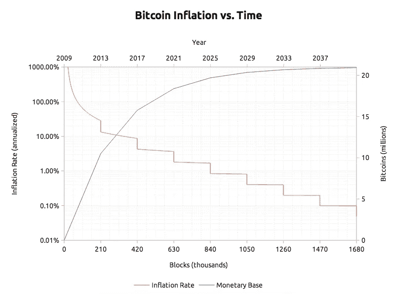
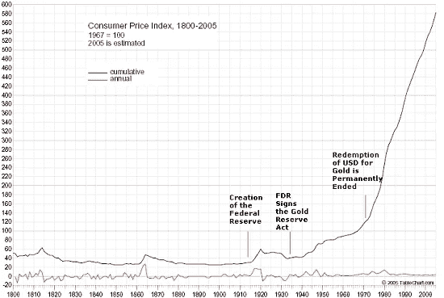
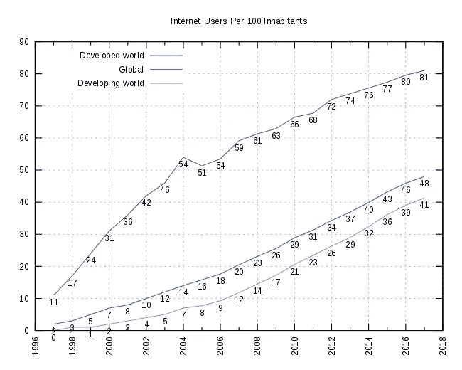

# 比特币，10 年后

> 原文：<https://medium.com/hackernoon/bitcoin-10-years-from-now-c89ea106c2db>

林第效应描述了一项技术或一个想法的未来预期寿命。它指出，一个想法的预期剩余寿命与它当前的年龄成正比，因此每一个额外的存活期都意味着更长的剩余寿命。比特币不仅是一个想法，也是一项技术和社会实验，这个想法已经有十年历史了，因此我们可以预计它至少还会存在十年。那么 2028 年的比特币我们能期待什么呢？首先，让我们检查一些事实。

在写这篇文章的时候，大约有*17，351，287 个比特币，并且每 10 分钟就有 12.5 个新的产生。这大约是总供应量的 83%，也就是将会存在的比特币总数。十年后，将会发现大约 2000 万个比特币，还会有三次区块奖励减半，每发现一个区块的奖励将会是 1.5625 个比特币。全世界将会有超过 250 万的新比特币。相比之下，在过去的十年中创造了将近 1750 万个，那时它们很便宜，也相对容易获得。在最初的几年里，你可以偶尔从水龙头里拿出几个比特币。在写这篇文章的时候，它们每个价值 6300 美元。顺便说一下，2018 年的 6300 美元相当于 2008 年的 5375 美元。在此期间，其累积通货膨胀率为 17.2%。这意味着在过去的十年里，由于*量化宽松，*也就是央行行长所说的*伪造，每一美元损失了超过六分之一的价值。*未来十年，美元的累计通胀率不太可能低于 17.2%，因为部分准备金贷款系统需要每年多一点的通胀来维持自身。因此，要分享 250 万个新的比特币，并且要比现在多 20%的美元来购买它们。*

现在，让我们看看互联网本身。梅特卡夫定律表明，通信网络的价值与网络上的用户数量的平方成正比。每一个新的互联网用户都是潜在的新互联网用户*尤其是*在这个星球上那些互联网连接很差的地方，因为那些地方通常有疲软的当地货币，比特币可以作为对冲。2008 年，23%的世界人口可以访问互联网，现在，2018 年，这个数字是 48%。在发展中国家，这个数字在 2008 年是 14%，2018 年是 41%。在接下来的十年里，全球人口数量可能不会再翻一番，但看起来他们会继续上升，特别是在发展中国家，他们可能会再翻一番。所有这些指标(更少的比特币，更多的法定货币，更多的互联网用户)都指向比特币价格的上涨*而不管当前的价格*。没错，比特币的价值上涨速度极快，平均每两年就会在其价格末尾增加一个零。但是想想推动价格上涨的潜在力量。每个移动设备都有可能持有比特币，但只有少数人持有。当越来越多的人接受这项技术时，错过周期的整个恐惧又开始了，价格跳到下一个平台。还要注意的是，每个当前的比特币用户都可以用他或她的比特币做三件事——出售、丢失或持有。他们也可以买新的。除非他们亏本出售，否则价格会上涨。

网络状况如何？比特币是一种非常抗拒改变的互联网协议。它在 2017 年末展示了一个前所未有的例子，当时比特币领域所有最大的公司都决定实施拟议的*隔离见证*升级，然后在几个月后硬分叉到 2 Mb 块。大多数用户想要的隔离见证被激活，但网络用户抵制硬分叉。这在硬分叉的支持者中导致了很多挫折，并导致了一种被称为比特币现金的山寨替代货币的产生。隔离见证不仅释放了块空间，还允许在比特币基础上构建第二层扩展解决方案，如*闪电网络。Lightning 网络允许即时、完全匿名、几乎免费的微交易，不占用块空间，目前正在运行。*除此之外，可同时执行的 Lightning 网络交易数量仅受节点带宽的限制，这使其成为 Visa 或 MasterCard 的未来真正竞争对手。许多其他第 2 层升级正在进行中，但核心网络的功能与其输入和输出、公钥和私钥等的功能相同。

届时会有其他代币取代比特币吗？毕竟，更有效的程序就在那里。简而言之——不。这一点怎么强调都不为过。互联网上的稀缺是一次性的发明。它不能被重复，因为你可以重复它无数次。比特币的历史和独特地位是它真正稀缺和难以改变的原因，这第一个十年不会因为任何“替代”令牌而重演。关于比特币是什么仍然有很多困惑，互联网上的*声音货币*是一个很难理解的概念，因为人类以前从未遇到过*绝对稀缺*。可以说，前进的最佳途径是让自己和他人了解这项发明及其意义。时间会证明你的消息来源是真是假，比特币不太可能在未来几年内被大规模采用。尽管如此，基础设施已经到位，用户界面每天都变得越来越简单。请记住，iPhone 在 2007 年首次向世界推出，智能手机在此过程中有大量的公司进行营销。比特币是有机增长的。让它呼吸，看着它展开，但无论你做什么，不要错过机会，趁你还能以这个折扣价买一些。很难预测未来，但我仍然期待十年后反思这篇文章。