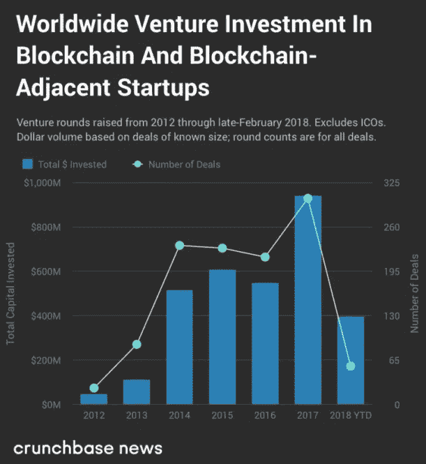
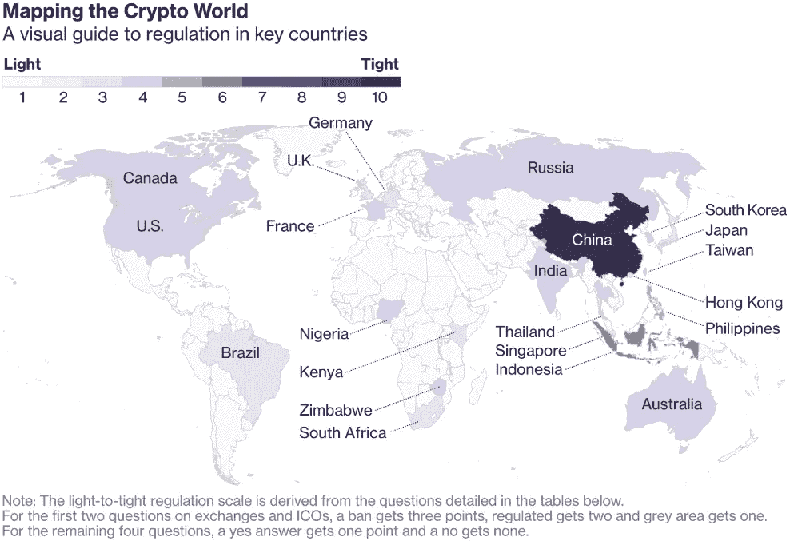

# 比特币:分析过去 9 个月的事件。现在发生了什么？什么策略有助于赚更多钱？—第一部分

> 原文：<https://medium.com/hackernoon/bitcoin-analyzing-events-over-the-last-9-months-1a2cb3d4b900>

嗨，我叫基里尔。我是一个区块链项目的联合创始人，也是一名加密投资者。在过去的 9 个月里，我将市场事件系统化，以便描绘出一幅准确的画面，并制定未来的战略。收集了大量有用的信息后，我决定写一篇文章。

# 内容:

1.[比特币](https://hackernoon.com/tagged/bitcoin)是“泡沫”吗？
2。过去 9 个月的事件及其基于交易统计、立法更新和其他因素的分析
3。消极因素
4。如何选择未来战略

# **1。比特币是“泡沫”吗？**

支持“泡沫”版本的主要论点是:

a)比特币没有任何商品的支持
b)没有人使用它
c)比特币只用于市场上的投机
d)看看 1990 年至 2000 年的网络泡沫，这里的情况也一样——一切都会很快崩溃。

现在，让我们来看看这些论点。

支持比特币网络的基础设施以及交易(或金融转账)需求为比特币提供了财务保障。根据最新的[统计数据](https://coinnewstelegraph.com/bitcoin-processes-more-transaction-value-than-visa-says-latest-report/)，比特币在 2018 年发送了超过 2.4 万亿美元，现在处理的交易价值超过了 Visa 的 1.3 万亿美元。

Volume of bitcoin transactions in 2018: every month Bitcoin network processes transactions worth more than $ 200 million

现在让我们看看支持比特币网络的基础设施。矿工消耗的电量和一个小国家的差不多。最大的制造商——比特大陆和比特福里——定期推出( [1](https://cointelegraph.com/news/bitfury-launches-new-generation-of-asic-based-bitcoin-mining-hardware) 和 [2](https://blog.bitmain.com/en/bitmain-announces-next-generation-7nm-asic-chip/) )新产品，以提高效率和减少电力消耗。顺便说一下，比特大陆 2018 年 Q1 奥运会的收入(来自他们的[财务报告](https://craft.co/bitmain))略高于 10 亿美元。你可以将其与俄罗斯知名公司 Gazprom Neft 在 2018 年 Q1 奥运会上达到 697 亿卢布的[收入](http://www.gazprom-neft.com/press-center/news/1642026/)进行比较。至于业内大公司的投资，你可以在下面找到他们的概述。这里我只能提一下 2017 年风险基金投资区块链项目的[价值](https://techcrunch.com/2018/03/03/2018-vc-investment-into-crypto-startups-set-to-surpass-2017-tally/)(不在 ICO 内):约 9 亿美元。

Investment of venture funds in blockchain startups, except ICO

我想说的是，比特币作为一个交易网络，以及一个投资机会，是由坚实的需求和投资保障的。这种需求不会在一瞬间消失，这就是为什么我们可以指望中长期投资，因此，我们至少还有几年的时间:)

很明显，在比特币的价值在过去 9 个月里从 20，000 美元跌至 6，000 美元后，泡沫已经足够缩小了。现在，我们正进入一个技术和立法发展以及对该行业进行大规模中期投资的阶段。

**2。过去 9 个月的事件，基于交易统计、立法更新和其他因素进行分析**

首先，让我们考虑不同国家关于[加密货币](https://hackernoon.com/tagged/cryptocurrency)的国家法规和计划。

Cryptocurrency regulation map, [Bloomberg](https://www.bloomberg.com/news/articles/2018-03-19/is-this-legal-making-sense-of-the-world-s-cryptocurrency-rules)

简而言之，全球对加密货币的态度可以用以下方式来描述:“我们真的想监管它，但我们仍然不知道如何监管。”日本法律允许加密货币交易。亚洲正在经历一场真正的加密热潮:韩国和中国推出了市场上最受欢迎的 ico。甚至有一个笑话说，如果你的团队中有一个戴眼镜的韩国人，他曾经为谷歌、脸书等公司工作。，那么你的 ICO 就成功了。

目前监管的主要更新是证券交易委员会(SEC)未来批准比特币交易所交易基金(ETF)的决定。SEC 本应于 9 月 30 日审议 CBOE(芝加哥期权交易所)VanEck/SolidX 的申请，但该申请被推迟了。为什么这如此重要？自 8 月份以来，SEC 已经拒绝了 3 家 ETF 的申请。这是最后一个，也是最重要的。如果被接受，风险和养老基金等主要机构投资者将能够投资比特币 ETF。这将导致价值的显著增加。下面是一个很好的图表，让事情变得非常清楚(我为质量差道歉。箭头表示黄金 ETF 的推出日期)。

Gold graph after ETF introduction and Bitcoin graph, [source](https://t.me/cryptowhaletrade)

另一个重要的更新是以太坊期货交易的推出。CBOE 正在[考虑](https://blokt.com/news/cboe-to-launch-ethereum-futures-contracts)引入这一工具。去年比特币价格上涨的原因之一是推出比特币期货的决定。

至于国家加密货币，值得一提的是委内瑞拉。[委内瑞拉石油](http://elpetro.gob.ve/)是委内瑞拉的国家加密货币，由 53 亿桶石油担保(据 N. Maduro 称)。该国已经筹集了 50 亿美元的预售款。El Petro 得到如此大量石油支持的信息的可信度是另一个问题。顺便说一句，马杜罗将把本币与 El Petro 挂钩。现在，为了拿到护照，你[需要支付一笔 Petro 的费用](https://cointelegraph.com/news/venezuela-mandates-passport-fees-must-be-paid-in-controversial-cryptocurrency-petro)。一个重要的事情是，尽管特朗普政府实施了制裁，但委内瑞拉正在使用加密货币进行外贸交易。在这里，我们可以与即将推出自己的加密货币的中国相提并论。中央王国和美国之间的“贸易战”将催化决策过程。另一个例子是阿根廷，当地货币对美元下跌了将近 50%。

The picture clearly shows the current situation with national currencies in the global market

让我们扪心自问:“在全球经济中，有没有一种不能被禁止的数字去中心化资产(中国正在尝试这样做，但无济于事)，可以帮助以几美元的价格在没有任何银行的情况下转移数百万美元？”

当市场下跌时，世界各地的银行、证券交易所和基金投资于加密技术，但是我们不断读到关于泡沫、金字塔等等的新闻。

1)首先，让我们考虑一下上面提到的中国巨头比特大陆，[向美国最大的金融初创公司之一](http://fortune.com/2018/05/15/crypto-exchange-circle-bitmain-value/) [Circle](https://www.crunchbase.com/organization/circle-2%20%20%20#section-overview) 投资了1.1 亿美元，后者[又收购了](http://fortune.com/2018/02/26/circle-cryptocurrency-trade-bitcoin/)波士顿的波洛涅克斯交易所(全球交易量排名前五)。高盛投资了 Circle 的 C 轮融资，该轮融资于 2015 年结束。最近，Circle[发布了](https://blog.circle.com/2018/09/26/introducing-usd-coin/)一款类似于 Tether (USDT)的稳定币 USDC。

造币厂计划在纽约附近的一个采矿中心投资 7 亿美元。他们的目标是在 2019 年年中达到满负荷。

3) Sygnia Asset Management，一家管理着 145 亿兰特的主要南非投资公司，透露了其在 2018 年推出加密货币交易所的[计划](https://cointelegraph.com/news/145-bln-south-african-investment-firm-to-launch-crypto-exchange)。最近的一项调查显示，47%之前没有投资经验的南非居民计划在 2018 年投资加密货币和/或矿业。

4)雅虎日本并不落后，计划在 2018 年推出自己的加密交易所。

5)日本巨头 SBI 控股公司已经推出了一个主要针对涟漪交易的加密交易所。

6) Opera 移动浏览器(每月 1 亿活跃用户)正在测试其新版本的应用程序，内置加密货币钱包和在线支付服务。

当完成一笔价值 7 亿美元的交易时，你很清楚自己在做什么。投资回报至少在几年内是可能的。

7)资产净值约 1 万亿美元的管理公司 Wellington Management 正在[考虑](https://www.businessinsider.com/bitcoin-crypto-attracting-interest-from-wellington-management-2018-3)将比特币及其衍生品纳入投资组合。

8)260 亿美元的索罗斯基金[正计划](https://www.bloomberg.com/news/articles/2018-04-06/george-soros-prepares-to-trade-cryptocurrencies-as-prices-plunge)进行加密交易。考虑到几个月前乔治·索罗斯在达沃斯论坛上公开反对加密货币的事实，这是相当令人惊讶的。

9)16 亿美元雄安全球区块链创新基金[将与日本银行合作发行](https://hashtelegraph.com/osnovateli-kitajskogo-blokchejn-fonda-zapustjat-stejblkoin-s-privjazkoj-k-iene/?utm_source=tg&utm_medium=daily)与日元挂钩的稳定硬币(Tether analog，一种由美元担保并在加密市场交易的硬币)。它将于 2018 年底发射，2019 年开始。

10)比特币基地(一家美国加密货币公司)推出了面向大规模投资者的服务，最低金额为 1000 万美元。大投资者需要一种特殊的方法，包括存储和保险。这些人是第一个介绍这种监护权解决方案的人。

11)纳斯达克[计划](https://www.cnbc.com/2018/04/25/nasdaq-is-open-to-becoming-cryptocurrency-exchange-ceo-says.html)推出一个密码交易所。

12)拥有 1100 万客户和价值 1.2 万亿美元资产的 TD Ameritrade 正在投资[一个新的加密交易所 ErisX，该交易所计划于 2019 年初推出。比特币、以太坊、比特币现金和莱特币将可以在那里交易。](https://www.amtd.com/newsroom/press-releases/press-release-details/2018/TD-Ameritrade-Invests-in-ErisX-a-New-Regulated-Cryptocurrency-Exchange-for-Spot-and-Futures-Trading/default.aspx?ref=vc.ru)

12)这块蛋糕上的一颗樱桃是 ICE，它是包括纽约证券交易所在内的 23 家全球最大交易所的运营商，[创建了](https://www.newsbtc.com/2018/08/29/why-ice-and-starbucks-bakkt-is-bigger-news-than-bitcoin-etf/)一家名为 **Bakkt 的公司，该公司将与星巴克、微软和其他顶级公司一起，建立一个买卖和存储加密货币资产的生态系统，包括机构投资者**。该生态系统包括交易所和存储服务。这非常酷，因为一切都朝着在星巴克买咖啡或用 crypto 支付微软软件的方向发展。这就是加密货币生态系统所需要的——广泛使用。该项目于 2018 年 11 月启动。

第 1 部分结束
第 2 部分:[改为](https://hackernoon.com/bitcoin-analyzing-events-over-the-last-9-months-3984f8158a28)

p.s .如果你喜欢这篇文章，希望我继续写下去，请留言。谢了。