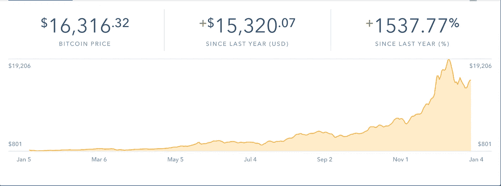

# 外行人的比特币(和区块链)

> 原文：<https://medium.com/hackernoon/bitcoin-and-the-blockchain-for-the-uninitiated-fd473da2d718>

仅仅一年时间，比特币的价值就上涨了**1500%***(不，这不是一个错别字)*因此，难怪每个人都真的有兴趣了解它。不幸的是，最近大多数关于比特币的文章都过于复杂，仍然给读者留下了更多关于它到底是什么以及为什么它有价值的问题。这篇文章旨在改变这种情况。

# 分布式分类账

要真正掌握比特币和加密货币，你必须首先了解区块链。区块链是驱动比特币和所有加密货币的底层技术，但其核心与货币无关。

> 最简单地说，区块链就是一本分类账——交易的记录。更具体地说，它是一个分布式的、可验证的和不可变的分类账。

创建区块链的主要原因是将第三方排除在对等交易之外。当涉及第三方时，他们控制着数据的中央存储，可能会损害数据的完整性。此外，他们可以对个人之间的交易收取不必要的费用。

例如，如果 Alice 和 Bob 彼此不认识并且不信任对方，但是想要进行资产交换，他们必须依赖可信的第三方。让我们称之为第三方夏娃。爱丽丝和鲍伯利用伊芙作为中介。Eve 控制着整个交易流程。

这些交易中涉及的资产可以是任何东西——从货币、契约、遗嘱和信托等。Eve 可以向 Alice 和 Bob 收取通过她进行交易的费用。如果 Eve 愿意，她还可以修改交易的细节和记录，因此 Alice 和 Bob 只需要相信 Eve 会做正确的事情，并且永远不会妥协。

区块链是一个解决这些问题的 ***分布式*分类账**。它允许互不信任的个人交换资产，而不必依赖第三方。区块链的每个参与者都维护一份该分类账的副本，并且区块链上发生的每笔经过验证的交易都被发送到分类账的每个副本。

# 验证和挖掘

验证是区块链最重要的部分。这确保了只有有效的交易才能进入分类账，并且不能从分类账中删除任何交易。这种验证是通过区块链的多个参与者执行一个计算上困难的数学问题并对实际发生的交易达成共识来进行的。这个过程被称为**采矿**。

如果大多数参与者对所发生的事情达成一致，该行动将被添加到分类帐中，并分发给其他所有参与者。这里有一个区块链如何处理这种情况的快速示例:

爱丽丝、鲍勃和伊芙是区块链的参与者和“矿工”。

区块链上发生了新的事务，Alice、Bob 和 Eve 都收到了这些事务。它们中的每一个都在交易上运行验证功能。爱丽丝和鲍勃都计算出了答案 a。

但是，Eve 试图修改分类帐并计算答案 b。因为 Alice 和 Bob 计算出相同的答案，所以该组事务被选为有效事务，并分配给该区块链的每个参与者。少数服从多数。实际上，这种验证发生在更多的矿工身上。估计有 15 万名矿工。

# 比特币和区块链

比特币就是这么来的。创造比特币是为了激励个人核实(或"*挖掘*")账本。参与者从他们的计算机提供资源来验证交易，并且随着时间的推移，这些验证任务变得更加困难。这在计算资源上消耗了能量和功率。

比特币是一种“货币”,参与者通过验证账本获得报酬。最初，个人只是将这种货币兑换成其他数字商品。比特币可以以价值的任何分数赠送或接收(例如 **0.00132596** BTC)。

区块链的另一个有趣的方面是，虽然分类帐是公开的，但交易实际上是匿名的，因为交易只指示钱包 id，这些 id 是如下所示的文本值:**1kr 6 qsydw 9 BF qg 1 mxipnnu 6 wpjgmua 9 I 1g。**只有拥有该特定钱包相应“钥匙”的个人才能访问其内容。

由于这种匿名因素，比特币一度主要用于非法活动(购买毒品、职业杀手、黑客等……)。有一个名为[丝绸之路](https://en.wikipedia.org/wiki/Silk_Road_(marketplace))的在线黑市，依靠比特币进行匿名交易。

# 比特币的价值

2010 年 5 月 22 日，一名参与者又支付了 10，000 比特币购买了 2 份棒约翰披萨。这就是现在所知的[比特币披萨日](https://www.investopedia.com/news/bitcoin-pizza-day-celebrating-20-million-pizza-order/)。当时，这相当于 25 美元。按照今天的汇率，大约是 1.5 亿美元。如今，大量企业接受比特币作为一种有效的支付形式。

由于区块链的设计方式，流通中的比特币将只有 2100 万枚，而且这些比特币必须全部被开采出来。随着时间的推移，挖掘这些比特币变得更加困难，这增加了单个比特币的价值(今天约为 15，500 美元)。目前有 1680 万比特币在流通。

事实上，比特币的存在数量是预先确定的，这大大降低了通货膨胀对其价值的负面影响。随着单个硬币的价值增加，很少有人会持有整个比特币，并使用整个比特币的一小部分来利用该货币。

比特币在任何时候的价值都是供给、需求和对其未来价值的猜测的函数。在某种程度上，比特币之所以有价值，只是因为个人相信它有价值。像所有的货币一样，人们只能用它来交易，因为其他方想要它，并且相信它有价值。一些人认为比特币将成为世界上唯一的货币。其他人感兴趣是因为它目前很受欢迎，这继续推动它的受欢迎程度，从而推动它的价值。

由于不了解比特币的个人的这种兴趣，比特币变得极其不稳定。那些只交易比特币，而不是把它作为一种货币来利用的个人把它当作一种商品——事实并非如此。如果比特币在未来的某个时候被接受为标准货币，它将继续繁荣发展，价值不断增长。如果个人继续像对待商品一样对待它，它将继续非常不稳定，其价值很可能在某个时候变为零。

# 结束语

比特币是最初的“*加密货币*”(之所以这样命名，是因为验证功能是基于密码学)，但现在有超过 700 种加密货币存在。以太币、莱特币、Ripple 是在获得未来价值的时刻最有前途的三个。尚不清楚这些货币是否会成为更多人日常交易中使用的标准货币。

然而，比比特币或任何加密货币更重要的是底层技术——区块链。区块链有无数的用例(可验证和匿名投票、国际交易、身份管理、保险、房地产、股票等)。

在过去的几年里，区块链的创业公司数量激增。一家初创公司甚至为房地产交易创造了一个 T2 区块链。大型银行和交易所甚至希望利用区块链。例如，纳斯达克在 2015 年推出了[纳斯达克 Linq](http://ir.nasdaq.com/releasedetail.cfm?releaseid=948326) ，使用区块链的分类账完成和记录私人证券交易。

虽然比特币的价值可能会在某个时候变为零，但区块链是游戏规则的改变者，并将一直存在下去。