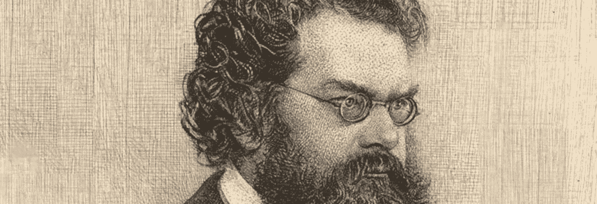

# 比特币和热力学

> 原文：<https://medium.com/hackernoon/bitcoin-and-thermodynamics-63f46b90627>

Ludwig Boltzmann, a guy who understood stuff

热力学第一定律，也被称为能量守恒定律，指出在一个孤立的系统中能量*不能被创造或毁灭*。第二定律指出，任何孤立系统的熵总是增加，第三定律指出，当温度接近绝对零度时，系统的熵接近恒定值。这和比特币有什么关系？让我们一起探索吧！

在比特币网络中，被称为*矿工*的参与者按照固定的规则在抽奖中争夺新的比特币。矿工对网络贡献的散列能力(计算能力)越多，他赢得*区块奖励*的机会就越高，区块奖励是每四年减半的比特币的特定金额。这次抽奖的*难度*，换句话说就是矿工*中奖*的几率，每隔 2016 个区块重新校准一次，这样找到下一个区块的平均时间总是大约十分钟。这个系统产生的是绝对稀缺性，任何时刻存在的比特币数量都是可以预测的。随着时间的推移，这个数字变得越来越可预测，因为块奖励慢慢接近零。到那时(大约在 2140 年)，单个矿工的面向集体奖励的采矿激励将至少在理论上被向网络参与者收取交易费的激励所取代。即便是现在，费用也是矿商报酬中不可忽视的一部分。随着比特币网络通过闪电网络(Lightning Network)等第二层解决方案进行扩展，费用仍然非常低，预计未来很长一段时间内都将保持在低水平。

绝对稀缺是人类从未遇到过的概念。可以说，这是第一个与物理定律直接相关的人造概念！我知道这听起来很牵强，但让我详细说明一下。任何人做的每件事都需要一定的能量。单词*做*暗示着某种类型的运动，某种类型的*能量消耗*，需要发生。人类可以采取的行动的*值*是一个完全主观的*东西。行动对不同的人有不同的价值。即使是最基本的行为，如呼吸，也包含了整个价值范围。对于一个被困在冰下的绝望的人来说，另一次呼吸比这个星球上的任何东西都有价值，而对于一个在阳光明媚的夏天，在清新的森林空气中渴望死亡的人来说，一点价值也没有。我们对不同事物的评价也不可避免地与该事物的供应联系在一起。如果前面提到的冬季潜水员配备了水肺罐，那么他可能不会想到他的下一次呼吸是如此珍贵的事情。一个人愿意为一件*商品*支付的*价格，或者一个或多个其他人行为的总和，可以从两个基本变量中推导出来——对该商品的高度主观的*需求*和总是受时间和空间约束的同一商品的*供给*。请注意，如果一件商品的供应足够有限，那么只要该商品有一定的 T21 需求，它的价格就会上涨。**

有人可能会说，没有人需要比特币，因此比特币没有内在价值。有人也可能会说，没有内在价值这种东西，因为需求总是主观的。无论如何，挖掘一枚比特币总会有成本，网络中的挖掘能力越强，成本就越高。这一成本由比特币网络的工作验证算法保证，接近人类活动的纯能源成本。一旦采矿设备就位，就意味着能源进入，稀缺资源退出。如果生产成本超过代币的当前价格，矿商可以选择不出售，从而进一步限制流通中的比特币的供应，最终在他认为合适的时候，将它们出售给其他商品。从这个意义上说，比特币是一块电池。不仅如此，它可以说是有史以来发明的最好的电池。储存和转移电能总是既昂贵又浪费。我们没有很多有效的方法来做这件事。比特币提供了一种将能量转化为特定数字的一小部分的方式。一个数学电池，如果你愿意的话。重要的是要记住，它不直接将能源转化为价值，而是将电力转化为数字稀缺。数字稀缺性可以通过编程来表达价值。

热力学第一定律明确指出，在一个孤立的系统中，能量不能被创造或毁灭。然而，比特币可以表达 T2 为了获得有限供应的份额而牺牲了多少能源。当然，你也可以通过购买而不是挖掘来获得比特币，但这样做你*也会*花费精力。你以某种方式获得了你购买比特币的钱，而这不知何故是因为有人在某处牺牲了时间和精力。比特币让你通过牺牲*努力*成为网络的一部分，来表达你看到了价值和稀缺之间的联系。

我们这些所谓的*比特币最大化主义者*之所以兴奋，主要不是因为最大化主义者的态度给了我们这些早早跳上货运列车的人巨大的收益。也不是因为我们是为了技术而参与其中，而反对这一观点的人经常讽刺地指责我们声称这是技术。我们这些宣扬这项发明近乎神圣的人这样做主要是因为我们看到了商品绝对稀缺的哲学影响。对计算机化货币中的双重支出问题提出有效解决方案的想法是人类的一大成就，不容忽视。这项发明*改变世界的潜力不能被低估。长远来看不会。你想得越多，这个想法就越不会让你安心。如果这个实验成功了，如果它是真的，它将把文明带到下一个阶段。我们不知道的是需要多长时间。现在，比特币领域的争论是关于它作为交易媒介的功能和作为价值储存手段的潜力(T21)。我们可能忽略了重点。我们*不可能知道*一种你完全负责且没有第三方保护的货币代币是否会成为所有交易的首选*交易媒介*。我们也无法知道比特币的价格是否会遵循我们都希望它遵循的炒作周期路径，以便它能够成为大多数最大主义者已经声称的价值储存库。也许我们一直关注的都是错误的事情。或许比特币最大的优势在于它作为记账单位的功能。毕竟这都是比特币做的事情。如果你拥有 21 个比特币，你就拥有了世界上第一种绝对稀缺商品的百万分之一。这可能不会让你一夜暴富，但它可能与有一天会呈现给你的曾曾孙子的机会有关。谁知道呢？*

为了结束这次小小的精神旅行，这里有一些已故的伟大的弗兰克·扎帕的话:

时间就是金钱，但空间是很长很长的时间