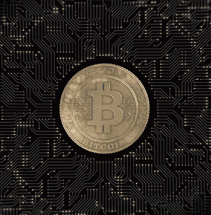

# 随着美国证券交易委员会(SEC)将决定几项比特币交易所交易基金(ETF)应用，比特币价格逼近 6500 美元

> 原文：<https://medium.com/hackernoon/bitcoin-approaches-6-500-as-the-sec-is-set-to-decide-on-several-bitcoin-etf-applications-e649efb0d285>

**市场状况—2018 年 11 月 5 日** [**BTC**](https://berminal.com/coins/Bitcoin-BTC)**:$ 6434.27(+1.64%)** [**ETH**](https://berminal.com/coins/Ethereum-ETH)**:$ 209.66(+3.54%)** [**XRP**](https://berminal.com/coins/XRP-(Ripple)-XRP)**:$ 0.4888(+6.12**

今天，加密货币市场一片绿色，排名前 20 位的硬币都出现了上涨。比特币正在努力克服 6500 美元的阻力，以太坊在周日意外升至 218 美元后一直保持在 200 美元以上。XRP 也跃升至 0.45 美元上方，目前接近 0.50 美元的阻力。目前，总市值为 2128 亿美元。

其他消息，日本数字设计公司的网络安全分析师认为，他们可能已经找到了日本 Zaif 加密货币交易所遭受 6000 万美元黑客攻击背后的黑客组织。

**1)SEC 将很快对已提交监管机构审批的众多比特币(BTC)和加密货币相关 ETF 做出下一轮决定。几份意见书的指定公众意见征询期将于 11 月 5 日，也就是下周初结束。到目前为止，SEC 已经否认了包括 Direxion、Proshares、VanEx 和 CBoE 在内的各方提交的所有九份比特币 ETF 申请。加密领域和更广泛的机构投资界焦急地等待着美国证券交易委员会的决定。([阅读更多](https://berminal.com/news/112368/SEC-Expected-to-Start-Announcing-Decisions-Regarding-Bitcoin-ETFs))**

Santiment 的分析师认为，替代币“已经等够了，它们正在为自己的牛市铺路。”数据分析平台主要关注公众区块链活动和社交媒体情感分析。根据 Santiment 的说法，上个月“许多 ERC 20 项目完全[打破]了它们的 ETH 价格相互依存关系”，这意味着许多令牌现在正按照自己的节拍前进，而不是与 ETH 价格同步前进。例如，昨天，在比特币基地宣布将 token 上市后，基本注意力 Token 上涨了 25%，而几周前 altcoin 上涨了 25%。过去几周，MKR 和 ZRX 也因利好消息的发布而大涨。与此同时，ETH 一直锁定在 195 美元至 220 美元的区间内。Santiment 表示，ETH 仍有希望，因为“从逻辑上讲，这种价格波动最终也会影响到 ETH。”([阅读更多](https://berminal.com/news/112181/Santiment-Analysis-Suggests-that-Altcoins-are-Decoupling-from-Ethereum))

**Ripple 基础设施创新全球主管陈爱龙·拉奥透露，该公司正计划在迪拜开设一个办事处。**在最近的 2018 年全球伊斯兰经济峰会上，Rao 讨论了 Ripple 的扩张计划。Ripple 目前在伦敦、印度、旧金山、纽约、卢森堡、悉尼和新加坡设有办事处。他补充说，Ripple 迄今已与来自不同国家的约 200 家机构签约，其中许多来自中东。据报道，客户名单包括沙特阿拉伯的 Al-Rajhi 银行，以及科威特金融公司。“我们最初的重点是跨境支付，因为我们认为这是摩擦最多的地方，”陈爱龙·拉奥说。([阅读更多](https://berminal.com/news/112451/Ripple-to-Open-Offices-in-the-Middle-East))

[***订阅百慕达简讯***](https://visitor.r20.constantcontact.com/d.jsp?llr=myyhdl6ab&p=oi&m=1131022639884&sit=9ar6aztmb&f=776989ec-8460-43a4-b86a-bcf8f2f1bca7)

[***免费下载百慕大 App***](https://berminal.app.link/medium-post)

*[***百慕大官方电报***](https://t.me/berminal)*

*[***伯明纳尔推特***](https://twitter.com/berminalapp)*

****