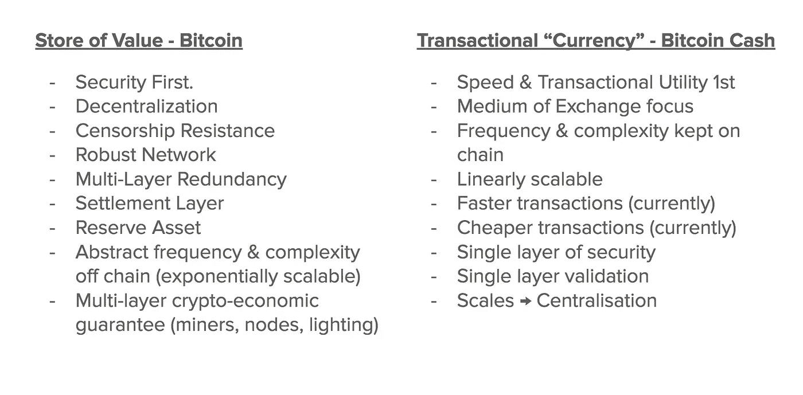

# 比特币(BTC) /比特币现金(BCH)。第一部分

> 原文：<https://medium.com/hackernoon/bitcoin-btc-bitcoin-cash-bch-part-1-dbf9fc69d687>

权威指南。结案了。让我们继续。请

开始了…

Keep this quote in mind…it will make more sense as we progress…

# 免责声明！！！

在这篇文章中，我无意冒犯任何人，但因为我知道这是不可避免的，人们总是会受到自己情绪的影响，所以我决定不在乎你是否被冒犯——只是说出需要说的话。

也请注意；我不想被进一步拖入这场狗屎风暴，但在最近与 BCH 阵营的人发生一些分歧后，我觉得有必要将我的想法、我的研究以及随后得出的结论写在“纸上”。

接下来将是“尽可能真实”地描述我的发现和我的论点，即为什么对于一个特定的用例，遵循一个特定的方法是如此重要。

对于那些想知道或者有疑问的人来说。是的，我对等式两边都做过研究。

我将在文章的最后链接许多参考资料，以及我记得并相信知道他们在这个领域谈论什么的人，但作为一个快速的概述，我可以告诉你，我已经研究、阅读和观看了数千篇文章和视频，这些文章和视频来自非常、非常广泛的令人难以置信的聪明人，包括(但不限于)[安德里亚斯·m·安东诺普洛斯](https://medium.com/u/898f59563d67?source=post_page-----dbf9fc69d687--------------------------------)、[吉米·宋](https://medium.com/u/4acb12744ff8?source=post_page-----dbf9fc69d687--------------------------------)、[特雷斯·梅耶尔](https://medium.com/u/75e93b5827c9?source=post_page-----dbf9fc69d687--------------------------------)， [温塞斯·卡萨雷斯](https://medium.com/u/7096ccd0251b?source=post_page-----dbf9fc69d687--------------------------------)，[纳瓦尔·拉维坎特](https://medium.com/u/67f5049293c7?source=post_page-----dbf9fc69d687--------------------------------)，[查马斯·帕里哈皮蒂亚](https://medium.com/u/dbfc705250be?source=post_page-----dbf9fc69d687--------------------------------)，[维塔利克·布特林](https://medium.com/u/587a00dbce51?source=post_page-----dbf9fc69d687--------------------------------)，[西蒙·狄克逊](https://medium.com/u/93856cf54c24?source=post_page-----dbf9fc69d687--------------------------------)，[亚当·贝克](https://medium.com/u/4ca1c71493c6?source=post_page-----dbf9fc69d687--------------------------------)，[凯尔·萨马尼](https://medium.com/u/2e8de4ec5cc0?source=post_page-----dbf9fc69d687--------------------------------)，[迈克·赫恩](https://medium.com/u/3748c5d6e52c?source=post_page-----dbf9fc69d687--------------------------------)等等，更不用说最初的白皮书和天知道多少人对它的解读了。

请注意；我要说的不是支持或反对比特币或 BCH 本身。

这是我认为对这个实验成功和改变世界最重要的方法/策略。

在这个案例中，我加强了我的信念，我想你会看到墙上写的关于哪个选项是长期可行的。

# 免责声明第 2 部分！！

(可以看出这是分部分写的…哈哈)

我原本打算把这篇文章叫做“致罗杰&所有 BCH 狂热分子的公开信”，但在做一些研究的过程中，我意识到了一些事情(假设我们去除了所有阴谋论的狗屎):

*   我们(大部分)都想要同样的东西
*   我们对此有不同的理论/方法
*   这是一个充满激情的话题，因此每个人都变得格外情绪化，让它成为“我们”对“他们”的话题，让它看起来比实际情况更疯狂
*   比特币很复杂，因为没有人“真正”理解它，所以问题变得更加复杂
*   这种差异与大区块或小区块无关——实际上是关于人们对比特币“是什么”(或应该是什么)以及为什么的定义。

最后一点很重要，因为这是真正的*之争的所在。*

*我意识到，在这里达成某种解决方案的唯一方法是同意:*

1.  *整个讨论不应该是关于“过去”是什么，或者人们对彼此的感觉，而是:*
2.  *应该是关于 ***什么策略*** 给了 BTC 最大的成功机会*

*所以…鉴于所有这些；*

*我减少了语言，消除了很多偏见，并花了一些额外的时间来回顾 ALOT 的内容，这些内容我通常不会订阅，来自我不一定同意的人，我通常会忽略他们的意见，这样我就可以用最好的方式呈现一个合乎逻辑的案例。*

*我得出的结论是…在下面..因为这将是一篇很长的文章，我将把它分成 3 到 4 个部分。*

*享受..*

**

*Yeah that’s me…and my beautifully designed slide…lol*

# *第 1 部分:基础*

# *比特币当初为什么行得通？*

*我认为很多人甚至不理解或意识到比特币为什么会起作用，或者迄今为止一直起作用。我会试着澄清一下:*

***比特币是侥幸**。这是一次具有全球影响的反常的自然事故，将改变我们所有人的历史进程。*

*这是一个技术奇迹(大部分仍然是)，但它之所以成功是因为“区块链”是一些惊人的创新，也不是因为它有一些 2100 万个硬币的“神奇经济公式”，可以数字分割到小数点后 10 位，采矿奖励半衰期为 4 年等。*

*它的成功有三个主要原因:*

1.  *一旦获得足够的初始牵引力/分权水平，Satoshi 就消失了*
2.  *博弈论/自私的基因(所有人类和生态系统固有的)*
3.  *网络效应。它被允许几乎不受抑制地生长，直到它变得根深蒂固而无法平息。*

*这意味着没有“蛇头”，要砍掉。这意味着参与这一网络传播的人类的“基因”或生物构成激励他们保护、发展和保护这一网络，以追求他们自己的利益。*

*这意味着人们投入的努力，从一开始就在社区中创造了前所未有的“归属”水平。这意味着没有人预见到这一点，即；这是一次突然袭击，因此，这意味着它在生态系统和更广泛的意识中变得如此根深蒂固，如果它最有可能 ***不会去任何地方。****

*除了这三个关键因素之外，还有许多其他因素使得这起离奇事故至今成功:*

*   *启动时间(2008/2009 年)*
*   *最初支持它的那类人*
*   *这在当时是 0 比 1 的创新*
*   *它已经成为这个领域的储备货币*
*   *所有的基础设施都是围绕它建立的*
*   *这是最值得信赖的网络，真正有影响力的玩家都把资金存在里面。*

*比特币及其历史的时间和因素大杂烩意味着，如果我们试图“重新做”这个实验，它不会以同样的方式工作。*

# *分权和审查阻力*

## *比特币的存在有两个原因*

*作为所有上述因素的怪异组合的结果，我们有了这样的东西:*

*   *数字的*
*   *可分的*
*   *数学安全*
*   *超过了临界质量*
*   *中立(几乎在所有方面，即；政治、种族、地位等)*
*   *去中心化(在更多的层面上，比其他任何东西都重要)*

*因此提供了:*

*   *抵制审查，以及*
*   *主权所有权*

*不记名资产的**，可以代表一个*值*，供任何人、任何地点、任何时间使用。***

> *价值*

*(记住这个词。)*

******

*如果你不同意这种说法，现在是一个很好的时机，让你回顾一下上一个非政府发行/授权发行的货币发生了什么，这不是那两件事:*

*[E 金](https://en.wikipedia.org/wiki/E-gold)*

*现在，让我们分解这个论点。*

# *2 策略。一个是上级*

*除去所有的阴谋论，看看事实，下面的比较表是我认为这两种策略的总结。*

**

*Slide from my presentation @ BTC vs BCH Brisbane*

*值得注意的是事情应该如何发生的“顺序”，我认为这个图像比文字更好地描述了这一点:*

**

*The red line is not investment advice…but remains my hypothesis*

# *第 2 部分:论据*

*这不会是最连贯有序的一组论点，但是我没有时间在这里瞎扯，所以我只是把每个论点分开，然后把它们展示出来。*

*我很可能不得不把这些放到第 2 部分，但是让我们看看我在这里有多疯狂&我会尽量把它们都塞进去。*

# *1.交易效用将创造价值储存*

*抱歉。但那都是扯淡。*

***效用增量与“价值”关系不大。***

*价值储存与安全、信任、自我主权、社会认同和长期价格稳定息息相关。*

*交换媒介与价格稳定息息相关。*

*BCH 两者都没有，便宜 15 美分和快 5 分钟没什么区别，除了投机能力和给市场带来更多波动..*

*您需要了解两个重要因素:*

1.  *波动性。*
2.  *速度*

*让我们来解释一下:*

1.  *我不管你的交易有多快，如果价格波动，你就没有货币。 ***一种货币是稳定的*** ，正是这种稳定性使其被用作货币。比特币的网络价值太小，不稳定。它的价值需要是现在的 10-20 倍，这样波动性才能平息，然后潜在地有一个抽象层作为稳定的货币/交换手段。但这并不是从交易速度开始的。它始于安全/保障/信任(稍后我将解释如何获得这些支柱)。*
2.  *波动性搞乱了速度。速度是衡量一个单位的货币流动的次数，除以该货币的总供应量。增速过快对资产(或货币)不利，也是货币贬值的基础。降低太多会冻结资产并侵蚀/破坏其价值(无效用)。有一个中间立场很难找到，但 BTC 目前有。通过专注于使交易更快&更容易，如果有的话，你只是增加了速度。然后，当你在组合中加入波动性时，人们不知道是购买、持有还是出售，如果出售很容易，速度很可能会飙升，整个事情失去控制。*

*BCH 聚焦在错误的杠杆上。它不能也不会被作为一种货币采用，因为它新生的网络价值会引起巨大的波动，进而影响和扭曲它的速度，削弱用户参与的欲望，从而影响它的安全保障，整个事情最终会溜溜球，并击败它最初的“现金”主张。*

# *2.交易“货币”是主要关注点*

*BCH 关注的是错误的事情。高吞吐量和更快的事务处理**一点也不重要。***

*这不是一场 crypto 能赢的战斗！BCH 将如何与这些家伙竞争，是在速度、效率、网络效应还是成本上？*

**

*Just some of the compitors that already have more trust, scale, tech & stability*

***这不行！***

*很抱歉，对于普通用户来说，以下是比 BCH 更有用的 ***方式*** 。它是即时的，另有 20 亿人拥有它，最重要的是它是稳定的:*

**

*Game. Set. Match.*

*比特币(也不是任何其他区块链)无法也不会赢得“便捷支付”战争，也不会赢得“现金替代”战争，除非它幸存下来——唯一的办法是让比特币像病毒一样多层传播&使其无法被杀死。*

*只要核心层仍然是真理的源泉，保持廉洁，我们就可以在它的基础上构建解决方案，这些解决方案有机会与上述所有解决方案竞争，同时保留价值储存和不记名资产基础。*

*没有这一点，我们就在与他们竞争——而这是一场我们最有可能输掉的战斗。*

# *3.打一场错误的仗*

*作为上述内容的延伸，值得注意的是，加密货币的整个景观部分是协作的，但从网络分析的角度来看；这是一场战争。*

*BCH 在太多的战线上战斗得太快了:*

**

*Another slide from my presentation. CBF writing it all again.*

*我认为现在有 8 或 9 个稳定的硬币项目是突出的，更不用说另外 20 或 30 个可能正在工作或正在进行中。*

*有些是菲亚特更无聊的符号化表示，但有些像 MAKR Dai，甚至可能是 Basecoin 都有相当有趣的模型，融合了去中心化、稳定性、支付速度等元素。*

*那你有 Litecoin，Dash，ZCash 还有多少其他的？*

*当你把政府或中央银行发行的“加密货币”(这是一个误称，是一堆狗屎，但会愚弄公众)分层时，你会试图说这个“其他”东西(BCH)是比联合国发行的更好的交易媒介。*

*嗯。*

*让我们甚至把政府/央行的白痴排除在外。*

*亚马逊/脸书/谷歌/腾讯/阿里巴巴或苹果发布他们自己的交易货币怎么样？他们已经服务了超过一半的世界(如果不是更多的话),并且由于他们的规模，在大众中赢得了相当大的信任。*

**

*The competitive landscape, outside of just “crypto”*

*事情是这样的。它们都可以制造一种具有高交易效用和容量的数字货币。但是你猜怎么着。*他们中没有人能创造出一种分散的、抵制审查的无记名资产。**

*这是一场艰苦的战斗。*

# *3.不信任的系统需要信任！*

## *贝宝比 BCH 好。*

*那里！我说了！*

*   *它是免费的*
*   *它有更多的用户*
*   *这样更快*
*   **它更受更多人的信任。**

*尽管我们一直在谈论“不可信”系统，但这些新的数字/加密货币的采用实际上是建立在信任的基础上的。*

*这种“信任”是分层次的:*

1.  *相信数学是可行的(工程师/专家)*
2.  *相信专家和工程师知道他们在做什么(声誉)*
3.  *来自协议/项目代言人和支持者的信任*

*最后一块比我们意识到的更重要。*

*99%的人口，(即；将推动下一波采用的人)并不真正理解(1)，可能会对(2)有所了解，但会将他们的决定建立在(3)的基础上。*

****收养是一种分层信任的形式。****

*此时此刻，我可以肯定地告诉你:*

*a)对于普通大众来说，Paypal 是比 BCH 更好的解决方案。*

*b)人们会相信一家像 PayPal LOOOOOOONG 一样大的**上市公司，而不会相信两个可疑的矿工，一个迷惑人们购买的东西的可疑网站和一个到处跑来跑去说自己在“做模型”的白痴假聪。***

# *4.比特币的统治地位*

*关于 BTC 因区块规模限制而失去主导地位的论点是站不住脚的。*

*该论点称，“由于比特币的吞吐量有限，所有这些其他加密货币都有机会被创造出来并获得牵引力，结果夺走了比特币的主导地位”。*

*我认为这是胡扯。*

*替代硬币和其他密码总是会出现，它们是循环的一部分。这是一项开源技术，关键是任何人都可以使用/复制/修改它。*

*任何不这么想的人都是十足的白痴。*

*( [Kyle Samani](https://medium.com/u/2e8de4ec5cc0?source=post_page-----dbf9fc69d687--------------------------------) 写了一篇精彩的文章，论述了开源行业走向市场的重要性，很好地说明了这一点)。*

*所有伟大的技术都会经历繁荣/萧条/增长周期。*

*当互联网刚刚起飞时，不仅有多种变体，而且每个人都说它是所有这些新的“信息超级高速公路”的无聊版本。*

*纵观历史，任何新技术都是如此，在这个开源的世界里也是如此；*影响以数量级复合！**

**

*Gartner’s hype cycle. The same will happen in Crypto*

*主导地位的下降是自然现象，是周期的一部分。*

*当所有愚蠢的狗屎硬币，没有团队，一个狗屎想法和没有执行经验的破产，比特币的统治地位将再次上升。*

***注* **

*我还想说，比特币在更广泛的加密市场中的主导地位是比特币主导地位的一个非常糟糕的指标。*

*如果有什么不同的话，比特币应该更多地与其他无记名资产价值储存手段进行比较，而不是与 XRP 或瑞士联邦理工学院这样的东西进行比较。*

*从这个意义上说，它的“统治地位”丝毫没有下降。事实上，在整个网络价值增长的同时，它可能保持非常稳定。*

# *5.“所有的音量都消失了”*

*所有进入 BTC 的“量”都不是来自使用——85%是投机。*

*试图将比特币交易量下降的原因指向区块大小是荒谬的。*

*成交量下降是因为泡沫破裂！所有在泡沫顶峰时期购买比特币或任何其他另类投资工具的白痴，在这些东西开始倾倒时，都跑向了出口。*

*块大小为零的。这很简单。*

# *6.BTC 应该做一切*

*这个很蠢。*

*是的——虽然公共、分散、共识网络可能有不止一个用例(尽管价值是基础之一)，但这并不意味着比特币应该代表所有用例。*

*BTC 的重点应该是成为可靠的货币。这种认为 BTC 应该什么都做的想法是愚蠢的，因为它增加了攻击面，淡化了给市场的信息，使其成为一个万事通而无一精通。*

*对于其他加密项目来说，有足够的空间来解决其他用例。*

# *7.费用市场很糟糕*

*同样，我认为这是逻辑上的一个重大缺陷。*

*市场存在于一定的范围内。参数是“约束”的另一种说法，没有这些，你就不会有市场——你只会有噪音。或者垃圾邮件。*

*互联网最大的问题是数据的成本已经变得可以忽略不计，因此，我们受到垃圾邮件和噪音的轰炸。新一波成功的互联网应用程序都是关于“理解”所有的噪音，试图对其进行优先排序，试图过滤等等。*

*我不想在这里陷入另一个兔子洞，我只想说，收费市场是一个强大的东西。*

*市场是代表 ***实际价值的强健生态系统的基础。****

*在空街区进行无限制的自由交易是愚蠢的。It =垃圾邮件。*

*最重要的是，如果你从长远来看，高收费不是问题。他们只影响了大约 2 或 3 个月，在他妈的郁金香式的狂热中，看到了更大的傻瓜理论在工作中最狂热的描述。*

# *8.价值储存假说*

*BCH 的支持者说，储值要么是“由区块流操作人员编造的废话”，要么是“后来出现的东西”。*

*显然，他们要么是糊涂了，要么就是对人类进化和货币历史没有概念。*

*世界上有数万亿美元，目前被**储存**在某个地方，不动。那钱要**安全**。它想要安全——它想要足够的流动性以保持一定程度的流动性。*

*目前，出于这一目的，将资金投入美元或黄金要安全得多。*

*比特币为世界提供了一个比美元和黄金好几个数量级的解决方案，为了保持这种方式，比特币需要进一步去中心化，并在验证、确认和参与模型中建立多层冗余。*

*在总共 3-12 个月的时间里(等到 lightning 被采用)，让支付速度快 10 分钟，便宜 15 分钟，这是我一生中见过的最短视、最自私、最荒谬、最贪婪、最愚蠢的事情，代价是混淆社区、混淆新用户、拖延和浪费每个人的时间、劫持一个品牌，最重要的是在一个倾向于集中化和由少数白痴控制的架构上建立一个“解决方案”。*

*安全/信任是价值储存所需要的。这些因素总是胜过交易效用。花点时间回顾一下历史。黄金作为价值储存手段幸存了下来(比其他任何东西都重要)，而人类历史上每一种专注于“更好形式的交易效用”的货币都崩溃了。每一个。黄金实际上是一种相当糟糕的交易媒介(相比之下，在过去的 500-2000 年间更是如此)，但它是唯一仍然存在的 SoV。*

*交换媒介不产生价值储存。事情不是这样的。*

*有一个逻辑顺序和流程。这是比特币:*

**

*Bitcoin. Strong Foundation. Abstracts up the Pyramid of Value*

*这是比特币现金:*

**

*?????*

*现在..你可能会认为我在尝试 BCH，或者这个图表不完全准确——你是对的。*

*但是…我真的不知道他们在想什么。我读过很多他们的论点，而且(a)他们都很矛盾，(b)他们都回到了某种形式的阴谋论。*

*这还不足以说服我…抱歉。*

## ****未完待续……****

*___________________________________________________________________*

*我想我会把它分成三部分——希望能让你更容易消化。*

*一旦完成，我会在这里更新第 2 部分和第 3 部分的链接，否则就直接跳到我的个人资料上找到它们。*

*我还强烈建议你阅读这篇文章，因为它将从历史的角度为你提供你所需要的基本要素，让你更好地理解我来自哪里:*

* [## 智人、进化、货币和比特币

### 一种奇怪的猿类物种是如何从易货到比特币的。一篇论文。

hackernoon.com](https://hackernoon.com/homo-sapiens-evolution-money-bitcoin-33f69701de) 

___________________________________________________________________

# 关于作者

可能和大多数密码狂热者一样，我有很多事情要做，尽管我的核心项目是让更多的人参与这个令人兴奋的新领域。(项目即将正式宣布)

我也阅读…很多。

如果你想和我联系，我在 LinkedIn 和 Twitter 上(我可能应该开始更多地使用它们)，如果你在 Medium +上关注我并分享这篇文章，我会非常感激(一些掌声也很好)。

 [## 亚历山大·斯维特斯基|职业简介| LinkedIn

### 查看 Aleksandar Svetski 在 LinkedIn 上的职业简介。LinkedIn 是世界上最大的商业网络，帮助…

www.linkedin.com](https://www.linkedin.com/in/alekssvetski/)  [## 亚历山大·斯维茨基—中等

### 阅读亚历山大·斯韦茨基在媒介上的作品。试图“思考”的企业家。我所有东西的出口加密…

medium.com](/@AleksandarSvetski)  [## 亚历山大·斯维茨基(@亚历山大·斯维茨基)|推特

### Aleksandar Svetski 的最新推文(@AleksSvetski)。CEO @ Valley Iconic。澳大利亚

twitter.com](https://twitter.com/AleksSvetski)*